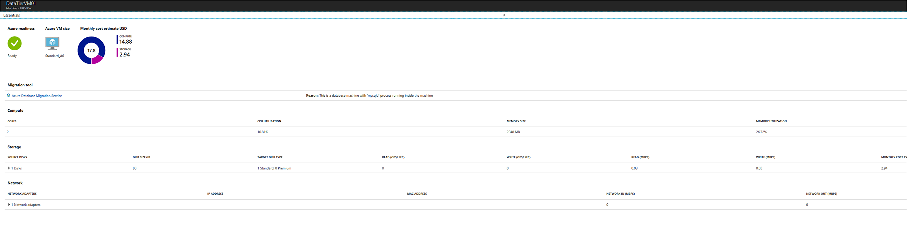

# Discover and assess on-premises VMware VMs for migration to Azure

The [Azure Migrate](migrate-overview.md) services assesses on-premises workloads for migration to Azure.

In this tutorial, you learn how to:

> [!div class="checklist"]
> * Create an Azure Migrate project.
> * Set up an on-premises collector virtual machine (VM), to discover on-premises VMware VMs for assessment.
> * Group VMs and create an assessment.


If you don't have an Azure subscription, create a [free account](https://azure.microsoft.com/pricing/free-trial/) before you begin.


## Prerequisites

- **VMware**: You need at least one VMware VM located on an ESXi host or cluster running version 5.0 or higher. The host or cluster must be managed by a vCenter server running version 5.5 or 6.0.
- **vCenter account**: You need a read-only account with administrator credentials for the vCenter server. Azure Migrate uses this account to discover VMs.
- **Permissions**: On the vCenter server, you need permissions to create a VM by importing a file in .OVA format. 
- **Statistics settings**: The statistics settings for the vCenter server should be set to level 3 before you start deployment.


## Create a project

1. In the Azure Portal, click **Create a resource**.
2. Search for **Azure Migrate**, and select the service (**Azure Migrate (preview)** in the search results. Then click **Create**.
3. Specify a project name, and the Azure subscription for the project.
4. Create a new resource group.
5. Specify the region in which to create the project, then click **Create**. Metadata gathered from on-premises VMs will be stored in this region. You can only create an Azure Migrate project in the East US region for this preview. However, you can assess VMs for a different location.

    
    


## Download the collector appliance

Azure Migrate creates an on-premises VM known as the collector appliance.This VM discovers on-premises VMware VMs, and sends metadata about them to the Azure Migrate service. To set up the collector appliance, you download an .OVA file, and import it to the on-premises vCenter server to create the VM.

1. In the Azure Migrate project, click **Getting Started** > **Discover & Assess** > **Discover Machines**.
2. In **Discover machines**, click **Download**, to download the .OVA file.
3. In **Copy project credentials**, copy the project ID and key. You need these when you configure the collector.

    

### Verify the collector appliance

Check that the .OVA file is secure, before you deploy it.

1. On the machine to which you downloaded the file, open an administrator command window.
2. Run the following command to generate the hash for the OVA:
    - ```C:\>CertUtil -HashFile <file_location> [Hashing Algorithm]```
    - Example usage: ```C:\>CertUtil -HashFile C:\AzureMigrate\AzureMigrate.ova SHA256```
3. The generated hash should match these settings.

    **Algorithm** | **Hash value**
    --- | ---
    MD5 | c283f00f46484bf673dc8383b01d0741 
    SHA1 | 8f49b47f53d051af1780bbc725659ce64e717ed4
    SHA256 | 7aecdbdb2aea712efe99d0c1444503f52d16de5768e783465e226fbbca71501d

## Create the collector VM

Import the downloaded file to the vCenter server.

1. In the vSphere Client console, click **File** > **Deploy OVF Template**.

    

2. In the Deploy OVF Template Wizard > **Source**, specify the location of the .ova file.
3. In **Name** and **Location**, specify a friendly name for the collector VM, and the inventory object in which the VM
will be hosted.
5. In **Host/Cluster**, specify the host or cluster on which the collector VM will run.
7. In storage, specify the storage destination for the collector VM.
8. In **Disk Format**, specify the disk type and size.
9. In **Network Mapping**, specify the network to which the collector VM will connect. The network needs internet connectivity, to send metadata to Azure. 
10. Review and confirm the settings, then click **Finish**.


## Run the collector to discover VMs

1. In the vSphere Client console, right-click the VM > **Open Console**.
2. Provide the language, time zone and password preferences for the appliance.
3. On the desktop, click the **Run collector** shortcut.
4. In the Azure Migrate Collector, open **Set Up Prequisites**.
    - Accept the license terms, and read the third-party information.
    - The collector checks that the VM has internet access.
    - If the VM accesses the internet via a proxy, click **Proxy settings**, and specify the proxy address and listening port. Specify credentials if the proxy needs authentication.
    - The collector checks that the Windows profiler service is running. The service is installed by default on the collector VM.
    - Download and install the VMware PowerCLI.
. In **Discover Machines**, do the following:
    - Specify the name (FQDN) or IP address of the vCenter server.
    - In **User name** and **Password**, specify the read-only account credentials that the collector will use to discover VMs on the vCenter server.
    - In **Collection scope**, select a scope for VM discovery. The collector can only discover VMs within the specified scope. Scope can be set to a specific folder, datacenter, or cluster. It shouldn't contain more than 1000 VMs. 
    - In **Tag category for grouping**, select **None**.
1. In **Select Project**, specify the Azure Migrate project ID and key that you copied from the portal. If didn't copy them, open the Azure portal from the collector VM. In the project **Overview** page, click **Discover Machines**, and copy the values.  
2. In **Complete Discovery**, monitor discovery, and check that metadata collected from the VMs is in scope. The collector provides an approximate discovery time.


### Verify VMs in the portal

Discovery time depends on how many VMs you are discovering. Typically, for 100 VMs, after the collector finishes running it takes around an hour for discovery to finish. 

1. In the Migration Planner project, click **Manage** > **Machines**.
2. Check that the VMs you want to discover appear in the portal.


## Create and view an assessment

After VMs are discovered, you group them and create an assessment. 

1. In the project **Overview** page, click **+Create assessment**.
2. Click **View all** to review the assessment settings.
3. Create the group, and specify a group name.
4. Select the machines that you want to add to the group.
5. Click **Create Assessment**, to create the group and the assessment.
6. After the assessment is created, view it in **Overview** > **Dashboard**.
7. Click **Export assessment**, to download it as an Excel file.

### Sample assessment

Here's an example assessment report. It includes information about whether VMs are compatible for Azure, and estimated monthly costs. 


#### Azure readiness

- For VMs that are ready, Azure Migrate recommends a VM size in Azure.
- For VMs that aren't ready, Azure Migrate explains why.
- Azure Migrate suggests tools that you can use for the migration.

    

#### Monthly cost estimate

Estimated monthly costs for compute and storage are aggregated for all VMs in the group. You can drill down to see costs for a specific machine.

 

You can drill down to see costs for a specific machine.

 

## Next steps

- [Learn](how-to-scale-assessment.md) how to set up an assessment for a large number of on-premises machines.
- Learn how to create more detailed assessment groups using [machine dependency mapping](how-to-create-group-machine-dependencies.md)
- [Learn more](concepts-assessment-calculation.md) about how assessments are calculated.
