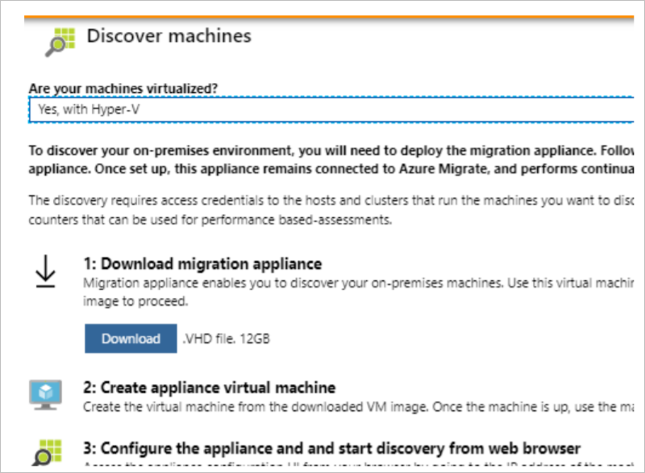

# Discover and assess on-premises Hyper-V VMs for migration to Azure with the Server Assessment Service

As you move on-premises resources to the cloud, use [Azure Migrate](migrate-overview.md) to discover, assess, and migrate machines and workloads to Microsoft Azure. This article describes how to set up the Azure Migrate appliance to discover and assess on-premises Hyper-V VMs to Azure. After the appliance is deployed, you can run assessments.


> [!NOTE]
> Azure Migrate Server Assessment for Hyper-V VMs currently in public preview. 

In this tutorial, you learn how to:

> [!div class="checklist"]
> * Create an Azure subscription if you don't have one, and make sure it has the correct permissions.
> * Create an account that Azure Migrate can use to discover VMs on Hyper-V hosts/clusters.
> * Create the appliance VM by downloading a zipped VHD template, and importing it to a Hyper-V host to create the VM. Make sure the the appliance VM can connect to the required Azure Migrate URLs.
> * Set up the appliance for the first time, and start discovery. Verify that the discovered VMs appear in the Azure portal.


## Before you start

We recommend you do the following before you start:

- Review the [new features and limitations](migrate-overview.md#azure-migrate-services-public-preview) for Server Assessment.
- Learn about [Hyper-V](migrate-overview.md#hyper-v-architecture) assessment architecture and processes.


If you don't have an Azure subscription, create a [free account](https://azure.microsoft.com/pricing/free-trial/) before you begin.


## Prerequisites

- **Azure account permissions**: When you log into Azure to set up discovery and assessment, your Azure account needs permission to create Azure Active Directory (Azure AD) apps.
- **Hyper-V host requirements**: Requirements are as follows:
    - The Hyper-V host should running Windows Server 2012 R2 or 2016, with the latest updates. In a cluster, all hosts should run one of these operating systems.
    - PowerShell remoting should be enabled on each host. Run this command as an admin in the PowerShell console: **Enable-PSRemoting -force**.
- **Account for discovery**: You need a domain or local account with admin permissions on the Hyper-V hosts/cluster. Azure Migrate uses this account to discover the on-premises VMs.
- **Azure Migrate appliance**: The Azure Migrate appliance runs on a Hyper-V VM. It's deployed using a zipped VHD file that you download from the Azure portal. This VHD runs Hyper-V VM version 5.0.
    - You need permissions to import this VM on a Hyper-V host.
    - The Hyper-V host on which the appliance VM is located must be running Windows Server 2012 R2 or later, with the latest updates. 
    - You should have enough capacity to allocate 16 GB RAM, four virtual processors, and one external virtual switch for the VM.
    - The appliance VM can have a static or dynamic IP address.
    - The appliance VM requires internet access.
- **Requirements for VHDs on SMB**: If you run VHDs on SMB in your on-premises site, you need to enable delegation of credentials from the appliance VM to the Hyper-V hosts/cluster running the VMs that you want to discover. This enables Azure Migrate to capture required information from the discovered machines.


## Set up Azure permissions

Either a tenant/global admin can assign permissions to create Azure AD apps to the account, or assign the Application Developer role (that has the permissions) to the account.

### Grant account permissions

The tenant/global admin can grant permissions as follows

1. In Azure AD, the tenant/global admin should navigate to **Azure Active Directory** > **Users** > **User Settings**.
2. The admin should set **App registrations** to **Yes**.

    

> [!NOTE]
> This is a default setting that isn't sensitive. [Learn more](https://docs.microsoft.com/azure/active-directory/develop/active-directory-how-applications-are-added#who-has-permission-to-add-applications-to-my-azure-ad-instance).


### Assign Application Developer role 

The tenant/global admin has permissions to assign the role to the account. [Learn more](https://docs.microsoft.comazure/active-directory/fundamentals/active-directory-users-assign-role-azure-portal).


## Set up an account to access Hyper-V hosts

Create an account that the Azure Migrate appliance can use to access Hyper-V hosts and cluster for VM discovery.

- A single set of credentials is required for all hosts and clusters that you want to include in the discovery.
- The account can be  a local or domain account, and needs admin privileges on Hyper-V host/cluster servers.


## Sign in to the Azure portal

Sign in to the [Azure portal](https://portal.azure.com).

## Open Azure Migrate

1. In the Azure portal, click **All services**.
2. Search for **Azure Migrate**, and select **Azure Migrate - PREVIEW**  in the search results. This opens the Azure Migrate dashboard.


## Set up the appliance VM

Deploy the Azure Migrate appliance as a Hyper-V VM:

- The appliance discovers on-premises Hyper-V VMs, and sends VM metadata and performance data to Azure Migrate.
- To set up the appliance you download a zipped VHD file, and import it to the on-premises Hyper-V host/cluster to create a VM.

### Download the VHD

1. In the Azure Migrate dashboard, click **Discover a new site** > **Discover & Assess** > **Discover Machines**.
2. In **Discover machines** > **Are your machines virtualized?**, click **Yes, with Hyper-V**.
3. Click **Download** to download the zipped VHD.

    


### Verify security

Check that the zipped file is secure, before you deploy it.

1. On the machine to which you downloaded the file, open an administrator command window.
2. Run the following command to generate the hash for the VHD
    - ```C:\>CertUtil -HashFile <file_location> [Hashing Algorithm]```
    - Example usage: ```C:\>CertUtil -HashFile C:\AzureMigrate\AzureMigrate.ova SHA256```
3. The generated hash should match these settings.


  For OVA version 1.0.9.14

  **Algorithm** | **Hash value**
  --- | ---
  MD5 | C78457689822921B783467586AFB22B3
  SHA1 | F1338F9D9818DB61C88F8BDA1A8B5DF34B8C562D
  SHA256 | 0BE66C936BBDF856CF0CDD705719897075C0CEA5BE3F3B6F65E85D22B6F685BE

  
### Create the appliance VM

Import the downloaded file to the Hyper-V host, and create a VM from it.

1. Extract the zipped VHD file to a folder on the Hyper-V host on which you'll set up the appliance VM.
2. Open Hyper-V Manager. In **Actions**, click **Import Virtual Machine**.

    

2. In the Import Virtual Machine Wizard > **Before you begin**, click **Next**.
3. In **Locate Folder**, specify the folder in which the extracted VHD is located. Then click **Next**.
1. In **Select Virtual Machine**, click **Next**.
2. In **Choose Import Type**, click **Copy the virtual machine (dreate a new unique ID)**. Then click **Next**.
3. In **Choose Destination**, leave the default setting unless you want a specific location. Click **Next**.
4. In **Storage Folders**, leave the default setting unless you need to modify. Click **Next**.
5. In **Choose Network**, specify the virtual switch that the VM will use. The switch needs internet connectivity to send data to Azure.
6. In **Summary**, review settings. Then click **Finish**.
7. In Hyper-V Manager > **Virtual Machines**, start the VM.


### Verify internet connectivity

The appliance VM needs internet connectivity to Azure. If you're using a URL-based proxy to control outbound connectivity, make sure these URLs are allowed.

**URL** | **Reason**
--- | ---
*.portal.azure.com | Reach the Azure portal.
*.windows.net<br/><br/> *microsoftonline.com | Log in to Azure.<br/><br/>  Create Azure AD app and Service Principal objects for agent to service communications.
management.azure.com | Communicate with Azure Resource Manager to set up Azure Migrate artifacts.
dc.services.visualstudio.com | Upload app logs for internal monitoring.
*.vault.azure.net | Communication between agent and service (persistent secrets).

## Set up the appliance

Set up the appliance for the first time, and register it with Azure Migrate.

1. In Hyper-V Manager > **Virtual Machines**, right-click the VM > **Connect**.
2. Provide the language, time zone, and password preferences for the appliance.
3. On the desktop of the appliance VM, click the **Start discovery** shortcut to open the appliance web app. Alternatively, run the web app remotely from **https://*appliance name or IP address*:44368**. 
2. In the appliance web app, click **Check for updates** to verify that you're running the latest version of the app. If not, you can download the latest upgrade.
3. In **Set up prerequisites**, do the following:
    - **License**: Accept the license terms, and read the third-party information.
    - **Connectivity**: The app checks that the VM has internet access. If the VM accesses the internet via a proxy and not directly:
        - Click **Proxy settings**, and specify the proxy address and listening port, in the form http://ProxyIPAddress or http://ProxyFQDN.
        - Specify credentials if the proxy needs authentication.
        - Only HTTP proxy is supported.
        - The collector checks that the collector service is running. The service is installed by default on the collector VM.
    - **Time sync**: The time on the appliance should be in sync with internet time for discovery to function correctly.

### Register the appliance with Azure Migrate

1. Click **Log In**.
2. On the new tab, log in using the Azure credentials with the required permissions. 
3. After a successful logon, go back to the web app.
4. Select the subscription, resource group, and region in which you want to store the list of discovered VMs, and the VM metadata.
5. Select a site name. A site gathers together a group of discovered VMs.


## Start discovery

Now, connect to the Hyper-V host/cluster, and start discovery.

1. In **User name** and **Password**, specify the account credentials that you created for the appliance to discover VMs on the Hyper-V host/cluster. Specify a friendly name for the credentials, and click **Save details**.
2. Click **Add host**, and specify the Hyper-V hosts/clusters on which you want to discover VMs. Click **Validate**. After validation, the number of VMs that can be discovered on each host/cluster is shown.
    - If validation fails for a host, reivewing the error by hovering over the icon in the **Status** column. Fix and validate again with **Validate list**.
    - To remote any hosts/clusters, select > **Delete**.
    - You can't remove a specific host from a cluster. You can only remove the entire cluster.
    - You can add a cluster even if there are issues with specific hosts in the cluster.
3. After validation, click **Save and start discovery** to kick off the discovery process.

It takes around 15 minutes for metadata of discovered VMs to appear in the portal. 

### Verify VMs in the portal

After discovery finishes, you can verify that the VMs appear in the portal. 

1. Open the Azure Migrate dashboard
2. In the **Server Assessment Service** page, click the icon that displays the count for the discovered machines. 

Note the following: 
- The appliance continuously profiles the on-premises environment and sends metadata.
- You can create as-is assessments immediately after discovery.
- For performance assessments, we recommend that you wait at least a day after discovery:
    - Collecting performance data takes time. Waiting at least a day ensures that there are enough performance data points before you run the assessment.
    - For performance data, the appliance collects real-time data points every 20 seconds for each performance metrics, and rolls them up to a single five minute data point. The appliance sends the five-minute data point to Azure every hour for assessment calculation.  
 

## Next steps

After discovery, you can run assessments, and migrate VMware VMs to Azure:

- [Learn](tutorial-server-assessment-hyper-v.md) how to create assessments for Hyper-V VMs.
- [Learn more](https://docs.microsoft.com/azure/migrate/concepts-collector#what-data-is-collected) about the data that's collected by the appliance.

