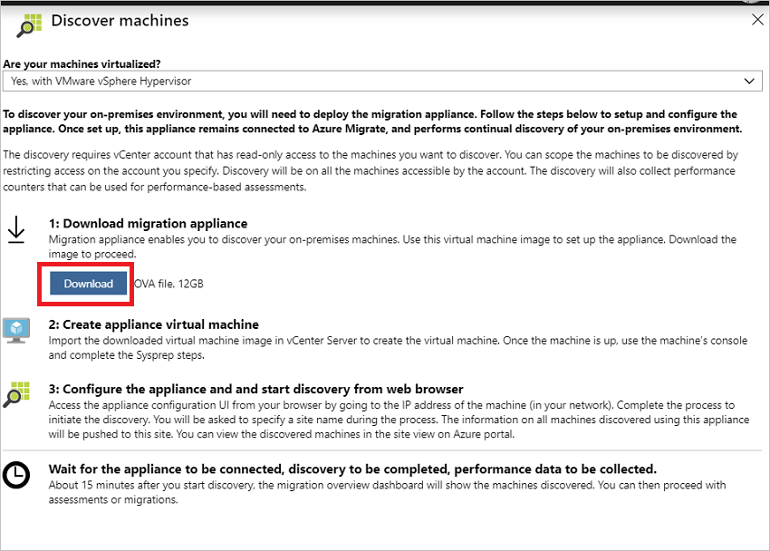

# Deploy Azure Migrate and start VMware VM discovery
As you move on-premises resources to the cloud, use [Azure Migrate](migrate-overview.md) to discover, assess, and migrate machines and workloads to Microsoft Azure. This article describes how to set up an Azure Migrate appliance to discover, assess, and migrate on-premises VMware VMs to Azure. After the appliance is deployed, you can run assessments and begin migration.

> [!NOTE]
> This article describes how to set up the appliance for use with the latest version of Azure Migrate. If you're using the earlier classic version Azure Migrate, you set up the appliance as described in [this article](tutorial-assessment-vmware-classic.md). How can I check which version I'm using?


In this tutorial, you learn how to:

> [!div class="checklist"]
> * Create an Azure subscription if you don't have one, and make sure it has the correct permissions.
> * Set up an account on the vCenter Server that Azure Migrate will use to discover VMs.
> * Deploy an Azure Migrate appliance to discover and assess VMware VMs. 
> * Start VM discovery.


## About the Azure Migrate appliance

Azure Migrate deploys a lightweight virtual appliance for discovery and assessment of on-premises machines. For assessment of VMware VMs, you deploy the appliance on a VMware VM. 

**Appliance** | **Details**
--- | ---
**Setup** | You download a template (an OVA file) from Azure portal, import it to vCenter Server, and create a VM from it.<br/><br/> You connect to the appliance VM, configure basic settings for it, and register it with Azure Migrate.
**Discovery** | You connect to the Collector app running on the appliance to initiate VM discovery. <br/><br/> The appliance VM is always connected to Azure, and continuously discovers on-premises machine. It reflects changes that occur, such as adding/removing VMs in scope, VM disks and NICs.<br/><br/> The Collect app continuously collects and sends VM metadata and performance data to Azure Migrate.
**Metadata** |  Collected metadata: vCenter VM name; vCenter VM path (host/cluster folder); IP and MAC addresses; operating system; number of cores/disks/NICs; memory and disk size.
**Performance data** | Collected performance data: CPU/memory usage; per disk data (disk read/write throughput; disk reads/writers per second), NIC data (network in, network out).<br/><br/> Performance data is collected from the day that the Collector app connects to vCenter Server. It doesn't collect historical data. 


## Before you start

We recommend you do the following before you start:

- Review the [features and limitations](migrate-overview.md#azure-migrate-services-public-preview) for this version of Azure Migrate.
- Learn about [VMware](migrate-overview.md#vmware-architecture) assessment processes and architecture.

If you don't have an Azure subscription, create a [free account](https://azure.microsoft.com/pricing/free-trial/) before you begin.


## Prerequisites

Here's what you need to set up this scenario.

- **Azure account permissions**: When you set up the appliance, you need to log into Azure. The Azure account you use to log in needs permission to create Azure Active Directory (Azure AD) apps.
- **VMware requirements**: The VMs you discover and assess must be managed by vCenter Server version 5.5, 6.0, or 6.5.<br/><br/> You need an ESXi host with version 5.0 or higher to deploy the Azure Migrate appliance.
- **vCenter Server account**: You need a read-only account to access the vCenter Server. Azure Migrate uses this account to discover the on-premises VMs.
    - Discovery is for all machines accessible by the account.
    - You can scope VM discovery by restricting access for the account.
- **vCenter Server permissions** | In vCenter Server, you need permissions to create a VM from an imported OVA file.
- **Appliance**: The Azure Migrate appliance needs internet activity to connect to Azure.


### Set up Azure account permissions

To set up the Azure account with permissions to create Azure AD apps, a tenant/global admin either can assign permissions to the account, or assign the Application Developer role (that has the required permissions) to the account.

Set up using one of the methods summarized in the table.

**Permissions** | **Details**
--- | ---
**Tenant/global admin grants permissions** | In Azure AD, the tenant/global admin should navigate to **Azure Active Directory** > **Users** > **User Settings**. The admin should set **App registrations** to **Yes**.<br/><br/> Note that this is a default setting that isn't sensitive. [Learn more](https://docs.microsoft.com/azure/active-directory/develop/active-directory-how-applications-are-added#who-has-permission-to-add-applications-to-my-azure-ad-instance).
**Tenant/global admin assigns Application Developer role** | The tenant/global admin with permissions to assign this role can assign it to the account. [Learn more](https://docs.microsoft.comazure/active-directory/fundamentals/active-directory-users-assign-role-azure-portal).


## Set up a vCenter Server account

Azure Migrate needs to access the vCenter Server to discover VMs. Before you deploy Azure Migrate, prepare a VMware account with the following properties:

- **User type**: At least a read-only user.
- **Permissions**: **Data Center object** –> **Propagate to Child Objects**, role=Read-only
- **Details**: User assigned at datacenter level, and has access to all the objects in the datacenter.

If you want to restrict access for the account to a specific host or cluster, assign the **No access** role with the **Propagate to Child Objects** option selected.


## Sign in to the Azure portal

Sign in to the [Azure portal](https://portal.azure.com).

## Set up the appliance

Download the appliance template, import it into vCenter Server and create the VM. Then set up the VM and register it with Azure Migrate.

### Download the template

1. In the Azure portal, click **All services**.
2. Search for **Azure Migrate**, and select **Azure Migrate** in the search results. This opens the Azure Migrate dashboard.
3. Under **Migration goals**, click **Servers**.
4. Under **Assessment tools**, click **+Discover**.
5. In **Discover machines** > > **Are your machines virtualized?**, select **Yes, with VMWare vSphere hypervisor**.
6. Click **Download** to download the template file (.OVA).

    


### Verify template security

Check that the template file is secure, before you deploy it.

1. On the machine to which you downloaded the file, open an administrator command window.
2. Run this command to generate the hash for the OVA:
    - ```C:\>CertUtil -HashFile <file_location> [Hashing Algorithm]```
    - Example usage: ```C:\>CertUtil -HashFile C:\AzureMigrate\AzureMigrate.ova SHA256```
3. The generated hash should match these settings.

  For OVA version ???

  **Algorithm** | **Hash value**
  --- | ---
  MD5 | C78457689822921B783467586AFB22B3
  SHA1 | F1338F9D9818DB61C88F8BDA1A8B5DF34B8C562D
  SHA256 | bbaede5fd1dfb112b9653e66fe3141715c2c27981056f3094c2cf74f0b7c1d05

  
### Create the appliance VM

After downloading the template, import the downloaded .OVA file to vCenter Server, and create a VM from it.

1. In the vSphere Client, click **File** > **Deploy OVF Template**.

    

2. In the wizard > **Source**, specify the location of the .OVA file.
3. In **Name** and **Location**, specify a friendly name for the VM, and the inventory object in which the VM
will be hosted.
5. In **Host/Cluster**, specify the host or cluster on which the VM will run.
6. In **Storage**, specify the storage destination for the VM.
7. In **Disk Format**, specify the disk type and size.
8. In **Network Mapping**, specify the network to which the  VM will connect. The network needs internet connectivity, to send metadata to Azure.
9. Review and confirm the settings, then click **Finish** to create the VM.


### Verify internet connectivity

The appliance VM needs internet connectivity to Azure. If you're using a URL-based proxy to control outbound connectivity, make sure these URLs are allowed.

**URL** | **Requirement**
--- | ---
*.portal.azure.com | Connect to the Azure portal.
*.windows.net<br/><br/> *microsoftonline.com | Log into Azure.<br/><br/>  Create Azure AD app and Service Principal objects for agent to service communications.
management.azure.com | Communicate with Azure Resource Manager to set up Azure Migrate components.
dc.services.visualstudio.com | Upload app logs for internal monitoring.
*.vault.azure.net | Communication between the appliance and service (persistent secrets).

### Configure appliance settings

Set up the appliance for the first time, and register it with Azure Migrate.

1. In the vSphere Client console, right-click the VM > **Open Console**.
2. Provide the language, time zone, and password for the appliance.
3. On the desktop of the appliance VM, click the **Start discovery** shortcut to open the appliance web app.

    > [!NOTE]
    > Alternatively, run the app remotely from **https://*appliance name or IP address*:44368**.

4. In the appliance web app, click **Check for updates** to verify that you're running the latest version of the app. If not, you can download the latest upgrade.
2. In **Set up prerequisites**, do the following:
    - **License**: Accept the license terms, and read the third-party information.
    - **Connectivity**: The app checks that the VM has internet access. If the VM accesses the internet via a proxy and not directly:
        - Click **Proxy settings**, and specify the proxy address and listening port, in the form http://ProxyIPAddress or http://ProxyFQDN.
        - Specify credentials if the proxy needs authentication.
        - Only HTTP proxy is supported.
        - The appliance checks that the Collector app is running. The app is installed by default.
    - **Time sync**: The time on the appliance should be in sync with internet time for discovery to function correctly.

### Register the appliance 

Register the appliance with Azure Migrate.

1. Click **Log In**.
2. On the new tab, log in using the Azure credentials with the required permissions. 
3. After a successful logon, close the tab, and go back to the web app.
4. Select the subscription, resource group, and region in which you want to store the list of discovered VMs, and the VM metadata.
5. Select a site name. A site is a repository of discovered VMs.


## Start discovery

Connect to the vCenter Server and start discovery. 

1. In **Specify vCenter Server details**, do the following:
    - Specify the name (FQDN) or IP address of the the vCenter Server. You can leave the default port, or specify a custom port on which your vCenter Server listens.
    - In **User name** and **Password**, specify the read-only account credentials that the appliance will use to discover VMs on the vCenter server.
    - In **Collection scope**, select a scope for VM discovery. The collector discovers VMs within the specified scope. Scope can be set to a specific folder, datacenter, or cluster.
2. Click **Validate connection** to make sure that the appliance can connect to vCenter Server.
3. After the connection is established, click **Save** > **Start discovery**.

### Data collection

- It takes around 15 minutes for metadata of discovered VMs to appear in the portal.
- Performance data starts collecting when the Collector app connects to vCenter Server.
- For performance data
    1. The app collects real-time utilization data every 20 seconds.
    2. It rolls up the 20-second data points to create a single data point every five minutes.
    3. It select the peak utilization value (out of all the 20-sec data points) and sends it to Azure for assessment calculation. Based on the percentile value specified in the assessment properties, the appropriate value is selected from all the five-minute data points, and used to compute the assessment.
- We suggest you wait at least a day before you create performance-based assessments, to give data time to amass. 

## Verify VMs in the portal

After discovery you can verify that the VMs appear in the Azure portal, as follows:

1. Open the Azure Migrate dashboard
2. In the **Server Assessment Service** page, click the icon that displays the count for the discovered machines. 

Note the following: 
- The appliance continuously profiles the on-premises environment and sends metadata.
- You can create as-is assessments immediately after discovery.
- For performance assessments, we recommend that you wait at least a day after discovery:
    - Collecting performance data takes time. Waiting at least a day ensures that there are enough performance data points before you run the assessment.
    - For performance data, the appliance collects real-time data points every 20 seconds for each performance metrics, and rolls them up to a single five minute data point. The appliance sends the five-minute data point to Azure every hour for assessment calculation.  
 

## Next steps

After discovery, you can run assessments, and migrate VMware VMs to Azure:

- [Learn](tutorial-assess-vmware.md) how to create assessments for VMware VMs.
- [Learn](tutorial-server-migration-vmware.md) how to migrate VMware VMs to Azure
- [Learn more](concepts-collector.md) about the data that's collected by the appliance.

