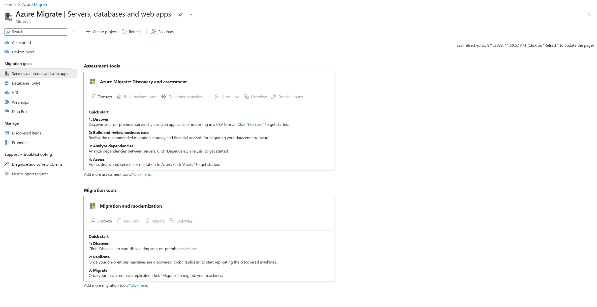

# Tutorial: Discover AWS instances with Server Assessment

As part of your migration journey to Azure, you discover your servers for assessment and migration.

This tutorial shows you how to discover Amazon Web Services (AWS) instances with the Azure Migrate: Server Assessment tool, using a lightweight Azure Migrate appliance. You deploy the appliance as a physical server, to continuously discover machine and performance metadata.

In this tutorial, you learn how to:

> [!div class="checklist"]
> * Set up an Azure account.
> * Prepare AWS instances for discovery.
> * Create an Azure Migrate project.
> * Set up the Azure Migrate appliance.
> * Start continuous discovery.

> [!NOTE]
> Tutorials show the quickest path for trying out a scenario, and use default options.  

If you don't have an Azure subscription, create a [free account](https://azure.microsoft.com/pricing/free-trial/) before you begin.

## Prerequisites

Before you start this tutorial, check you have these prerequisites in place.

**Requirement** | **Details**
--- | ---
**Appliance** | You need an EC2 VM on which to run the Azure Migrate appliance. The machine should have:<br/><br/> - Windows Server 2016 installed. Running the appliance on a machine with Windows Server 2019 isn't supported.<br/><br/> - 16-GB RAM, 8 vCPUs, around 80 GB of disk storage, and an external virtual switch.<br/><br/> - A static or dynamic IP address, with internet access, either directly or through a proxy.
**Windows instances** | Allow inbound connections on WinRM port 5985 (HTTP), so that the appliance can pull configuration and performance metadata.
**Linux instances** | Allow inbound connections on port 22 (TCP).

## Prepare an Azure user account

To create an Azure Migrate project and register the Azure Migrate appliance, you need an account with:
- Contributor or Owner permissions on an Azure subscription.
- Permissions to register Azure Active Directory apps.

If you just created a free Azure account, you're the owner of your subscription. If you're not the subscription owner, work with the owner to assign the permissions as follows:

1. In the Azure portal, search for "subscriptions", and under **Services**, select **Subscriptions**.

    

2. In the **Subscriptions** page, select the subscription in which you want to create an Azure Migrate project. 
3. In the subscription, select **Access control (IAM)** > **Check access**.
4. In **Check access**, search for the relevant user account.
5. In **Add a role assignment**, click **Add**.

    

6. In **Add role assignment**, select the Contributor or Owner role, and select the account (azmigrateuser in our example). Then click **Save**.

    

7. In the portal, search for users, and under **Services**, select **Users**.
8. In **User settings**, verify that Azure AD users can register applications (set to **Yes** by default).

    


## Prepare AWS instances

Set up an account that the appliance can use to access AWS instances.

- For Windows servers, set up a local user account on all the Windows servers that you want to include in the discovery. Add the user account to the following groups: - Remote Management Users - Performance Monitor Users - Performance Log users.
 - For Linux servers, you need a root account on the Linux servers that you want to discover.
- Azure Migrate uses password authentication when discovering AWS instances. AWS instances don't support password authentication by default. Before you can discover instance, you need to enable password authentication.
    - For Windows machines, allow WinRM port 5985 (HTTP). This allows remote WMI calls.
    - For Linux machines:
        1. Sign into each Linux  machine.
        2. Open the sshd_config file : vi /etc/ssh/sshd_config
        3. In the file, locate the **PasswordAuthentication** line, and change the value to **yes**.
        4. Save the file and close it. Restart the ssh service.
    - If you are using a root user to discover your Linux VMs, ensure root login is allowed on the VMs.
        1. Sign into each Linux machine
        2. Open the sshd_config file : vi /etc/ssh/sshd_config
        3. In the file, locate the **PermitRootLogin** line, and change the value to **yes**.
        4. Save the file and close it. Restart the ssh service.

## Set up a project

Set up a new Azure Migrate project.

1. In the Azure portal > **All services**, search for **Azure Migrate**.
2. Under **Services**, select **Azure Migrate**.
3. In **Overview**, select **Create project**.
5. In **Create project**, select your Azure subscription and resource group. Create a resource group if you don't have one.
6. In **Project Details**, specify the project name and the geography in which you want to create the project. Review supported geographies for [public](migrate-support-matrix.md#supported-geographies-public-cloud) and [government clouds](migrate-support-matrix.md#supported-geographies-azure-government).

   

7. Select **Create**.
8. Wait a few minutes for the Azure Migrate project to deploy.

The **Azure Migrate: Server Assessment** tool is added by default to the new project.



## Set up the appliance

The Azure Migrate appliance is a lightweight appliance, used by Azure Migrate Server Assessment to do the following:

- Discover on-premises servers.
- Send metadata and performance data for discovered servers to Azure Migrate Server Assessment.

[Learn more](migrate-appliance.md) about the Azure Migrate appliance.


## Appliance deployment steps

To set up the appliance you:
- Provide an appliance name and generate an Azure Migrate project key in the portal.
- Download a zipped file with Azure Migrate installer script from the Azure portal.
- Extract the contents from the zipped file. Launch the PowerShell console with administrative privileges.
- Execute the PowerShell script to launch the appliance web application.
- Configure the appliance for the first time, and register it with the Azure Migrate project using the Azure Migrate project key.

### Generate the Azure Migrate project key

1. In **Migration Goals** > **Servers** > **Azure Migrate: Server Assessment**, select **Discover**.
2. In **Discover machines** > **Are your machines virtualized?**, select **Physical or other (AWS, GCP, Xen, etc.)**.
3. In **1:Generate Azure Migrate project key**, provide a name for the Azure Migrate appliance that you will set up for discovery of physical or virtual servers.The name should be alphanumeric with 14 characters or fewer.
1. Click on **Generate key** to start the creation of the required Azure resources. Please do not close the Discover machines page during the creation of resources.
1. After the successful creation of the Azure resources, an **Azure Migrate project key** is generated.
1. Copy the key as you will need it to complete the registration of the appliance during its configuration.

### Download the installer script

In **2: Download Azure Migrate appliance**, click on **Download**.


### Verify security

Check that the zipped file is secure, before you deploy it.

1. On the machine to which you downloaded the file, open an administrator command window.
2. Run the following command to generate the hash for the zipped file:
    - ```C:\>CertUtil -HashFile <file_location> [Hashing Algorithm]```
    - Example usage for public cloud: ```C:\>CertUtil -HashFile C:\Users\administrator\Desktop\AzureMigrateInstaller-Server-Public.zip SHA256 ```
    - Example usage for government cloud: ```  C:\>CertUtil -HashFile C:\Users\administrator\Desktop\AzureMigrateInstaller-Server-USGov.zip SHA256 ```
3.  Verify the latest appliance versions and hash values:
    - For the public cloud:

        **Scenario** | **Download*** | **Hash value**
        --- | --- | ---
        Physical (85 MB) | [Latest version](https://go.microsoft.com/fwlink/?linkid=2140334) | 207157bab39303dca1c2b93562d6f1deaa05aa7c992f480138e17977641163fb

    - For Azure Government:

        **Scenario** | **Download*** | **Hash value**
        --- | --- | ---
        Physical (85 MB) | [Latest version](https://go.microsoft.com/fwlink/?linkid=2140338) | ca67e8dbe21d113ca93bfe94c1003ab7faba50472cb03972d642be8a466f78ce
 

### Run the Azure Migrate installer script
The installer script does the following:

- Installs agents and a web application for physical server discovery and assessment.
- Install Windows roles, including Windows Activation Service, IIS, and PowerShell ISE.
- Download and installs an IIS rewritable module. [Learn more](https://www.microsoft.com/download/details.aspx?id=7435).
- Updates a registry key (HKLM) with persistent setting details for Azure Migrate.
- Creates the following files under the path:
    - **Config Files**: %Programdata%\Microsoft Azure\Config
    - **Log Files**: %Programdata%\Microsoft Azure\Logs

Run the script as follows:

1. Extract the zipped file to a folder on the server that will host the appliance.  Make sure you don't run the script on a machine on an existing Azure Migrate appliance.
2. Launch PowerShell on the above server with administrative (elevated) privilege.
3. Change the PowerShell directory to the folder where the contents have been extracted from the downloaded zipped file.
4. Run the script named **AzureMigrateInstaller.ps1** by running the following command:

    - For the public cloud: 
    
        ``` PS C:\Users\administrator\Desktop\AzureMigrateInstaller-Server-Public> .\AzureMigrateInstaller.ps1 ```
    - For Azure Government: 
    
        ``` PS C:\Users\Administrators\Desktop\AzureMigrateInstaller-Server-USGov>.\AzureMigrateInstaller.ps1 ```

    The script will launch the appliance web application when it finishes successfully.

If you come across any issues, you can access the script logs at C:\ProgramData\Microsoft Azure\Logs\AzureMigrateScenarioInstaller_<em>Timestamp</em>.log for troubleshooting.


### Verify appliance access to Azure

Make sure that the appliance VM can connect to Azure URLs for [public](migrate-appliance.md#public-cloud-urls) and [government](migrate-appliance.md#government-cloud-urls) clouds.

### Configure the appliance

Set up the appliance for the first time.

1. Open a browser on any machine that can connect to the appliance, and open the URL of the appliance web app: **https://*appliance name or IP address*: 44368**.

   Alternately, you can open the app from the desktop by clicking the app shortcut.
2. Accept the **license terms**, and read the third-party information.
1. In the web app > **Set up prerequisites**, do the following:
    - **Connectivity**: The app checks that the server has internet access. If the server uses a proxy:
        - Click on **Set up proxy** to and specify the proxy address (in the form http://ProxyIPAddress or http://ProxyFQDN) and listening port.
        - Specify credentials if the proxy needs authentication.
        - Only HTTP proxy is supported.
        - If you have added proxy details or disabled the proxy and/or authentication, click on **Save** to trigger connectivity check again.
    - **Time sync**: Time is verified. The time on the appliance should be in sync with internet time for server discovery to work properly.
    - **Install updates**: Azure Migrate Server Assessment checks that the appliance has the latest updates installed.After the check completes, you can click on **View appliance services** to see the status and versions of the components running on the appliance.

### Register the appliance with Azure Migrate

1. Paste the **Azure Migrate project key** copied from the portal. If you do not have the key, go to **Server Assessment> Discover> Manage existing appliances**, select the appliance name you provided at the time of key generation and copy the corresponding key.
1. Click on **Log in**. It will open an Azure login prompt in a new browser tab. If it doesn't appear, make sure you've disabled the pop-up blocker in the browser.
1. On the new tab, sign in by using your Azure username and password.
   
   Sign-in with a PIN isn't supported.
3. After you successfully logged in, go back to the web app. 
4. If the Azure user account used for logging has the right [permissions](tutorial-prepare-physical.md) on the Azure resources created during key generation, the appliance registration will be initiated.
1. After appliance is successfully registered, you can see the registration details by clicking on **View details**.


## Start continuous discovery

Now, connect from the appliance to the physical servers to be discovered, and start the discovery.

1. In **Step 1: Provide credentials for discovery of Windows and Linux physical or virtual servers​**, click on **Add credentials** to specify a friendly name for credentials, add **Username** and **Password** for a Windows or Linux server. Click on **Save**.
1. If you want to add multiple credentials at once,click on **Add more** to save and add more credentials. Multiple credentials are supported for physical servers discovery.
1. In **Step 2:Provide physical or virtual server details​**, click on **Add discovery source** to specify the server **IP address/FQDN** and the friendly name for credentials to connect to the server.
1. You can either **Add single item** at a time or **Add multiple items** in one go. There is also an option to provide server details through **Import CSV**.


    - If you choose **Add single item**, you can choose the OS type,specify friendly name for credentials, add server **IP address/FQDN** and click on **Save**.
    - If you choose **Add multiple items**, you can add multiple records at once by specifying server **IP address/FQDN** with the friendly name for credentials in the text box.**Verify** the added records and click on **Save**.
    - If you choose **Import CSV** _(selected by default)_, you can download a CSV template file, populate the file with the server **IP address/FQDN** and friendly name for credentials. You then import the file into the appliance, **verify** the records in the file and click on **Save**.

1. On clicking Save, appliance will try validating the connection to the servers added and show the **Validation status** in the table against each server.
    - If validation fails for a server, review the error by clicking on **Validation failed** in the Status column of the table. Fix the issue, and validate again.
    - To remove a server, click on **Delete**.
1. You can **revalidate** the connectivity to servers any time before starting the discovery.
1. Click on **Start discovery**, to kick off discovery of the successfully validated servers. After the discovery has been successfully initiated, you can check the discovery status against each server in the table.


This starts discovery. It takes approximately 2 minutes per server for metadata of discovered server to appear in the Azure portal.

## Verify servers in the portal

After discovery finishes, you can verify that the servers appear in the portal.

1. Open the Azure Migrate dashboard.
2. In **Azure Migrate - Servers** > **Azure Migrate: Server Assessment** page, click the icon that displays the count for **Discovered servers**.

## Next steps

- [Assess physical servers](tutorial-migrate-aws-virtual-machines.md) for migration to Azure VMs.
- [Review the data](migrate-appliance.md#collected-data---physical) that the appliance collects during discovery.
