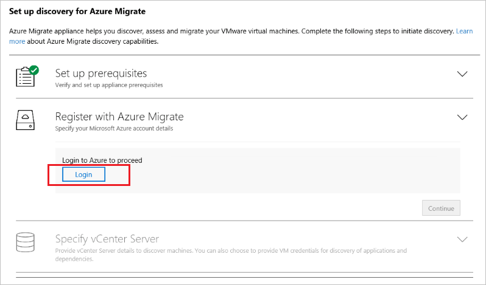

# Tutorial: Discover AWS instances with Server Assessment

As part of your migration journey to Azure, you discover your servers for assessment and migration.

This tutorial shows you how to discover Amazon Web Services (AWS) instances with the Azure Migrate: Server Assessment tool, using a lightweight Azure Migrate appliance. You deploy the appliance as a physical server, to continuously discover machine and performance metadata.

In this tutorial, you learn how to:

> [!div class="checklist"]
> * Set up an Azure account.
> * Prepare AWS instances for discovery.
> * Create an Azure Migrate project.
> * Set up the Azure Migrate appliance.
> * Start continuous discovery.

> [!NOTE]
> Tutorials show the quickest path for trying out a scenario, and use default options.  

If you don't have an Azure subscription, create a [free account](https://azure.microsoft.com/pricing/free-trial/) before you begin.

## Prerequisites

Before you start this tutorial, check you have these prerequisites in place.

**Requirement** | **Details**
--- | ---
**Appliance** | You need an EC2 VM on which to run the Azure Migrate appliance. The machine should have:<br/><br/> - Windows Server 2016 installed. Running the appliance on a machine with Windows Server 2019 isn't supported.<br/><br/> - 16-GB RAM, 8 vCPUs, around 80 GB of disk storage, and an external virtual switch.<br/><br/> - A static or dynamic IP address, with internet access, either directly or through a proxy.
**Windows instances** | Allow inbound connections on WinRM port 5985 (HTTP), so that the appliance can pull configuration and performance metadata.
**Linux instances** | Allow inbound connections on port 22 (TCP).

## Prepare an Azure user account

To create an Azure Migrate project and register the Azure Migrate appliance, you need an account with:
- Contributor or Owner permissions on an Azure subscription.
- Permissions to register Azure Active Directory apps.

If you just created a free Azure account, you're the owner of your subscription. If you're not the subscription owner, work with the owner to assign the permissions as follows:

1. In the Azure portal, search for "subscriptions", and under **Services**, select **Subscriptions**.

    

2. In the **Subscriptions** page, select the subscription in which you want to create an Azure Migrate project. 
3. In the subscription, select **Access control (IAM)** > **Check access**.
4. In **Check access**, search for the relevant user account.
5. In **Add a role assignment**, click **Add**.

    

6. In **Add role assignment**, select the Contributor or Owner role, and select the account (azmigrateuser in our example). Then click **Save**.

    

7. In the portal, search for users, and under **Services**, select **Users**.
8. In **User settings**, verify that Azure AD users can register applications (set to **Yes** by default).

    


## Prepare AWS instances

Set up an account that the appliance can use to access AWS instances.

- For Windows servers, set up a local user account on all the Windows servers that you want to include in the discovery. Add the user account to the following groups: - Remote Management Users - Performance Monitor Users - Performance Log users.
 - For Linux servers, you need a root account on the Linux servers that you want to discover.


## Set up a project

Set up a new Azure Migrate project.

1. In the Azure portal > **All services**, search for **Azure Migrate**.
2. Under **Services**, select **Azure Migrate**.
3. In **Overview**, select **Create project**.
5. In **Create project**, select your Azure subscription and resource group. Create a resource group if you don't have one.
6. In **Project Details**, specify the project name and the geography in which you want to create the project. Review supported geographies for [public](migrate-support-matrix.md#supported-geographies-public-cloud) and [government clouds](migrate-support-matrix.md#supported-geographies-azure-government).

   

7. Select **Create**.
8. Wait a few minutes for the Azure Migrate project to deploy.

The **Azure Migrate: Server Assessment** tool is added by default to the new project.


## Set up the appliance

To set up the appliance on an AWS instance, you download and run an installer script on a [suitable instance](#prerequisites). After creating the appliance, you check that it can connect to Azure, configure it for the first time, and register it with the Azure Migrate project.

### Download the installer script

Download the zipped file for the appliance.

1. In **Migration Goals** > **Servers** > **Azure Migrate: Server Assessment**, click **Discover**.
2. In **Discover machines** > **Are your machines virtualized?**, click **Not virtualized/Other**.
3. Click **Download** to download the zipped file.


### Install the appliance

The installer script does the following:

- Installs agents and a web application for AWS discovery and assessment.
- Install Windows roles, including Windows Activation Service, IIS, and PowerShell ISE.
- Download and installs an IIS rewritable module. [Learn more](https://www.microsoft.com/download/details.aspx?id=7435).
- Updates a registry key (HKLM) with persistent setting details for Azure Migrate.
- Creates the following files under the path:
    - **Config Files**: %Programdata%\Microsoft Azure\Config
    - **Log Files**: %Programdata%\Microsoft Azure\Logs

Run the script as follows:

1. Extract the zipped file to a folder on the server that will host the appliance.  Make sure you don't run the script on a machine on an existing Azure Migrate appliance.
2. Launch PowerShell on the above server with administrative (elevated) privilege.
3. Change the PowerShell directory to the folder where the contents have been extracted from the downloaded zipped file.
4. Run the script named **AzureMigrateInstaller.ps1** by running the following command:

    - For the public cloud: ``` PS C:\Users\administrator\Desktop\AzureMigrateInstaller> AzureMigrateInstaller.ps1 ```
    - For Azure Government: ``` PS C:\Users\Administrators\Desktop\AzureMigrateInstaller-Server-USGov>AzureMigrateInstaller.ps1 ```

    The script will launch the appliance web application when it finishes successfully.

If you come across any issues, you can access the script logs at C:\ProgramData\Microsoft Azure\Logs\AzureMigrateScenarioInstaller_<em>Timestamp</em>.log for troubleshooting.


### Verify appliance access to Azure

Check appliance access as follows:

1. Make sure that the appliance machine can connect to Azure URLs for [public](migrate-appliance.md#public-cloud-urls) and [government](migrate-appliance.md#government-cloud-urls) clouds.
2. Make sure that these ports are open on the appliance machine:

    - Allow inbound connections on TCP port 3389, to allow remote desktop connections to the appliance.
    - Allow inbound connections on port 44368, to remotely access the appliance web app using the URL: https://<appliance-ip-or-name>:44368.
    - Allow outbound connections on port 443 (HTTPS), to send discovery and performance metadata to Azure Migrate.


### Configure the appliance

Set up the appliance for the first time.

1. Open a browser on any machine that can connect to the VM, and open the URL of the appliance web app: **https://*appliance name or IP address*: 44368**.

   Alternately, you can open the app from the appliance desktop by selecting the app shortcut.
2. In the Azure Migrate Appliance web app > **Set up prerequisites**, review/accept the license terms, and read the third-party information.
3. The appliance checks that the VM has internet access, and that the time on the VM is in sync with internet time.
    - If you're using a proxy, click **Set up proxy** and specify the proxy address and port (in the format http://ProxyIPAddress or http://ProxyFQDN). 
    - Specify credentials if the proxy requires authentication. Only HTTP proxy is supported.
4. The appliance installs the latest Azure Migrate updates
5. Review the settings and click **Continue**.

       

### Register the appliance with Azure Migrate

1. In **Register with Azure Migrate**, select **Login**. If it doesn't appear, make sure you've disabled the pop-up blocker in the browser.

    

1. On the **Sign in** page, sign in with your Azure user name and password. Sign-in with a PIN isn't supported.

    
1. After you successfully sign in, go back to the app.
1. In **Register with Azure Migrate**, select the subscription in which the Azure Migrate project was created, and then select the project.
1. Specify a name for the appliance. The name should be alphanumeric with 14 characters or fewer.
3. Select **Register**. Then click **Continue**. A message shows registration as successful.

    


## Start continuous discovery

The appliance connects to the AWS instance for discovery.

1. Click **Add Credentials** to specify the account credentials that the appliance will use to discover servers.  
2. Sign in with username and password. Sign in with a Key isn't supported. Also User must be a root login or part of the local admin group.
3. Specify the **Operating System**,  a friendly name for the credentials, and the username and password. Then click **Add**.
You can add multiple credentials for Windows and Linux servers.
4. Click **Add server**, and specify server details- FQDN/IP address and friendly name of credentials (one entry per row) to connect to the server.
5. Click **Validate**. After validation, the list of servers that can be discovered is shown.
    - If validation fails for a server, review the error by hovering over the icon in the **Status** column. Fix issues, and validate again.
    - To remove a server, select > **Delete**.
6. After validation, click **Save and start discovery** to start the discovery process.

This starts discovery. It usually takes less than two minutes per server for metadata to appear in the Azure portal.


## Verify discovered VMs in the portal

After discovery, you can verify that the VMs appear in the Azure portal:

1. Open the Azure Migrate dashboard.
2. In **Azure Migrate - Servers** > **Azure Migrate: Server Assessment**, select the icon that displays the count for **Discovered servers**.

## Next steps

- [Assess physical servers](tutorial-migrate-aws-virtual-machines.md) for migration to Azure VMs.
- [Review the data](migrate-appliance.md#collected-data---physical) that the appliance collects during discovery.
