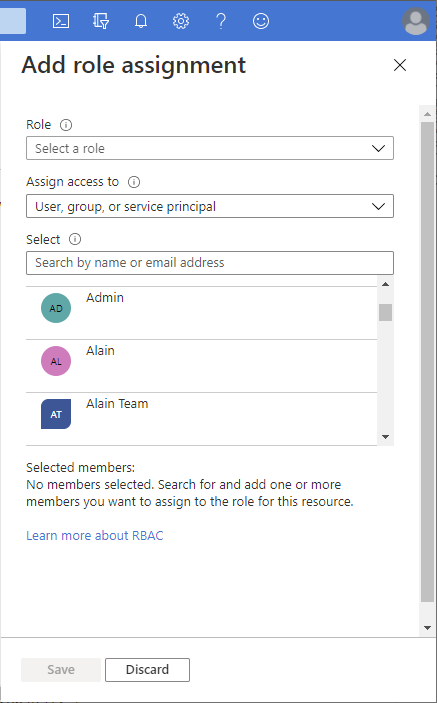
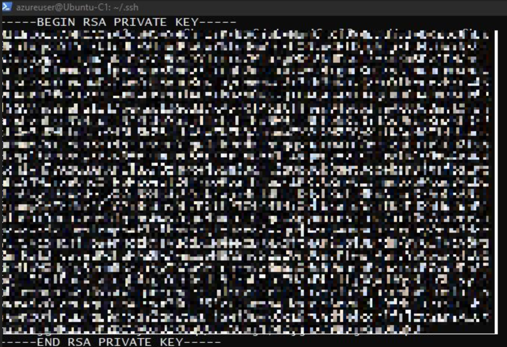

# Tutorial: Discover Google Cloud Platform (GCP) instances with Azure Migrate: Discovery and assessment

As part of your migration journey to Azure, you discover your servers for assessment and migration.

This tutorial shows you how to discover Google Cloud Platform (GCP) instances with the Azure Migrate: Discovery and assessment tool, using a lightweight Azure Migrate appliance. You deploy the appliance on a server on GCP, to continuously discover machine and performance metadata.

In this tutorial, you learn how to:

> [!div class="checklist"]
> * Set up an Azure account.
> * Prepare server on GCP for discovery.
> * Create a project.
> * Set up the Azure Migrate appliance.
> * Start continuous discovery.

> [!NOTE]
> Tutorials show the quickest path for trying out a scenario and using default options.  

If you don't have an Azure subscription, create a [free account](https://azure.microsoft.com/pricing/free-trial/) before you begin.

## Prerequisites

Before you start this tutorial, check you have these prerequisites in place.

**Requirement** | **Details**
--- | ---
**Appliance** | You need a server on GCP on which to run the Azure Migrate appliance. The machine should have:<br/><br/> - Windows Server 2016 installed.<br/> _Running the appliance on a machine with Windows Server 2019 isn't supported_.<br/><br/> - 16-GB RAM, 8 vCPUs, around 80 GB of disk storage, and an external virtual switch.<br/><br/> - A static or dynamic IP address, with internet access, either directly or through a proxy.
**Windows server instances** | Allow inbound connections on WinRM port 5985 (HTTP) for discovery of Windows servers.
**Linux server instances** | Allow inbound connections on port 22 (TCP) for discovery of Linux servers.

## Prepare an Azure user account

To create a project and register the Azure Migrate appliance, you need an account with:

* Contributor or Owner permissions on an Azure subscription.
* Permissions to register Azure Active Directory apps.

If you just created a free Azure account, you're the owner of your subscription. If you're not the subscription owner, work with the owner to assign the permissions as follows:

1. In the Azure portal, search for "subscriptions", and under **Services**, select **Subscriptions**.

    

1. In the **Subscriptions** page, select the subscription in which you want to create a project.

1. Select **Access control (IAM)**.

1. Select **Add** > **Add role assignment** to open the **Add role assignment** page.

1. Assign the following role. For detailed steps, see [Assign Azure roles using the Azure portal](../role-based-access-control/role-assignments-portal.md).

    | Setting | Value |
    | --- | --- |
    | Role | Contributor or Owner |
    | Assign access to | User |
    | Members | azmigrateuser |

    

1. To register the appliance, your Azure account needs **permissions to register Azure Active Directory apps**.

1. In the portal, go to **Azure Active Directory** > **Users**.

1. Request the tenant or global admin to assign the [Application Developer role](../active-directory/roles/permissions-reference.md#application-developer) to the account to allow Azure AD app registration by users. [Learn more](../active-directory/roles/manage-roles-portal.md#assign-a-role).

## Prepare GCP instances

Set up an account that the appliance can use to access servers on  GCP.

* For **Windows servers**:
    * Set up a local user account on non-domain joined servers, and a domain account on domain joined servers that you want to include in the discovery. Add the user account to the following groups: 
        * Remote Management Users
        * Performance Monitor Users
        * Performance Log users.
* For **Linux servers**:
    * You need a root account on the Linux servers that you want to discover. If you aren't able to provide a root account, refer to the instructions in the [support matrix](migrate-support-matrix-physical.md#permissions-for-linux-server) for an alternative.
    * Azure Migrate uses password authentication when discovering GCP instances. GCP instances don't support password authentication by default. Before you can discover instance, you need to enable password authentication.
        1. Sign into each Linux  machine.
        2. Open the sshd_config file: vi /etc/ssh/sshd_config
        3. In the file, locate the **PasswordAuthentication** line, and change the value to **yes**.
        4. Save the file and close it. Restart the ssh service.
    * If you're using a root user to discover your Linux servers, ensure root login is allowed on the servers.
        1. Sign into each Linux machine
        2. Open the sshd_config file: vi /etc/ssh/sshd_config
        3. In the file, locate the **PermitRootLogin** line, and change the value to **yes**.
        4. Save the file and close it. Restart the ssh service.

## Set up a project

Set up a new project.

1. In the Azure portal > **All services**, search for **Azure Migrate**.
2. Under **Services**, select **Azure Migrate**.
3. In **Get started**, select **Create project**.
4. In **Create project**, select your Azure subscription and resource group. Create a resource group if you don't have one.
5. In **Project Details**, specify the project name and the geography in which you want to create the project. Review supported geographies for [public](migrate-support-matrix.md#public-cloud) and [government clouds](migrate-support-matrix.md#azure-government).

   

6. Select **Create**.
7. Wait a few minutes for the project to deploy. The **Azure Migrate: Discovery and assessment** tool is added by default to the new project.


> [!NOTE]
> If you have already created a project, you can use the same project to register additional appliances to discover and assess more no of servers.[Learn more](create-manage-projects.md#find-a-project).

## Set up the appliance

The Azure Migrate appliance is a lightweight appliance, used by Azure Migrate: Discovery and assessment to do the following:

* Discover on-premises servers.
* Send metadata and performance data for discovered servers to Azure Migrate: Discovery and assessment.

[Learn more](migrate-appliance.md) about the Azure Migrate appliance.

To set up the appliance, you:

1. Provide an appliance name and generate a project key in the portal.
1. Download a zipped file with Azure Migrate installer script from the Azure portal.
1. Extract the contents from the zipped file. Launch the PowerShell console with administrative privileges.
1. Execute the PowerShell script to launch the appliance web application.
1. Configure the appliance for the first time and register it with the project using the project key.

### 1. Generate the project key

1. In **Migration goals** > **Servers, databases and web apps** > **Azure Migrate: Discovery and assessment**, select **Discover**.
2. In **Discover servers** > **Are your servers virtualized?**, select **Physical or other (AWS, GCP, Xen, etc.)**.
3. In **1:Generate project key**, provide a name for the Azure Migrate appliance that you'll set up for discovery of your GCP virtual servers. The name should be alphanumeric with 14 characters or fewer.
4. Click **Generate key** to start the creation of the required Azure resources. Don't close the Discover servers page during the creation of resources.
5. After the successful creation of the Azure resources, a **project key** is generated.
6. Copy the key as you'll need it to complete the registration of the appliance during its configuration.

### 2. Download the installer script

In **2: Download Azure Migrate appliance**, click **Download**.

### Verify security

Check that the zipped file is secure before you deploy it.

1. On the machine to which you downloaded the file, open an administrator command window.
2. Run the following command to generate the hash for the zipped file:
    - ```C:\>CertUtil -HashFile <file_location> [Hashing Algorithm]```
    - Example usage for public cloud: ```C:\>CertUtil -HashFile C:\Users\administrator\Desktop\AzureMigrateInstaller-Server-Public.zip SHA256 ```
    - Example usage for government cloud: ```  C:\>CertUtil -HashFile C:\Users\administrator\Desktop\AzureMigrateInstaller-Server-USGov.zip SHA256 ```
3.  Verify the latest appliance versions and hash values:
    - For the public cloud:

        **Scenario** | **Download** | **Hash value**
        --- | --- | ---
        Physical (85 MB) | [Latest version](https://go.microsoft.com/fwlink/?linkid=2191847) | 7EF01AE30F7BB8F4486EDC1688481DB656FB8ECA7B9EF6363B4DAB1CFCFDA141 

    - For Azure Government:

        **Scenario** | **Download** | **Hash value**
        --- | --- | ---
        Physical (85 MB) | [Latest version](https://go.microsoft.com/fwlink/?linkid=2191847) | 7EF01AE30F7BB8F4486EDC1688481DB656FB8ECA7B9EF6363B4DAB1CFCFDA141 
 

### 3. Run the Azure Migrate installer script
The installer script does the following:

- Installs agents and a web application for GCP server discovery and assessment.
- Install Windows roles, including Windows Activation Service, IIS, and PowerShell ISE.
- Download and installs an IIS rewritable module.
- Updates a registry key (HKLM) with persistent setting details for Azure Migrate.
- Creates the following files under the path:
    - **Config Files**: %Programdata%\Microsoft Azure\Config
    - **Log Files**: %Programdata%\Microsoft Azure\Logs

Run the script as follows:

1. Extract the zipped file to a folder on the server that will host the appliance.  Make sure you don't run the script on a machine on an existing Azure Migrate appliance.

2. Launch PowerShell on the above server with administrative (elevated) privilege.

3. Change the PowerShell directory to the folder where the contents have been extracted from the downloaded zipped file.

4. Run the script named `AzureMigrateInstaller.ps1` by running the following command:

   - For the public cloud: 
    
     `PS C:\Users\administrator\Desktop\AzureMigrateInstaller-Server-Public> .\AzureMigrateInstaller.ps1`

   - For Azure Government: 
    
     `PS C:\Users\Administrators\Desktop\AzureMigrateInstaller-Server-USGov>.\AzureMigrateInstaller.ps1`

    The script will launch the appliance web application when it finishes successfully.

If you come across any issues, you can access the script logs at C:\ProgramData\Microsoft Azure\Logs\AzureMigrateScenarioInstaller_<em>Timestamp</em>.log for troubleshooting.

### Verify appliance access to Azure

Make sure that the appliance can connect to Azure URLs for [public](migrate-appliance.md#public-cloud-urls) and [government](migrate-appliance.md#government-cloud-urls) clouds.

### 4. Configure the appliance

Set up the appliance for the first time.

1. Open a browser on any machine that can connect to the appliance and open the URL of the appliance web app: **https://*appliance name or IP address*: 44368**.

   Alternately, you can open the app from the desktop by clicking the app shortcut.
2. Accept the **license terms** and read the third-party information.

#### Set up prerequisites and register the appliance

In the configuration manager, select **Set up prerequisites**, and then complete these steps:
1. **Connectivity**: The appliance checks that the server has internet access. If the server uses a proxy:
    - Select **Setup proxy** to specify the proxy address (in the form `http://ProxyIPAddress` or `http://ProxyFQDN`, where *FQDN* refers to a *fully qualified domain name*) and listening port.
    - Enter credentials if the proxy needs authentication.
    - If you have added proxy details or disabled the proxy or authentication, select **Save** to trigger connectivity and check connectivity again.
    
        Only HTTP proxy is supported.
1. **Time sync**: Check that the time on the appliance is in sync with internet time for discovery to work properly.
1. **Install updates and register appliance**: To run auto-update and register the appliance, follow these steps:

    :::image type="content" source="./media/tutorial-discover-vmware/prerequisites.png" alt-text="Screenshot that shows setting up the prerequisites in the appliance configuration manager.":::

    > [!NOTE]
    > This is a new user experience in Azure Migrate appliance which is available only if you have set up an appliance using the latest OVA/Installer script downloaded from the portal. The appliances which have already been registered will continue seeing the older version of the user experience and will continue to work without any issues.

    1. For the appliance to run auto-update, paste the project key that you copied from the portal. If you don't have the key, go to **Azure Migrate: Discovery and assessment** > **Overview** > **Manage existing appliances**. Select the appliance name you provided when you generated the project key, and then copy the key that's shown.
	2. The appliance will verify the key and start the auto-update service, which updates all the services on the appliance to their latest versions. When the auto-update has run, you can select **View appliance services** to see the status and versions of the services running on the appliance server.
    3. To register the appliance, you need to select **Login**. In **Continue with Azure Login**, select **Copy code & Login** to copy the device code (you must have a device code to authenticate with Azure) and open an Azure Login prompt in a new browser tab. Make sure you've disabled the pop-up blocker in the browser to see the prompt.
    
        :::image type="content" source="./media/tutorial-discover-vmware/device-code.png" alt-text="Screenshot that shows where to copy the device code and sign in.":::
    4. In a new tab in your browser, paste the device code and sign in by using your Azure username and password. Signing in with a PIN isn't supported.
	    > [!NOTE]
        > If you close the sign in tab accidentally without logging in, refresh the browser tab of the appliance configuration manager to display the device code and Copy code & Login button.
	5. After you successfully sign in, return to the browser tab that displays the appliance configuration manager. If the Azure user account that you used to sign in has the required permissions for the Azure resources that were created during key generation, appliance registration starts.

        After the appliance is successfully registered, to see the registration details, select **View details**.

You can *rerun prerequisites* at any time during appliance configuration to check whether the appliance meets all the prerequisites.


## Start continuous discovery

Now, connect from the appliance to the GCP servers to be discovered, and start the discovery.

1. In **Step 1: Provide credentials for discovery of Windows and Linux physical or virtual servers​**, select **Add credentials**.
1. For Windows server, select the source type as **Windows Server**, specify a friendly name for credentials, add the username and password. Select **Save**.
1. If you're using password-based authentication for Linux server, select the source type as **Linux Server (Password-based)**, specify a friendly name for credentials, add the username and password. Select **Save**.
1. If you're using SSH key-based authentication for Linux server, you can select source type as **Linux Server (SSH key-based)**, specify a friendly name for credentials, add the username, browse and select the SSH private key file. Select **Save**.

    - Azure Migrate supports the SSH private key generated by ssh-keygen command using RSA, DSA, ECDSA, and ed25519 algorithms.
    - Currently Azure Migrate doesn't support passphrase-based SSH key. Use an SSH key without a passphrase.
    - Currently Azure Migrate doesn't support SSH private key file generated by PuTTY.
    - Azure Migrate supports OpenSSH format of the SSH private key file as shown below:
    
    


2. If you want to add multiple credentials at once, select **Add more** to save and add more credentials. 
   > [!Note]
   > By default, the credentials will be used to gather data about the installed applications, roles, and features, and also to collect dependency data from Windows and Linux servers, unless you disable the slider to not perform these features (as instructed in the last step).
3. In **Step 2:Provide physical or virtual server details​**, select **Add discovery source** to specify the server **IP address/FQDN** and the friendly name for credentials to connect to the server.
4. You can either **Add single item** at a time or **Add multiple items** in one go. There's also an option to provide server details through **Import CSV**.

    - If you choose **Add single item**, you can choose the OS type, specify friendly name for credentials, add server **IP address/FQDN** and select **Save**.
    - If you choose **Add multiple items**, you can add multiple records at once by specifying server **IP address/FQDN** with the friendly name for credentials in the text box. Verify** the added records and select **Save**.
    - If you choose **Import CSV** _(selected by default)_, you can download a CSV template file, populate the file with the server **IP address/FQDN** and friendly name for credentials. You then import the file into the appliance, **verify** the records in the file and select **Save**.

5. On clicking **Save**, the appliance will try validating the connection to the servers added and show the **Validation status** in the table against each server.
    - If validation fails for a server, review the error by clicking on **Validation failed** in the Status column of the table. Fix the issue, and validate again.
    - To remove a server, select **Delete**.
6. You can **revalidate** the connectivity to servers anytime before starting the discovery.
1. Before initiating discovery, you can choose to disable the slider to not perform software inventory and agentless dependency analysis on the added servers. You can change this option at any time.

    :::image type="content" source="./media/tutorial-discover-physical/disable-slider.png" alt-text="Screenshot that shows where to disable the slider.":::
1. To perform discovery of SQL Server instances and databases, you can add additional credentials (Windows domain/non-domain, SQL authentication credentials) and the appliance will attempt to automatically map the credentials to the SQL servers. If you add domain credentials, the appliance will authenticate the credentials against Active Directory of the domain to prevent any user accounts from locking out. To check validation of the domain credentials, follow these steps:
  - In the configuration manager credentials table, see **Validation status** for domain credentials. Only the domain credentials are validated.
  - If validation fails, you can select a Failed status to see the validation error. Fix the issue, and then select **Revalidate credentials** to reattempt validation of the credentials.

### Start discovery

Click **Start discovery**, to kick off discovery of the successfully validated servers. After the discovery has been successfully initiated, you can check the discovery status against each server in the table.

## How discovery works


* It takes approximately 2 minutes to complete discovery of 100 servers and their metadata to appear in the Azure portal.
* [Software inventory](how-to-discover-applications.md) (discovery of installed applications) is automatically initiated when the discovery of servers is finished.
* [Software inventory](how-to-discover-applications.md) identifies the SQL Server instances that are running on the servers. Using the information it collects, the appliance attempts to connect to the SQL Server instances through the Windows authentication credentials or the SQL Server authentication credentials that are provided on the appliance. Then, it gathers data on SQL Server databases and their properties. The SQL Server discovery is performed once every 24 hours.
* Appliance can connect to only those SQL Server instances to which it has network line of sight, whereas software inventory by itself may not need network line of sight.
* The time taken for discovery of installed applications depends on the number of discovered servers. For 500 servers, it takes approximately one hour for the discovered inventory to appear in the Azure Migrate project in the portal.
* During software inventory, the added server credentials are iterated against servers and validated for agentless dependency analysis. When the discovery of servers is finished, in the portal, you can enable agentless dependency analysis on the servers. Only the servers on which validation succeeds can be selected to enable [agentless dependency analysis](how-to-create-group-machine-dependencies-agentless.md).
* SQL Server instances and databases data begin to appear in the portal within 24 hours after you start discovery.
* By default, Azure Migrate uses the most secure way of connecting to SQL instances that is, Azure Migrate encrypts communication between the Azure Migrate appliance and the source SQL Server instances by setting the TrustServerCertificate property to `true`. Additionally, the transport layer uses SSL to encrypt the channel and bypass the certificate chain to validate trust. Hence, the appliance server must be set up to trust the certificate's root authority. However, you can modify the connection settings, by selecting **Edit SQL Server connection properties** on the appliance. [Learn more](/sql/database-engine/configure-windows/enable-encrypted-connections-to-the-database-engine) to understand what to choose.

    :::image type="content" source="./media/tutorial-discover-vmware/sql-connection-properties.png" alt-text="Screenshot that shows how to edit SQL Server connection properties.":::
## Verify servers in the portal

After discovery finishes, you can verify that the servers appear in the portal.

1. Open the Azure Migrate dashboard.
2. In **Servers, databases and web apps** > **Azure Migrate: Discovery and assessment** page, click the icon that displays the count for **Discovered servers**.

## Next steps

* [Assess GCP servers](tutorial-assess-gcp.md) for migration to Azure VMs.
* [Review the data](discovered-metadata.md#collected-data-for-physical-servers) that the appliance collects during discovery.
