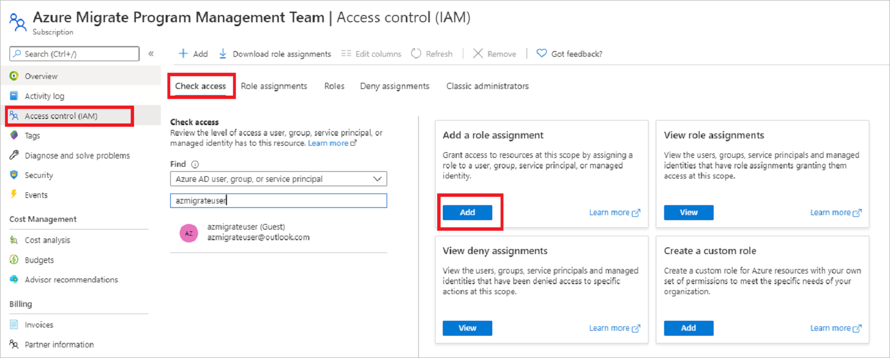

# Tutorial: Discover Hyper-V VMs with Server Assessment

As part of your migration journey to Azure, you discover your on-premises inventory and workloads. 

This tutorial shows you how to discover on-premises Hyper-V virtual machines (VMs) with the Azure Migrate: Server Assessment tool, using a lightweight Azure Migrate appliance. You deploy the appliance as a Hyper-V VM, to continuously discover machine and performance metadata.

In this tutorial, you learn how to:

> [!div class="checklist"]
> * Set up an Azure account
> * Prepare the Hyper-V environment for discovery.
> * Create an Azure Migrate project.
> * Set up the Azure Migrate appliance.
> * Start continuous discovery.

> [!NOTE]
> Tutorials show the quickest path for trying out a scenario, and use default options.  

If you don't have an Azure subscription, create a [free account](https://azure.microsoft.com/pricing/free-trial/) before you begin.

## Prerequisites

Before you start this tutorial, check you have these prerequisites in place.


**Requirement** | **Details**
--- | ---
**Hyper-V host** | Hyper-V hosts on which VMs are located can be standalone, or in a cluster.<br/><br/> The host must be running Windows Server 2019, Windows Server 2016, or Windows Server 2012 R2.<br/><br/> Verify inbound connections are allowed on WinRM port 5985 (HTTP), so that the appliance can connect to pull VM metadata and performance data, using a Common Information Model (CIM) session.
**Appliance deployment** | Hyper-v host needs resources to allocate a VM for the appliance:<br/><br/> - Windows Server 2016<br/><br/> -16 GB of RAM<br/><br/> - Eight vCPUs<br/><br/> - Around 80 GB of disk storage.<br/><br/> - An external virtual switch.<br/><br/> - Internet access on for the VM, directly or via a proxy.
**VMs** | VMs can be running any Windows or Linux operating system. 

Before you start, you can [review the data](migrate-appliance.md#collected-data---hyper-v) that the appliance collects during discovery.

## Prepare an Azure user account

To create an Azure Migrate project and register the Azure Migrate appliance, you need an account with:
- Contributor or Owner permissions on an Azure subscription.
- Permissions to register Azure Active Directory apps.

If you just created a free Azure account, you're the owner of your subscription. If you're not the subscription owner, work with the owner to assign the permissions as follows:


1. In the Azure portal, search for "subscriptions", and under **Services**, select **Subscriptions**.

    

2. In the **Subscriptions** page, select the subscription in which you want to create an Azure Migrate project. 
3. In the subscription, select **Access control (IAM)** > **Check access**.
4. In **Check access**, search for the relevant user account.
5. In **Add a role assignment**, click **Add**.

    

6. In **Add role assignment**, select the Contributor or Owner role, and select the account (azmigrateuser in our example). Then click **Save**.

    

7. In the portal, search for users, and under **Services**, select **Users**.
8. In **User settings**, verify that Azure AD users can register applications (set to **Yes** by default).

    

9. Alternately, the tenant/global admin can assign the **Application Developer** role to an account to allow the registration of AAD App(s). [Learn more](../active-directory/fundamentals/active-directory-users-assign-role-azure-portal.md).

## Prepare Hyper-V hosts

Set up an account with Administrator access on the Hyper-V hosts. The appliance uses this account for discovery.

- Option 1: Prepare an account with Administrator access to the Hyper-V host machine.
- Option 2: Prepare a Local Admin account, or Domain Admin account, and add the account to these groups: Remote Management Users, Hyper-V Administrators, and Performance Monitor Users.


## Set up a project

et up a new Azure Migrate project.

1. In the Azure portal > **All services**, search for **Azure Migrate**.
2. Under **Services**, select **Azure Migrate**.
3. In **Overview**, select **Create project**.
5. In **Create project**, select your Azure subscription and resource group. Create a resource group if you don't have one.
6. In **Project Details**, specify the project name and the geography in which you want to create the project. Review supported geographies for [public](migrate-support-matrix.md#supported-geographies-public-cloud) and [government clouds](migrate-support-matrix.md#supported-geographies-azure-government).

   

7. Select **Create**.
8. Wait a few minutes for the Azure Migrate project to deploy.

The **Azure Migrate: Server Assessment** tool is added by default to the new project.


## Set up the appliance

This tutorial sets up the appliance on a Hyper-V VM, as follows:

- Provide an appliance name and generate an Azure Migrate project key in the portal.
- Download a compressed Hyper-V VHD from the Azure portal.
- Create the appliance, and check that it can connect to Azure Migrate Server Assessment.
- Configure the appliance for the first time, and register it with the Azure Migrate project using the Azure Migrate project key.
> [!NOTE]
> If for some reason you can't set up the appliance using a template, you can set it up using a PowerShell script. [Learn more](deploy-appliance-script.md#set-up-the-appliance-for-hyper-v).


### Generate the Azure Migrate project key

1. In **Migration Goals** > **Servers** > **Azure Migrate: Server Assessment**, select **Discover**.
2. In **Discover machines** > **Are your machines virtualized?**, select **Yes, with Hyper-V**.
3. In **1:Generate Azure Migrate project key**, provide a name for the Azure Migrate appliance that you will set up for discovery of Hyper-V VMs.The name should be alphanumeric with 14 characters or fewer.
1. Click on **Generate key** to start the creation of the required Azure resources. Please do not close the Discover machines page during the creation of resources.
1. After the successful creation of the Azure resources, an **Azure Migrate project key** is generated.
1. Copy the key as you will need it to complete the registration of the appliance during its configuration.

### Download the VHD

In **2: Download Azure Migrate appliance**, select the .VHD file and click on **Download**. 


### Verify security

Check that the zipped file is secure, before you deploy it.

1. On the machine to which you downloaded the file, open an administrator command window.

2. Run the following PowerShell command to generate the hash for the ZIP file
    - ```C:\>Get-FileHash -Path <file_location> -Algorithm [Hashing Algorithm]```
    - Example usage: ```C:\>Get-FileHash -Path ./AzureMigrateAppliance_v3.20.09.25.zip -Algorithm SHA256```

3.  Verify the latest appliance versions and hash values:

    - For the Azure public cloud:

        **Scenario** | **Download** | **SHA256**
        --- | --- | ---
        Hyper-V (8.91 GB) | [Latest version](https://go.microsoft.com/fwlink/?linkid=2140422) |  40aa037987771794428b1c6ebee2614b092e6d69ac56d48a2bbc75eeef86c99a

    - For Azure Government:

        **Scenario*** | **Download** | **SHA256**
        --- | --- | ---
        Hyper-V (85.8 MB) | [Latest version](https://go.microsoft.com/fwlink/?linkid=2140424) |  cfed44bb52c9ab3024a628dc7a5d0df8c624f156ec1ecc3507116bae330b257f

### Create the appliance VM

Import the downloaded file, and create the VM.

1. Extract the zipped VHD file to a folder on the Hyper-V host that will host the appliance VM. Three folders are extracted.
2. Open Hyper-V Manager. In **Actions**, click **Import Virtual Machine**.
2. In the Import Virtual Machine Wizard > **Before you begin**, click **Next**.
3. In **Locate Folder**, specify the folder containing the extracted VHD. Then click **Next**.
1. In **Select Virtual Machine**, click **Next**.
2. In **Choose Import Type**, click **Copy the virtual machine (create a new unique ID)**. Then click **Next**.
3. In **Choose Destination**, leave the default setting. Click **Next**.
4. In **Storage Folders**, leave the default setting. Click **Next**.
5. In **Choose Network**, specify the virtual switch that the VM will use. The switch needs internet connectivity to send data to Azure.
6. In **Summary**, review the settings. Then click **Finish**.
7. In Hyper-V Manager > **Virtual Machines**, start the VM.


### Verify appliance access to Azure

Make sure that the appliance VM can connect to Azure URLs for [public](migrate-appliance.md#public-cloud-urls) and [government](migrate-appliance.md#government-cloud-urls) clouds.

### Configure the appliance

Set up the appliance for the first time.

> [!NOTE]
> If you set up the appliance using a [PowerShell script](deploy-appliance-script.md) instead of the downloaded VHD, the first two steps in this procedure aren't relevant.

1. In Hyper-V Manager > **Virtual Machines**, right-click the VM > **Connect**.
2. Provide the language, time zone, and password for the appliance.
3. Open a browser on any machine that can connect to the VM, and open the URL of the appliance web app: **https://*appliance name or IP address*: 44368**.

   Alternately, you can open the app from the appliance desktop by clicking the app shortcut.
1. Accept the **license terms**, and read the third-party information.
1. In the web app > **Set up prerequisites**, do the following:
    - **Connectivity**: The app checks that the VM has internet access. If the VM uses a proxy:
      - Click on **Set up proxy** to and specify the proxy address (in the form http://ProxyIPAddress or http://ProxyFQDN) and listening port.
      - Specify credentials if the proxy needs authentication.
      - Only HTTP proxy is supported.
      - If you have added proxy details or disabled the proxy and/or authentication, click on **Save** to trigger connectivity check again.
    - **Time sync**: Time is verified. The time on the appliance should be in sync with internet time for VM discovery to work properly.
    - **Install updates**: Azure Migrate Server Assessment checks that the appliance has the latest updates installed.After the check completes, you can click on **View appliance services** to see the status and versions of the components running on the appliance.

### Register the appliance with Azure Migrate

1. Paste the **Azure Migrate project key** copied from the portal. If you do not have the key, go to **Server Assessment> Discover> Manage existing appliances**, select the appliance name you provided at the time of key generation and copy the corresponding key.
1. Click on **Log in**. It will open an Azure login prompt in a new browser tab. If it doesn't appear, make sure you've disabled the pop-up blocker in the browser.
1. On the new tab, sign in by using your Azure username and password.
   
   Sign-in with a PIN isn't supported.
3. After you successfully logged in, go back to the web app. 
4. If the Azure user account used for logging has the right permissions on the Azure resources created during key generation, the appliance registration will be initiated.
1. After appliance is successfully registered, you can see the registration details by clicking on **View details**.


### Delegate credentials for SMB VHDs

If you're running VHDs on SMBs, you must enable delegation of credentials from the appliance to the Hyper-V hosts. To do this from the appliance:

1. On the appliance VM, run this command. HyperVHost1/HyperVHost2 are example host names.

    ```
    Enable-WSManCredSSP -Role Client -DelegateComputer HyperVHost1.contoso.com, HyperVHost2.contoso.com, HyperVHost1, HyperVHost2 -Force
    ```

2. Alternatively, do this in the Local Group Policy Editor on the appliance:
    - In **Local Computer Policy** > **Computer Configuration**, click **Administrative Templates** > **System** > **Credentials Delegation**.
    - Double-click **Allow delegating fresh credentials**, and select **Enabled**.
    - In **Options**, click **Show**, and add each Hyper-V host you want to discover to the list, with **wsman/** as a prefix.
    - In  **Credentials Delegation**, double-click **Allow delegating fresh credentials with NTLM-only server authentication**. Again, add each Hyper-V host you want to discover to the list, with **wsman/** as a prefix.

## Start continuous discovery

Connect from the appliance to Hyper-V hosts or clusters, and start VM discovery.

1. In **Step 1: Provide Hyper-V host credentials**, click on **Add credentials** to  specify a friendly name for credentials, add **Username** and **Password** for a Hyper-V host/cluster that the appliance will use to discover VMs. Click on **Save**.
1. If you want to add multiple credentials at once,click on **Add more** to save and add more credentials. Multiple credentials are supported for Hyper-V VMs discovery.
1. In **Step 2: Provide Hyper-V host/cluster details**, click on **Add discovery source** to specify the Hyper-V host/cluster **IP address/FQDN** and the friendly name for credentials to connect to the host/cluster.
1. You can either **Add single item** at a time or **Add multiple items** in one go. There is also an option to provide Hyper-V host/cluster details through **Import CSV**.


    - If you choose **Add single item**, you need to specify friendly name for credentials and Hyper-V host/cluster **IP address/FQDN** and click on **Save**.
    - If you choose **Add multiple items** _(selected by default)_, you can add multiple records at once by specifying Hyper-V host/cluster **IP address/FQDN** with the friendly name for credentials in the text box.**Verify** the added records and click on **Save**.
    - If you choose **Import CSV**, you can download a CSV template file, populate the file with the Hyper-V host/cluster **IP address/FQDN** and friendly name for credentials. You then import the file into the appliance, **verify** the records in the file and click on **Save**.

1. On clicking Save, appliance will try validating the connection to the Hyper-V hosts/clusters added and show the **Validation status** in the table against each host/cluster.
    - For successfully validated hosts/clusters, you can view more details by clicking on their IP address/FQDN.
    - If validation fails for a host, review the error by clicking on **Validation failed** in the Status column of the table. Fix the issue, and validate again.
    - To remove hosts or clusters, click on **Delete**.
    - You can't remove a specific host from a cluster. You can only remove the entire cluster.
    - You can add a cluster, even if there are issues with specific hosts in the cluster.
1. You can **revalidate** the connectivity to hosts/clusters any time before starting the discovery.
1. Click on **Start discovery**, to kick off VM discovery from the successfully validated hosts/clusters. After the discovery has been successfully initiated, you can check the discovery status against each host/cluster in the table.

This starts discovery. It takes approximately 2 minutes per host for metadata of discovered servers to appear in the Azure portal.

## Verify VMs in the portal

After discovery finishes, you can verify that the VMs appear in the portal.

1. Open the Azure Migrate dashboard.
2. In **Azure Migrate - Servers** > **Azure Migrate: Server Assessment** page, click the icon that displays the count for **Discovered servers**.

## Next steps

- [Assess Hyper-V VMs](tutorial-assess-hyper-v.md) for migration to Azure VMs.
- [Review the data](migrate-appliance.md#collected-data---hyper-v) that the appliance collects during discovery.