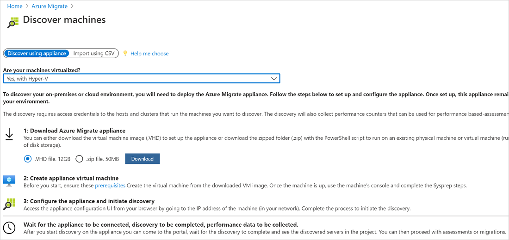
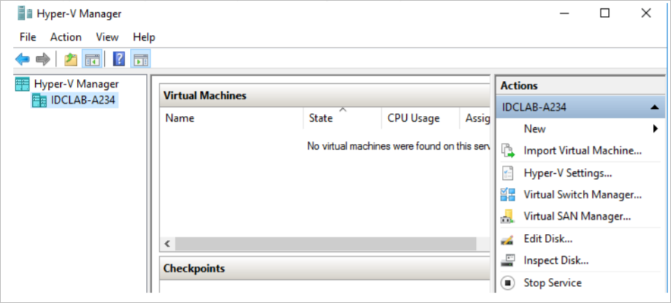
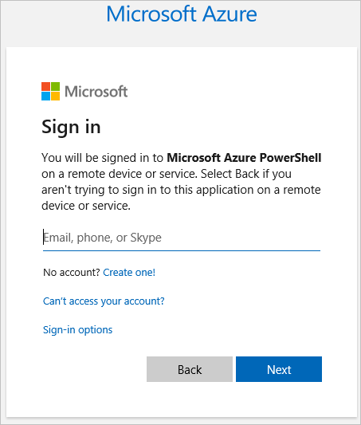

# Tutorial: Discover Hyper-V VMs with Server Assessment

As part of your migration journey to Azure, you discover your on-premises inventory and workloads. 

This tutorial shows you how to discover on-premises Hyper-V virtual machines (VMs) with the Azure Migrate: Server Assessment tool, using a lightweight Azure Migrate appliance. You deploy the appliance as a Hyper-V VM, to continuously discover machine and performance metadata.

In this tutorial, you learn how to:

> [!div class="checklist"]
> * Set up an Azure account
> * Prepare the Hyper-V environment for discovery.
> * Create an Azure Migrate project.
> * Set up the Azure Migrate appliance.
> * Start continuous discovery.

> [!NOTE]
> Tutorials show the quickest path for trying out a scenario, and use default options.  

If you don't have an Azure subscription, create a [free account](https://azure.microsoft.com/pricing/free-trial/) before you begin.

## Prerequisites

Before you start this tutorial, check you have these prerequisites in place.


**Requirement** | **Details**
--- | ---
**Hyper-V host** | Hyper-V hosts on which VMs are located can be standalone, or in a cluster.<br/><br/> The host must be running Windows Server 2019, Windows Server 2016, or Windows Server 2012 R2.<br/><br/> Verify inbound connections are allowed on WinRM port 5985 (HTTP), so that the appliance can connect to pull VM metadata and performance data, using a Common Information Model (CIM) session.
**Appliance deployment** | vCenter Server needs resources to allocate a VM for the appliance:<br/><br/> - Windows Server 2016<br/><br/> -32 GB of RAM<br/><br/> - Eight vCPUs<br/><br/> - Around 80 GB of disk storage.<br/><br/> - An external virtual switch.<br/><br/> - Internet access on for the VM, directly or via a proxy.
**VMs** | VMs can be running any Windows or Linux operating system. 

Before you start, you can [review the data](migrate-appliance.md#collected-data---hyper-v) that the appliance collects during discovery.

## Prepare an Azure user account

To create an Azure Migrate project and register the Azure Migrate appliance, you need an account with:
- Contributor or Owner permissions on an Azure subscription.
- Permissions to register Azure Active Directory apps.

If you just created a free Azure account, you're the owner of your subscription. If you're not the subscription owner, work with the owner to assign the permissions as follows:


1. In the Azure portal, search for "subscriptions", and under **Services**, select **Subscriptions**.

    

2. In the **Subscriptions** page, select the subscription in which you want to create an Azure Migrate project. 
3. In the subscription, select **Access control (IAM)** > **Check access**.
4. In **Check access**, search for the relevant user account.
5. In **Add a role assignment**, click **Add**.

    

6. In **Add role assignment**, select the Contributor or Owner role, and select the account (azmigrateuser in our example). Then click **Save**.

    

7. In the portal, search for users, and under **Services**, select **Users**.
8. In **User settings**, verify that Azure AD users can register applications (set to **Yes** by default).

    

## Prepare Hyper-V hosts

Set up an account with Administrator access on the Hyper-V hosts. The appliance uses this account for discovery.

- Option 1: Prepare an account with Administrator access to the Hyper-V host machine.
- Option 2: Prepare a Local Admin account, or Domain Admin account, and add the account to these groups: Remote Management Users, Hyper-V Administrators, and Performance Monitor Users.


## Set up a project

et up a new Azure Migrate project.

1. In the Azure portal > **All services**, search for **Azure Migrate**.
2. Under **Services**, select **Azure Migrate**.
3. In **Overview**, select **Create project**.
5. In **Create project**, select your Azure subscription and resource group. Create a resource group if you don't have one.
6. In **Project Details**, specify the project name and the geography in which you want to create the project. Review supported geographies for [public](migrate-support-matrix.md#supported-geographies-public-cloud) and [government clouds](migrate-support-matrix.md#supported-geographies-azure-government).

   

7. Select **Create**.
8. Wait a few minutes for the Azure Migrate project to deploy.

The **Azure Migrate: Server Assessment** tool is added by default to the new project.


## Set up the appliance

This tutorial sets up the appliance on a Hyper-V VM.
- You download the appliance template, and import the template into vCenter Server to create the appliance VM.
- After creating the appliance, you set it up for the first time, and register it with the Azure Migrate project.

> [!NOTE]
> If for some reason you can't set up the appliance using a template, you can set it up using a PowerShell script. [Learn more](deploy-appliance-script.md#set-up-the-appliance-for-hyper-v).


### Download the VHD

1. In **Migration Goals** > **Servers** > **Azure Migrate: Server Assessment**, select **Discover**.
2. In **Discover machines** > **Are your machines virtualized?**, select **Yes, with Hyper-V**.
3. Select **Download** to download the VHD file.

   


### Deploy the appliance VM

Import the downloaded file, and create a VM:

1. Download the zipped VHD file to the Hyper-V host on which the appliance VM will be placed.
2. Extract the zipped file.

    - In the extracted location, the file unzips into a folder called AzureMigrateAppliance_VersionNumber.
    - This folder contains a subfolder, also called AzureMigrateAppliance_VersionNumber.
    - This subfolder contains three further subfolders - Snapshots, Virtual Hard Disks, and Virtual Machines.

3. Open Hyper-V Manager. In **Actions**, click **Import Virtual Machine**.

    

4. In the Import Virtual Machine Wizard > **Before you begin**, click **Next**.
5. In **Locate Folder**, select the **Virtual Machines** folder. Then click **Next**.
6. In **Select Virtual Machine**, click **Next**.
7. In **Choose Import Type**, click **Copy the virtual machine (create a new unique ID)**. Then click **Next**.
8. In **Choose Destination**, leave the default setting. Click **Next**.
9. In **Storage Folders**, leave the default setting. Click **Next**.
10. In **Choose Network**, specify the virtual switch that the VM will use. The switch needs internet connectivity to send data to Azure. [Learn](/windows-server/virtualization/hyper-v/get-started/create-a-virtual-switch-for-hyper-v-virtual-machines) about creating a virtual switch.
11. In **Summary**, review the settings. Then click **Finish**.
12. In Hyper-V Manager > **Virtual Machines**, start the VM.


### Verify appliance access to Azure

Check appliance access as follows:

1. Check that the VM can connect to Azure.
    - In the public cloud, the appliance machine should be able to connect to these [URLs](migrate-appliance.md#public-cloud-urls).
    - In the government cloud, the appliance should be able to connect to these [government URLs](migrate-appliance.md#government-cloud-urls).
2. Make sure that these ports are open on the appliance machine:

    - Allow inbound connections on TCP port 3389, to allow remote desktop connections to the appliance.
    - Allow inbound connections on port 44368, to remotely access the appliance web app using the URL: https://\<appliance-ip-or-name>:44368.
    - Allow outbound connections on port 443 (HTTPS), to send discovery and performance metadata to Azure Migrate.


### Configure the appliance

Set up the appliance for the first time.

> [!NOTE]
> If you set up the appliance using a [PowerShell script](deploy-appliance-script.md) instead of the downloaded VHD, the first two steps in this procedure aren't relevant.

1. In Hyper-V Manager > **Virtual Machines**, right-click the VM > **Connect**.
2. Provide the language, time zone, and password for the appliance.
3. Open a browser on any machine that can connect to the VM, and open the URL of the appliance web app: **https://*appliance name or IP address*: 44368**.

   Alternately, you can open the app from the appliance desktop by clicking the app shortcut.
1. In the web app > **Set up prerequisites**, do the following:
    - **License**: Accept the license terms, and read the third-party information.
    - **Connectivity**: The app checks that the VM has internet access. If the VM uses a proxy:
      - Click **Proxy settings**, and specify the proxy address and listening port, in the form http://ProxyIPAddress or http://ProxyFQDN.
      - Specify credentials if the proxy needs authentication.
      - Only HTTP proxy is supported.
    - **Time sync**: Time is verified. The time on the appliance should be in sync with internet time for VM discovery to work properly.
    - **Install updates**: Azure Migrate Server Assessment checks that the appliance has the latest updates installed.

### Register the appliance 

1. In **Register with Azure Migrate**, select **Login**. If it doesn't appear, make sure you've disabled the pop-up blocker in the browser.

    

1. On the **Sign in** page, sign in with your Azure user name and password. Sign-in with a PIN isn't supported.

    
1. After you successfully sign in, go back to the app.
1. In **Register with Azure Migrate**, select the subscription in which the Azure Migrate project was created, and then select the project.
1. Specify a name for the appliance. The name should be alphanumeric with 14 characters or fewer.
3. Select **Register**. Then click **Continue**. A message shows registration as successful.

    


### Delegate credentials for SMB VHDs

If you're running VHDs on SMBs, you must enable delegation of credentials from the appliance to the Hyper-V hosts. To do this, you enable each host to act as a delegate for the appliance. If you followed the tutorials in order, you did this in the previous tutorial, when you prepared Hyper-V for assessment and migration. You should have either set up CredSSP for the hosts [manually](tutorial-prepare-hyper-v.md#enable-credssp-to-delegate-credentials), or by [running a script](tutorial-prepare-hyper-v.md#run-the-script) that does this.

Enable on the appliance as follows:

#### Option 1

On the appliance VM, run this command. HyperVHost1/HyperVHost2 are example host names.

```
Enable-WSManCredSSP -Role Client -DelegateComputer HyperVHost1.contoso.com, HyperVHost2.contoso.com, HyperVHost1, HyperVHost2 -Force
```

Example: ` Enable-WSManCredSSP -Role Client -DelegateComputer HyperVHost1.contoso.com HyperVHost2.contoso.com -Force `

#### Option 2

Alternatively, do this in the Local Group Policy Editor on the appliance:

1. In **Local Computer Policy** > **Computer Configuration**, click **Administrative Templates** > **System** > **Credentials Delegation**.
2. Double-click **Allow delegating fresh credentials**, and select **Enabled**.
3. In **Options**, click **Show**, and add each Hyper-V host you want to discover to the list, with **wsman/** as a prefix.
4. Then, in **Credentials Delegation**, double-click **Allow delegating fresh credentials with NTLM-only server authentication**. Again, add each Hyper-V host you want to discover to the list, with **wsman/** as a prefix.


## Start continuous discovery

The appliance needs to connect to Hyper-V hosts to discover VMs.


### Connect to Hyper-V hosts

1. In **User name** and **Password**, specify the account credentials that the appliance will use to discover VMs. Specify a friendly name for the credentials, and click **Save details**.
2. Click **Add host**, and specify Hyper-V host/cluster details.
3. Click **Validate**. After validation, the number of VMs that can be discovered on each host/cluster is shown.
    - If validation fails for a host, review the error by hovering over the icon in the **Status** column. Fix issues, and validate again.
    - To remove hosts or clusters, select > **Delete**.
    - You can't remove a specific host from a cluster. You can only remove the entire cluster.
    - You can add a cluster, even if there are issues with specific hosts in the cluster.
4. After validation, click **Save and start discovery** to start the discovery process.

This starts discovery. It takes around 1.5 minutes per host for metadata of discovered servers to appear in the Azure portal.


### Verify discovered VMs in the portal

After discovery, you can verify that the VMs appear in the Azure portal:

1. Open the Azure Migrate dashboard.
2. In **Azure Migrate - Servers** > **Azure Migrate: Server Assessment**, select the icon that displays the count for **Discovered servers**.

## Next steps

- [Assess Hyper-V VMs](tutorial-assess-hyper-v.md) for migration to Azure VMs.
- [Review the data](migrate-appliance.md#collected-data---hyper-v) that the appliance collects during discovery.