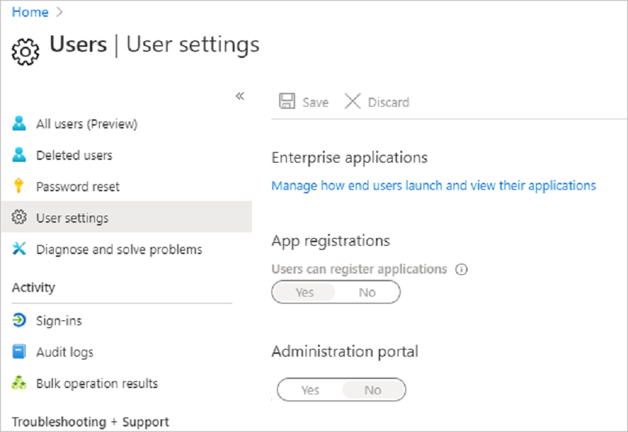

# Tutorial: Assess servers using an imported CSV file

As part of your migration journey to Azure, you discover your on-premises inventory and workloads. 

This tutorial shows you how to assess on-premises machines with the Azure Migrate: Server Assessment tool, using an imported  comma-separate values (CSV) file. 

If you use a CSV file, you don't need to set up the Azure Migrate appliance to discover and assess servers. You can control the data you share in the file, and much of the data is optional. This method is useful if:

- You want to create a quick, initial assessment before you deploy the appliance.
- You can't deploy the Azure Migrate appliance in your organization.
- You can't share credentials that allow access to on-premises servers.
- Security constraints prevent you from gathering and sending data collected by the appliance to Azure.

> [!NOTE]
> You can't migrate servers imported using a CSV file.

In this tutorial, you learn how to:
> [!div class="checklist"]
> * Set up an Azure account
> * Set up an Azure Migrate project
> * Prepare a CSV file
> * Import the file
> * Assess servers

> [!NOTE]
> Tutorials show the quickest path for trying out a scenario, and use default options where possible. 

If you don't have an Azure subscription, create a [free account](https://azure.microsoft.com/pricing/free-trial/) before you begin.

## Prerequisites

- You can add up to 20,000 servers in a single CSV file, and in an Azure Migrate project. 
- Operating system names specified in the CSV file must contain and match [supported names](#supported-operating-system-names).

## Prepare an Azure user account

To create an Azure Migrate project, you need an account with:
- Contributor or Owner permissions on an Azure subscription.
- Permissions to register Azure Active Directory apps.

If you just created a free Azure account, you're the owner of your subscription. If you're not the subscription owner, work with the owner to assign the permissions as follows:

1. In the Azure portal, search for "subscriptions", and under **Services**, select **Subscriptions**.

    

2. In the **Subscriptions** page, select the subscription in which you want to create an Azure Migrate project. 
3. In the subscription, select **Access control (IAM)** > **Check access**.
4. In **Check access**, search for the relevant user account.
5. In **Add a role assignment**, select **Add**.

    

6. In **Add role assignment**, select the Contributor or Owner role, and select the account (azmigrateuser in our example). Then select **Save**.

    

7. In the portal, search for users, and under **Services**, select **Users**.
8. In **User settings**, verify that Azure AD users can register applications (set to **Yes** by default).

    

## Set up a project

Set up a new Azure Migrate project if you don't have one.

1. In the Azure portal > **All services**, search for **Azure Migrate**.
2. Under **Services**, select **Azure Migrate**.
3. In **Overview**, select **Create project**.
5. In **Create project**, select your Azure subscription and resource group. Create a resource group if you don't have one.
6. In **Project Details**, specify the project name and the geography in which you want to create the project. Review supported geographies for [public](migrate-support-matrix.md#supported-geographies-public-cloud) and [government clouds](migrate-support-matrix.md#supported-geographies-azure-government).

     
    > [!Note]
    > Use the **Advanced** configuration section to create an Azure Migrate project with private endpoint connectivity. [Learn more](how-to-use-azure-migrate-with-private-endpoints.md#create-a-project-with-private-endpoint-connectivity)

7. Select **Create**.
8. Wait a few minutes for the Azure Migrate project to deploy.

The **Azure Migrate: Server Assessment** tool is added by default to the new project.

## Prepare the CSV

Download the CSV template and add server information to it.

### Download the template

1. In **Migration Goals** > **Servers** > **Azure Migrate: Server Assessment**, select **Discover**.
2. In **Discover machines**, select **Import using CSV**.
3. Select **Download** to download the CSV template. Alternatively, you can [download it directly](https://go.microsoft.com/fwlink/?linkid=2109031).

    

### Add server information

Gather server data and add it to the CSV file.

- To gather data, you can export it from tools you use for on-premises server management, such as VMware vSphere or your configuration-management database (CMDB).
- To review sample data, download our [example file](https://go.microsoft.com/fwlink/?linkid=2108405).

The following table summarizes the file fields to fill in:

**Field name** | **Mandatory** | **Details**
--- | --- | ---
**Server name** | Yes | We recommend specifying the fully qualified domain name (FQDN).
**IP address** | No | Server address.
**Cores** | Yes | Number of processor cores allocated to the server.
**Memory** | Yes | Total RAM, in MB, allocated to the server.
**OS name** | Yes | Server operating system.   Operating system names that match or contain the names in [this](#supported-operating-system-names) list are recognized by the assessment.
**OS version** | No | Server operating system version.
**OS architecture** | No | Server OS architecture   Valid values are: x64, x86, amd64, 32-bit or 64-bit
**Number of disks** | No | Not needed if individual disk details are provided.
**Disk 1 size**  | No | Maximum size of disk, in GB. You can add details for more disks by [adding columns](#add-multiple-disks) in the template. You can add up to eight disks.
**Disk 1 read ops** | No | Disk read operations per second.
**Disk 1 write ops** | No | Disk write operations per second.
**Disk 1 read throughput** | No | Data read from the disk per second, in MB per second.
**Disk 1 write throughput** | No | Data written to disk per second, in MB per second.
**CPU utilization percentage** | No | Percentage of CPU used.
**Memory utilization percentage** | No | Percentage of RAM used.
**Total disks read ops** | No | Disk-read operations per second.
**Total disks write ops** | No | Disk-write operations per second.
**Total disks read throughput** | No | Data read from the disk, in MB per second.
**Total disks write throughput** | No | Data written to disk, in MB per second.
**Network In throughput** | No | Data received by the server, in MB per second.
**Network Out throughput** | No | Data transmitted by the server, in MB per second.
**Firmware type** | No | Server firmware. Values can be "BIOS" or "UEFI".
**MAC address**| No | Server MAC address.

### Add operating systems

Assessment recognizes specific operating system names. Any name you specify must exactly match one of the strings in the [supported names list](#supported-operating-system-names).

### Add multiple disks

The template provides default fields for the first disk. You can add similar columns for up to eight disks.

For example, to specify all fields for a second disk, add these columns:

- Disk 2 size
- Disk 2 read ops
- Disk 2 write ops
- Disk 2 read throughput
- Disk 2 write throughput

## Import the server information

After adding information to the CSV template, import the CSV file into Server Assessment.

1. In Azure Migrate, in **Discover machines**, go to the completed template.
2. Select **Import**.
3. The import status is shown.
    - If warnings appear in the status, you can either fix them or continue without addressing them.
    - To improve assessment accuracy, improve the server information as suggested in warnings.
    - To view and fix warnings, select **Download warning details .CSV**. This operation downloads the CSV with warnings included. Review the warnings and fix issues as needed.
    - If errors appear in the status so that the import status is **Failed**, you must fix those errors before you can continue with the import:
        1. Download the CSV, which now includes error details.
        1. Review and address the errors as necessary. 
        1. Upload the modified file again.
4. When the import status is **Completed**, the server information has been imported. Refresh if the import process doesn't seem to be complete.

## Update server information

You can update the information for a server by importing the data for the server again with the same **Server name**. You can't modify the **Server name** field. Deleting servers is currently not supported.

## Verify servers in the portal

To verify that the servers appear in the Azure portal after discovery:

1. Open the Azure Migrate dashboard.
2. On the **Azure Migrate - Servers** > **Azure Migrate: Server Assessment** page, select the icon that displays the count for **Discovered servers**.
3. Select the **Import based** tab.

## Supported operating system names

Operating system names provided in the CSV must contain and match. If they don't, you won't be able to assess them. 

**A-H** | **I-R** | **S-T** | **U-Z**
--- | --- | --- | ---
Asianux 3 Asianux 4 Asianux 5 CentOS CentOS 4/5 CoreOS Linux Debian GNU/Linux 4 Debian GNU/Linux 5 Debian GNU/Linux 6 Debian GNU/Linux 7 Debian GNU/Linux 8 FreeBSD | IBM OS/2 macOS X 10 MS-DOS Novell NetWare 5 Novell NetWare 6 Oracle Linux Oracle Linux 4/5 Oracle Solaris 10 Oracle Solaris 11 Red Hat Enterprise Linux 2 Red Hat Enterprise Linux 3 Red Hat Enterprise Linux 4 Red Hat Enterprise Linux 5 Red Hat Enterprise Linux 6 Red Hat Enterprise Linux 7 Red Hat Fedora | SCO OpenServer 5 SCO OpenServer 6 SCO UnixWare 7  Serenity Systems eComStation 1 Serenity Systems eComStation  Sun Microsystems Solaris 8 Sun Microsystems Solaris 9  SUSE Linux Enterprise 10 SUSE Linux Enterprise 11 SUSE Linux Enterprise 12 SUSE Linux Enterprise 8/9 SUSE Linux Enterprise 11 SUSE openSUSE | Ubuntu Linux VMware ESXi 4 VMware ESXi 5 VMware ESXi 6 Windows 10 Windows 2000 Windows 3 Windows 7 Windows 8 Windows 95 Windows 98 Windows NT Windows Server (R) 2008 Windows Server 2003 Windows Server 2008 Windows Server 2008 R2 Windows Server 2012 Windows Server 2012 R2 Windows Server 2016 Windows Server 2019 Windows Server Threshold Windows Vista Windows Web Server 2008 R2 Windows XP Professional

## Next steps

In this tutorial, you:

> [!div class="checklist"]
> * Created an Azure Migrate project 
> * Discovered servers using an imported CSV file. 
Now, run an assessment for [VMware VM migration to Azure VMs](./tutorial-assess-vmware-azure-vm.md).