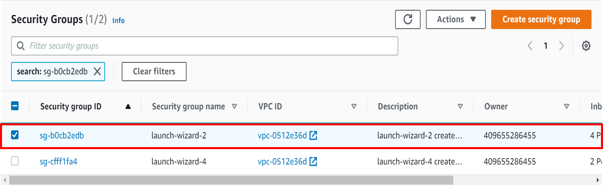
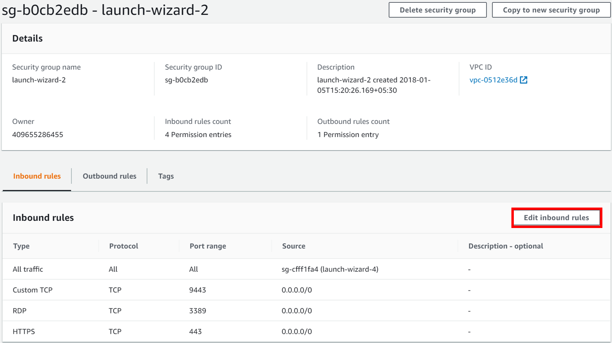

# Discover, assess, and migrate Amazon Web Services (AWS) VMs to Azure

> [!CAUTION]
> This article references CentOS, a Linux distribution that's nearing end-of-life status. Please consider your use and plan accordingly.

This tutorial shows you how to discover, assess, and migrate Amazon Web Services (AWS) virtual machines (VMs) to Azure VMs by using Azure Migrate: Server Assessment and the Migration and modernization tool.

> [!NOTE]
> You migrate AWS VMs to Azure by treating them as physical servers.

In this tutorial, you learn how to:
> [!div class="checklist"]
>
> * Verify prerequisites for migration.
> * Prepare Azure resources with the Migration and modernization tool. Set up permissions for your Azure account and resources to work with Azure Migrate and Modernize.
> * Prepare AWS Elastic Compute Cloud (EC2) instances for migration.
> * Add the Migration and modernization tool in the Azure Migrate and Modernize hub.
> * Set up the replication appliance and deploy the configuration server.
> * Install the Mobility service on the AWS VMs you want to migrate.
> * Enable replication for VMs.
> * Track and monitor the replication status.
> * Run a test migration to make sure everything's working as expected.
> * Run a full migration to Azure.

If you don't have an Azure subscription, create a [free account](https://azure.microsoft.com/pricing/free-trial/) before you begin.

## Discover and assess

Before you migrate to Azure, we recommend that you perform a VM discovery and migration assessment. This assessment helps right-size your AWS VMs for migration to Azure and estimate potential Azure run costs.

To set up an assessment:

1. Follow the [tutorial](./tutorial-discover-physical.md) to set up Azure and prepare your AWS VMs for an assessment. Note that:

    - Azure Migrate and Modernize uses password authentication to discover AWS instances. AWS instances don't support password authentication by default. Before you can discover an instance, you need to enable password authentication.
        - For Windows machines, allow WinRM port 5985 (HTTP). This port allows remote WMI calls.
        - For Linux machines:
            1. Sign in to each Linux machine.
            1. Open the *sshd_config* file: `vi /etc/ssh/sshd_config`.
            1. In the file, locate the `PasswordAuthentication` line and change the value to `yes`.
            1. Save the file and close it. Restart the ssh service.
    - If you're using a root user to discover your Linux VMs, ensure that root login is allowed on the VMs.
        1. Sign in to each Linux machine.
        1. Open the *sshd_config* file: `vi /etc/ssh/sshd_config`.
        1. In the file, locate the `PermitRootLogin` line and change the value to `yes`.
        1. Save the file and close it. Restart the ssh service.

1. Then, follow this [tutorial](./tutorial-assess-physical.md) to set up an Azure Migrate project and appliance to discover and assess your AWS VMs.

Although we recommend that you try out an assessment, performing an assessment isn't a mandatory step to be able to migrate VMs.

## Prerequisites

- Ensure that the AWS VMs you want to migrate are running a supported operating system (OS) version. AWS VMs are treated like physical machines for the migration. Review the [supported operating systems and kernel versions](../site-recovery/vmware-physical-azure-support-matrix.md#replicated-machines) for the physical server migration workflow. You can use standard commands like `hostnamectl` or `uname -a` to check the OS and kernel versions for your Linux VMs. We recommend that you perform a test migration (test failover) to validate if the VM works as expected before you proceed with the migration.
- Make sure your AWS VMs comply with the [supported configurations](./migrate-support-matrix-physical-migration.md#physical-server-requirements) for migration to Azure.
- Verify that the AWS VMs that you replicate to Azure comply with [Azure VM requirements](./migrate-support-matrix-physical-migration.md#azure-vm-requirements).
- Some changes are needed on the VMs before you migrate them to Azure:
    - For some operating systems, Azure Migrate and Modernize makes these changes automatically.
    - It's important to make these changes before you begin migration. If you migrate the VM before you make the change, the VM might not boot up in Azure.
Review the [Windows](prepare-for-migration.md#windows-machines) and [Linux](prepare-for-migration.md#linux-machines) changes you need to make.

### Prepare Azure resources for migration

Prepare Azure for migration with the Migration and modernization tool.

Task | Details
--- | ---
Create an Azure Migrate project | Your Azure account needs Contributor or Owner permissions to [create a new project](./create-manage-projects.md).
Verify permissions for your Azure account | Your Azure account needs permissions to create a VM and write to an Azure managed disk.

### Assign permissions to create a project

1. In the Azure portal, open the subscription and select **Access control (IAM)**.
1. In **Check access**, find the relevant account and select it to view permissions.
1. You should have **Contributor** or **Owner** permissions.
    - If you just created a free Azure account, you're the owner of your subscription.
    - If you're not the subscription owner, work with the owner to assign the role.

### Assign Azure account permissions

Assign the VM Contributor role to the Azure account. This role provides permissions to:

- Create a VM in the selected resource group.
- Create a VM in the selected virtual network.
- Write to an Azure managed disk.

### Create an Azure network

[Set up](../virtual-network/manage-virtual-network.yml#create-a-virtual-network) an Azure virtual network. When you replicate to Azure, the Azure VMs that are created are joined to the Azure virtual network that you specified when you set up migration.

## Prepare AWS instances for migration

To prepare for AWS to Azure migration, you need to prepare and deploy a replication appliance for migration.

### Prepare a machine for the replication appliance

The Migration and modernization tool uses a replication appliance to replicate machines to Azure. The replication appliance runs the following components:

- **Configuration server**: The configuration server coordinates communications between the AWS environment and Azure and manages data replication.
- **Process server**: The process server acts as a replication gateway. It receives replication data and optimizes that data with caching, compression, and encryption. Then it sends the data to a cache storage account in Azure.

To prepare for appliance deployment:

- Set up a separate EC2 VM to host the replication appliance. This instance must be running Windows Server 2012 R2 or Windows Server 2016. [Review](./migrate-replication-appliance.md#appliance-requirements) the hardware, software, and networking requirements for the appliance.
- The appliance shouldn't be installed on a source VM that you want to replicate or on the Azure Migrate: Discovery and assessment appliance you might have installed before. It should be deployed on a different VM.
- The source AWS VMs to be migrated should have a network line of sight to the replication appliance. Configure necessary security group rules to enable this capability. We recommend that you deploy the replication appliance in the same virtual private cloud (VPC) as the source VMs to be migrated. If the replication appliance needs to be in a different VPC, the VPCs must be connected through VPC peering.
- The source AWS VMs communicate with the replication appliance on ports HTTPS 443 (control channel orchestration) and TCP 9443 (data transport) inbound for replication management and replication data transfer. The replication appliance in turn orchestrates and sends replication data to Azure over port HTTPS 443 outbound. To configure these rules, edit the security group inbound/outbound rules with the appropriate ports and source IP information.

   

   

- The replication appliance uses MySQL. Review the [options](migrate-replication-appliance.md#mysql-installation) for installing MySQL on the appliance.
- Review the Azure URLs required for the replication appliance to access [public](migrate-replication-appliance.md#url-access) and [government](migrate-replication-appliance.md#azure-government-url-access) clouds.

## Set up the replication appliance

The first step of migration is to set up the replication appliance. To set up the appliance for AWS VMs migration, you must download the installer file for the appliance and then run it on the [VM you prepared](#prepare-a-machine-for-the-replication-appliance).

### Download the replication appliance installer

1. In the Azure Migrate project, select **Servers, databases, and web apps** > **Migration and modernization** > **Discover**.

    

1. In **Discover machines** > **Are your machines virtualized?**, select **Not virtualized/Other**.
1. In **Target region**, select the Azure region to which you want to migrate the machines.
1. Select **Confirm that the target region for migration is \<region-name\>**.
1. Select **Create resources**. This step creates an Azure Site Recovery vault in the background.
    - If you already set up migration with the Migration and modernization tool, the target option can't be configured because resources were set up previously.
    - You can't change the target region for this project after you select this button.
    - To migrate your VMs to a different region, you need to create a new or different Azure Migrate project.

    > [!NOTE]
    > If you selected private endpoint as the connectivity method for the Azure Migrate project when it was created, the Recovery Services vault is also configured for private endpoint connectivity. Ensure that the private endpoints are reachable from the replication appliance. [Learn more](troubleshoot-network-connectivity.md).

1. In **Do you want to install a new replication appliance?**, select **Install a replication appliance**.
1. In **Download and install the replication appliance software**, download the appliance installer and the registration key. You need the key to register the appliance. The key is valid for five days after download.

    

1. Copy the appliance setup file and key file to the Windows Server 2016 or Windows Server 2012 AWS VM you created for the replication appliance.
1. Run the replication appliance setup file, as described in the next procedure.
    1. Under **Before You Begin**, select **Install the configuration server and process server**. Then select **Next**.
    1. In **Third-Party Software License**, select **I accept the third-party license agreement**. Then select **Next**.
    1. In **Registration**, select **Browse**, and then go to where you put the vault registration key file. Select **Next**.
    1. In **Internet Settings**, select **Connect to Azure Site Recovery without a proxy server**. Then select **Next**.
    1. The **Prerequisites Check** page runs checks for several items. When it's finished, select **Next**.
    1. In **MySQL Configuration**, provide a password for the MySQL database. Then select **Next**.
    1. In **Environment Details**, select **No**. You don't need to protect your VMs. Then select **Next**.
    1. In **Install Location**, select **Next** to accept the default.
    1. In **Network Selection**, select **Next** to accept the default.
    1. In **Summary**, select **Install**.
    1. **Installation Progress** shows you information about the installation process. When it's finished, select **Finish**. A window displays a message about a reboot. Select **OK**.
    1. Next, a window displays a message about the configuration server connection passphrase. Copy the passphrase to your clipboard and save the passphrase in a temporary text file on the source VMs. You need this passphrase later during the Mobility service installation process.

1. After the installation finishes, the Appliance configuration wizard launches automatically. (You can also launch the wizard manually by using the `cspsconfigtool` shortcut that was created on the appliance desktop.) In this tutorial, we manually install the Mobility service on source VMs to be replicated. You need to create a dummy account in this step to proceed. For your dummy account, use "guest" as the friendly name, "username" as the username, and "password" as the password for the account. You use this dummy account in the Enable Replication stage.

1. After the appliance restarts after setup, in **Discover machines**, select the new appliance in **Select Configuration Server** and select **Finalize registration**. The **Finalize registration** step performs a couple of final tasks to prepare the replication appliance.

    

## Install the Mobility service agent

A Mobility service agent must be preinstalled on the source AWS VMs to be migrated before you can initiate replication. The approach you choose to install the Mobility service agent might depend on your organization's preferences and existing tools. The "push" installation method built into Site Recovery isn't currently supported. Approaches you might want to consider:

- [AWS System Manager](https://docs.aws.amazon.com/systems-manager/latest/userguide/what-is-systems-manager.html)
- [System Center Configuration Manager](../site-recovery/vmware-azure-mobility-install-configuration-mgr.md)
- [Azure Arc for servers and custom script extensions](../azure-arc/servers/overview.md)
- [Install Mobility agent for Windows](../site-recovery/vmware-physical-mobility-service-overview.md#install-the-mobility-service-using-command-prompt-classic)
- [Install Mobility agent for Linux](../site-recovery/vmware-physical-mobility-service-overview.md#linux-machine-1)

1. Extract the contents of the installer tarball to a local folder (for example, /tmp/MobSvcInstaller) on the AWS VM, as follows:

    ```
    mkdir /tmp/MobSvcInstaller
    tar -C /tmp/MobSvcInstaller -xvf <Installer tarball>
    cd /tmp/MobSvcInstaller
    ```  

1. Run the installer script:

    ```
    sudo ./install -r MS -v VmWare -q -c CSLegacy
    ```  

1. Register the agent with the replication appliance:

    ```
    /usr/local/ASR/Vx/bin/UnifiedAgentConfigurator.sh -i <replication appliance IP address> -P <Passphrase File Path>
    ```

## Enable replication for AWS VMs

> [!NOTE]
> Through the portal, you can add up to 10 VMs for replication at once. To replicate more VMs simultaneously, you can add them in batches of 10.

1. In the Azure Migrate project, select **Servers, databases, and web apps** > **Migration and modernization** > **Replicate**.

    

1. In **Replicate**, > **Source settings** > **Are your machines virtualized?**, select **Not virtualized/Other**.
1. In **On-premises appliance**, select the name of the Azure Migrate appliance that you set up.
1. In **Process Server**, select the name of the replication appliance.
1. In **Guest credentials**, select the dummy account you created previously during the [replication installer setup](#download-the-replication-appliance-installer) to install the Mobility service manually. (Push installation isn't supported.) Then select **Next: Virtual machines**.

    
1. In **Virtual Machines**, in **Import migration settings from an assessment?**, leave the default setting **No, I'll specify the migration settings manually**.
1. Check each VM you want to migrate. Then select **Next: Target settings**.

    :::image type="content" source="./media/tutorial-migrate-physical-virtual-machines/select-vms-inline.png" alt-text="Screenshot that shows selecting VMs." lightbox="./media/tutorial-migrate-physical-virtual-machines/select-vms-expanded.png":::

1. In **Target settings**, select the subscription and target region to which you'll migrate. Specify the resource group in which the Azure VMs will reside after migration.
1. In **Virtual Network**, select the Azure virtual network/subnet to which the Azure VMs will be joined after migration.
1. In **Cache storage account**, keep the default option to use the cache storage account that was automatically created for the project. Use the dropdown list if you want to specify a different storage account to use as the cache storage account for replication. <br/>

    > [!NOTE]
    >
    > - If you selected private endpoint as the connectivity method for the Azure Migrate project, grant the Recovery Services vault access to the cache storage account. [Learn more](migrate-servers-to-azure-using-private-link.md#grant-access-permissions-to-the-recovery-services-vault).
    > - To replicate by using Azure ExpressRoute with private peering, create a private endpoint for the cache storage account. [Learn more](migrate-servers-to-azure-using-private-link.md#create-a-private-endpoint-for-the-storage-account-1).
1. In **Availability options**, select:
    -  **Availability Zone**: Pins the migrated machine to a specific availability zone in the region. Use this option to distribute servers that form a multinode application tier across availability zones. If you select this option, you need to specify the availability zone to use for each of the selected machines on the **Compute** tab. This option is only available if the target region selected for the migration supports availability zones.
    -  **Availability Set**: Places the migrated machine in an availability set. The target resource group that was selected must have one or more availability sets in order to use this option.
    - **No infrastructure redundancy required**: Select this option if you don't need either of these availability configurations for the migrated machines.

1. In **Disk encryption type**, select:
    - Encryption-at-rest with a platform-managed key.
    - Encryption-at-rest with a customer-managed key.
    - Double encryption with platform-managed and customer-managed keys.

   > [!NOTE]
   > To replicate VMs with customer-managed keys, you need to [create a disk encryption set](../virtual-machines/disks-enable-customer-managed-keys-portal.yml) under the target resource group. A disk encryption set object maps managed disks to an Azure Key Vault instance that contains the customer-managed key to use for server-side encryption.

1. In **Azure Hybrid Benefit**:
    - Select **No** if you don't want to apply Azure Hybrid Benefit. Then select **Next**.
    - Select **Yes** if you have Windows Server machines that are covered with active Software Assurance or Windows Server subscriptions, and you want to apply the benefit to the machines you're migrating. Then select **Next**.

    

1. In **Compute**, review the VM name, size, OS disk type, and availability configuration (if selected in the previous step). VMs must conform with [Azure requirements](migrate-support-matrix-physical-migration.md#azure-vm-requirements).
    - **VM size**: If you're using assessment recommendations, the VM size dropdown list shows the recommended size. Otherwise, Azure Migrate and Modernize picks a size based on the closest match in the Azure subscription. Alternatively, pick a manual size in **Azure VM size**.
    - **OS disk**: Specify the OS (boot) disk for the VM. The OS disk is the disk that has the operating system bootloader and installer.
    - **Availability Zone**: Specify the availability zone to use.
    - **Availability Set**: Specify the availability set to use.

1. In **Disks**, specify whether the VM disks should be replicated to Azure and select the disk type (standard SSD/HDD or premium managed disks) in Azure. Then select **Next**.
    - You can exclude disks from replication.
    - If you exclude disks, they won't be present on the Azure VM after migration.

    :::image type="content" source="./media/tutorial-migrate-physical-virtual-machines/disks-inline.png" alt-text="Screenshot that shows the Disks tab in the Replicate dialog." lightbox="./media/tutorial-migrate-physical-virtual-machines/disks-expanded.png":::

1. In **Tags**, choose to add tags to your virtual machines, disks, and NICs.

    :::image type="content" source="./media/tutorial-migrate-vmware/tags-inline.png" alt-text="Screenshot that shows the Tags tab in the Replicate dialog." lightbox="./media/tutorial-migrate-vmware/tags-expanded.png":::

1. In **Review and start replication**, review the settings and select **Replicate** to start the initial replication for the servers.

> [!NOTE]
> To update replication settings any time before replication starts, select **Manage** > **Replicating machines**. Settings can't be changed after replication starts.

## Track and monitor replication status

- When you select **Replicate**, a Start Replication job begins.
- When the Start Replication job finishes successfully, the VMs begin their initial replication to Azure.
- After that initial replication finishes, delta replication begins. Incremental changes to AWS VM disks are periodically replicated to the replica disks in Azure.

You can track job status in the portal notifications.

You can monitor replication status by selecting **Replicating servers** in **Azure Migrate: Server Migration**.


## Run a test migration

When delta replication begins, you can run a test migration for the VMs before you run a full migration to Azure. We highly recommend the test migration. It provides an opportunity to discover any potential issues and fix them before you proceed with the actual migration. We recommend that you do this step at least once for each VM before you migrate it.

- Running a test migration checks that migration works as expected without affecting the AWS VMs, which remain operational and continue replicating.
- Test migration simulates the migration by creating an Azure VM by using replicated data. (The test usually migrates to a nonproduction virtual network in your Azure subscription.)
- You can use the replicated test Azure VM to validate the migration, perform app testing, and address any issues before full migration.

To do a test migration:

1. In **Migration goals**, select **Servers, databases, and web apps** > **Migration and modernization** > **Test migrated servers**.

     

1. Right-click the VM you want to test and select **Test migrate**.

    

1. In **Test Migration**, select the Azure virtual network in which the Azure VM will be located after the migration. We recommend that you use a nonproduction virtual network.
1. The Test Migration job starts. Monitor the job in the portal notifications.
1. After the migration finishes, view the migrated Azure VM in **Virtual Machines** in the Azure portal. The machine name has the suffix **-Test**.
1. After the test is finished, right-click the Azure VM in **Replicating machines** and select **Clean up test migration**.

    :::image type="content" source="./media/tutorial-migrate-physical-virtual-machines/clean-up-inline.png" alt-text="Screenshot that shows the result after the cleanup of test migration." lightbox="./media/tutorial-migrate-physical-virtual-machines/clean-up-expanded.png":::

    > [!NOTE]
    > You can now register your servers running SQL Server with SQL VM RP to take advantage of automated patching, automated backup, and simplified license management by using the SQL IaaS Agent Extension.
    >- Select **Manage** > **Replicating servers** > **Machine containing SQL server** > **Compute and Network** and select **yes** to register with SQL VM RP.
    >- Select **Azure Hybrid Benefit for SQL Server** if you have SQL Server instances that are covered with active Software Assurance or SQL Server subscriptions and you want to apply the benefit to the machines you're migrating to.

## Migrate AWS VMs

After you verify that the test migration works as expected, you can migrate the AWS VMs.

1. In the Azure Migrate project, select **Servers, databases, and web apps** > **Migration and modernization** > **Replicating servers**.

    

1. In **Replicating machines**, right-click the VM and select **Migrate**.
1. In **Migrate** > **Shut down virtual machines and perform a planned migration with no data loss**, select **Yes** > **OK**.

    > [!NOTE]
    >  Automatic shutdown isn't supported while migrating AWS VMs.

1. A migration job starts for the VM. You can view the job status by selecting the notification bell icon on the top right of the portal page. You can also go to the **Jobs** page of the Migration and modernization tool. (Select **Overview** on the tool tile and select **Jobs** from the left menu.)
1. After the job finishes, you can view and manage the VM from the **Virtual Machines** page.

### Complete the migration

1. After the migration is finished, right-click the VM and select **Stop migration**. This action:
    - Stops replication for the AWS VM.
    - Removes the AWS VM from the **Replicating servers** count in the Migration and modernization tool.
    - Cleans up replication state information for the VM.
1. Verify and [troubleshoot any Windows activation issues on the Azure VM](/troubleshoot/azure/virtual-machines/troubleshoot-activation-problems).
1. Perform any post-migration app tweaks, such as updating host names, database connection strings, and web server configurations.
1. Perform final application and migration acceptance testing on the migrated application now running in Azure.
1. Cut over traffic to the migrated Azure VM instance.
1. Update any internal documentation to show the new location and IP address of the Azure VMs.

## Post-migration best practices

- For increased resilience:
    - Keep data secure by backing up Azure VMs by using Azure Backup. [Learn more](../backup/quick-backup-vm-portal.md).
    - Keep workloads running and continuously available by replicating Azure VMs to a secondary region with Site Recovery. [Learn more](../site-recovery/azure-to-azure-tutorial-enable-replication.md).
- For increased security:
    - Lock down and limit inbound traffic access with [Microsoft Defender for Cloud - Just-in-time administration](../security-center/security-center-just-in-time.md).
    - Manage and govern updates on Windows and Linux machines with [Azure Update Manager](../update-manager/overview.md).
    - Restrict network traffic to management endpoints with [network security groups](../virtual-network/network-security-groups-overview.md).
    - Deploy [Azure Disk Encryption](../virtual-machines/disk-encryption-overview.md) to help secure disks and keep data safe from theft and unauthorized access.
    - Read more about [securing IaaS resources](https://azure.microsoft.com/services/virtual-machines/secure-well-managed-iaas/) and [Microsoft Defender for Cloud](https://azure.microsoft.com/services/security-center/).
- For monitoring and management:
    - Consider deploying [Microsoft Cost Management](../cost-management-billing/cost-management-billing-overview.md) to monitor resource usage and spending.

## Troubleshooting and tips

**Question:** I can't see my AWS VM in the discovered list of servers for migration.<br>
**Answer:** Check if your replication appliance meets the requirements. Make sure Mobility Agent is installed on the source VM to be migrated and is registered to the Configuration Server. Check the network setting and firewall rules to enable a network path between the replication appliance and source AWS VMs.

**Question:** How do I know if my VM was successfully migrated?<br>
**Answer:** Post migration, you can view and manage the VM from the **Virtual Machines** page. Connect to the migrated VM to validate.

**Question:** I'm unable to import VMs for migration from my previously created Server Assessment results.<br>
**Answer:** Currently, we don't support the import of assessment for this workflow. As a workaround, you can export the assessment and then manually select the VM recommendation during the Enable Replication step.

**Question:** I'm getting the error "Failed to fetch BIOS GUID" while trying to discover my AWS VMs.<br>
**Answer:** Always use root login for authentication and not any pseudo user. Also, review supported operating systems for AWS VMs.

**Question:** My replication status isn't progressing.<br>
**Answer:** Check if your replication appliance meets the requirements. Make sure that you enabled the required ports on your replication appliance TCP port 9443 and HTTPS 443 for data transport. Ensure that no stale duplicate versions of the replication appliance are connected to the same project.

**Question:** I'm unable to discover AWS instances by using Azure Migrate and Modernize because of the HTTP status code of 504 from the remote Windows management service.<br>
**Answer:** Make sure to review the Azure Migrate appliance requirements and URL access needs. Make sure no proxy settings are blocking the appliance registration.

**Question:** Do I have to make any changes before I migrate my AWS VMs to Azure?<br>
**Answer:** You might have to make the following changes before you migrate your EC2 VMs to Azure:

- If you're using cloud-init for your VM provisioning, you might want to disable cloud-init on the VM before you replicate it to Azure. The provisioning steps performed by cloud-init on the VM might be specific to AWS and won't be valid after the migration to Azure. ​
- If the VM is a paravirtualized (PV) VM and not a hardware VM, you might not be able to run it as is on Azure. PV VMs use a custom boot sequence in AWS. You might be able to overcome this challenge by uninstalling PV drivers before you perform a migration to Azure.
- We always recommend that you run a test migration before the final migration.

**Question:** Can I migrate AWS VMs running the Amazon Linux operating system?<br>
**Answer:** VMs running Amazon Linux can't be migrated as is because the Amazon Linux OS is only supported on AWS.
To migrate workloads running on Amazon Linux, you can spin up a CentOS/RHEL VM in Azure. Then you can migrate the workload running on the AWS Linux machine by using a relevant workload migration approach. For example, depending on the workload, there might be workload-specific tools to aid the migration. These tools might be for databases or deployment tools for web servers.

## Next steps

Investigate the [cloud migration journey](/azure/architecture/cloud-adoption/getting-started/migrate) in the Cloud Adoption Framework for Azure.
