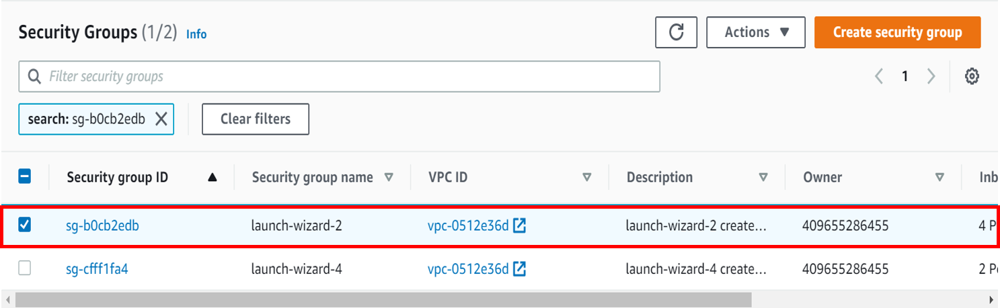
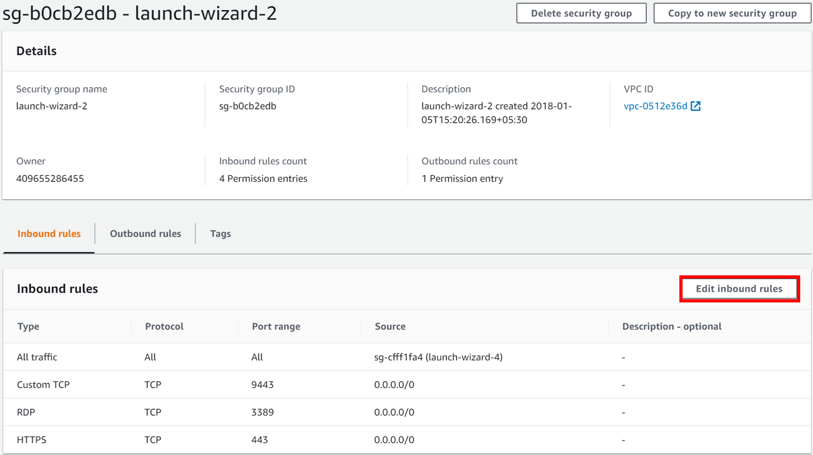

# Discover, assess, and migrate Amazon Web Services (AWS) EC2 instances to Azure

This tutorial shows you how to discover, assess, and migrate Amazon Web Services (AWS) EC2 instances to Azure VMs by using Azure Migrate.

> [!NOTE]
> You migrate AWS VMs to Azure by treating them as physical servers.

In this tutorial, you learn how to:
> [!div class="checklist"]
>
> * Verify prerequisites for migration.
> * Prepare Azure resources and Set up permissions for your Azure account to work with Azure Migrate.
> * Prepare AWS Elastic Compute Cloud (EC2) instances for discovery, assessment and migration.
> * Migrate EC2 instances as physical servers to Azure.

If you don't have an Azure subscription, create a [free account](https://azure.microsoft.com/pricing/free-trial/) before you begin.

## Discover and assess

Before you migrate to Azure, we recommend that you perform a VM discovery and migration assessment. This assessment helps right-size your AWS VMs for migration to Azure and estimate potential Azure run costs.

To set up an assessment:

1. Follow the [tutorial](./tutorial-discover-physical.md) to set up Azure and prepare your AWS VMs for an assessment. Note that:

    - Azure Migrate and Modernize uses password authentication to discover AWS instances. AWS instances don't support password authentication by default. Before you can discover an instance, you need to enable password authentication.
        - For Windows machines, allow WinRM port 5985 (HTTP). This port allows remote WMI calls.
        - For Linux machines:
            1. Sign in to each Linux machine.
            1. Open the *sshd_config* file: `vi /etc/ssh/sshd_config`.
            1. In the file, locate the `PasswordAuthentication` line and change the value to `yes`.
            1. Save the file and close it. Restart the ssh service.
    - If you're using a root user to discover your Linux VMs, ensure that root login is allowed on the VMs.
        1. Sign in to each Linux machine.
        1. Open the *sshd_config* file: `vi /etc/ssh/sshd_config`.
        1. In the file, locate the `PermitRootLogin` line and change the value to `yes`.
        1. Save the file and close it. Restart the ssh service.

1. Then, follow this [tutorial](./tutorial-assess-physical.md) to set up an Azure Migrate project and appliance to discover and assess your AWS VMs.

Although we recommend that you try out an assessment, performing an assessment isn't a mandatory step to be able to migrate VMs.

To plan to migrate an AWS workload to Azure, see [Migrate compute from Amazon Web Services to Azure](/azure/migration/migrate-compute-from-aws), which includes [example migration scenarios](/azure/migration/migrate-compute-from-aws#migration-scenarios) that might align to your use case.

## Prerequisites

- Ensure that the AWS VMs you want to migrate are running a supported operating system (OS) version. AWS VMs are treated like physical machines for the migration. Review the [supported operating systems and kernel versions](../site-recovery/vmware-physical-azure-support-matrix.md#replicated-machines) for the physical server migration workflow. You can use standard commands like `hostnamectl` or `uname -a` to check the OS and kernel versions for your Linux VMs. We recommend that you perform a test migration (test failover) to validate if the VM works as expected before you proceed with the migration.
- Make sure your AWS VMs comply with the [supported configurations](./migrate-support-matrix-physical-migration.md#physical-server-requirements) for migration to Azure.
- Verify that the AWS VMs that you replicate to Azure comply with [Azure VM requirements](./migrate-support-matrix-physical-migration.md#azure-vm-requirements).
- Some changes are needed on the VMs before you migrate them to Azure:
    - For some operating systems, Azure Migrate and Modernize makes these changes automatically.
    - It's important to make these changes before you begin migration. If you migrate the VM before you make the change, the VM might not boot up in Azure.
Review the [Windows](prepare-for-migration.md#windows-machines) and [Linux](prepare-for-migration.md#linux-machines) changes you need to make.

### Prepare Azure resources for migration

- Verify permissions for your Azure account: Your Azure account needs permissions to create a VM and write to an Azure managed disk.
- For the required Azure Migrate built‑in roles and permission details to create a project and run discovery, assessments, and migrations, see [Prepare Azure accounts for Azure Migrate](prepare-azure-accounts.md).
- Assign permissions to register the Replication Appliance in Microsoft Entra ID. For more information, see [required permissions](../site-recovery/deploy-vmware-azure-replication-appliance-modernized.md#required-permissions).
- Create an Azure network: [Set up](../virtual-network/manage-virtual-network.yml#create-a-virtual-network) an Azure virtual network. When you replicate to Azure, Azure VMs are created and joined to the Azure virtual network that you specified when you set up migration.

Also,

- [Review](./agent-based-migration-architecture.md) the migration architecture.
- [Review](../site-recovery/migrate-tutorial-windows-server-2008.md#limitations-and-known-issues) the limitations related to migrating Windows Server 2008 servers to Azure.

## Prepare AWS instances for migration

To prepare for AWS to Azure migration, you need to prepare and deploy a replication appliance for migration.  Physical server  migrations (including AWS, GCP or other clouds) require a separate replication appliance to execute agent-based migrations. You can’t use the Azure Migrate appliance created for discovery to execute physical server migrations.

### Prepare a machine for the replication appliance

To prepare for appliance deployment:

- Set up a separate EC2 VM to host the replication appliance. This instance must be running Windows Server 2022. [Review](tutorial-migrate-physical-virtual-machines.md#set-up-the-replication-appliance) the hardware, software, and networking requirements for the appliance.
- The appliance shouldn't be installed on a source VM that you want to replicate or on the Azure Migrate: Discovery and assessment appliance you might have installed before. It should be deployed on a different VM.
- The source AWS VMs to be migrated should have a network line of sight to the replication appliance. Configure necessary security group rules to enable this capability. We recommend that you deploy the replication appliance in the same virtual private cloud (VPC) as the source VMs to be migrated. If the replication appliance needs to be in a different VPC, the VPCs must be connected through VPC peering.
- The source AWS VMs communicate with the replication appliance on ports HTTPS 443 (control channel orchestration) and TCP 9443 (data transport) inbound for replication management and replication data transfer. The replication appliance in turn orchestrates and sends replication data to Azure over port HTTPS 443 outbound. To configure these rules, edit the security group inbound/outbound rules with the appropriate ports and source IP information.

   

   

- Review the Azure URLs required for the replication appliance to access [public](migrate-replication-appliance.md#url-access) and [government](migrate-replication-appliance.md#azure-government-url-access) clouds.

## Migrate EC2 instances as physical servers
After completing the above requirements, you can begin migrating AWS EC2 instances as physical servers. For more information, see [migrate physical servers or servers running in other clouds](tutorial-migrate-physical-virtual-machines.md#prepare-a-machine-for-the-replication-appliance).

## Troubleshooting and tips

**Question:** I can't see my AWS VM in the discovered list of servers for migration. 
**Answer:** Check if your replication appliance meets the requirements. Make sure Mobility Agent is installed on the source VM to be migrated and is registered to the Configuration Server. Check the network setting and firewall rules to enable a network path between the replication appliance and source AWS VMs.

**Question:** How do I know if my VM was successfully migrated? 
**Answer:** Post migration, you can view and manage the VM from the **Virtual Machines** page. Connect to the migrated VM to validate.

**Question:** I'm unable to import VMs for migration from my previously created Server Assessment results. 
**Answer:** Currently, we don't support the import of assessment for this workflow. As a workaround, you can export the assessment and then manually select the VM recommendation during the Enable Replication step.

**Question:** I'm getting the error "Failed to fetch BIOS GUID" while trying to discover my AWS VMs. 
**Answer:** Always use root login for authentication and not any pseudo user. Also, review supported operating systems for AWS VMs.

**Question:** My replication status isn't progressing. 
**Answer:** Check if your replication appliance meets the requirements. Make sure that you enabled the required ports on your replication appliance TCP port 9443 and HTTPS 443 for data transport. Ensure that no stale duplicate versions of the replication appliance are connected to the same project.

**Question:** I'm unable to discover AWS instances by using Azure Migrate and Modernize because of the HTTP status code of 504 from the remote Windows management service. 
**Answer:** Make sure to review the Azure Migrate appliance requirements and URL access needs. Make sure no proxy settings are blocking the appliance registration.

**Question:** Do I have to make any changes before I migrate my AWS VMs to Azure? 
**Answer:** You might have to make the following changes before you migrate your EC2 VMs to Azure:

- If you're using cloud-init for your VM provisioning, you might want to disable cloud-init on the VM before you replicate it to Azure. The provisioning steps performed by cloud-init on the VM might be specific to AWS and won't be valid after the migration to Azure. ​
- If the VM is a paravirtualized (PV) VM and not a hardware VM, you might not be able to run it as is on Azure. PV VMs use a custom boot sequence in AWS. You might be able to overcome this challenge by uninstalling PV drivers before you perform a migration to Azure.
- We always recommend that you run a test migration before the final migration.

**Question:** Can I migrate AWS VMs running the Amazon Linux operating system? 
**Answer:** VMs running Amazon Linux can't be migrated as is because the Amazon Linux OS is only supported on AWS.
To migrate workloads running on Amazon Linux, you can spin up a RHEL VM in Azure. Then you can migrate the workload running on the AWS Linux machine by using a relevant workload migration approach. For example, depending on the workload, there might be workload-specific tools to aid the migration. These tools might be for databases or deployment tools for web servers.

## Next steps

Investigate the [cloud migration journey](/azure/architecture/cloud-adoption/getting-started/migrate) in the Cloud Adoption Framework for Azure.
