# Migrate Hyper-V VMs to Azure 

This article shows you how to migrate on-premises Hyper-V VMs to Azure, using agentless migration with the Azure Migrate: Server Migration tool.

[Azure Migrate](migrate-services-overview.md) provides a central hub to track discovery, assessment, and migration of your on-premises apps and workloads, and private/public cloud VMs, to Azure. The hub provides Azure Migrate tools for assessment and migration, as well as third-party independent software vendor (ISV) offerings.

This tutorial is the third in a series that demonstrates how to assess and migrate Hyper-V to Azure using Azure Migrate Server Assessment and Migration. In this tutorial, you learn how to:

> [!div class="checklist"]
> * Prepare Azure and your on-premises Hyper-V environment
> * Set up the source environment, and deploy a replication appliance.
> * Set up the target environment.
> * Enable replication.
> * Run a test migration to make sure everything's working as expected.
> * Run a full migration to Azure.

If you don't have an Azure subscription, create a [free account](https://azure.microsoft.com/pricing/free-trial/) before you begin.

## Prerequisites

Before you begin this tutorial, you should:

1. [Review](hyper-v-migration-architecture.md) the Hyper-V migration architecture.
2. [Complete the first tutorial](tutorial-prepare-hyper-v.md) in this series to set up Azure and Hyper-V for migration. In the first tutorial, you:
    - [Prepare Azure](tutorial-prepare-hyper-v.md#prepare-azure) for migration.
    - [Prepare the on-premises environment](tutorial-prepare-hyper-v.md#prepare-for-hyper-v-migration) for migration.
3. We recommend that you try assessing Hyper-V VMs, using Azure Migrate: Server Assessment, before migrating them to Azure. To do this, [complete the second tutorial](tutorial-assess-hyper-v.md) in this series. Although we recommend that you try out an assessment, you don't have to run an assessment before you migrate VMs.
4. Make sure that your Azure account is assigned the Virtual Machine Contributor role, so that you have permissions to:

    - Create a VM in the selected resource group.
    - Create a VM in the selected virtual network.
    - Write to an Azure managed disk.
5. [Set up an Azure network](../virtual-network/manage-virtual-network.md#create-a-virtual-network). When you migrate to Azure, the created Azure VMs are joined to an Azure network you specify when you set up migration.

## Add the Azure Migrate Server Migration tool

If you didn't follow the second tutorial to assess Hyper-V VMs, you need to [follow these instructions](how-to-add-tool-first-time.md) to set up an Azure Migrate project, and add the Azure Migrate Server Migration tool to the project.

If you followed the second tutorial and already have an Azure Migrate project, add the Azure Migrate: Server Migration tool as follows:

1. In the Azure Migrate project, click **Overview**. 
2. In **Discover, assess, and migration servers**, click **Assess and migrate servers**.
3. In **Migration tools**, select **Click here to add a migration tool when you are ready to migrate**.

    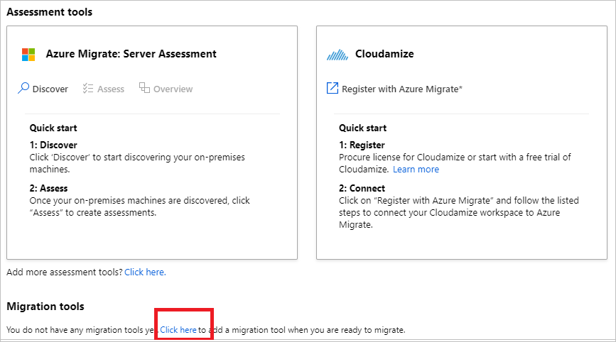

4. In the tools list, select **Azure Migrate: Server Migration** > **Add tool**

    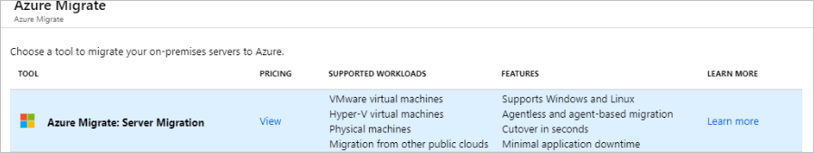

## Set up the Azure Migrate appliance

Azure Migrate Server Migration runs a lightweight Hyper-V VM appliance.

- The appliance performs VM discovery and sends VM metadata and performance data to Azure Migrate Server Migration.
- The appliance is also used by the Azure Migrate: Server Assessment tool, to migrate Hyper-V VMs to Azure.

To set up the appliance:
- If you followed the second tutorial to assess Hyper-V VMs, you already set up the appliance during that tutorial, and don't need to do it again.
- If you didn't follow that tutorial, you need to set up the appliance now. To do this, you: 

    - Download a compressed Hyper-V VHD from the Azure portal.
    - Create the appliance, and check that it can connect to Azure Migrate Server Assessment. 
    - Configure the appliance for the first time, and register it with the Azure Migrate project.

    Follow the detailed instructions in [this article](how-to-set-up-appliance-hyper-v.md) to set up the appliance.

## Prepare Hyper-V hosts

1. In the Azure Migrate project > **Servers**, in **Azure Migrate: Server Migration**, click **Discover**.
2. In **Discover machines** > **Are your machines virtualized?**, select **Yes, with Hyper-V**.
3. In **Target region**, select the Azure region to which you want to migrate the machines.
6. Select **Confirm that the target region for migration is region-name**.
7. Click **Create resources**. This creates an Azure Site Recovery vault in the background.
    - If you've already set up migration with Azure Migrate Server Migration, this option won't appear since resources were set up previously.
    - You can't change the target region for this project after clicking this button.
    - All subsequent migrations are to this region.
    
8. In **Prepare Hyper-V host servers**, download the Hyper-V Replication provider, and the registration key file.
    - The registration key is needed to register the Hyper-V host with Azure Migrate Server Migration.
    - The key is valid for five days after you generate it.

    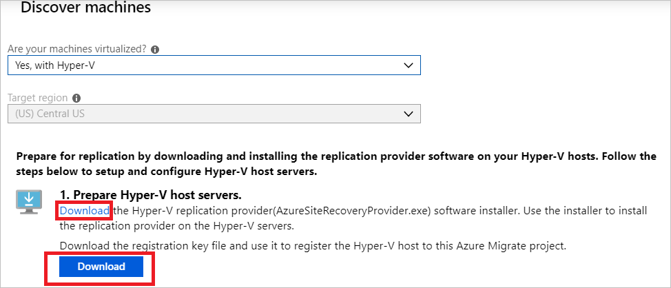

4. Copy the provider setup file and registration key file to each Hyper-V host (or cluster node) running VMs you want to replicate.
5. Run the provider setup file on each host, as described in the next procedure.
6. After installing the provider on hosts, in **Discover machines**, click **Finalize registration**.

    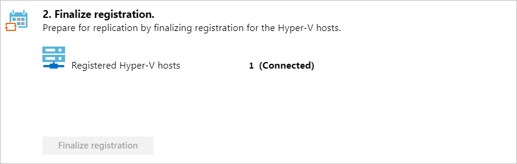

It can take up to 15 minutes after finalizing registration until discovered VMs appear in Azure Migrate Server Migration. As VMs are discovered, the **Discovered servers** count rises.

### Register Hyper-V hosts

Install the downloaded setup file (AzureSiteRecoveryProvider.exe) on each relevant Hyper-V host.

1. Run the provider setup file on each host or cluster node.
2. In the Provider Setup wizard > **Microsoft Update**, opt in to use Microsoft Update to check for Provider updates.
3. In **Installation**, accept the default installation location for the Provider and agent, and select **Install**.
4. After installation, in the Registration Wizard > **Vault Settings**, select **Browse**, and in **Key File**, select the vault key file that you downloaded.
5. In **Proxy Settings**, specify how the provider running on the host connects to the internet.
    - If the appliance is located behind a proxy server, you need to specify proxy settings.
    - Specify the proxy name as **http://ip-address**, or **http://FQDN**. HTTPS proxy servers aren't supported.
   

6. Make sure that the provider can reach the [required URLs](migrate-support-matrix-hyper-v-migration.md#hyper-v-hosts).
7. In **Registration**, after the host is registered, click **Finish**.

## Replicate Hyper-V VMs

With discovery completed, you can begin replication of Hyper-V VMs to Azure.

> [!NOTE]
> You can replicate up to 10 machines together. If you need to replicate more, then replicate them simultaneously in batches of 10.

1. In the Azure Migrate project > **Servers**, **Azure Migrate: Server Migration**, click **Replicate**.
2. In **Replicate**, > **Source settings** > **Are your machines virtualized?**, select **Yes, with Hyper-V**. Then click **Next: Virtual machines**.
3. In **Virtual machines**, select the machines you want to replicate.
    - If you've run an assessment for the VMs, you can apply VM sizing and disk type (premium/standard) recommendations from the assessment results. To do this, in **Import migration settings from an Azure Migrate assessment?**, select the **Yes** option.
    - If you didn't run an assessment, or you don't want to use the assessment settings, select the **No** options.
    - If you selected to use the assessment, select the VM group, and assessment name.

        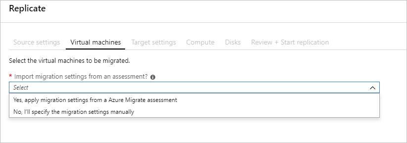

4. In **Virtual machines**, search for VMs as needed, and check each VM you want to migrate. Then, click **Next: Target settings**.

    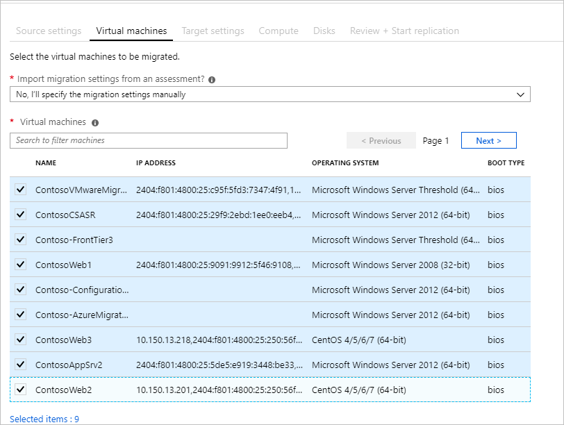

5. In **Target settings**, select the target region to which you'll migrate, the subscription, and the resource group in which the Azure VMs will reside after migration.
7. In **Replication Storage Account**, select the Azure Storage account in which replicated data will be stored in Azure.
8. **Virtual Network**, select the Azure VNet/subnet to which the Azure VMs will be joined after migration.
9. In **Azure Hybrid Benefit**:

    - Select **No** if you don't want to apply Azure Hybrid Benefit. Then, click **Next**.
    - Select **Yes** if you have Windows Server machines that are covered with active Software Assurance or Windows Server subscriptions, and you want to apply the benefit to the machines you're migrating. Then click **Next**.

    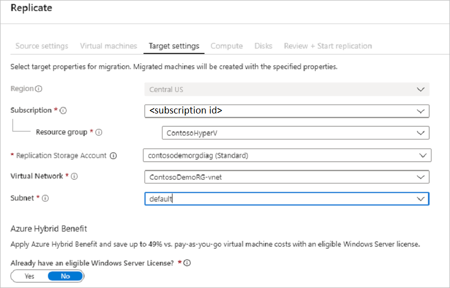

10. In **Compute**, review the VM name, size, OS disk type, and availability set. VMs must conform with [Azure requirements](migrate-support-matrix-hyper-v-migration.md#azure-vm-requirements).

    - **VM size**: If you're using assessment recommendations, the VM size dropdown will contain the recommended size. Otherwise Azure Migrate picks a size based on the closest match in the Azure subscription. Alternatively, pick a manual size in **Azure VM size**. 
    - **OS disk**: Specify the OS (boot) disk for the VM. The OS disk is the disk that has the operating system bootloader and installer. 
    - **Availability set**: If the VM should be in an Azure availability set after migration, specify the set. The set must be in the target resource group you specify for the migration.

    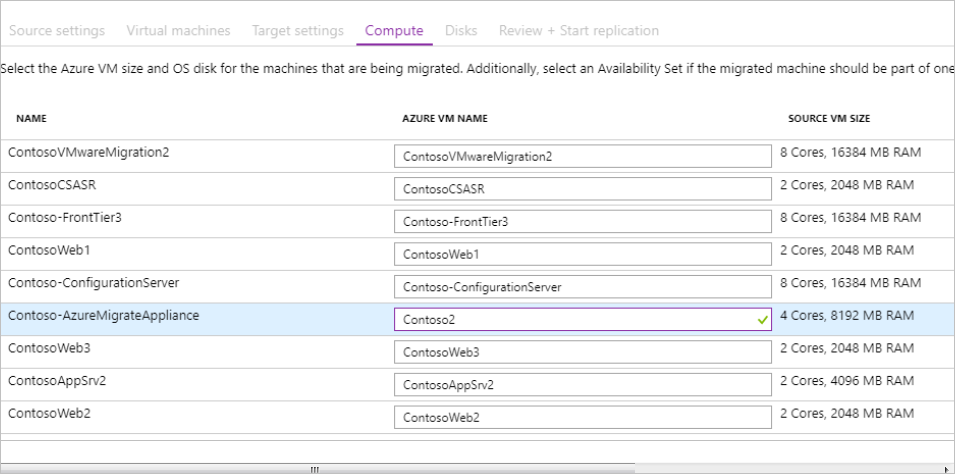

11. In **Disks**, specify whether the VM disks should be replicated to Azure, and select the disk type (standard SSD/HDD or premium-managed disks) in Azure. Then click **Next**.
    - You can exclude disks from replication.
    - If you exclude disks, won't be present on the Azure VM after migration. 

    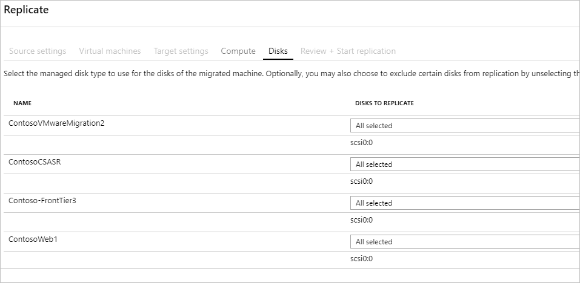

10. In **Review and start replication**, review the settings, and click **Replicate** to start the initial replication for the servers.

> [!NOTE]
> You can update replication settings any time before replication starts, in **Manage** > **Replicating machines**. Settings can't be changed after replication starts.

## Provisioning for the first time

If this is the first VM you're replicating in the Azure Migrate project, Azure Migrate: Server Migration automatically provisions these resources in same resource group as the project.

- **Service bus**: Azure Migrate: Server Migration uses the Service Bus to send replication orchestration messages to the appliance.
- **Gateway storage account**: Azure Migrate: Server Migration uses the gateway storage account to store state information about the VMs being replicated.
- **Log storage account**: The Azure Migrate appliance uploads replication logs for VMs to a log storage account. Azure Migrate applies the replication information to the replica-managed disks.
- **Key vault**: The Azure Migrate appliance uses the key vault to manage connection strings for the service bus, and access keys for the storage accounts used in replication. You should have set up the permissions that the key vault needs to access the storage account when you [prepared Azure](tutorial-prepare-hyper-v.md#prepare-azure) for Hyper-V VM assessment and migration. 

## Track and monitor

- When you click **Replicate** a Start Replication job begins. 
- When the Start Replication job finishes successfully, the machines begin their initial replication to Azure.
- After initial replication finishes, delta replication begins. Incremental changes to on-premises disks are periodically replicated to  Azure.

You can track job status in the portal notifications.

You can monitor replication status by clicking on **Replicating servers** in **Azure Migrate: Server Migration**.

## Run a test migration

When delta replication begins, you can run a test migration for the VMs, before running a full migration to Azure. We highly recommend that you do this at least once for each machine, before you migrate it.

- Running a test migration checks that migration will work as expected, without impacting the on-premises machines, which remain operational, and continue replicating. 
- Test migration simulates the migration by creating an Azure VM using replicated data (usually migrating to a non-production Azure VNet in your Azure subscription).
- You can use the replicated test Azure VM to validate the migration, perform app testing, and address any issues before full migration.

Do a test migration as follows:

1. In **Migration goals** > **Servers** > **Azure Migrate: Server Migration**, click **Test migrated servers**.

     

2. Right-click the VM to test, and click **Test migrate**.

    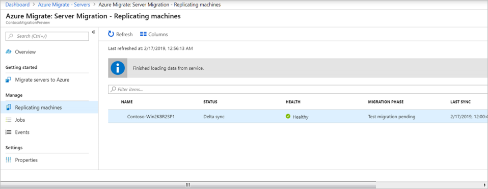

3. In **Test Migration**, select the Azure virtual network in which the Azure VM will be located after the migration. We recommend you use a non-production virtual network.
4. The **Test migration** job starts. Monitor the job in the portal notifications.
5. After the migration finishes, view the migrated Azure VM in **Virtual Machines** in the Azure portal. The machine name has a suffix **-Test**.
6. After the test is done, right-click the Azure VM in **Replicating machines**, and click **Clean up test migration**.

    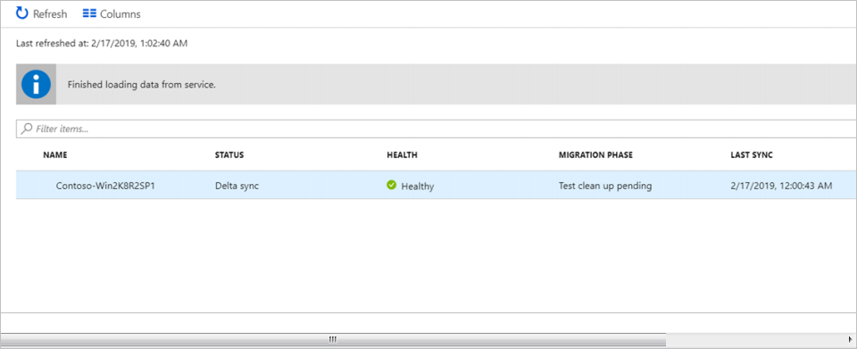

## Migrate VMs

After you've verified that the test migration works as expected, you can migrate the on-premises machines.

1. In the Azure Migrate project > **Servers** > **Azure Migrate: Server Migration**, click **Replicating servers**.

    

2. In **Replicating machines**, right-click the VM > **Migrate**.
3. In **Migrate** > **Shut down virtual machines and perform a planned migration with no data loss**, select **Yes** > **OK**.
    - By default Azure Migrate shuts down the on-premises VM, and runs an on-demand replication to synchronize any VM changes that occurred since the last replication occurred. This ensures no data loss.
    - If you don't want to shut down the VM, select **No**
4. A migration job starts for the VM. Track the job in Azure notifications.
5. After the job finishes, you can view and manage the VM from the **Virtual Machines** page.

## Complete the migration

1. After the migration is done, right-click the VM > **Stop migration**. This stops replication for the on-premises machine, and cleans up replication state information for the VM.
2. Install the Azure VM [Windows](https://docs.microsoft.com/azure/virtual-machines/extensions/agent-windows) or [Linux](https://docs.microsoft.com/azure/virtual-machines/extensions/agent-linux) agent on the migrated machines.
3. Perform any post-migration app tweaks, such as updating database connection strings, and web server configurations.
4. Perform final application and migration acceptance testing on the migrated application now running in Azure.
5. Cut over traffic to the migrated Azure VM instance.
6. Remove the on-premises VMs from your local VM inventory.
7. Remove the on-premises VMs from local backups.
8. Update any internal documentation to show the new location and IP address of the Azure VMs. 

## Post-migration best practices

- For increased resilience:
    - Keep data secure by backing up Azure VMs using the Azure Backup service. [Learn more](../backup/quick-backup-vm-portal.md).
    - Keep workloads running and continuously available by replicating Azure VMs to a secondary region with Site Recovery. [Learn more](../site-recovery/azure-to-azure-tutorial-enable-replication.md).
- For increased security:
    - Lock down and limit inbound traffic access with [Azure Security Center - Just in time administration](https://docs.microsoft.com/azure/security-center/security-center-just-in-time).
    - Restrict network traffic to management endpoints with [Network Security Groups](https://docs.microsoft.com/azure/virtual-network/security-overview).
    - Deploy [Azure Disk Encryption](https://docs.microsoft.com/azure/security/azure-security-disk-encryption-overview) to help secure disks, and keep data safe from theft and unauthorized access.
    - Read more about [securing IaaS resources](https://azure.microsoft.com/services/virtual-machines/secure-well-managed-iaas/), and visit the [Azure Security Center](https://azure.microsoft.com/services/security-center/).
- For monitoring and management:
-  Consider deploying [Azure Cost Management](https://docs.microsoft.com/azure/cost-management/overview) to monitor resource usage and spending.

## Next steps

Investigate the [cloud migration journey](https://docs.microsoft.com/azure/architecture/cloud-adoption/getting-started/migrate) in the Azure Cloud Adoption Framework.
