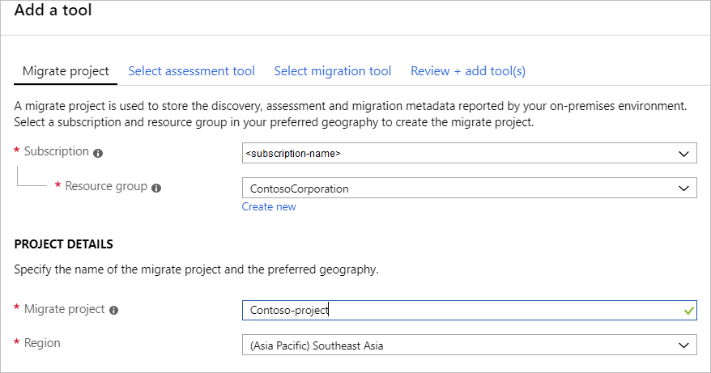
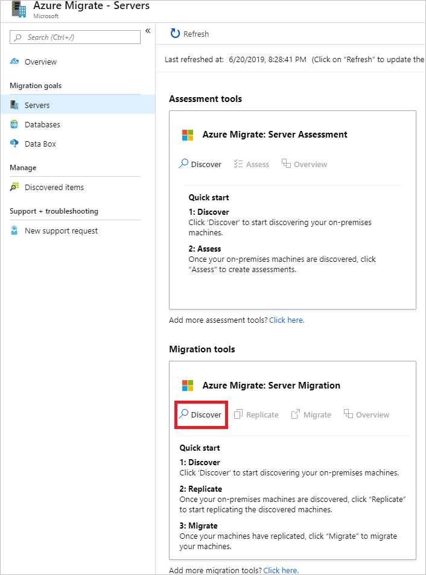
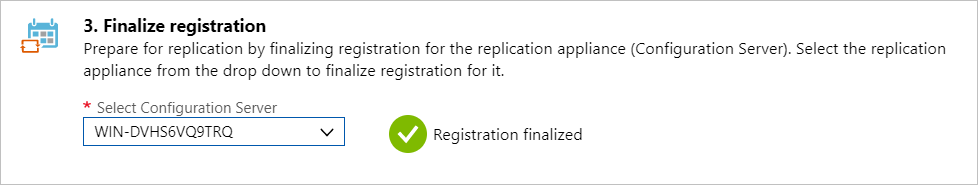
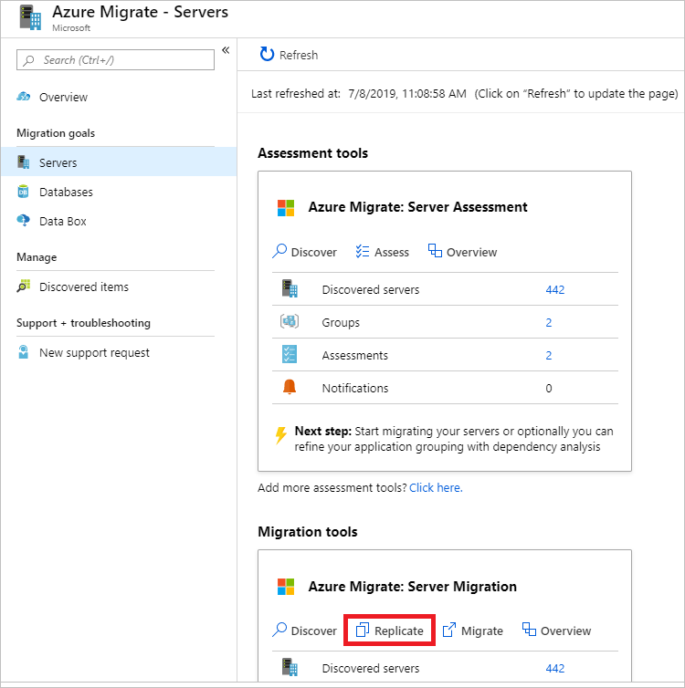
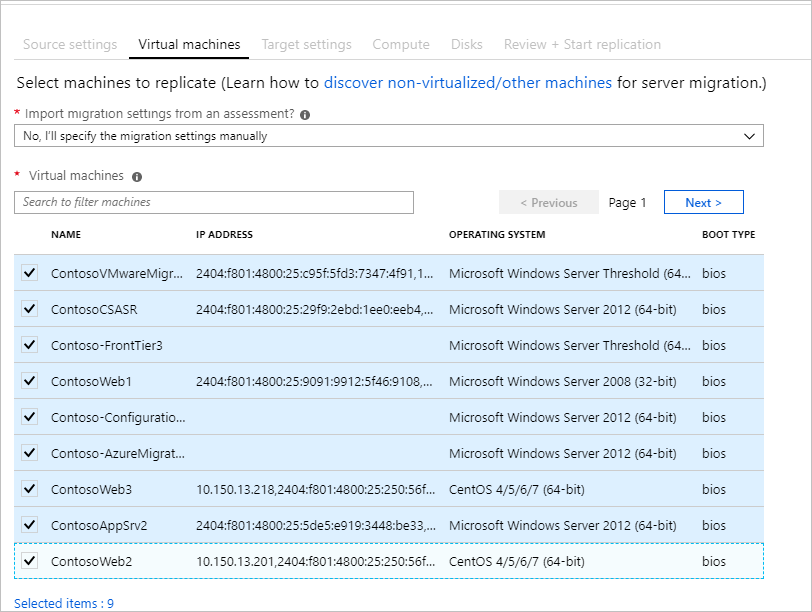
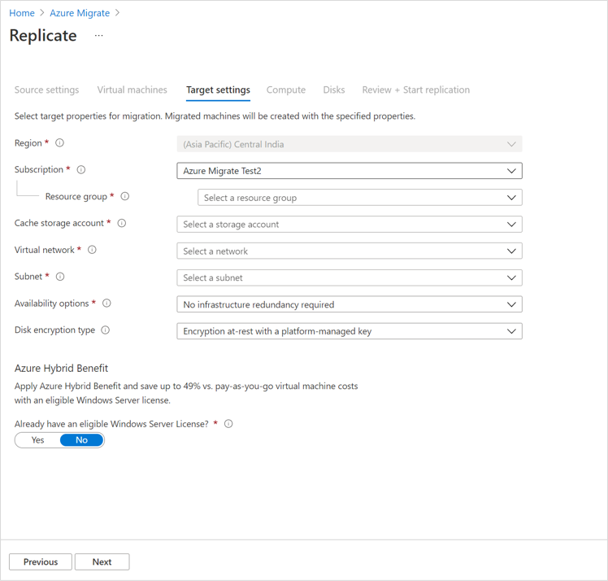
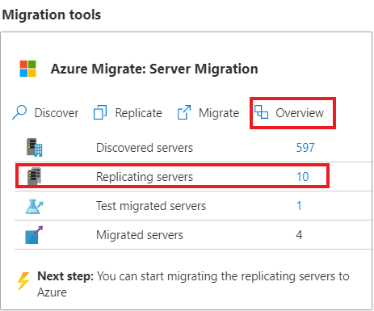
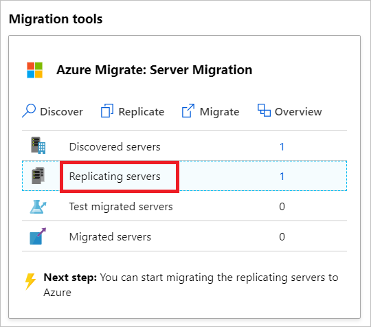

# Migrate physical or virtualized servers to Azure 

This article shows you how to migrate physical or virtualized servers to Azure. The Azure Migrate Server Migration tool offers migration of physical and virtualized servers, using agent-based replication. Using this tool, you can migrate a wide range of machines to Azure:

- Migrate on-premises physical servers.
- Migrate VMs virtualized by platforms such as Xen, KVM.
- Migrate Hyper-V or VMware VMs. This is useful if for some reason you're unable to use the standard migration flow that Azure Migrate Server Migration offers for [Hyper-V](tutorial-migrate-hyper-v.md), [VMware agentless](tutorial-migrate-vmware.md) migration, or [VMware agent-based](tutorial-migrate-vmware-agent.md) migration.
- Migrate VMs running in private clouds.
- Migrate VMs running in public clouds such as Amazon Web Services (AWS) or Google Cloud Platform (GCP).


[Azure Migrate](migrate-services-overview.md) provides a central hub to track discovery, assessment and migration of your on-premises apps and workloads, and cloud VM instances, to Azure. The hub provides Azure Migrate tools for assessment and migration, as well as third-party independent software vendor (ISV) offerings.


In this tutorial, you learn how to:
> [!div class="checklist"]
> * Prepare Azure for migration with the Azure Migrate Server Migration tool.
> * Check requirements for machines you want to migrate, and prepare a machine for the Azure Migrate replication appliance that's used to discover and migrate machines to Azure.
> * Add the Azure Migrate Server Migration tool in the Azure Migrate hub.
> * Set up the replication appliance.
> * Install the Mobility service on machines you want to migrate.
> * Enable replication.
> * Run a test migration to make sure everything's working as expected.
> * Run a full migration to Azure.

> [!NOTE]
> Tutorials show you the simplest deployment path for a scenario so that you can quickly set up a proof-of-concept. Tutorials use default options where possible, and don't show all possible settings and paths. For detailed instructions, review the How-tos for Azure Migrate.

If you don't have an Azure subscription, create a [free account](https://azure.microsoft.com/pricing/free-trial/) before you begin.


## Prerequisites

Before you begin this tutorial, you should:

1. [Review](migrate-architecture.md) the migration architecture.
2. Make sure that your Azure account is assigned the Virtual Machine Contributor role, so that you have permissions to:

    - Create a VM in the selected resource group.
    - Create a VM in the selected virtual network.
    - Write to an Azure managed disk. 

3. [Set up an Azure network](../virtual-network/manage-virtual-network.md#create-a-virtual-network). When you replicate to Azure, Azure VMs are created, and joined to an Azure network you specify when you set up migration.


## Prepare Azure

Set up Azure permissions before you can migrate with Azure Migrate Server Migration.

- **Create a project**: Your Azure account needs permissions to create an Azure Migrate project. 
- **Register the Azure Migrate replication appliance**: The replication appliance creates and registers an Azure Active Directory app in your Azure account. Delegate permissions for this.
- **Create Key Vault**: To migrate machines, Azure Migrate creates a Key Vault in the resource group, to manage access keys to the replication storage account in your subscription. To create the vault, you need role assignment permissions on the resource group in which the Azure Migrate project resides. 


### Assign permissions to create project

1. In the Azure portal, open the subscription, and select **Access control (IAM)**.
2. In **Check access**, find the relevant account, and click it to view permissions.
3. You should have **Contributor** or **Owner** permissions.
    - If you just created a free Azure account, you're the owner of your subscription.
    - If you're not the subscription owner, work with the owner to assign the role.

### Assign permissions to register the replication appliance

For agent-based migration, delegate permissions for Azure Migrate Server Migration to create and register an Azure AD app in your account. You can assign permissions using one of the following methods:

- A tenant/global admin can grant permissions to users in the tenant, to create and register Azure AD apps.
- A tenant/global admin can assign the Application Developer role (that has the permissions) to the account.

It's worth noting that:

- The apps don't have any other access permissions on the subscription other than those described above.
- You only need these permissions when you register a new replication appliance. You can remove the permissions after the replication appliance is set up. 


#### Grant account permissions

The tenant/global admin can grant permissions as follows

1. In Azure AD, the tenant/global admin should navigate to **Azure Active Directory** > **Users** > **User Settings**.
2. The admin should set **App registrations** to **Yes**.

    

> [!NOTE]
> This is a default setting that isn't sensitive. [Learn more](https://docs.microsoft.com/azure/active-directory/develop/active-directory-how-applications-are-added#who-has-permission-to-add-applications-to-my-azure-ad-instance).

#### Assign Application Developer role 

The tenant/global admin can assign the Application Developer role to an account. [Learn more](https://docs.microsoft.comazure/active-directory/fundamentals/active-directory-users-assign-role-azure-portal).

## Assign permissions to create Key Vault

Assign role assignment permissions on the resource group in which the Azure Migrate project resides, as follows:

1. In the resource group in the Azure portal, select **Access control (IAM)**.
2. In **Check access**, find the relevant account, and click it to view permissions. You need **Owner** (or **Contributor** and **User Access Administrator**) permissions.
3. If you don't have the required permissions, request them from the resource group owner. 

## Prepare for migration

### Check machine requirements for migration

Make sure machines comply with requirements for migration to Azure. 

> [!NOTE]
> Agent-based migration with Azure Migrate Server Migration is based on features of the Azure Site Recovery service. Some requirements might link to Site Recovery documentation.

1. [Verify](migrate-support-matrix-vmware.md#agent-based-migration-vmware-server-requirements) VMware server requirements.
2. [Verify](migrate-support-matrix-vmware.md#agent-based-migration-vmware-vm-requirements) VM support requirements for migration.
3. Verify VM settings. On-premises VMs you replicate to Azure must comply with [Azure VM requirements](migrate-support-matrix-vmware.md#azure-vm-requirements).


### Prepare a machine for the replication appliance

Azure Migrate Server Migration uses a replication appliance to replicate machines to Azure. The replication appliance runs the following components.

- **Configuration server**: The configuration server coordinates communications between on-premises and Azure, and manages data replication.
- **Process server**: The process server acts as a replication gateway. It receives replication data; optimizes it with caching, compression, and encryption, and sends it to a cache storage account in Azure. 

Before you start, you need to prepare a Windows Server 2016 machine to host the replication appliance. The machine should comply with [these requirements](migrate-support-matrix-vmware.md#agent-based-migration-replication-appliance-requirements).


## Add the Azure Migrate Server Migration tool

Set up an Azure Migrate project, and then add the Azure Migrate Server Migration tool to it.

1. In the Azure portal > **All services**, search for **Azure Migrate**.
2. Under **Services**, select **Azure Migrate**.
3. In **Overview**, click **Assess and migrate servers**.
4. Under **Discover, assess and migrate servers**, click **Assess and migrate servers**.

    

5. In **Discover, assess and migrate servers**, click **Add tools**.
6. In **Migrate project**, select your Azure subscription, and create a resource group if you don't have one.
7. In **Project Details**, specify the project name, and geography in which you want to create the project, and click **Next**

    

    You can create an Azure Migrate project in any of these geographies.

    **Geography** | **Region**
    --- | ---
    Asia | Southeast Asia
    Europe | North Europe or West Europe
    United States | East US or West Central US

    The geography specified for the project is only used to store the metadata gathered from on-premises VMs. You can select any target region for the actual migration.
8. In **Select assessment tool**, select **Skip adding an assessment tool for now** > **Next**.
9. In **Select migration tool**, select **Azure Migrate: Server Migration** > **Next**.
10. In **Review + add tools**, review the settings, and click **Add tools**
11. After adding the tool, it appears in the Azure Migrate project > **Servers** > **Migration tools**.

## Set up the replication appliance

The first step of migration is to set up the replication appliance. You  download the installer file for the appliance, and run it on the [machine you prepared](#prepare-a-machine-for-the-replication-appliance). After installing the appliance, you register it with Azure Migrate Server Migration.


### Download the replication appliance installer

1. In the Azure Migrate project > **Servers**, in ***Azure Migrate: Server Migration**, click **Discover**.

    

3. In **Discover machines** > **Are your machines virtualized?**, click **Not virtualized/Other**.
4. In **Target region**, select the Azure region to which you want to migrate the machines.
5. Select **Confirm that the target region for migration is region-name**.
6. Click **Create resources**. This creates an Azure Site Recovery vault in the background.
    - If you've already set up migration with Azure Migrate Server Migration, the target option can't be configured, since resources were set up previously.
    - You can't change the target region for this project after clicking this button.
    - All subsequent migrations are to this region.

7. In **Do you want to install a new replication appliance?**, select **Install a replication appliance**.
9. In **Download and install the replication appliance software**, download the appliance installer, and the registration key. You need to the key in order to register the appliance. The key is valid for five days after it's downloaded.

    

10. Copy the appliance setup file and key file to the Windows Server 2016 machine you created for the appliance.
11. Run the replication appliance setup file, as described in the next procedure.
12. After the appliance has restarted after setup, in **Discover machines**, select the new appliance in **Select Configuration Server**, and click **Finalize registration**. Finalize registration performs a couple of final tasks to prepare the replication appliance.

    

It can take up to 15 minutes after finalizing registration until discovered machines appear in Azure Migrate Server Migration. As VMs are discovered, the **Discovered servers** count rises.


## Install the Mobility service

On machines you want to migrate, you need to install the Mobility service agent. The agent installers are available on the replication appliance. You find the right installer, and install the agent on each machine you want to migrate. Do this as follows:

1. Sign in to the replication appliance.
2. Navigate to **%ProgramData%\ASR\home\svsystems\pushinstallsvc\repository**.
3. Find the installer for the machine operating system and version. Review [supported operating systems](https://docs.microsoft.com/azure/site-recovery/vmware-physical-azure-support-matrix#replicated-machines). 
4. Copy the installer file to the machine you want to migrate.
5. Make sure that you have the passphrase that was generated when you deployed the appliance.
    - Store the file in a temporary text file on the machine.
    - You can obtain the passphrase on the replication appliance. From the command line, run **C:\ProgramData\ASR\svsystems\bin\genpassphrase.exe -v** to view the current passphrase.
    - Don't regenerate the passphrase. This will break connectivity and you will have to reregister the replication appliance.


### Install on Windows

1. Extract the contents of installer file to a local folder (for example C:\Temp) on the machine, as follows:

    ```
    ren Microsoft-ASR_UA*Windows*release.exe MobilityServiceInstaller.exe
    MobilityServiceInstaller.exe /q /x:C:\Temp\Extracted
    cd C:\Temp\Extracted
    ```
2. Run the Mobility Service Installer:
    ```
   UnifiedAgent.exe /Role "MS" /Silent
    ```
3. Register the agent with the replication appliance:
    ```
    cd C:\Program Files (x86)\Microsoft Azure Site Recovery\agent
    UnifiedAgentConfigurator.exe  /CSEndPoint <replication appliance IP address> /PassphraseFilePath <Passphrase File Path>
    ```

### Install on Linux

1. Extract the contents of the installer tarball to a local folder (for example /tmp/MobSvcInstaller) on the machine, as follows:
    ```
    mkdir /tmp/MobSvcInstaller
    tar -C /tmp/MobSvcInstaller -xvf <Installer tarball>
    cd /tmp/MobSvcInstaller
    ```
2. Run the installer script:
    ```
    sudo ./install -r MS -q
    ```
3. Register the agent with the replication appliance:
    ```
    /usr/local/ASR/Vx/bin/UnifiedAgentConfigurator.sh -i <replication appliance IP address> -P <Passphrase File Path>
    ```

## Replicate machines

1. In the Azure Migrate project > **Servers**, **Azure Migrate: Server Migration**, click **Replicate**.

    

2. In **Replicate**, > **Source settings** > **Are your machines virtualized?**, select **Yes, with VMware vSphere**.
3. In **On-premises appliance**, select the name of the Azure Migrate appliance that you set up.
4. In **vCenter server**, specify the name of the vCenter server managing the VMs, or the vSphere server on which the VMs are hosted.
5. In **Process Server**, select the name of the replication appliance.
6. In **Guest credentials**, you specify a VM admin account that will be used for push installation of the Mobility service. In this tutorial we're installing the Mobility service manually, so you can add any dummy account. Then click **Next: Virtual machines**.

    

7. In **Virtual Machines**, in **Import migration settings from an assessment?**, leave the default setting **No, I'll specify the migration settings manually**.
8. Check each VM you want to migrate. Then click **Next: Target settings**.

    


9. In **Target settings**, select the subscription, and target region to which you'll migrate, and specify the resource group in which the Azure VMs will reside after migration.
10. In **Virtual Network**, select the Azure VNet/subnet to which the Azure VMs will be joined after migration.
11. In **Azure Hybrid Benefit**:

    - Select **No** if you don't want to apply Azure Hybrid Benefit. Then click **Next**.
    - Select **Yes** if you have Windows Server machines that are covered with active Software Assurance or Windows Server subscriptions, and you want to apply the benefit to the machines you're migrating. Then click **Next**.

    

12. In **Compute**, review the VM name, size, OS disk type, and availability set. VMs must conform with [Azure requirements](migrate-support-matrix-vmware.md#azure-vm-requirements).

    - **VM size**: By default, Azure Migrate Server Migration picks a size based on the closest match in the Azure subscription. Alternatively, pick a manual size in **Azure VM size**. 
    - **OS disk**: Specify the OS (boot) disk for the VM. The OS disk is the disk that has the operating system bootloader and installer. 
    - **Availability set**: If the VM should be in an Azure availability set after migration, specify the set. The set must be in the target resource group you specify for the migration.

    

13. In **Disks**, specify whether the VM disks should be replicated to Azure, and select the disk type (standard SSD/HDD or premium managed disks) in Azure. Then click **Next**.
    - You can exclude disks from replication.
    - If you exclude disks, won't be present on the Azure VM after migration. 

    


14. In **Review and start replication**, review the settings, and click **Replicate** to start the initial replication for the servers.

> [!NOTE]
> You can update replication settings any time before replication starts, **Manage** > **Replicating machines**. Settings can't be changed after replication starts.


## Track and monitor

- When you click **Replicate** a Start Replication job begins. 
- When the Start Replication job finishes successfully, the machines begin their initial replication to Azure.
- After initial replication finishes, delta replication begins. Incremental changes to on-premises disks are periodically replicated to the replica disks in Azure.


You can track job status in the portal notifications.

You can monitor replication status by clicking on **Replicating servers** in **Azure Migrate: Server Migration**.


## Run a test migration


When delta replication begins, you can run a test migration for the VMs, before running a full migration to Azure. We highly recommend that you do this at least once for each machine, before you migrate it.

- Running a test migration checks that migration will work as expected, without impacting the on-premises machines, which remain operational, and continue replicating. 
- Test migration simulates the migration by creating an Azure VM using replicated data (usually migrating to a non-production VNet in your Azure subscription).
- You can use the replicated test Azure VM to validate the migration, perform app testing, and address any issues before full migration.

Do a test migration as follows:


1. In **Migration goals** > **Servers** > **Azure Migrate: Server Migration**, click **Test migrated servers**.

     

2. Right-click the VM to test, and click **Test migrate**.

    

3. In **Test Migration**, select the Azure VNet in which the Azure VM will be located after the migration. We recommend you use a non-production VNet.
4. The **Test migration** job starts. Monitor the job in the portal notifications.
5. After the migration finishes, view the migrated Azure VM in **Virtual Machines** in the Azure portal. The machine name has a suffix **-Test**.
6. After the test is done, right-click the Azure VM in **Replicating machines**, and click **Clean up test migration**.

    


## Migrate VMs

After you've verified that the test migration works as expected, you can migrate the on-premises machines.

1. In the Azure Migrate project > **Servers** > **Azure Migrate: Server Migration**, click **Replicating servers**.

    

2. In **Replicating machines**, right-click the VM > **Migrate**.
3. In **Migrate** > **Shut down virtual machines and perform a planned migration with no data loss**, select **Yes** > **OK**.
    - By default Azure Migrate shuts down the on-premises VM, and runs an on-demand replication to synchronize any VM changes that occurred since the last replication occurred. This ensures no data loss.
    - If you don't want to shut down the VM, select **No**
4. A migration job starts for the VM. Track the job in Azure notifications.
5. After the job finishes, you can view and manage the VM from the **Virtual Machines** page.

## Complete the migration

1. After the migration is done, right-click the VM > **Stop migration**. This stops replication for the on-premises machine, and cleans up replication state information for the VM.
2. Install the Azure VM [Windows](https://docs.microsoft.com/azure/virtual-machines/extensions/agent-windows) or [Linux](https://docs.microsoft.com/azure/virtual-machines/extensions/agent-linux) agent on the migrated machines.
3. Perform any post-migration app tweaks, such as updating database connection strings, and web server configurations.
4. Perform final application and migration acceptance testing on the migrated application now running in Azure.
5. Cut over traffic to the migrated Azure VM instance.
6. Remove the on-premises VMs from your local VM inventory.
7. Remove the on-premises VMs from local backups.
8. Update any internal documentation to show the new location and IP address of the Azure VMs. 

## Post-migration best practices

- For increased resilience:
    - Keep data secure by backing up Azure VMs using the Azure Backup service. [Learn more](../backup/quick-backup-vm-portal.md).
    - Keep workloads running and continuously available by replicating Azure VMs to a secondary region with Site Recovery. [Learn more](../site-recovery/azure-to-azure-tutorial-enable-replication.md).
- For increased security:
    - Lock down and limit inbound traffic access with [Azure Security Center - Just in time administration](https://docs.microsoft.com/azure/security-center/security-center-just-in-time).
    - Restrict network traffic to management endpoints with [Network Security Groups](https://docs.microsoft.com/azure/virtual-network/security-overview).
    - Deploy [Azure Disk Encryption](https://docs.microsoft.com/azure/security/azure-security-disk-encryption-overview) to help secure disks, and keep data safe from theft and unauthorized access.
    - Read more about [securing IaaS resources](https://azure.microsoft.com/services/virtual-machines/secure-well-managed-iaas/), and visit the [Azure Security Center](https://azure.microsoft.com/services/security-center/).
- For monitoring and management:
    - Consider deploying [Azure Cost Management](https://docs.microsoft.com/azure/cost-management/overview) to monitor resource usage and spending.


## Next steps

Investigate the [cloud migration journey](https://docs.microsoft.com/azure/architecture/cloud-adoption/getting-started/migrate) in the Azure Cloud Adoption Framework.
