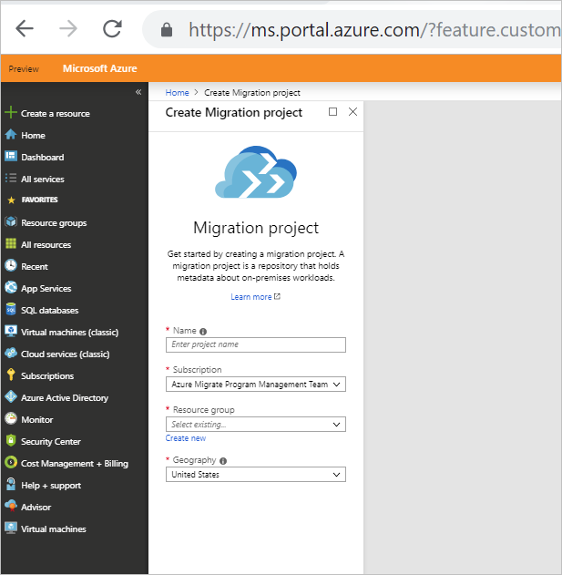
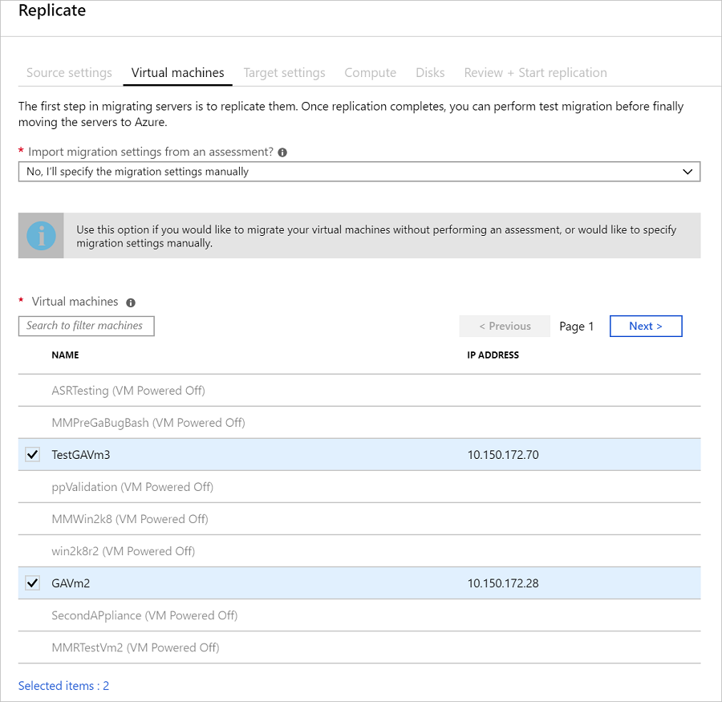
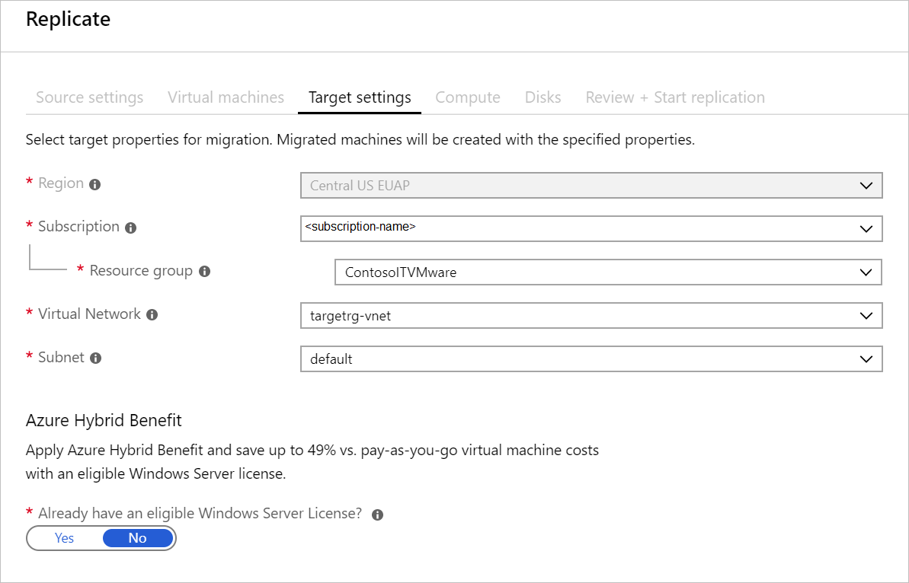
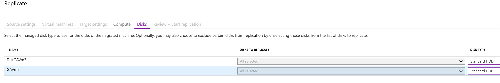

# Migrate on-premises machines to Azure (agent-based)

[Azure Migrate](migrate-services-overview.md) helps you to discover, assess, and migrate machines and workloads to Microsoft Azure. This article describes how to migrate on-premises VMware VMs using Azure Migrate Server Migration.

For VMware VM migration, Azure Migrate offers both an agentless method, and an agent-based method for VMware migration. This article describes the agent-based method.

- [Learn about](server-migrate-overview.md) the available methods.
- Learn how agent-based migration works.
- Review [this article](tutorial-migrate-vmware.md) if you want to use the agentless method.

In this tutorial, you learn how to:
- > [!div class="checklist"]
> * Set up permissions for your Azure account and resources to work with Azure Migrate.
> * Verify vCenter Server and ESXi host settings.
> * Create an account on the vCenter Server. The account is used by the Azure Migrate service to discover VMware VMs for assessment and migration.
> * Verify you have vCenter Server permissions to create a VMware VM with an OVA file. Azure Migrate uses a lightweight appliance set up as a VMware VM using an OVA file, for discovery and assessment.
> * Verify required ports, and appliance internet access to Azure URLs.

> [!NOTE]
> Tutorials show you the simplest deployment path for a scenario so that you can quickly set up a proof-of-concept. Tutorials use default options where possible, and don't show all possible settings and paths. For detailed instructions, review the How Tos for VMware assessment and migration.

If you don't have an Azure subscription, create a [free account](https://azure.microsoft.com/pricing/free-trial/) before you begin.

In this article you

> [!div class="checklist"]
> * Prepare Azure and your on-premises VMware environment
> * Set up the source environment, including deployment of an on-premises Azure Migrate configuration server.
> * Set up the target environment for migration
> * Set up a replication policy
> * Enable replication
> * Run a test migration to make sure everything's working as expected
> * Run a a full migration to Azure

## Prerequisites

Before you begin this tutorial, you should:

1. [Review the limitations](server-migrate-overview.md#agentless-migration-limitations) for agentless migration.
2. If you don't have an Azure subscription, create a [free account](https://azure.microsoft.com/pricing/free-trial/) before you begin.

## Prepare Azure 

### Verify account permissions

Your account needs permissions to create an Azure Migrate project in the subscription, and to enable replication for VMs.

- **Create a project**: You should have **Contributor** or **Owner** permissions.
- **Enable VM replication**: Your account should be assigned the Virtual Machine Contributor built-in role to do the following:
    - Create a VM in the selected resource group.
    - Create a VM in the selected virtual network.
    - Write to an Azure storage account.
    - Write to an Azure managed disk.

If you just created your free Azure account, you're the administrator of your subscription and you have the permissions you need. If you're not the subscription administrator, work with the administrator to assign the permissions you need.

### Set up an Azure network

On-premises machines are replicated to Azure managed disks. When you failover to Azure for migration, Azure VMs are created from these managed disks, and joined to the Azure network you specify in this procedure.

1. In the [Azure portal](https://portal.azure.com), select **Create a resource** > **Networking** > **Virtual network**.
2. Keep **Resource Manager** selected as the deployment model.
3. In **Name**, enter a network name. The name must be unique within the Azure resource group. We're using **ContosoASRnet** in this tutorial.
4. Specify the resource group in which the network will be created. We're using the existing resource group **contosoRG**.
5. In **Address range**, enter the range for the network. We're using **10.1.0.0/24**, and not using a subnet.
6. In **Subscription**, select the subscription in which to create the network.
7. In **Location**, select the same region as that in which the Recovery Services vault was created. In our tutorial it's **West Europe**. The network must be in the same region as the vault.
8. We're leaving the default options of basic DDoS protection, with no service endpoint on the network.
9. Click **Create**.

The virtual network takes a few seconds to create. After it's created, you see it in the Azure portal dashboard.

## Prepare on-premises VMware

### Prepare an account for automatic discovery

Site Recovery needs access to VMware servers to:

- Automatically discover VMs. At least a read-only account is required.
- Orchestrate replication, failover, and failback. You need an account that can run operations such
  as creating and removing disks, and powering on VMs.

Create the account as follows:

1. To use a dedicated account, create a role at the vCenter level. Give the role a name such as
   **Azure_Site_Recovery**.
2. Assign the role the permissions summarized in the table below.
3. Create a user on the vCenter server or vSphere host. Assign the role to the user.

#### VMware account permissions

**Task** | **Role/Permissions** | **Details**
--- | --- | ---
**VM discovery** | At least a read-only user   Data Center object –> Propagate to Child Object, role=Read-only | User assigned at datacenter level, and has access to all the objects in the datacenter.   To restrict access, assign the **No access** role with the **Propagate to child** object, to the child objects (vSphere hosts, datastores, VMs and networks).
**Full replication, failover, failback** |  Create a role (Azure_Site_Recovery) with the required permissions, and then assign the role to a VMware user or group   Data Center object –> Propagate to Child Object, role=Azure_Site_Recovery   Datastore -> Allocate space, browse datastore, low-level file operations, remove file, update virtual machine files   Network -> Network assign   Resource -> Assign VM to resource pool, migrate powered off VM, migrate powered on VM   Tasks -> Create task, update task   Virtual machine -> Configuration   Virtual machine -> Interact -> answer question, device connection, configure CD media, configure floppy media, power off, power on, VMware tools install   Virtual machine -> Inventory -> Create, register, unregister   Virtual machine -> Provisioning -> Allow virtual machine download, allow virtual machine files upload   Virtual machine -> Snapshots -> Remove snapshots | User assigned at datacenter level, and has access to all the objects in the datacenter.   To restrict access, assign the **No access** role with the **Propagate to child** object, to the child objects (vSphere hosts, datastores, VMs and networks).

### Prepare an account for Mobility service installation

The Mobility service must be installed on machines you want to replicate. Site Recovery can do a push installation of this service when you enable replication for a machine, or you can install it manually, or using installation tools.

- In this tutorial, we're going to install the Mobility service with the push installation.
- For this push installation, you need to prepare an account that Site Recovery can use to access the VM. You specify this account
when you set up disaster recovery in the Azure console.

Prepare the account as follows:

Prepare a domain or local account with permissions to install on the VM.

- **Windows VMs**: To install on Windows VMs if you're not using a domain account, disable Remote User Access
   control on the local machine. To do this, in the registry > **HKEY_LOCAL_MACHINE\SOFTWARE\Microsoft\Windows\CurrentVersion\Policies\System**, add the
     DWORD entry **LocalAccountTokenFilterPolicy**, with a value of 1.
- **Linux VMs**: To install on Linux VMs, prepare a root account on the source Linux server.

### Check VMware requirements

Make sure VMware servers and VMs comply with requirements. Azure Migrate agent-based migration is based on features of the Azure Site Recovery service. Information about requirements are available in the Site Recovery documentation. Links are included as appropriate.

1. Verify VMware server requirements.
2. For Linux VMs, [check](../site-recovery/vmware-physical-azure-support-matrix.md#linux-file-systemsguest-storage) file system and storage requirements. 
3. Check on-premises [network](../site-recovery/vmware-physical-azure-support-matrix.md#network) and [storage](../site-recovery/vmware-physical-azure-support-matrix.md#storage) support. 
4. Check what's supported for [Azure networking](../site-recovery/vmware-physical-azure-support-matrix.md#azure-vm-network-after-failover), [storage](../site-recovery/vmware-physical-azure-support-matrix.md#azure-storage), and [compute](../site-recovery/vmware-physical-azure-support-matrix.md#azure-compute), after failover.
5. Your on-premises VMs you replicate to Azure must comply with [Azure VM requirements](../site-recovery/vmware-physical-azure-support-matrix.md#azure-vm-requirements).
6. In Linux virtual machines, device name or mount point name should be unique. Ensure that no two devices/mount points have the same names. Note that name aren't case-sensitive. For example, naming two devices for the same VM as _device1_ and _Device1_ isn't allowed.

### Prepare to connect to Azure VMs after failover

After failover, you might want to connect to the Azure VMs from your on-premises network.

To connect to Windows VMs using RDP after failover, do the following:

- **Internet access**. Before failover, enable RDP on the on-premises VM before failover. Make sure that TCP, and UDP rules are added for the **Public** profile, and that RDP is allowed in **Windows Firewall** > **Allowed Apps**, for all profiles.
- **Site-to-site VPN access**:
    - Before failover, enable RDP on the on-premises machine.
    - RDP should be allowed in the **Windows Firewall** -> **Allowed apps and features** for **Domain and Private** networks.
    - Check that the operating system's SAN policy is set to **OnlineAll**. [Learn
   more](https://support.microsoft.com/kb/3031135).
- There should be no Windows updates pending on the VM when you trigger a failover. If there are, you won't be able to sign in to the virtual
   machine until the update completes.
- On the Windows Azure VM after failover, check **Boot diagnostics** to view a screenshot of the VM. If you can't connect, check that the VM is running and review these
   [troubleshooting tips](https://social.technet.microsoft.com/wiki/contents/articles/31666.troubleshooting-remote-desktop-connection-after-failover-using-asr.aspx).

To connect to Linux VMs using SSH after failover, do the following:

- On the on-premises machine before failover, check that the Secure Shell service is set to start
   automatically on system boot.
- Check that firewall rules allow an SSH connection.
- On the Azure VM after failover, allow incoming connections to the SSH port for the network security group rules on the failed over VM, and for the Azure subnet to which it's connected.
- Add a public IP address for the VM.
- You can check **Boot diagnostics** to view a screenshot of the VM.

### Create an Azure Migrate project

If you don't have an Azure Migrate project, create one now.

1. In the Azure portal > **All services**, search for **Azure Migrate**.
2. Under **Services**, select **Azure Migrate**.

    

3. In **Overview**, click **Assess and migrate servers**.
4. Under **Discover, assess and migrate servers**, click **Assess and migrate servers**.

    

1. In **Discover, assess and migrate servers**, click **Add tools**.
2. In **Migrate project**, select your Azure subscription, and create a resource group if you don't have one.
3. In **Project Details**, specify the project name, and geography in which you want to create the project. You can create an Azure Migrate project in the regions summarized in the table.

    - The region specified for the project is only used to store the metadata gathered from on-premises VMs.
    - You can select any target region for the actual migration.
    
        **Geography** | **Region**
        --- | ---
        Asia | Southeast Asia
        Europe | North Europe or West Europe
        United States | East US or West Central US

    

6. Click **Next**.
7. In **Select assessment tool**, select **Skip adding a migration tool for now** > **Next**.
8. In **Select migration tool**, select **Azure Migrate: Server Migration** > **Next**.
9. In **Review + add tools**, review the settings and click **Add tools**.
10. To view the Azure Migrate project after it's created, in **Server**, click **See details for a different migrate project**.
11. In **Settings**, select the subscription and project.  **Azure Migrate: Server Migration** will appear under **Migration tools**.

## Set up the replication appliance

The first step of migration is to set up the replication appliance. The replication appliance is a single, highly available, on-premises VMware VM that hosts these components:

- **Configuration server**: The configuration server coordinates communications between on-premises and Azure, and manages data replication.
- **Process server**: The process server acts as a replication gateway. It receives replication data; optimizes it with caching, compression, and encryption, and sends it to a cache storage account in Azure. The process server also installs the Mobility Service agent on VMs you want to replicate, and performs automatic discovery of on-premises VMware VMs.

To set up the replication appliance, you download a prepared Open Virtualization Application (OVA) template. You import the template into VMware, and create the replication appliance VM. 

### Download the replication appliance template

Download the template as follows:

1. Under **Migration Goals** > **Servers** > **Azure Migrate: Server Assessment**, click **Discover**.
2. In **Discover machines** > **Are your machines virtualized?**, click **Yes, with VMWare vSphere hypervisor**.
3. In **How do you want to migrate?**, select **Using agent-based replication**.
4. In **Target region**, select the Azure region to which you want to migrate the machines.
5. In **Do you want to install a new replication appliance**, select **Install a replication appliance**.
6. Click **Download**, to download the replication appliance. This downloads an OVF template that you use to create a new VMware VM that runs the appliance.

### Import the template in VMware

After downloading the OVF template, you import it into VMware.

1. Sign in to the VMware vCenter server or vSphere ESXi host with the VMWare vSphere Client.
2. On the **File** menu, select **Deploy OVF Template** to start the **Deploy OVF Template Wizard**. 
3. On **Select source**, enter the location of the downloaded OVF.
4. On **Review details**, select **Next**.
5. On **Select name and folder** and **Select configuration**, accept the default settings.
6. On **Select storage**, for best performance select **Thick Provision Eager Zeroed** in **Select virtual disk format**.
7. On the rest of the wizard pages, accept the default settings.
8. On **Ready to complete**, to set up the VM with the default settings, select **Power on after deployment** > **Finish**.

   > [!TIP]
   > If you want to add an additional NIC, clear **Power on after deployment** > **Finish**. By default, the template contains a single NIC. You can add additional NICs after deployment.

#### Add an additional adapter

If you want to add an additional NIC to the configuration server, add it before you register the server in the vault. Adding additional adapters isn't supported after registration.

1. In the vSphere Client inventory, right-click the VM and select **Edit Settings**.
2. In **Hardware**, select **Add** > **Ethernet Adapter**. Then select **Next**.
3. Select an adapter type and a network. 
4. To connect the virtual NIC when the VM is turned on, select **Connect at power on**. Select **Next** > **Finish**. Then select **OK**.

### Kick off replication appliance setup

1. From the VMWare vSphere Client console, turn on the VM.
2. The VM boots up into a Windows Server 2016 installation experience. Accept the license agreement, and enter an administrator password.
3. After the installation finishes, sign in to the VM as the administrator.
4. The first time you sign in, the replication appliance setup tool (Azure Site Recovery Configuration Tool) starts within a few seconds.
5. Enter a name to use when registering the appliance with Azure Migrate. Then click **Next**.
6. The tool checks that the VM can connect to Azure. After the connection is established, select **Sign in** to sign in to your Azure subscription. The credentials must have access to the Migration project in which you want to register the configuration server.
7. The tool performs some configuration tasks and then reboots.
8. Sign in to the machine again. In a few seconds, the Configuration Server Management Wizard starts automatically.

### Register the configuration server

Finish setting up and registering the configuration server. 

When you register the appliance, a

1. In the Configuration Server Management Wizard, select **Setup connectivity**.
    a. First, select the NIC that the in-built process server on the replication appliance uses for discovery and push installation of the Mobility service on source machines.
    b. Then, select the NIC that the replication appliance uses for connectivity with Azure. Then select **Save**. You cannot change this setting after it's configured.
2. When prompted for vault details, specify the subscription and resource group in which the Azure Migrate project is located, and the Azure Migrate project name. You can find these details in the Azure Migrate project > **Servers** > Azure Migrate Server Migration** > **Discover** > **Discover machines**, under **Configure the appliance and register it to the Azure Migrate project**.
3. In **Install third-party software**, accept the license agreement. Select **Download and Install** to install MySQL Server.
4. Select **Install VMware PowerCLI**. Make sure all browser windows are closed before you do this. Then select **Continue**.
5. In **Validate appliance configuration**, prerequisites are verified before you continue.
6. In **Configure vCenter Server/vSphere ESXi server**, enter the FQDN or IP address of the vCenter server, or vSphere host, where the VMs you want to replicate are located. Enter the port on which the server is listening. Enter a friendly name to be used for the VMware server in the vault.
7. Enter the credentials for the account you [created](#prepare-an-account-for-automatic-discovery) for VMware discovery. Select **Add** > **Continue**.
    - Ensure the credentials are correct.
    - Be sure that the credentials are in the Administrators group for VMs you want to migrate. 
8. In **Configure virtual machine credentials**, enter the credentials you [created](#prepare-an-account-for-mobility-service-installation) for push installation of the Mobility service, when you enable replication for VMs.  
    - For Windows machines, the account needs local administrator privileges on the machines you want to replicate.
    - For Linux, provide details for the root account.
9. Select **Finalize configuration** to complete registration.

After the replication appliance is registered, Azure Migrate connects to VMware servers using the specified settings, and discovers VMs. You can view discovered VMs in **Manage** > **Discovered items**, in the **Replication appliance** tab.

## Create a replication policy

1. In the Azure Migrate project **Servers** > **Azure Migrate: Server Assessment** > **Discover** > **Discover machines** > **Create and associate a replication policy**, select the registered replication appliance (configuration server).
2. Then, select **Create replication policy**.
4. In the replication policy > **RPO threshold**, use the default of 60 minutes. This value defines how often recovery points are created. An alert is generated if continuous replication exceeds this limit.
5. In **Recovery point retention**, specify how longer each recovery point is retained. For this tutorial we're using 72 hours. Replicated VMs can be recovered to any point in a retention window.
6. In **App-consistent snapshot frequency**, specify how often app-consistent snapshots are created. We're using the default of 60 minutes. Select **OK** to create the policy.

The policy is automatically associated with the replication appliance.

## Enable replication

Enable replication for VMs as follows:

1. In the Azure Migrate project **Servers** > **Azure Migrate: Server Assessment**, click **Replicate**.
2. In **Source settings** > **Are you machines virtualized?**, select, **Yes, with VMware vSphere hypervisor**.
3. In **On-premises appliance**, select the replication appliance that you set up.
4. In vCenter server/vSphere host, select the VMware server that's hosting or managing the VMware VMs you want to migrate.
5. In Process Server, select the name of the replication appliance.
6. In Guest credentials, select an account with Administrator permissions on VMware you want to migrate.
7. In **Replication policy**, select the policy you created.

    

8. In **Virtual machines**, specify whether you want to use assessment recommendations to size VMs in Azure. For this tutorial, select **No, I'll specify the migration settings manually**. We're assume there are no assessment settings to use.
9. Select the VMs you want to migrate.

        

10. In **Target settings**, specify the region, subscription, and resource group in which you want to create the Azure VMs after migration. Select the Azure VNet and subnet you created. The Azure VMs will be located in this network/subnet.
11. In **Azure Hybrid Benefit**, specify whether you have an eligible Windows Server license to take advantage of Azure Hybrid Benefit. [Learn more](https://azure.microsoft.com/pricing/hybrid-benefit/).

    

12. In **Compute**, specify the settings for the Azure VM after migration. Since we're not using assessment recommendations in this tutorial, specify an Azure VM size that's close to the size of the on-premises VM. In this tutorial, our resource group doesn't belong to an availability set.

    

13. In **Disks**, specify the VM disks that should be replicated. In this tutorial we're not excluding any disks from replication.
14. Azure Migrate migrates VMware VMs to Azure VMs with managed disks. In **Disk type**, specify whether the managed disks use Premium or Standard HDD storage. For this tutorial we'll use Standard HDD. [Learn more](..//virtual-machines/windows/disks-types.md).

    

15. In **Review + start replication**, check the settings. To start the  initial replication of VMs, click **Replicate**.

After initial replication completes. VMs continuously replicate in accordance with replication policy settings.

## Migrate VMs

After VMs are replicating, you can migrate them to Azure. 

## Run a test failover

### Create a network for test failover

We recommended that for test failover, you choose a network that's isolated from the production recovery site network specific in the  **Compute and Network** settings for each VM. By default, when you create an Azure virtual network, it is isolated from other networks. The test network should mimic your production network:

- The test network should have same number of subnets as your production network. Subnets should have the same names.
- The test network should use the same IP address range.
- Update the DNS of the test network with the IP address specified for the DNS VM in **Compute and Network** settings. Read [test failover considerations for Active Directory](../site-recovery/site-recovery-active-directory.md#test-failover-considerations) for more details.

### Run a test failover for a single VM

When you run a test failover, the following happens:

1. A prerequisites check runs to make sure all of the conditions required for failover are in
   place.
2. Failover processes the data, so that an Azure VM can be created. If you select the latest recovery
   point, a recovery point is created from the data.
3. An Azure VM is created using the data processed in the previous step.

Run the test failover as follows:

1. In **Settings** > **Replicated Items**, click the VM > **+Test Failover**.
2. Select the **Latest processed** recovery point for this tutorial. This fails over the VM to the latest available point in time. The time stamp is shown. With this option, no time is spent processing data, so it provides a low RTO (recovery time objective).
3. In **Test Failover**, select the target Azure network to which Azure VMs will be connected after
   failover occurs.
4. Click **OK** to begin the failover. You can track progress by clicking on the VM to open its
   properties. Or you can click the **Test Failover** job in vault name > **Settings** > **Jobs** >
   **Site Recovery jobs**.
5. After the failover finishes, the replica Azure VM appears in the Azure portal > **Virtual
   Machines**. Check that the VM is the appropriate size, that it's connected to the right network,
   and that it's running.
6. You should now be able to connect to the replicated VM in Azure.
7. To delete Azure VMs created during the test failover, click **Cleanup test failover** on the
  VM. In **Notes**, record and save any observations associated with the test failover.

In some scenarios, failover requires additional processing that takes around eight to ten minutes
to complete. You might notice longer test failover times for VMware Linux machines, VMware VMs that
don't have the DHCP service enables, and VMware VMs that don't have the following boot drivers:
storvsc, vmbus, storflt, intelide, atapi.

### Connect after failover

If you want to connect to Azure VMs using RDP/SSH after failover, [prepare to connect](../site-recovery/site-recovery-test-failover-to-azure.md#prepare-to-connect-to-azure-vms-after-failover). 

## Migrate to Azure

Run a failover for the machines you want to migrate.

1. In **Settings** > **Replicated items** click the machine > **Failover**.
2. In **Failover** select a **Recovery Point** to fail over to. Select the latest recovery point.
3. The encryption key setting isn't relevant for this scenario.
4. Select **Shut down machine before beginning failover**. Site Recovery will attempt to shutdown virtual machines before triggering the failover. Failover continues even if shutdown fails. You can follow the failover progress on the **Jobs** page.
5. Check that the Azure VM appears in Azure as expected.
6. In **Replicated items**, right-click the VM > **Complete Migration**. This does the following:

   - Finishes the migration process, stops replication for the on-premises VM, and stops Site Recovery billing for the VM.
   - This step cleans up the replication data. It doesn't delete the migrated VMs.

> [!WARNING]
> **Don't cancel a failover in progress**: VM replication is stopped before failover starts. If you cancel a failover in progress, failover stops, but the VM won't replicate again.

In some scenarios, failover requires additional processing that takes around eight to ten minutes to complete. You might notice longer test failover times for physical servers, VMware Linux machines, VMware VMs that don't have the DHCP service enables, and VMware VMs that don't have the following boot drivers: storvsc, vmbus, storflt, intelide, atapi.

## Post-migration steps in Azure

- Perform any post-migration app tweaks, such as updating database connection strings, and web server configurations. 
- Perform final application and migration acceptance testing on the migrated application now running in Azure.
- The [Azure VM agent](https://docs.microsoft.com/azure/virtual-machines/extensions/agent-windows) manages VM interaction with the Azure Fabric Controller. It's required for some Azure services, such as Azure Backup, Site Recovery, and Azure Security.
    - If you're migrating VMware machines and physical servers, the Mobility Service installer installs available Azure VM agent on Windows machines. On Linux VMs, we recommend that you install the agent after failover.
    - If you’re migrating Azure VMs to a secondary region, the Azure VM agent must be provisioned on the VM before the migration.
    - If you’re migrating Hyper-V VMs to Azure, install the Azure VM agent on the Azure VM after the migration.
- Manually remove any Site Recovery provider/agent from the VM. If you migrate VMware VMs or physical servers, uninstall the Mobility service from the VM.
- For increased resilience:
    - Keep data secure by backing up Azure VMs using the Azure Backup service. [Learn more](https://docs.microsoft.com/azure/backup/quick-backup-vm-portal).
    - Keep workloads running and continuously available by replicating Azure VMs to a secondary region with Site Recovery. [Learn more](../site-recovery/azure-to-azure-quickstart.md).
- For increased security:
    - Lock down and limit inbound traffic access with Azure Security Center [Just in time administration]( https://docs.microsoft.com/azure/security-center/security-center-just-in-time)
    - Restrict network traffic to management endpoints with [Network Security Groups](https://docs.microsoft.com/azure/virtual-network/security-overview).
    - Deploy [Azure Disk Encryption](https://docs.microsoft.com/azure/security/azure-security-disk-encryption-overview) to help secure disks, and keep data safe from theft and unauthorized access.
    - Read more about [securing IaaS resources]( https://azure.microsoft.com/services/virtual-machines/secure-well-managed-iaas/ ), and visit the [Azure Security Center](https://azure.microsoft.com/services/security-center/ ).
- For monitoring and management:
    - Consider deploying [Azure Cost Management](https://docs.microsoft.com/azure/cost-management/overview) to monitor resource usage and spending.

## Post-migration steps on-premises

- Move app traffic over to the app running on the migrated Azure VM instance.
- Remove the on-premises VMs from your local VM inventory.
- Remove the on-premises VMs from local backups.
- Update any internal documentation to show the new location and IP address of the Azure VMs.

## Next steps

[Learn about](server-migrate-overview.md) VMware migration options

  
