# Migrate VMware VMs to Azure (agent-based)

This article shows you how to migrate on-premises VMware VMs to Azure, using agent-based migration with the Azure Migrate Server Migration tool.

[Azure Migrate](migrate-services-overview.md) provides a central hub to track discovery, assessment and migration of your on-premises apps and workloads, and AWS/GCP VM instances, to Azure. The hub provides Azure Migrate tools for assessment and migration, as well as third-party independent software vendor (ISV) offerings.

In this tutorial, you learn how to:
> [!div class="checklist"]
> * Set up the source environment, and deploy an Azure Migrate replication appliance for agent-based migration.
> * Set up the target environment for migration.
> * Set up a replication policy.
> * Enable replication.
> * Run a test migration to make sure everything's working as expected.
> * Run a full migration to Azure.

> [!NOTE]
> Tutorials show you the simplest deployment path for a scenario so that you can quickly set up a proof-of-concept. Tutorials use default options where possible, and don't show all possible settings and paths. For detailed instructions, review the How-tos for VMware assessment and migration.

If you don't have an Azure subscription, create a [free account](https://azure.microsoft.com/pricing/free-trial/) before you begin.

## Before you begin

We recommend that you try out VMware VM assessment with Azure Migrate Server Assessment, before you migrate VMs to Azure. Set up an assessment as follows:

1. Follow the tutorial to [prepare Azure and VMware](tutorial-prepare-vmware.md) for assessment.
2. Then, follow [this tutorial](tutorial-assess-vmware.md) to set up an Azure Migrate appliance for assessment, and discover and assess VMs.

Although we recommend that you try out an assessment, you don't have to run an assessment before you migrate VMs.

## Migration methods

You can migrate VMware VMs to Azure using the Azure Migrate Server Migration tool. This tool offers a couple of options for VMware VM migration:

- Agentless replication. Migrate VMs without needing to install anything on them.
- Agent-based migration. or replication. Install an agent (the Mobility services agent) on the VM for replication.

To decide whether you want to use agentless or agent-based migration, review these articles:

- [Learn about](server-migrate-overview.md) the VMware migration options.
- [Review the limitations](server-migrate-overview.md#agentless-migration-limitations) for agentless migration.
- [Follow this article](tutorial-migrate-vmware.md) to try out agentless migration.

## Prerequisites

Before you begin this tutorial, you should:

1. [Review](migrate-architecture.md) the VMware migration architecture.
2. Make sure that your Azure account is assigned the Virtual Machine Contributor role, so that you have permissions to:

    - Create a VM in the selected resource group.
    - Create a VM in the selected virtual network.
    - Write to an Azure managed disk. 

3. [Set up an Azure network](../virtual-network/manage-virtual-network.md#create-a-virtual-network). On-premises machines are replicated to Azure managed disks. When you fail over to Azure for migration, Azure VMs are created from these managed disks, and joined to an Azure network you specify when you set up migration.

## Prepare Azure

If you have already run an assessment with Azure Migrate Server Assessment, you can skip the instructions in this section since you've already completed these steps. 

If you haven't run an assessment, you need to set up Azure permissions before you can migrate with Azure Migrate Server Migration.

- **Create a project**: Your Azure account needs permissions to create an Azure Migrate project. 
- **Register the Azure Migrate replication appliance**: The replication appliance creates and registers an Azure Active Directory app in your Azure account. You need to delegate permissions for this.
- **Create Key Vault**: To migrate VMware VMs using Azure Migrate Server Migration, Azure Migrate creates a Key Vault in the resource group, to manage access keys to the replication storage account in your subscription. To create the vault, you need role assignment permissions on the resource group in which the Azure Migrate project resides. 

### Assign permissions to create project

1. In the Azure portal, open the subscription, and select **Access control (IAM)**.
2. In **Check access**, find the relevant account, and click it to view permissions.
3. You should have **Contributor** or **Owner** permissions.
    - If you just created a free Azure account, you're the owner of your subscription.
    - If you're not the subscription owner, work with the owner to assign the role.

### Assign permissions to register the replication appliance

For agent-based migration, delegate permissions for Azure Migrate Server Migration to create and register an Azure AD app in your account. You can assign permissions using one of the following methods:

- A tenant/global admin can grant permissions to users in the tenant, to create and register Azure AD apps.
- A tenant/global admin can assign the Application Developer role (that has the permissions) to the account.

It's worth noting that:

- The apps don't have any other access permissions on the subscription other than those described above.
- You only need these permissions when you register a new replication appliance. You can remove the permissions after the replication appliance is set up. 

#### Grant account permissions

The tenant/global admin can grant permissions as follows

1. In Azure AD, the tenant/global admin should navigate to **Azure Active Directory** > **Users** > **User Settings**.
2. The admin should set **App registrations** to **Yes**.

    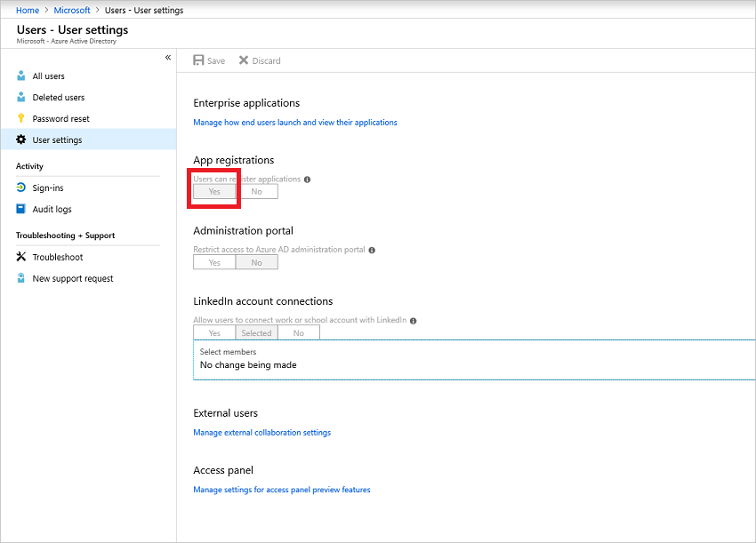

> [!NOTE]
> This is a default setting that isn't sensitive. [Learn more](https://docs.microsoft.com/azure/active-directory/develop/active-directory-how-applications-are-added#who-has-permission-to-add-applications-to-my-azure-ad-instance).

#### Assign Application Developer role 

The tenant/global admin can assign the Application Developer role to an account. [Learn more](https://docs.microsoft.comazure/active-directory/fundamentals/active-directory-users-assign-role-azure-portal).

## Assign permissions to create Key Vault

Assign role assignment permissions on the resource group in which the Azure Migrate project resides, as follows:

1. In the resource group in the Azure portal, select **Access control (IAM)**.
2. In **Check access**, find the relevant account, and click it to view permissions. You need **Owner** (or **Contributor** and **User Access Administrator**) permissions.
3. If you don't have the required permissions, request them from the resource group owner. 

## Prepare on-premises VMware

### Prepare an account for automatic discovery

Azure Migrate Server Migration needs access to VMware servers to:

- Automatically discover VMs. At least a read-only account is required.
- Orchestrate replication, failover, and failback. You need an account that can run operations such
  as creating and removing disks, and powering on VMs.

Create the account as follows:

1. To use a dedicated account, create a role at the vCenter level. Give the role a name such as
   **Azure_Site_Recovery**.
2. Assign the role the permissions summarized in the table below.
3. Create a user on the vCenter server or vSphere host. Assign the role to the user.

#### VMware account permissions

**Task** | **Role/Permissions** | **Details**
--- | --- | ---
**VM discovery** | At least a read-only user   Data Center object –> Propagate to Child Object, role=Read-only | User assigned at datacenter level, and has access to all the objects in the datacenter.   To restrict access, assign the **No access** role with the **Propagate to child** object, to the child objects (vSphere hosts, datastores, VMs and networks).
**Full replication, failover, failback** |  Create a role (Azure_Site_Recovery) with the required permissions, and then assign the role to a VMware user or group   Data Center object –> Propagate to Child Object, role=Azure_Site_Recovery   Datastore -> Allocate space, browse datastore, low-level file operations, remove file, update virtual machine files   Network -> Network assign   Resource -> Assign VM to resource pool, migrate powered off VM, migrate powered on VM   Tasks -> Create task, update task   Virtual machine -> Configuration   Virtual machine -> Interact -> answer question, device connection, configure CD media, configure floppy media, power off, power on, VMware tools install   Virtual machine -> Inventory -> Create, register, unregister   Virtual machine -> Provisioning -> Allow virtual machine download, allow virtual machine files upload   Virtual machine -> Snapshots -> Remove snapshots | User assigned at datacenter level, and has access to all the objects in the datacenter.   To restrict access, assign the **No access** role with the **Propagate to child** object, to the child objects (vSphere hosts, datastores, VMs and networks).

### Prepare an account for Mobility service installation

The Mobility service must be installed on machines you want to replicate.

- The Azure Migrate replication appliance can do a push installation of this service when you enable replication for a machine, or you can install it manually, or using installation tools.
- In this tutorial, we're going to install the Mobility service with the push installation.
- For push installation, you need to prepare an account that Azure Migrate Server Migration can use to access the VM.

Prepare the account as follows:

1. Prepare a domain or local account with permissions to install on the VM.
2. For Windows VMs, if you're not using a domain account, disable Remote User Access control on the local machine by adding the DWORD entry **LocalAccountTokenFilterPolicy**, with a value of  in the registry, under **HKEY_LOCAL_MACHINE\SOFTWARE\Microsoft\Windows\CurrentVersion\Policies\System**
3. For Linux VMs, prepare a root account on the source Linux server.

### Check VMware requirements

Make sure VMware servers and VMs comply with requirements for migration to Azure. 

> [!NOTE]
> Agent-based migration with Azure Migrate Server Migration is based on features of the Azure Site Recovery service. Some requirements might link to Site Recovery documentation.

1. [Verify](migrate-support-matrix-vmware.md#agent-based-migration-vmware-server-requirements) VMware server requirements.
2. [Verify](migrate-support-matrix-vmware.md#agent-based-migration-vmware-vm-requirements) VM support requirements for migration.
3. Verify VM settings. On-premises VMs you replicate to Azure must comply with [Azure VM requirements](migrate-support-matrix-vmware.md#azure-vm-requirements).

## Add the Azure Migrate Server Migration tool

If you didn't follow the tutorial to assess VMware VMs, set up an Azure Migrate project, and then add the Azure Migrate Server Migration tool:

1. In the Azure portal > **All services**, search for **Azure Migrate**.
2. Under **Services**, select **Azure Migrate**.

    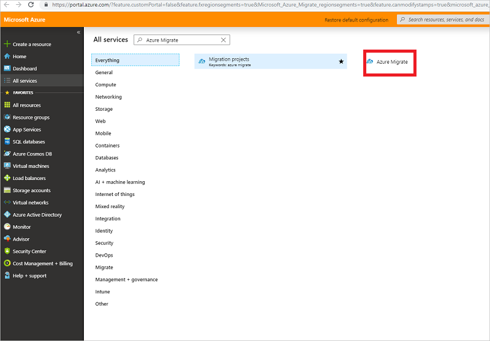

3. In **Overview**, click **Assess and migrate servers**.
4. Under **Discover, assess and migrate servers**, click **Assess and migrate servers**.

    

1. In **Discover, assess and migrate servers**, click **Add tools**.
2. In **Migrate project**, select your Azure subscription, and create a resource group if you don't have one.
3. In **Project Details**, specify the project name, and geography in which you want to create the project, and click **Next**

    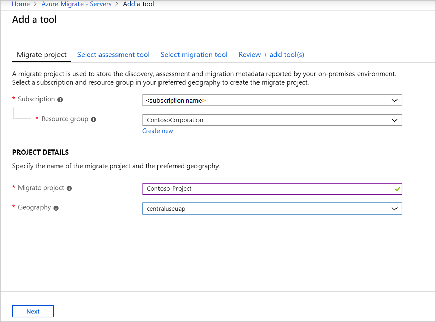

    You can create an Azure Migrate project in any of these geographies.

    **Geography** | **Region**
    --- | ---
    Asia | Southeast Asia
    Europe | North Europe or West Europe
    United States | East US or West Central US

    The geography specified for the project is only used to store the metadata gathered from on-premises VMs. You can select any target region for the actual migration.
4. In **Select assessment tool**, select **Skip adding an assessment tool for now** > **Next**.
5. In **Select migration tool**, select **Azure Migrate: Server Migration** > **Next**.
6. In **Review + add tools**, review the settings and click **Add tools**
7. After adding the tool, it appears in the Azure Migrate project > **Servers** > **Migration tools**.

## Set up the replication appliance

The first step of migration is to set up the replication appliance. The replication appliance is a single, highly available, on-premises VMware VM that hosts these components:

- **Configuration server**: The configuration server coordinates communications between on-premises and Azure, and manages data replication.
- **Process server**: The process server acts as a replication gateway. It receives replication data; optimizes it with caching, compression, and encryption, and sends it to a cache storage account in Azure. The process server also installs the Mobility Service agent on VMs you want to replicate, and performs automatic discovery of on-premises VMware VMs.

To set up the replication appliance, you download a prepared Open Virtualization Application (OVA) template. You import the template into VMware, and create the replication appliance VM. 

### Download the replication appliance template

Download the template as follows:

1. In the Azure Migrate project click **Servers** under **Migration Goals**.
2. In **Azure Migrate - Servers** > **Azure Migrate: Server Migration**, click **Discover**.

    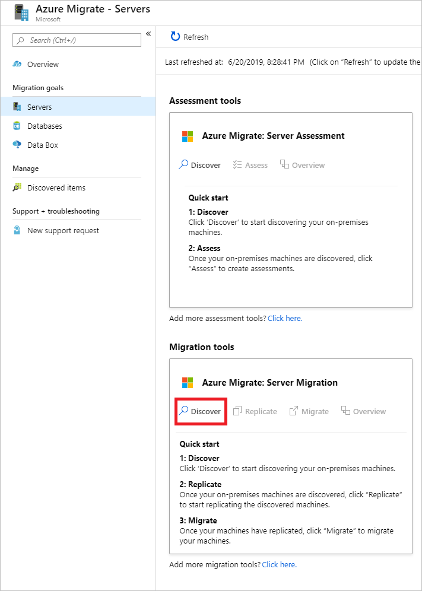

3. In **Discover machines** > **Are your machines virtualized?**, click **Yes, with VMWare vSphere hypervisor**.
4. In **How do you want to migrate?**, select **Using agent-based replication**.
5. In **Target region**, select the Azure region to which you want to migrate the machines.
6. Select **Confirm that the target region for migration is region-name**.
7. Click **Create resources**. This creates an Azure Site Recovery vault in the background.
    - You can't change the target region for this project after clicking this button.
    - All subsequent migrations are to this region.

    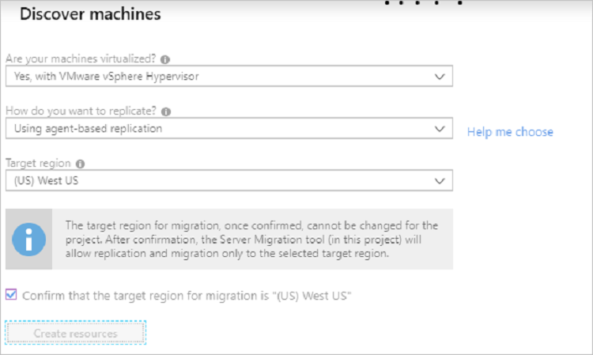

8. In **Do you want to install a new replication appliance?**, select **Install a replication appliance**.
9. Click **Download**, to download the replication appliance. This downloads an OVF template that you use to create a new VMware VM that runs the appliance.
    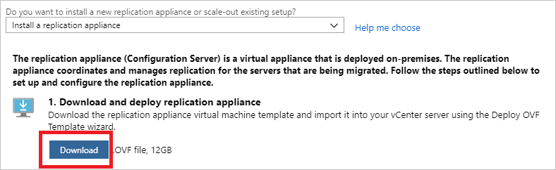
10. Note the name of the resource group and the Recovery Services vault. You need these during appliance deployment.

### Import the template in VMware

After downloading the OVF template, you import it into VMware to create the replication application on a VMware VM running Windows Server 2016.

1. Sign in to the VMware vCenter server or vSphere ESXi host with the VMWare vSphere Client.
2. On the **File** menu, select **Deploy OVF Template** to start the **Deploy OVF Template Wizard**. 
3. In **Select source**, enter the location of the downloaded OVF.
4. In **Review details**, select **Next**.
5. In **Select name and folder** and **Select configuration**, accept the default settings.
6. In **Select storage** > **Select virtual disk format**, for best performance select **Thick Provision Eager Zeroed**.
7. On the rest of the wizard pages, accept the default settings.
8. In **Ready to complete**, to set up the VM with the default settings, select **Power on after deployment** > **Finish**.

   > [!TIP]
   > If you want to add an additional NIC, clear **Power on after deployment** > **Finish**. By default, the template contains a single NIC. You can add additional NICs after deployment.

### Kick off replication appliance setup

1. From the VMWare vSphere Client console, turn on the VM.
2. The VM boots up into a Windows Server 2016 installation experience. Accept the license agreement, and enter an administrator password.
3. After the installation finishes, sign in to the VM as the administrator, using the admin password.
4. The first time you sign in, the replication appliance setup tool (Azure Site Recovery Configuration Tool) starts within a few seconds.
5. Enter a name to use for registering the appliance with Azure Migrate Server Migration. Then click **Next**.
6. The tool checks that the VM can connect to Azure. After the connection is established, select **Sign in** to sign in to your Azure subscription.
7. Wait for the tool to finish registering an Azure AD app to identify the appliance. The appliance reboots.
1. Sign in to the machine again. In a few seconds, the Configuration Server Management Wizard starts automatically.

### Register the replication appliance

Finish setting up and registering the replication appliance.

1. In the Configuration Server Management Wizard, select **Setup connectivity**.
2. Select the NIC (by default there's only one NIC) that the replication appliance uses for VM discovery, and to do a push installation of the Mobility service on source machines.
3. Select the NIC that the replication appliance uses for connectivity with Azure. Then select **Save**. You cannot change this setting after it's configured.
4. If the appliance is located behind a proxy server, you need to specify proxy settings.
    - Specify the proxy name as **http://ip-address**, or **http://FQDN**. HTTPS proxy servers aren't supported.
5. When prompted for the subscription, resource groups, and vault details, add the details that you noted when you downloaded the appliance template.
6. In **Install third-party software**, accept the license agreement. Select **Download and Install** to install MySQL Server.
7. Select **Install VMware PowerCLI**. Make sure all browser windows are closed before you do this. Then select **Continue**.
8. In **Validate appliance configuration**, prerequisites are verified before you continue.
9. In **Configure vCenter Server/vSphere ESXi server**, enter the FQDN or IP address of the vCenter server, or vSphere host, where the VMs you want to replicate are located. Enter the port on which the server is listening. Enter a friendly name to be used for the VMware server in the vault.
10. Enter the credentials for the account you [created](#prepare-an-account-for-automatic-discovery) for VMware discovery. Select **Add** > **Continue**.
11. In **Configure virtual machine credentials**, enter the credentials you [created](#prepare-an-account-for-mobility-service-installation) for push installation of the Mobility service, when you enable replication for VMs.  
    - For Windows machines, the account needs local administrator privileges on the machines you want to replicate.
    - For Linux, provide details for the root account.
12. Select **Finalize configuration** to complete registration.

After the replication appliance is registered, Azure Migrate Server Assessment connects to VMware servers using the specified settings, and discovers VMs. You can view discovered VMs in **Manage** > **Discovered items**, in the **Other** tab.

## Replicate VMs

1. In the Azure Migrate project > **Servers**, **Azure Migrate: Server Migration**, click **Replicate**.

    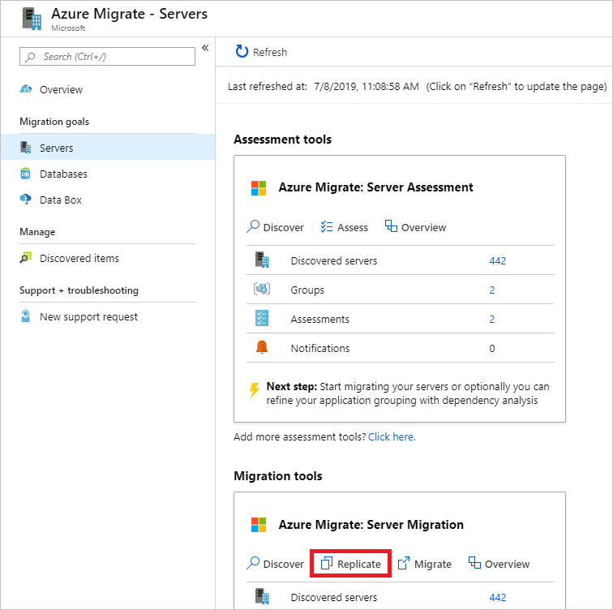

2. In **Replicate**, > **Source settings** > **Are your machines virtualized?**, select **Yes, with VMware vSphere**.
3. In **On-premises appliance**, select the name of the Azure Migrate appliance that you set up.
4. In **vCenter server**, specify the name of the vCenter server managing the VMs, or the vSphere server on which the VMs are hosted.
5. In **Process Server**, select the name of the replication appliance.
6. In **Guest credentials**, specify the VM admin account that will be used for push installation of the Mobility service. Then click **Next: Virtual machines**.

    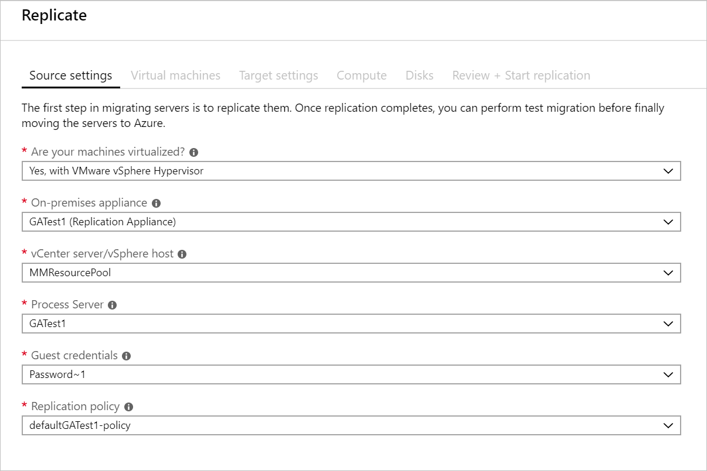

7. In **Virtual Machines**, select the machines that you want to replicate.

    - If you've run an assessment for the VMs, you can apply VM sizing and disk type (premium/standard) recommendations from the assessment results. To do this, in **Import migration settings from an Azure Migrate assessment?**, select the **Yes** option.
    - If you didn't run an assessment, or you don't want to use the assessment settings, select the **No** options.
    - If you selected to use the assessment, select the VM group, and assessment name.

8. Check each VM you want to migrate. Then click **Next: Target settings**.
9. In **Target settings**, select the subscription, and target region to which you'll migrate, and specify the resource group in which the Azure VMs will reside after migration.
10. In **Virtual Network**, select the Azure VNet/subnet to which the Azure VMs will be joined after migration.
11. In **Azure Hybrid Benefit**:

    - Select **No** if you don't want to apply Azure Hybrid Benefit. Then click **Next**.
    - Select **Yes** if you have Windows Server machines that are covered with active Software Assurance or Windows Server subscriptions, and you want to apply the benefit to the machines you're migrating. Then click **Next**.

12. In **Compute**, review the VM name, size, OS disk type, and availability set. VMs must conform with [Azure requirements](migrate-support-matrix-vmware.md#agentless-migration-vmware-vm-requirements).

    - **VM size**: If you're using assessment recommendations, the VM size dropdown will contain the recommended size. Otherwise Azure Migrate picks a size based on the closest match in the Azure subscription. Alternatively, pick a manual size in **Azure VM size**. 
    - **OS disk**: Specify the OS (boot) disk for the VM. The OS disk is the disk that has the operating system bootloader and installer. 
    - **Availability set**: If the VM should be in an Azure availability set after migration, specify the set. The set must be in the target resource group you specify for the migration.

13. In **Disks**, specify whether the VM disks should be replicated to Azure, and select the disk type (standard SSD/HDD or premium managed disks) in Azure. Then click **Next**.
    - You can exclude disks from replication.
    - If you exclude disks, won't be present on the Azure VM after migration. 

14. In **Review and start replication**, review the settings, and click **Replicate** to start the initial replication for the servers.

> [!NOTE]
> You can update replication settings any time before replication starts, **Manage** > **Replicating machines**. Settings can't be changed after replication starts.

## Track and monitor

- When you click **Replicate** a Start Replication job begins. 
- When the Start Replication job finishes successfully, the machines begin their initial replication to Azure.
- After initial replication finishes, delta replication begins. Incremental changes to on-premises disks are periodically replicated to the replica disks in Azure.

You can track job status in the portal notifications.

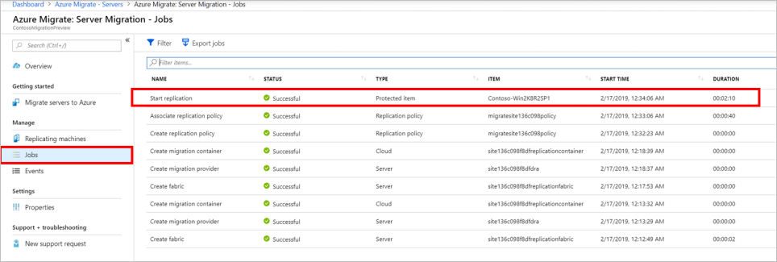

You can monitor replication status by clicking on **Replicating servers** in **Azure Migrate: Server Migration**.
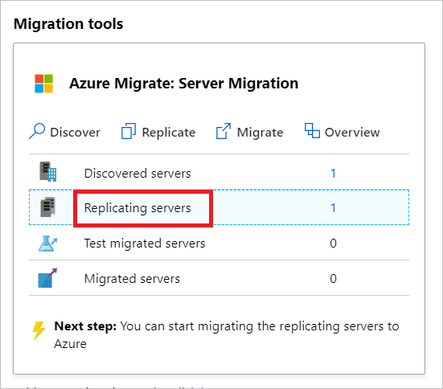

## Run a test migration

When delta replication begins, you can run a test migration for the VMs, before running a full migration to Azure. We highly recommend that you do this at least once for each machine, before you migrate it.

- Running a test migration checks that migration will work as expected, without impacting the on-premises machines, which remain operational, and continue replicating. 
- Test migration simulates the migration by creating an Azure VM using replicated data (usually migrating to a non-production VNet in your Azure subscription).
- You can use the replicated test Azure VM to validate the migration, perform app testing, and address any issues before full migration.

Do a test migration as follows:

1. In **Migration goals** > **Servers** > **Azure Migrate: Server Migration**, click **Test migrated servers**.

     

2. Right-click the VM to test, and click **Test migrate**.

    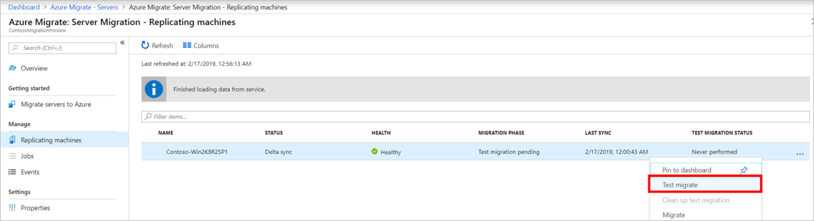

3. In **Test Migration**, select the Azure VNet in which the Azure VM will be located after the migration. We recommend you use a non-production VNet.
4. The **Test migration** job starts. Monitor the job in the portal notifications.
5. After the migration finishes, view the migrated Azure VM in **Virtual Machines** in the Azure portal. The machine name has a suffix **-Test**.
6. After the test is done, right-click the Azure VM in **Replicating machines**, and click **Clean up test migration**.

    

## Migrate VMs

After you've verified that the test migration works as expected, you can migrate the on-premises machines.

1. In the Azure Migrate project > **Servers** > **Azure Migrate: Server Migration**, click **Replicating servers**.

    

2. In **Replicating machines**, right-click the VM > **Migrate**.
3. In **Migrate** > **Shut down virtual machines and perform a planned migration with no data loss**, select **Yes** > **OK**.
    - By default Azure Migrate shuts down the on-premises VM, and runs an on-demand replication to synchronize any VM changes that occurred since the last replication occurred. This ensures no data loss.
    - If you don't want to shut down the VM, select **No**
4. A migration job starts for the VM. Track the job in Azure notifications.
5. After the job finishes, you can view and manage the VM from the **Virtual Machines** page.

## Complete the migration

1. After the migration is done, right-click the VM > **Stop migration**. This stops replication for the on-premises machine, and cleans up replication state information for the VM.
2. Install the Azure VM [Windows](https://docs.microsoft.com/azure/virtual-machines/extensions/agent-windows) or [Linux](https://docs.microsoft.com/azure/virtual-machines/extensions/agent-linux) agent on the migrated machines.
3. Perform any post-migration app tweaks, such as updating database connection strings, and web server configurations.
4. Perform final application and migration acceptance testing on the migrated application now running in Azure.
5. Cut over traffic to the migrated Azure VM instance.
6. Remove the on-premises VMs from your local VM inventory.
7. Remove the on-premises VMs from local backups.
8. Update any internal documentation to show the new location and IP address of the Azure VMs. 

## Post-migration best practices

- For increased resilience:
    - Keep data secure by backing up Azure VMs using the Azure Backup service. [Learn more](../backup/quick-backup-vm-portal.md).
    - Keep workloads running and continuously available by replicating Azure VMs to a secondary region with Site Recovery. [Learn more](../site-recovery/azure-to-azure-tutorial-enable-replication.md).
- For increased security:
    - Lock down and limit inbound traffic access with [Azure Security Center - Just in time administration](https://docs.microsoft.com/azure/security-center/security-center-just-in-time).
    - Restrict network traffic to management endpoints with [Network Security Groups](https://docs.microsoft.com/azure/virtual-network/security-overview).
    - Deploy [Azure Disk Encryption](https://docs.microsoft.com/azure/security/azure-security-disk-encryption-overview) to help secure disks, and keep data safe from theft and unauthorized access.
    - Read more about [securing IaaS resources](https://azure.microsoft.com/services/virtual-machines/secure-well-managed-iaas/), and visit the [Azure Security Center](https://azure.microsoft.com/services/security-center/).
- For monitoring and management:
-  Consider deploying [Azure Cost Management](https://docs.microsoft.com/azure/cost-management/overview) to monitor resource usage and spending.

## Next steps

Investigate the [cloud migration journey](https://docs.microsoft.com/azure/architecture/cloud-adoption/getting-started/migrate) in the Azure Cloud Adoption Framework.
