# Migrate VMware VMs to Azure (agentless)

This article shows you how to migrate on-premises VMware VMs to Azure, using the [Azure Migrate:Server Migration](migrate-services-overview.md#azure-migrate-server-migration-tool) tool, with agentless migration. You can also migrate VMware VMs using agent-based migration. [Compare](server-migrate-overview.md#compare-migration-methods) the methods.

This tutorial is the third in a series that demonstrates how to assess and migrate VMware VMs to Azure. 

> [!NOTE]
> Tutorials show you the simplest deployment path for a scenario so that you can quickly set up a proof-of-concept. Tutorials use default options where possible, and don't show all possible settings and paths. 

In this tutorial, you learn how to:

> [!div class="checklist"]
> * Add the Azure Migration:Server Migration tool.
> * Discover VMs you want to migrate.
> * Start replicating VMs.
> * Run a test migration to make sure everything's working as expected.
> * Run a full VM migration.

If you don't have an Azure subscription, create a [free account](https://azure.microsoft.com/pricing/free-trial/) before you begin.

## Prerequisites

Before you begin this tutorial, you should:

1. [Complete the first tutorial](tutorial-prepare-vmware.md) to prepare Azure and VMware for migration.
2. We recommend that you complete the second tutorial to [assess VMware VMs](tutorial-assess-vmware.md) before migrating them to Azure, but you don't have to. 

## Add the Azure Migrate Server Migration tool

If you didn't set up an Azure Migrate project yet, [do that](how-to-add-tool-first-time.md) before you add the tool. If you have a project set up, add the tool as follows:

1. In the Azure Migrate project, click **Overview**. 
2. In **Discover, assess, and migration servers**, click **Assess and migrate servers**.

     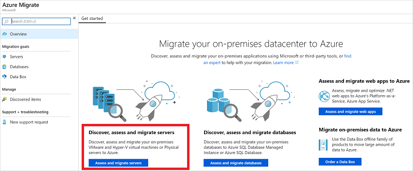

3. In **Migration tools**, select **Click here to add a migration tool when you are ready to migrate**.

    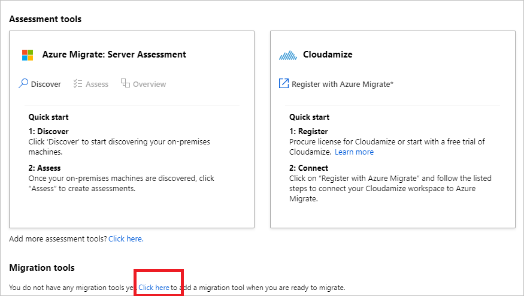

4. In the tools list, select **Azure Migrate: Server Migration** > **Add tool**

    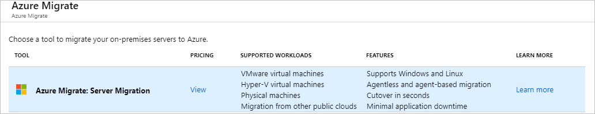

## Set up the Azure Migrate appliance

Azure Migrate Server Migration runs a lightweight VMware VM appliance that's used for discovery, assessment, and agentless migration of VMware VMs. If you follow the [assessment tutorial](tutorial-assess-vmware.md), you've already set the appliance up. If  you didn't, set it up now, using one of these methods:

- **OVA template**: [Set up](how-to-set-up-appliance-vmware.md) on a VMware VM using a downloaded OVA template.
- **Script**: [Set up](deploy-appliance-script.md) on a VMware VM or physical machine, using a PowerShell installer script. This method should be used if you can't set up a VM using an OVA template, or if you're in Azure Government.

After creating the appliance, you check that it can connect to Azure Migrate:Server Assessment, configure it for the first time, and register it with the Azure Migrate project.

## Replicate VMs

After setting up the appliance and completing discovery, you can begin replication of VMware VMs to Azure. 

- You can run up to 300 replications simultaneously.
- In the portal, you can select up to 10 VMs at once for migration. To migrate more machines, add them to groups in batches of 10.

Enable replication as follows:

1. In the Azure Migrate project > **Servers**, **Azure Migrate: Server Migration**, click **Replicate**.

    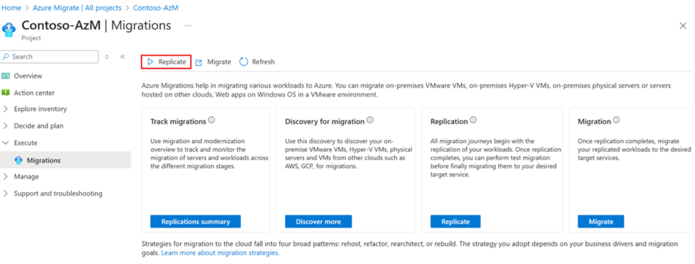

2. In **Replicate**, > **Source settings** > **Are your machines virtualized?**, select **Yes, with VMware vSphere**.
3. In **On-premises appliance**, select the name of the Azure Migrate appliance that you set up > **OK**. 

    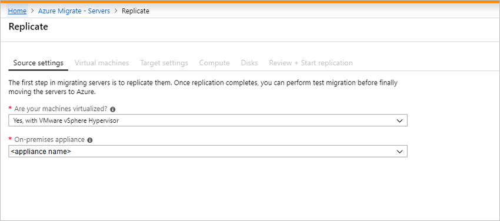

4. In **Virtual machines**, select the machines you want to replicate. To apply VM sizing and disk type from an assessment if you've run one, in **Import migration settings from an Azure Migrate assessment?**, select **Yes**, and select the VM group and assessment name. If you aren't using assessment settings, select **No**.
   
    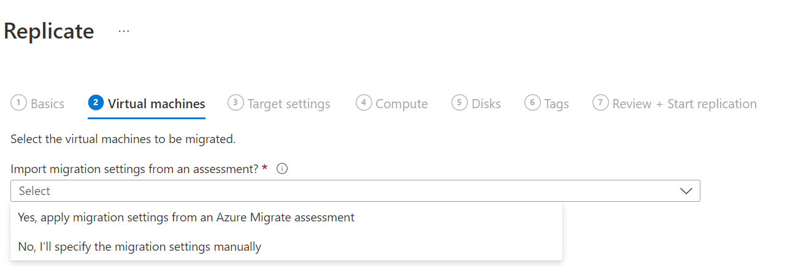

5. In **Virtual machines**, select VMs you want to migrate. Then click **Next: Target settings**.

    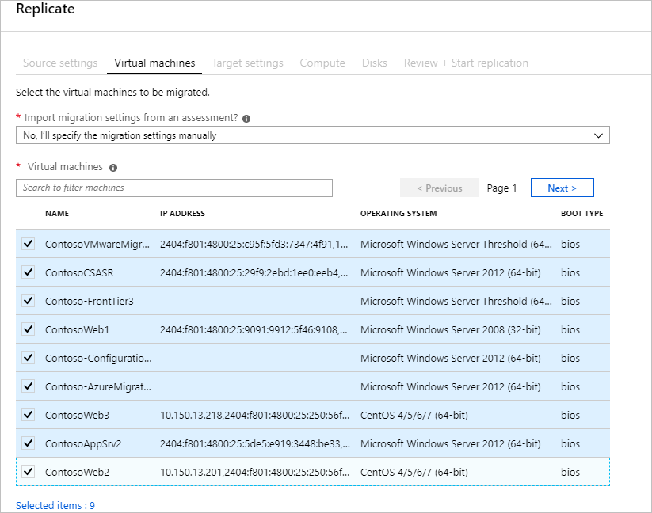

6. In **Target settings**, select the subscription and target region. Specify the resource group in which the Azure VMs reside after migration.
7. In **Virtual Network**, select the Azure VNet/subnet which the Azure VMs join after migration.
7. In **Azure Hybrid Benefit**:

    - Select **No** if you don't want to apply Azure Hybrid Benefit. Then click **Next**.
    - Select **Yes** if you have Windows Server machines that are covered with active Software Assurance or Windows Server subscriptions, and you want to apply the benefit to the machines you're migrating. Then click **Next**.

    

8. In **Compute**, review the VM name, size, OS disk type, and availability set. VMs must conform with [Azure requirements](migrate-support-matrix-vmware-migration.md#azure-vm-requirements).

    - **VM size**: If you're using assessment recommendations, the VM size dropdown shows the recommended size. Otherwise Azure Migrate picks a size based on the closest match in the Azure subscription. Alternatively, pick a manual size in **Azure VM size**. 
    - **OS disk**: Specify the OS (boot) disk for the VM. The OS disk is the disk that has the operating system bootloader and installer. 
    - **Availability set**: If the VM  will reside in an Azure availability set after migration, specify the set. The set must be in the target resource group you specify for the migration.

    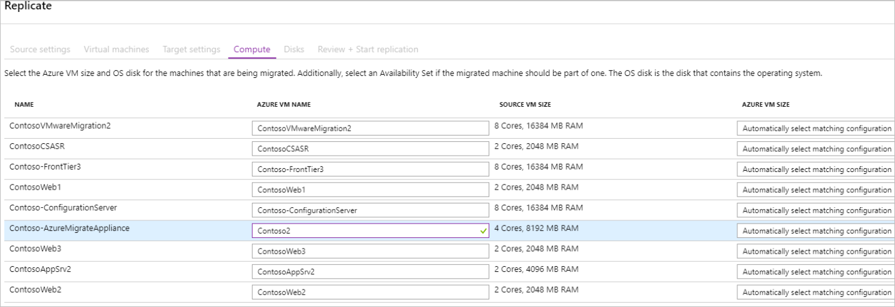

9. In **Disks**, specify whether the VM disks should be replicated to Azure, and select the disk type (standard SSD/HDD or premium-managed disks) in Azure. Then click **Next**.
   
    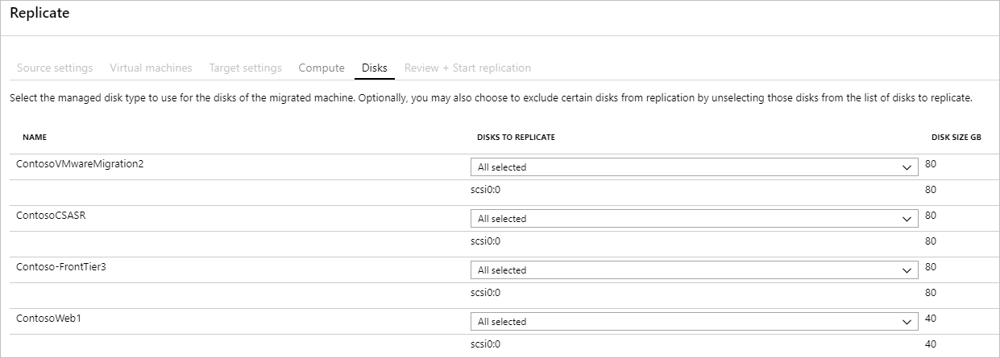

10. In **Review and start replication**, review the settings, and click **Replicate** to start the initial replication for the servers.

> [!NOTE]
> You can update replication settings any time before replication starts (**Manage** > **Replicating machines**). You can't change settings after replication starts.

### Provisioning for the first time

If this is the first VM you're replicating in the project, Server Migration automatically provisions these resources, in same resource group as the project.

- **Service bus**: Server Migration uses the service bus to send replication orchestration messages to the appliance.
- **Gateway storage account**: Server Migration uses the gateway storage account to store state information about the VMs being replicated.
- **Log storage account**: The Azure Migrate appliance uploads replication logs for VMs to a log storage account. Azure Migrate applies the replication information to the replica managed disks.
- **Key vault**: The Azure Migrate appliance uses the key vault to manage connection strings for the service bus, and access keys for the storage accounts used in replication.

## Track and monitor

1. Track job status in the portal notifications.
2. Monitor replication status by clicking on **Replicating servers** in **Azure Migrate: Server Migration**.

     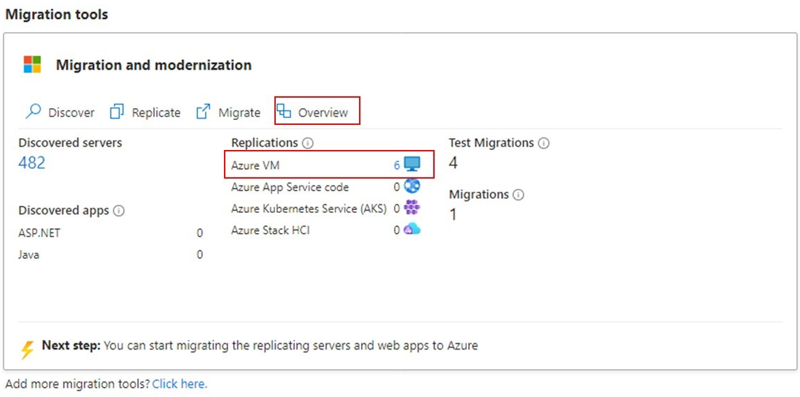

Replication occurs as follows:
- When the Start Replication job finishes successfully, the machines begin their initial replication to Azure.
- During initial replication, a VM snapshot is created. Disk data from the snapshot is replicated to replica managed disks in Azure.
- After initial replication finishes, delta replication begins. Incremental changes to on-premises disks are periodically replicated to the replica disks in Azure.

## Run a test migration

When delta replication begins, you can run a test migration for the VMs, before running a full migration to Azure. We highly recommend that you do this at least once for each machine, before you migrate it.

- Running a test migration checks that migration will work as expected, without impacting the on-premises machines, which remain operational, and continue replicating. 
- Test migration simulates the migration by creating an Azure VM using replicated data (usually migrating to a non-production VNet in your Azure subscription).
- You can use the replicated test Azure VM to validate the migration, perform app testing, and address any issues before full migration.

Do a test migration as follows:

1. In **Migration goals** > **Servers** > **Azure Migrate: Server Migration**, click **Test migrated servers**.

     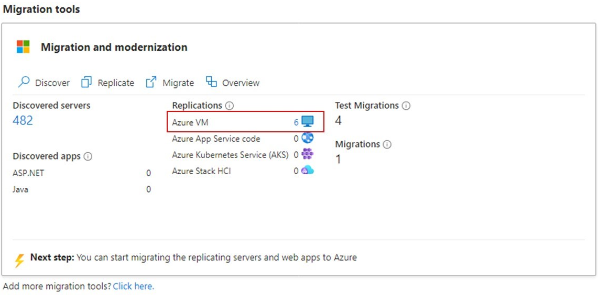

2. Right-click the VM to test, and click **Test migrate**.

    

3. In **Test Migration**, select the Azure VNet in which the Azure VM will be located after the migration. We recommend you use a non-production VNet.
4. The **Test migration** job starts. Monitor the job in the portal notifications.
5. After the migration finishes, view the migrated Azure VM in **Virtual Machines** in the Azure portal. The machine name has a suffix **-Test**.
6. After the test is done, right-click the Azure VM in **Replicating machines**, and click **Clean up test migration**.

    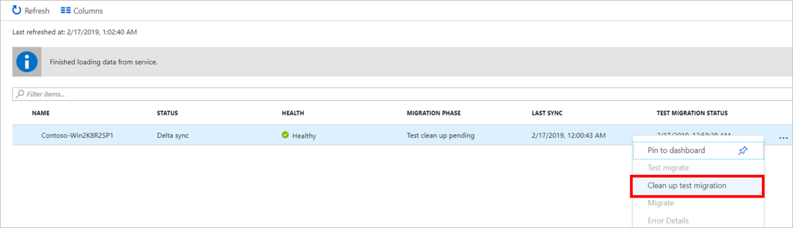

## Migrate VMs

After you've verified that the test migration works as expected, you can migrate the on-premises machines.

1. In the Azure Migrate project > **Servers** > **Azure Migrate: Server Migration**, click **Replicating servers**.

    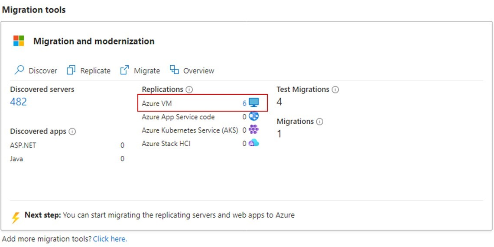

2. In **Replicating machines**, right-click the VM > **Migrate**.
3. In **Migrate** > **Shut down virtual machines and perform a planned migration with no data loss**, select **Yes** > **OK**.
    - By default Azure Migrate shuts down the on-premises VM, and runs an on-demand replication to synchronize any VM changes that occurred since the last replication occurred. This ensures no data loss.
    - If you don't want to shut down the VM, select **No**
4. A migration job starts for the VM. Track the job in Azure notifications.
5. After the job finishes, you can view and manage the VM from the **Virtual Machines** page.

## Complete the migration

1. After the migration is done, right-click the VM > **Stop Replication**. This stops replication for the on-premises machine, and cleans up replication state information for the VM.
2. Install the Azure VM [Windows](https://docs.microsoft.com/azure/virtual-machines/extensions/agent-windows) or [Linux](https://docs.microsoft.com/azure/virtual-machines/extensions/agent-linux) agent on the migrated machines.
3. Perform any post-migration app tweaks, such as updating database connection strings, and web server configurations.
4. Perform final application and migration acceptance testing on the migrated application now running in Azure.
5. Cut over traffic to the migrated Azure VM instance.
6. Remove the on-premises VMs from your local VM inventory.
7. Remove the on-premises VMs from local backups.
8. Update any internal documentation to show the new location and IP address of the Azure VMs. 

## Post-migration best practices

- For increased resilience:
    - Keep data secure by backing up Azure VMs using the Azure Backup service. [Learn more](../backup/quick-backup-vm-portal.md).
    - Keep workloads running and continuously available by replicating Azure VMs to a secondary region with Site Recovery. [Learn more](../site-recovery/azure-to-azure-tutorial-enable-replication.md).
- For increased security:
    - Lock down and limit inbound traffic access with [Azure Security Center - Just in time administration](https://docs.microsoft.com/azure/security-center/security-center-just-in-time).
    - Restrict network traffic to management endpoints with [Network Security Groups](https://docs.microsoft.com/azure/virtual-network/security-overview).
    - Deploy [Azure Disk Encryption](https://docs.microsoft.com/azure/security/azure-security-disk-encryption-overview) to help secure disks, and keep data safe from theft and unauthorized access.
    - Read more about [securing IaaS resources](https://azure.microsoft.com/services/virtual-machines/secure-well-managed-iaas/), and visit the [Azure Security Center](https://azure.microsoft.com/services/security-center/).
- For monitoring and management:
-  Consider deploying [Azure Cost Management](https://docs.microsoft.com/azure/cost-management/overview) to monitor resource usage and spending.

## Next steps

Investigate the [cloud migration journey](https://docs.microsoft.com/azure/architecture/cloud-adoption/getting-started/migrate) in the Azure Cloud Adoption Framework.
