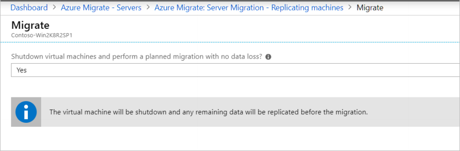

# Migrate VMware VMs to Azure

[Azure Migrate](migrate-services-overview.md) helps you to discover, assess, and migrate machines and workloads to Microsoft Azure. This article describes how to migrate on-premises VMware VMs using Azure Migrate Server Migration.

For VMware VM migration, Azure Migrate offers both an agentless method, and an agent-based method for VMware migration. This article describes the agentless method.

- [Learn about](server-migrate-overview.md) the available methods.
- Learn how agentless migration works.
- Use this article if you want to use the agent-based method.

This tutorial is the second in a series that shows you how to assess and migrate VMware VMs to Azure. You should complete the [first](tutorial-prepare-vmware.md) and [second](tutorial-assess-vmware.md) tutorials before you begin this one.
In this article, you:

> [!div class="checklist"]
> * Prepare VMs for migration.
> * Add the server migration tool.
> * Discover VMs you want to migrate.
> * Start replicating VMs.
> * Run a test migration to make sure everything's working as expected.
> * Run a full VM migration.

## Prerequisites

Before you begin this tutorial, you should:

1. [Review the limitations](server-migrate-overview.md#agentless-migration-limitations) for agentless migration.
2. [Set up Azure and VMware](tutorial-prepare-vmware.md) by following the [first tutorial] in the series.
3. [Deploy an Azure Migrate appliance and start continuous on-premises discovery](tutorial-assess-vmware.md), by following the [second tutorial] in the series.
    - The second tutorial also includes instructions on running an assessment.
    We recommend you try out an assessment, but you don't have to run an assessment before you try a migration.
4. If you don't have an Azure subscription, create a [free account](https://azure.microsoft.com/pricing/free-trial/) before you begin.

## Prepare VMs for migration

Azure Migrate requires some VM changes to ensure that VMs can be migrated to Azure.

- For some [operating systems](server-migrate-overview.md#agentless-migration-limitations), Azure Migrate makes these changes automatically.
- If you're migrating a VM that doesn't have one of these operating systems, follow the instructions to prepare the VM.
- It's important to make these changes before you begin migration. If you migrate the VM before you make the change, the VM might not boot up in Azure.
- Configuration changes you make on on-premises VMs are replicated to Azure after replication for the VM is enabled. To ensure that changes are replicated, make sure that the recovery point you migrate to is later than the time at which the configuration changes were made on-premises.

### Prepare Windows Server VMs

**Action** | **Details** | **Instructions**
--- | --- | ---
Ensure that Windows volumes in Azure VM use the same drive letter assignments as the on-premises VM. | Configure the SAN policy as Online All. | 1. Sign in to the VM with an admin account, and open a command window.  2. Type **diskpart** to run the Diskpart utility.  3. Type **SAN POLICY=OnlineAll**  4. Type Exit to leave Diskpart, and close the command prompt.
Enable Azure serial access console for the Azure VM | This helps with troubleshooting. You don't need to reboot the VM. The Azure VM will boot using the disk image, and this is equivalent to a reboot for the new VM. | Follow [these instructions](https://docs.microsoft.com/azure/virtual-machines/windows/serial-console#enable-serial-console-in-custom-or-older-images) to enable.
Install Hyper-V Guest Integration | If you're migrating machines running Windows Server 2003, install Hyper-V Guest Integration Services on the VM operating system. | [Learn more](https://docs.microsoft.com/windows-server/virtualization/hyper-v/manage/manage-hyper-v-integration-services#install-or-update-integration-services).
Remote Desktop | Enable Remote Desktop on the VM, and check that the Windows Firewall isn't blocking Remote Desktop access on any network profiles. | [Learn more](https://docs.microsoft.com/windows-server/remote/remote-desktop-services/clients/remote-desktop-allow-access).

### Prepare Linux VMs

**Action** | **Details** 
--- | --- | ---
Install Hyper-V Linux Integration Services | Most new versions of Linux distributions have this included by default.
Rebuild the Linux init image to contain the necessary Hyper-V drivers | This ensures that the VM will boot in Azure, and is only required on some distributions.
Enable Azure serial console logging | This helps with troubleshooting. You don't need to reboot the VM. The Azure VM will boot using the disk image, and this is equivalent to a reboot for the new VM.  Follow [these instructions](https://docs.microsoft.com/azure/virtual-machines/linux/serial-console) to enable.
Update device map file | Update the device map file that has the device name to volume associations, to use persistent device identifiers
Update fstab entries | Update entries to use persistent volume identifiers.
Remove udev rule | Remove any udev rules that reserves interface names based on mac address etc.
Update network interfaces | Update network interfaces to receive IP address based on DHCP.
Enable ssh | Ensure ssh is enabled and the sshd service is set to start automatically on reboot.  Ensure that incoming ssh connection requests are not blocked by the OS firewall or iptable rules.

[Follow this article](https://docs.microsoft.com/azure/virtual-machines/linux/create-upload-generic) that discusses these steps for running a Linux VM on Azure, and include instructions for some of the popular Linux distributions.  

## Add the Server Migration tool

If you already created an Azure Migrate project when you set up server assessment, do the following:

1. Under **Migration goals** > **Servers**, click **Add tool**.
2. Add the **Azure Migrate: Server Migration** tool.

If you haven't yet set up a project, follow the next procedure.
### Set up an Azure Migrate project

1. In the Azure portal > **All services**, search for **Azure Migrate**.
2. In the search results, select **Azure Migrate**.
3. In **Overview**, click **Assess and migrate servers**.
4. Under **Discover, assess and migrate servers**, click **Assess and migrate servers**.
5. In **Discover, assess and migrate servers**, click **Add tools**.
6. In **Migrate project**, select your Azure subscription, and create a resource group if you don't have one. Remember that a new group requires [permissions to work with the Azure Migrate service](tutorial-prepare-vmware.md#assign-role-assignment-permissions).
7. In **Project Details**, specify the project name, and geography in which you want to create the project. You can create an Azure Migrate project in the regions summarized in the table.

    - The region specified for the project is only used to store the metadata gathered from on-premises VMs.
    - You can select any target region for the actual migration.
    
        **Geography** | **Region**
        --- | ---
        Asia | Southeast Asia
        Europe | North Europe or West Europe
        United States | East US or West Central US
1. Click **Next**.
2. In **Select assessment tool**, select **Skip adding an assessment tool for now** > **Next**.
3. In **Select migration tool**, **Azure Migrate: Server Migration** > **Next**.
4. In **Review + add tools**, review the settings, and click **Add tools**.
5. To view the Azure Migrate project after it's created, in **Server**, click **See details for a different migrate project**.
6. In **Settings**, select the subscription and project.  **Azure Migrate: Server Migration** will appear under **Assessment tools**.

## Prepare for discovery
In order to discover VMs in preparation for replication and migration, you need to do the following:

- Prepare VMware and Azure
- Set up the appliance VM
- Start continuous discovery

If you've already set up the Azure Migrate appliance for assessment purposes, you will skip these steps, since you completed them before you deployed the appliance.

If you haven't yet set up an appliance, follow the procedures below to prepare for discovery.

### Prepare VMware and Azure

Prepare Azure and VMware for discovery.

1. Set up permissions for your Azure account to create Azure Active Directory (Azure AD) apps and verify on-premises VMware settings. 
2. Set up vCenter Server accounts, in line with the permissions required for migration.
3. Verify internet access, so that the Azure Migrate appliance can reach Azure URLs.

Follow the instructions in [this tutorial](tutorial-prepare-vmware.md) to configure these settings, and then come back to this article.

### Set up the appliance VM

Deploy the Azure Migrate appliance as a VMware VM:

- The appliance discovers on-premises VMware VMs, and sends VM metadata and performance data to Azure Migrate.
- To set up the appliance, you download an OVA template file, and import it to vCenter Server to create a VM.

Follow the instructions to set up the appliance in [this tutorial](tutorial-assess-vmware.md#set-up-the-appliance-vm) , and then come back to this article. 

### Start continuous discovery

Now connect to the vCenter Server and start discovery. 

1. In **Specify vCenter Server details**, do the following:
    - Specify the name (FQDN) or IP address of the vCenter Server. You can leave the default port, or specify a custom port on which your vCenter Server listens.
    - In **User name** and **Password**, specify the read-only account credentials that the appliance will use to discover VMs on the vCenter server. 
    - In **Collection scope**, select a scope for VM discovery. The collector discovers VMs within the specified scope. Scope can be set to a specific folder, datacenter, or cluster.
2. Click **Validate connection** to make sure that the appliance can connect to vCenter Server.
3. After the connection is established, click **Save** > **Start discovery**.

It takes around 15 minutes for metadata of discovered VMs to appear in the portal. After setting up the appliance, it continuously discovers configuration changes such as adding and removing VMs, disks, or network adapters, and sends VM metadata and performance data to Azure Migrate.

### Verify VMs in the portal

After discovery you can verify that the VMs appear in the Azure portal, as follows:

1. Open the Azure Migrate dashboard
2. In the **Server Assessment Service** page, click the icon that displays the count for the discovered machines. 

## Replicate VMs

1. Under **Migration goals** > **Servers**, **Azure Migrate: Server Migration**, click **Replicate**.
2. In **Azure Migrate: Server Assessment**, click **Replicate**.

    

3. In **Replicate**, > **Source settings** > **Are your machines virtualized?**, select **Yes, with VMware vSphere Hypervisor**.
4. In  **On-premises appliance**, select the appliance name.

    

5. In **Virtual machines**, specify assessment settings:
    - If you've run an assessment for the VMs, you can apply sizing and disk settings for the VM uses the assessment results. To do this, in **Import migration settings from an Azure Migrate assessment?**, select the **Yes** option.
    - If you didn't run an assessment, or you don't want to use the assessment settings, select the **No** options.
    - If you selected to use the assessment, select the VM group, and assessment name.
6. In **Virtual machines**, search for VMs as needed, and check each VM you want to migrate. Then click **Next: Target settings**.
7. In **Target settings**:
    - Select the subscription, and target region for the migration.
    - Specify the resource group in which the Azure VMs will reside after migration.
    - Select the Azure VNet/subnet to which the Azure VMs will be joined.
    - In **Azure Hybrid Benefit**, click **Yes** if you're migrating Windows machines, and you want to apply the benefit to the machines you're migrating. Then click **Next**.
8. In **Compute** do the following:
    - **VM size**: 
        - If you're using assessment recommendations, the VM size dropdown will contain size recommendations from the assessment.
        - Otherwise Azure Migrate picks a size based on the closest match in the Azure subscription.
        - Alternatively, clear the option to let Azure Migrate pick the size, and select sizes manually.
    - **OS disk**: Specify the OS (boot) disk for the VM. The OS disk is the disk that has the operating system bootloader and installer. 
    - **Availability set**: If the VM should be in an Azure availability set after migration, specify the set. The set must be in the target resource group you specify for the migration.
9. In **Disk**, specify whether the VM disks should be replicated to Standard or Premium-managed disks in Azure. Then click **Next**.
    - You can exclude disks from replication.
    - If you exclude disks, won't be present on the Azure VM after migration. 
11. In **Review and start replication**, review the settings, and click **Replicate** to start the initial replication for the servers.

> [!NOTE]
> You can update replication settings any time before replication starts, **Manage** > **Replicating machines**. Settings can't be changed after replication starts.

      
## Replication process

- When you click **Replicate** a Start Replication job begins. 
- When the Start Replication job finishes successfully, the machines start their initial replicating.
- During initial replication, a VM snapshot is created. Disk data from the snapshot is replicated to replica managed disks in Azure.
- After initial replication finishes, delta replication begins. Incremental changes to on-premises disks are periodically replicated to the replica disks in Azure.

## Track and monitor

You can track job status in the portal notifications, in the **Jobs** view in the Server Migration tool.

You can monitor replication status from the Server Migration tool. 

### Provisioning for the first time
If this is the first VM you're replicating in the Azure Migrate project, Azure Migrate automatically provisions these resources in same resource group as the project. 
- **Service bus**: Azure Migrate uses the service bus to send replication orchestration messages to the appliance.
- **Gateway storage account**: Azure Migrate uses the gateway storage account to store state information about the VMs being replicated.
- **Log storage account**: The Azure Migrate appliance uploads replication logs for VMs to a log storage account. Azure Migrate applies the replication information to the replica managed disks.
- **Key vault**: The Azure Migrate appliance uses the key vault to manage connection strings for the service bus, and access keys for the storage accounts used in replication. You should have set up the permissions that the key vault needs to access the storage account when you prepared. [Review these permissions](tutorial-prepare-vmware.md#assign-role-assignment-permissions).

## Run a test migration

When delta replication begins, you can run a test migration for the VMs, before running a full migration to Azure.

- Running a test migration checks that migration will work as expected, without impacting the on-premises machines, which remain operational, and continue replicating. 
- Test migration simulates the migration by creating an Azure VM using replicated data (usually migrating to a non-production VNet in your Azure subscription).
- You can use the replicated test Azure VM to validate the migration, perform app testing, and address any issues before full migration.

Do a test migration as follows:

1. In **Migration goals** > **Servers** > **Azure Migrate: Server Migration**, click **Test migrated servers**.
2. Right-click the VM to test, and click **Test migrate**.

    

3. In **Test Migration**, select the Azure VNet in which the Azure VM will be located after the migration. We recommend you use a non-production VNet.
4. The **Test migration** job starts. Monitor the job in portal notification.
5. After the migration finishes, view the migrated Azure VM in Virtual Machines in the Azure portal. The machine name has a suffix **-Test**.
6. After the test is done, right-click the Azure VM in **Replicating machines**, and click **Clean up test migration**.

    

## Migrate VMs

After you've verified that the test migration works as expected, you can migrate the on-premises machines.

1. In the **Replicating servers**, right-click the VM > **Migrate**.
2. In Migrate > **Shut down virtual machines and perform a planned migration with no data loss**, select **Yes**.
    - By default Azure Migrate shuts down the on-premises VM, and runs an on-demand replication to synchronize any VM changes that occurred since the last replication occurred. This ensures no data loss.
    - If you don't want to shut down the VM, select **No**

     
3. Click **OK**.
4. A migration job starts for the VM. Track the job in Azure notifications.
5. After the job finishes, you can view and manage the VM from the **Virtual Machines** page.
6. To finish the migration, right-click the VM > **Stop migration**. This stops replication for the on-premises machine, and cleans up replication state information for the VM.

## Next steps

[Learn](concepts-assessment-calculation.md) how assessments are calculated.

