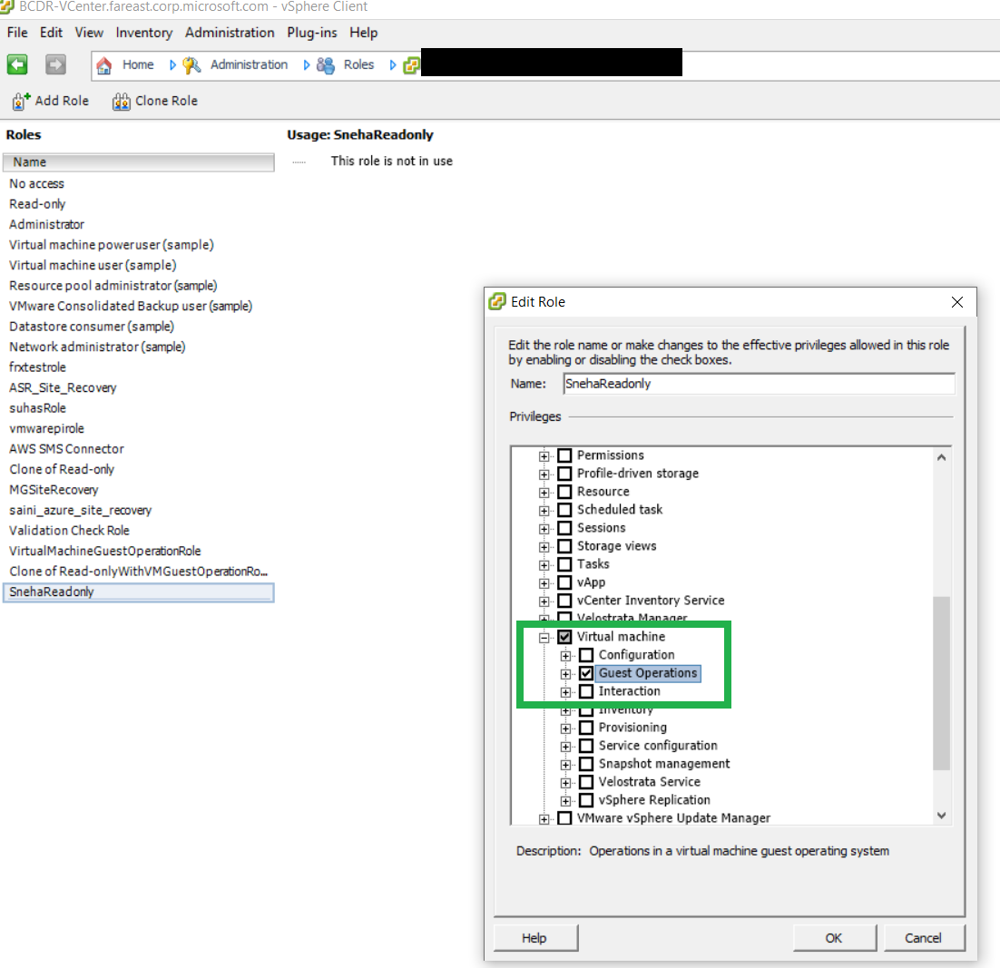

# Prepare VMware VMs for assessment and migration to Azure

This article helps you to prepare for assessment and migration of on-premises VMware VMs to Azure using [Azure Migrate](migrate-services-overview.md).

This tutorial is the first in a series that shows you how to assess and migrate VMware VMs. In this tutorial, you learn how to:

> [!div class="checklist"]
> * Prepare Azure to work with Azure Migrate.
> * Prepare to assess VMware VMs with the Azure Migrate:Server Assessment tool.
> * Prepare to migrate VMware VMs with the Azure Migrate:Server Migration tool. 

> [!NOTE]
> Tutorials show you the simplest deployment path for a scenario. They're useful as a quick proof-of-concept. Tutorials use default options where possible, and don't show all possible settings and paths. 

If you don't have an Azure subscription, create a [free account](https://azure.microsoft.com/pricing/free-trial/) before you begin.

## Prepare Azure

The table summarizes the tasks you need to complete in Azure. Instructions for each task follow the table.

**Task** | **Details** | **Permissions**
--- | --- | ---
**Create an Azure Migrate project** | An Azure Migrate project provides a central location for orchestrating and managing assessments and migrations with Azure Migrate tools, Microsoft tools, and third-party offerings. | Your Azure account needs Contributor or Owner permissions in the resource group in which the project resides.
**Register appliance** | Azure Migrate uses a lightweight Azure Migrate appliance to discover VMs, to assess them with the Server Assessment tool, and to migrate them using agentless migration with the Server Migration tool. [Learn more](migrate-appliance-architecture.md#appliance-registration) about registration. | To register the appliance, your Azure account needs Contributor or Owner permissions on the Azure subscription.
**Create Azure AD apps** | When registering an appliance, Azure Migrate creates Azure Active Directory (Azure AD) apps.    - The first app is used for communication between the agents running on the appliance and Azure Migrate.    - The second app is used exclusively to access KeyVault created in the user's subscription for agentless VMware VM migration.   | Your Azure account needs permissions to create Azure AD apps.
**Create a Key Vault** | To migrate VMware VMs using agentless migration, Azure Migrate creates a Key Vault to manage access keys to the replication  account in your subscription. | To allow Azure Migrate to create the Key Vault, you set permissions (Owner, or Contributor and User Access Administrator) on the resource group in which the Azure Migrate project resides.

### Assign permissions to create project

1. In the Azure portal, open the subscription, and select **Access control (IAM)**.
2. In **Check access**, find the relevant account, and click it to view permissions.
3. You should have **Contributor** or **Owner** permissions.
    - If you just created a free Azure account, you're the owner of your subscription.
    - If you're not the subscription owner, work with the owner to assign the role.

### Assign permissions to create Azure AD apps

To register the appliance, your Azure account needs permissions to create Azure AD apps. Assign the permissions using one of these methods:

- **Method 1: Grant permissions to the account**: A tenant/global admin can grant permissions to user accounts in the tenant, to create and register Azure AD apps.
- **Method 2: Assign a role with the permissions to a user account**: A tenant/global admin can assign the Application Developer role (that has the required permissions) to the user account.

> [!NOTE]
> You only need these permissions when you register a new appliance. You can remove the permissions after the appliance is set up.

#### Method 1: Grant permissions to the account

Grant permissions to the account as follows:

1. Make sure you're a tenant or global admin. Then, in Azure AD, navigate to **Azure Active Directory** > **Users** > **User Settings**.
2. Set **App registrations** to **Yes**. This is a default setting that isn't sensitive. [Learn more](https://docs.microsoft.com/azure/active-directory/develop/active-directory-how-applications-are-added#who-has-permission-to-add-applications-to-my-azure-ad-instance).

    

#### Method 2: Assign Application Developer role

Alternatively, the tenant/global admin can assign the Application Developer role to an account. [Learn more](https://docs.microsoft.com/azure/active-directory/fundamentals/active-directory-users-assign-role-azure-portal) about assigning a role.

### Assign permissions to create a Key Vault

To enable Azure Migrate to create a Key Vault, assign permissions as follows:

1. In the resource group in the Azure portal, select **Access control (IAM)**.
2. In **Check access**, find the relevant account, and click it to view permissions.

    - To run server assessment, **Contributor** permissions are enough.
    - To run agentless server migration, you should have **Owner** (or **Contributor** and **User Access Administrator**) permissions.

3. If you don't have the required permissions, request them from the resource group owner.

## Prepare for assessment

To prepare for VMware VM assessment, you need to:

1. **Verify VMware settings**. Make sure that the vCenter Server and VMs you want to migrate meet requirements.
2. **Set up permissions for assessment**. Azure Migrate uses a vCenter account to access the vCenter Server, to discover and assess VMs.
3. **Verify appliance requirements**. Verify deployment requirements for the Azure Migrate appliance, before you deploy it in the next tutorial.

### Verify VMware settings

1. [Check VMware requirements](migrate-support-matrix-vmware.md#vmware-requirements) for assessment.
2. [Make sure](migrate-support-matrix-vmware.md#port-access-requirements) that the  ports you need are open on vCenter Server.
3. On vCenter Server, check that your account has permissions to create a VM using an OVA file. This is needed when you deploy the Azure Migrate appliance as a VMware VM, using an OVA file.
4. There are some changes needed on VMs before you migrate them to Azure.

    - For some operating systems, Azure Migrate makes these changes automatically. 
    - It's important to make these changes before you begin migration. If you migrate the VM before you make the change, the VM might not boot up in Azure.
    - Review [Windows](prepare-for-migration.md#windows-machines) and [Linux](prepare-for-migration.md#linux-machines) changes you need to make.

### Set up permissions for assessment

Azure Migrate needs to access the vCenter Server so that the Azure Migrate appliance can discover VMs for assessment and agentless migration. Set up an account as follows:

1. In the vSphere Web Client, open **Administration** > **Access** > **SSO Users and Groups**.
2. In **Users**, click the **New User** icon.
3. Type in the new user details.
4. Select permissions in accordance with the table values.

    **Feature** | **Account permissions**
    --- | ---
    [Assess VMs](tutorial-assess-vmware.md) | For assessment, the account needs read-only access.
    [Discover VM apps, roles, and features](how-to-discover-applications.md) | If you want to use app-discovery, the read-only account used for assessment needs privileges enabled for **Virtual machines** > **Guest Operations**.
    [Analyze dependencies on VMs (agentless)](how-to-create-group-machine-dependencies-agentless.md) | If you want to analyze dependencies, the read-only account used for assessment needs privileges enabled for **Virtual machines** > **Guest Operations**.
    
> [!NOTE]
> If you want to limit VM discovery for assessment to a specific scope, review [this article](set-discovery-scope.md#assign-a-role-for-assessment).

### Verify appliance settings for assessment

In the [next tutorial](tutorial-assess-vmware.md) you set up the Azure Migrate appliance, and begin assessment. Before you do that, review the appliance requirements as follows: 

1. [Review the requirements](migrate-appliance.md#appliance---vmware) for deploying the Azure Migrate appliance.
2. Review the Azure URLs that the appliance needs to access in the [public](migrate-appliance.md#public-cloud-urls) and [government](migrate-appliance.md#government-cloud-urls) clouds.
3. [Note](migrate-support-matrix-vmware.md#port-access-requirements) the ports that the appliance uses.
4. [Review the data](migrate-appliance.md#collected-data---vmware) that the appliance collects during discovery and assessment.

## Prepare for agentless VMware migration

You can migrate VMware VMs using [agentless or agent-based migration](server-migrate-overview.md). This section summarizes the requirements for agentless migration.

1. [Decide](server-migrate-overview.md#compare-migration-methods) whether you want to use agentless migration.
2. [Review](migrate-support-matrix-vmware-migration.md#vmware-requirements-agentless) hypervisor requirements for machines you want to migrate.
3. [Review](migrate-support-matrix-vmware-migration.md#vm-requirements-agentless) the requirements for VMware VMs you want to migrate using agentless migration.
4. [Review](migrate-support-matrix-vmware-migration.md#appliance-requirements-agentless) the Azure Migrate appliance requirements for agentless migration.
5. Note the URL access required for [public](migrate-appliance.md#public-cloud-urls) and [government](migrate-appliance.md#government-cloud-urls) clouds.
6. Review [port access](migrate-support-matrix-vmware-migration.md#port-requirements-agentless) requirements.
7. Set up permissions for agentless migration, as described in the next procedure.

### Assign permissions to an account

Azure Migrate appliance connects to the vCenter Server to discover and migrate VMs with agentless migration. You can assign the permissions that the appliance needs to user account, or create a role with the permissions, and assign that role to a user account.

1. In the vSphere Web Client, open **Administration** > **Access** > **SSO Users and Groups**.
2. In **Users**, click the **New User** icon.
3. Type in the new user details.
4. Assign [these permissions](migrate-support-matrix-vmware-migration.md#vmware-requirements-agentless)

#### Create a role and assign to an account

Alternatively, you can create an account. Then create a role, and assign it to the account, as follows:

1. Sign into the Sphere Web Client as the vCenter Server administrator
2. Select the vCenter Server instance >  **Create role**.
3. Specify a role name, for example <em>Azure_Migrate</em>, and assign the [required permissions](migrate-support-matrix-vmware-migration.md#vmware-requirements-agentless) to the role.

    

4. Now create an account, and assign the role to the account.

> [!NOTE]
> If you want to limit VM discovery for agentless migration to a specific scope, review [this article](set-discovery-scope.md#assign-a-role-for-agentless-migration).

## Prepare for agent-based VMware migration

You can migrate VMware VMs using [agentless or agent-based migration](server-migrate-overview.md). This section summarizes the requirements for agent-based migration.

1. [Decide](server-migrate-overview.md#compare-migration-methods) whether you want to use agent-based migration.
1. [Review](migrate-support-matrix-vmware-migration.md#vmware-requirements-agent-based) hypervisor requirements for machines you want to migrate.
2. [Review](migrate-support-matrix-vmware-migration.md#vm-requirements-agent-based) VMware VMs requirements, including installation of the Mobility service on each VM you want to migrate.
3. Agent-based migration uses a replication appliance:
    - [Review](migrate-replication-appliance.md#appliance-requirements) the deployment requirements for the replication appliance.
    - [Review the options](migrate-replication-appliance.md#mysql-installation) for installing MySQL on the appliance.
    - Note the URL access required for [public](migrate-replication-appliance.md#url-access) and [government](migrate-replication-appliance.md#azure-government-url-access) clouds.
    - Review [port access](migrate-replication-appliance.md#port-access) requirements for the replication appliance.
4. There are some changes needed on VMs before you can migrate them to Azure. Review [Windows](prepare-for-migration.md#windows-machines) and [Linux](prepare-for-migration.md#linux-machines) changes you need to make.

## Next steps

In this tutorial, you:

> [!div class="checklist"]
> * Set up Azure permissions.
> * Prepared VMware for assessment and migration.

Continue to the second tutorial to set up an Azure Migrate project, and assess VMware VMs for migration to Azure.

> [!div class="nextstepaction"]
> [Assess VMware VMs](./tutorial-assess-vmware.md)
