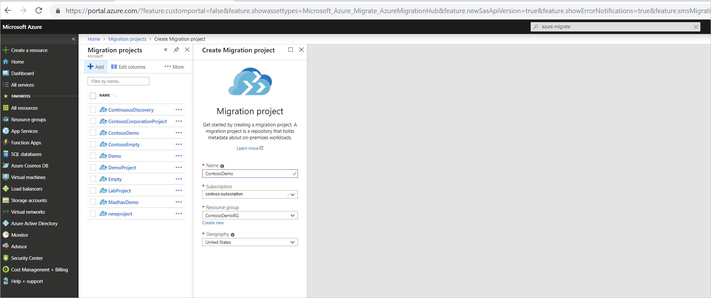

# Prepare to assess and migrate VMware VMs to Azure

This article describes how to prepare your on-premises environment and Azure resources  for migration of on-premises VMware VMs to Azure with [Azure Migrate](migrate-services-overview.md) services.

In this tutorial, you learn how to:

> [!div class="checklist"]
> * Create an Azure subscription if you don't have one, and make sure it has the correct permissions.
> * Create an account on the vCenter Server so that the Azure Migrate service can discover VMware VMs.
> * Create an Azure Migrate project.
> * Set up a lightweight Azure Migrate appliance that runs on-premises to discover and assess VMs. 
> * Start continuous discovery. 

This article is the first tutorial in a series that shows you how to assess and migrate VMware VMs to Azure. After you've completed this tutorial, you can run an assessment for Hyper-V VMs, and migrate them to Azure.

> [!NOTE]
> Tutorials show you the simplest deployment path for a scenario so that you can quickly set up a proof-of-concept. They use default options where possible, and don't show all possible settings and paths. For detailed instructions, review the How Tos for VMware assessment and migration.

If you don't have an Azure subscription, create a [free account](https://azure.microsoft.com/pricing/free-trial/) before you begin.

## Prerequisites

Here's what you need before you can start assessing and migrating VMware VMs:

- **Azure account permissions**: When you log into Azure to set up discovery and assessment, the Azure account needs permission to create Azure Active Directory (Azure AD) apps.
- **VMware requirements**: Verify you have vCenter server and an ESXi host.
- **Account for discovery**: You need a read-only account to access the vCenter Server. Azure Migrate uses this account to discover the on-premises VMs.
- **Azure Migrate project** You need to set up an Azure Migrate project in the Azure portal.
- **Azure Migrate appliance**: Azure Migrate runs a lightweight appliance on a VMware VM. This appliance performs VM discovery and sends VM metadata and performance data to Azure Migrate. To set up the appliance you need to:<br/><br/> Verify requirements for the appliance.<br/><r/> Set up the appliance as a VMware VM using an OVF template, downloaded from the Azure portal.<br/><br/> Check that the appliance can reach Azure.<br/><br/> Configure the appliance for the first time, and register it with Azure Migrate.

## Set up Azure permissions

Either a tenant/global admin can assign permissions to create Azure AD apps to the account, or you can assign the Application Developer role (that has the permissions) to the account.

### Grant account permissions

The tenant/global admin can grant permissions as follows

1. In Azure AD, the tenant/global admin should navigate to **Azure Active Directory** > **Users** > **User Settings**.
2. The admin should set **App registrations** to **Yes**.

    

> [!NOTE]
> This is a default setting that isn't sensitive. [Learn more](https://docs.microsoft.com/azure/active-directory/develop/active-directory-how-applications-are-added#who-has-permission-to-add-applications-to-my-azure-ad-instance).


### Assign Application Developer role 

The tenant/global admin has permissions to assign the role to the account. [Learn more](https://docs.microsoft.comazure/active-directory/fundamentals/active-directory-users-assign-role-azure-portal).


## Verify VMware settings for VM migration
1. Make sure that VMs that you want to discover and assess are managed by vCenter Server version 5.5, 6.0, or 6.5.
2. Make sure you have an ESXi host with version 5.0 or higher to deploy the Azure Migrate appliance.
3. 
## Set up a vCenter Server account

Azure Migrate needs access the vCenter Server to discover VMs for assessment. Before you deploy Azure Migrate, prepare a VMware account with the following properties:

- User type: At least a read-only user.
- Permissions: Data Center object –> Propagate to Child Object, role=Read-only
- Details: User assigned at datacenter level, and has access to all the objects in the datacenter.
- To restrict access, assign the No access role with the Propagate to child object, to the child objects (vSphere hosts, datastores, VMs, and networks).


## Sign in to the Azure portal

Sign in to the [Azure portal](https://portal.azure.com).

## Set up an Azure Migrate project

1. In the Azure portal, search for **Azure Migrate**.
2. In the search results, under **Services**, select **Migration projects**.
3. In **Migration projects**, click **Add**
4. In **Create migration project**, specify a project name.
1. Select the subscription and create a new resource group.
2. Specify the geography/region in which you want to create the project. You can create an Azure Migrate project in the regions summarized in the table.
    - The region specified for the project is only used to store the metadata gathered from on-premises VMs.
    - You can select any target region for the actual migration.
    
    **Geography** | **Region**
    --- | ---
    Asia | Southeast Asia
    Europe | North Europe or West Europe
    Unites States | East US or West Central US

6. Click **Create**.

    

## Set up the appliance VM

Deploy the Azure Migrate appliance as a VMware VM:

- The appliance discovers on-premises VMware VMs, and sends VM metadata and performance data to Azure Migrate.
- To set up the appliance, you download an OVA template file, and import it to vCenter Server to create a VM.

### Download the OVA template

1. In the Azure Migrate dashboard, click **Discover a new site** > **Discover & Assess** > **Discover Machines**.
2. In **Discover machines** > **Are your machines virtualized?**, click **Yes, with VMWare vSphere hypervisor**.
3. Click **Download** to download the .OVA template file.

    


### Verify OVA security

Check that the OVA file is secure, before you deploy it.

1. On the machine to which you downloaded the file, open an administrator command window.
2. Run the following command to generate the hash for the OVA:
    - ```C:\>CertUtil -HashFile <file_location> [Hashing Algorithm]```
    - Example usage: ```C:\>CertUtil -HashFile C:\AzureMigrate\AzureMigrate.ova SHA256```
3. The generated hash should match these settings.


  For OVA version 1.0.9.14

  **Algorithm** | **Hash value**
  --- | ---
  MD5 | C78457689822921B783467586AFB22B3
  SHA1 | F1338F9D9818DB61C88F8BDA1A8B5DF34B8C562D
  SHA256 | 0BE66C936BBDF856CF0CDD705719897075C0CEA5BE3F3B6F65E85D22B6F685BE

  
### Create the appliance VM

Import the downloaded OVA file to vCenter Server, and create a VM from it.

1. In the vSphere Client console, click **File** > **Deploy OVF Template**.

    

2. In the Deploy OVF Template Wizard > **Source**, specify the location of the OVA file.
3. In **Name** and **Location**, specify a friendly name for the VM, and the inventory object in which the VM
will be hosted.
5. In **Host/Cluster**, specify the host or cluster on which the VM will run.
6. In **Storage**, specify the storage destination for the VM.
7. In **Disk Format**, specify the disk type and size.
8. In **Network Mapping**, specify the network to which the  VM will connect. The network needs internet connectivity, to send metadata to Azure.
9. Review and confirm the settings, then click **Finish**.


### Verify appliance access to Azure

The appliance VM needs internet connectivity to Azure. If you're using a URL-based proxy to control outbound connectivity, make sure these URLs are allowed.

**URL** | **Requirement**
--- | ---
*.portal.azure.com | Reach the Azure portal.
*.windows.net<br/><br/> *microsoftonline.com | Log into Azure.<br/><br/>  Create Azure AD app and Service Principal objects for agent to service communications.
management.azure.com | Communicate with Azure Resource Manager to set up Azure Migrate artifacts.
dc.services.visualstudio.com | Upload app logs for internal monitoring.
*.vault.azure.net | Communication between agent and service (persistent secrets).

### Configure and register the appliance

Set up the appliance for the first time, and register it with Azure Migrate.

1. In the vSphere Client console, right-click the VM > **Open Console**.
2. Provide the language, time zone, and password preferences for the appliance.
3. On the desktop of the appliance VM, click the **Start discovery** shortcut to open the appliance web app. Alternatively, run the app remotely from **https://*appliance name or IP address*:44368**. 
4. In the appliance web app, click **Check for updates** to verify that you're running the latest version of the app. If not, you can download the latest upgrade.
5. In **Set up prerequisites**, do the following:
    - **License**: Accept the license terms, and read the third-party information.
    - **Connectivity**: The app checks that the VM has internet access. If the VM accesses the internet via a proxy and not directly:
        - Click **Proxy settings**, and specify the proxy address and listening port, in the form http://ProxyIPAddress or http://ProxyFQDN.
        - Specify credentials if the proxy needs authentication.
        - Only HTTP proxy is supported.
        - The collector checks that the collector service is running. The service is installed by default on the collector VM.
    - **Time sync**: The time on the appliance should be in sync with internet time for discovery to function correctly.

### Register the appliance with Azure Migrate

1. Click **Log In**.
2. On the new tab, log in using the Azure credentials with the required permissions. 
3. After a successful logon, go back to the web app.
4. Select the subscription, resource group, and region in which you want to store the list of discovered VMs, and the VM metadata.
5. Select a site name. A site gathers together a group of discovered VMs.


## Start continuous discovery

Now connect to the vCenter Server and start discovery. 

1. In **Specify vCenter Server details**, do the following:
    - Specify the name (FQDN) or IP address of the the vCenter Server. You can leave the default port, or specify a custom port on which your vCenter Server listens.
    - In **User name** and **Password**, specify the read-only account credentials that the appliance will use to discover VMs on the vCenter server.
    - In **Collection scope**, select a scope for VM discovery. The collector discovers VMs within the specified scope. Scope can be set to a specific folder, datacenter, or cluster.
2. Click **Validate connection** to make sure that the appliance can connect to vCenter Server.
3. After the connection is established, click **Save** > **Start discovery**.

It takes around 15 minutes for metadata of discovered VMs to appear in the portal. 

## Verify VMs in the portal

After discovery you can verify that the VMs appear in the Azure portal, as follows:

1. Open the Azure Migrate dashboard
2. In the **Server Assessment Service** page, click the icon that displays the count for the discovered machines. 

Note the following: 
- The appliance continuously profiles the on-premises environment and sends metadata.
- You can create as-is assessments immediately after discovery.
- For performance assessments, we recommend that you wait at least a day after discovery:
    - Collecting performance data takes time. Waiting at least a day ensures that there are enough performance data points before you run the assessment.
    - For performance data, the appliance collects real-time data points every 20 seconds for each performance metrics, and rolls them up to a single five minute data point. The appliance sends the five-minute data point to Azure every hour for assessment calculation.  
 

## Next steps

In this tutorial, you used the Azure portal to: 
 
> [!div class="checklist"] 
> * Prepare for VMware VM assessment and migration
> * Set up an Azure Migrate project
> * Set up an on-premises appliance
> * Kicked off continuous VM discovery

Continue to the next tutorial to assess VMware VMs for migration to Azure

> [!div class="nextstepaction"] 
> [Assess VMware VMs](./tutorial-assess-vmware.md) 

