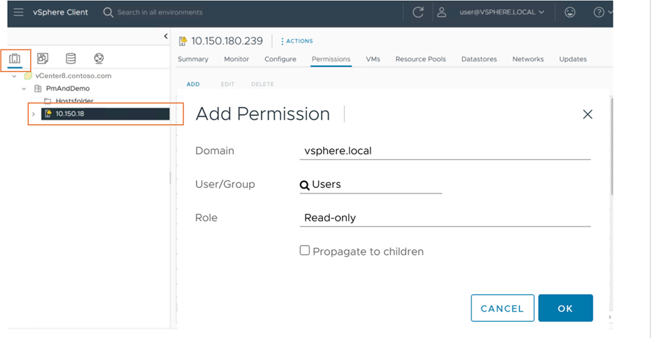

# Set discovery scope for servers in VMware vSphere environment

This article describes how to limit the scope of discovery for servers in VMware vSphere environment when you are:

- Discovering servers with the [Azure Migrate appliance](../migrate-appliance-architecture.md) when you're using the Azure Migrate: Discovery and assessment tool.
- Discovering servers with the [Azure Migrate appliance](../migrate-appliance-architecture.md) when you're using the Migration and modernization tool, for agentless migration of servers from VMware vSphere environment to Azure.

When you set up the appliance, it connects to vCenter Server and starts discovery. Before you connect the appliance to vCenter Server, you can limit discovery to vCenter Server datacenters, clusters, a folder of clusters, hosts, a folder of hosts, or individual servers. To set the scope, you assign permissions on the account that the appliance uses to access the vCenter Server.

[!INCLUDE [scenario-banner.md](../includes/scenario-banner.md)]

## Before you start

If you haven't set up a vCenter Server user account that Azure Migrate uses for discovery, do that now for [assessment](./tutorial-discover-vmware.md?context=/azure/migrate/context/migrate-context#prepare-vmware) or [agentless migration](migrate-support-matrix-vmware-migration.md#agentless-migration).

## Assign permissions and roles

You can assign permissions on VMware vSphere inventory objects using one of two methods:

- On the account used by the appliance, assign a role with the required permissions on the objects you want to scope.
- Alternatively, assign a role to the account at the data center level, and propagate to the child objects. Then give the account a **No access** role, for every object that you don't want in scope. We don't recommend this approach since it's cumbersome, and might expose access controls, because every new child object is automatically granted access inherited from the parent.

### Assign a role for assessment

1. On the appliance vCenter Server account that you're using for discovery, apply the **Read-only** role for all parent objects that host servers that you want to discover and assess (host, cluster, hosts folder, clusters folder, up to datacenter).
2. Propagate these permissions  to child objects in the hierarchy.

    

### Assign a role for agentless migration

1. On the appliance vCenter Server account you're using for migration, apply a user-defined role that has the [permissions needed](migrate-support-matrix-vmware-migration.md#vmware-vsphere-requirements-agentless), to all parent objects that host servers you want to discover and migrate.
2. You can name the role with something that's easier to identify. For example, <em>Azure_Migrate</em>.

### Scoped discovery of VMs

1. To discover selective VMs, assign read permissions to the individual VMs. To discover all VMs from a folder, assign read permissions at the folder level and enable **Propagate to children** option.
1. Grant read-only access to all the parent objects that host the virtual machines including host, cluster, hosts folder, clusters folder, up to data center. You don't need to propagate the permissions to all child objects.
1. From vSphere client, make sure that the read permissions are applied to the parent objects both from the Hosts and Clusters view and from the VMs & templates view.

   

1. The role-based access control setup ensures that the corresponding vCenter user account has access to only tenant-specific servers. 

## Next steps

[Set up the appliance](how-to-set-up-appliance-vmware.md?context=/azure/migrate/context/migrate-context)
