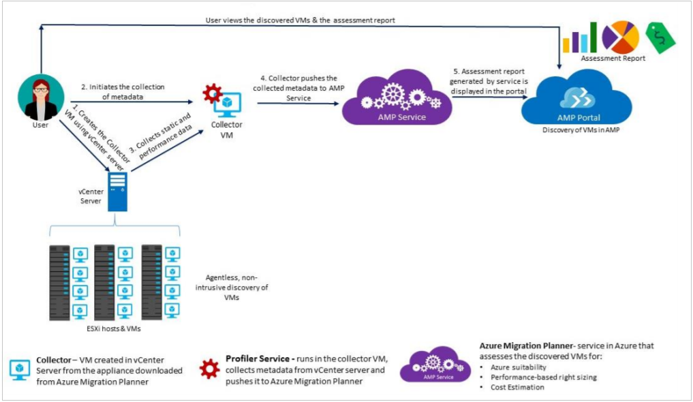

# About Azure Migration Planner

Welcome to the Azure Migration Planner! This article provides a quick overview of the service.

Post any comments or questions at the bottom of this article.

## What is Azure Migration Planner?

Azure Migration Planner is a service that makes it easy to assess on-premises workloads for
migration to Azure. The planner assesses migration suitability, performance-based sizing, and
cost estimations. If you're contemplating lift-and-shift migrations, or are in early assessment stages for migration, this service is for you.

At this time, Migration Planner supports assessment of on-premises VMware virtual machines (VMs) for migration to IaaS VMs in Azure. VMs should be managed by a vCenter server, version 5.5 or 6.0.

## Why use Migration Planner

Migration Planner helps you to assess the following:

- **Azure readiness summary**: Which of your on-premises machines are suitable for Azure.
- **Optimizations**: Recommended CPU core and memory optimizations in Azure.
- **Monthly costs**: The estimated cost for running the machines in Azure.
- **Machine list**: A list of the machines included in the assessment, and a sumary of their suitability for Azure, Azure size recommendations, and performance usage data. 

### What's included in an assessment

Migration Planner bases an assessment on a number of values, including:

**Location**: By default Migration Planner assumes the Azure location to which you want to migrate is the ocation in which you create the Migration Planner project.  
**Storage redundancy**: The type of storage that the Azure VMs will use after migration. Currently Migration Planner supports [Locally redundant storage (LRS)](../storage/common/storage-redundancy.md#locally-redundant-storage) only.
**Plans**: Migration Planner takes into account whether you're enrolled in the [Azure Hybrid Use Benefit](https://azure.microsoft.com/pricing/hybrid-use-benefit/) software assurance plan, and whether you have any Azure offers that should be applied. Only the [pay-as-you-go](https://azure.microsoft.com/offers/ms-azr-0003p/) offer is currently available.
**Pricing**: Migration Planner takes [Azure VM tier pricing](../virtual-machines/windows/sizes-general.md) into account, to meet your exact requirements. By default the [Standard](../virtual-machines/windows/sizes-general.md) tier is used. Billing is currently in US dollars only.
**Size**: Migration Planner recommends a size for Azure VMs after migration, based on on-premises machines sizes. 
**Performance and comfort**:  By default, Migration Planner uses a time span of a month for evaluating performance history for on-premises machines, with a 95% percentile value. Assessment also considers a comfort values for issues such as seasonal usage, short performance history, and likely increases in future usage. For example, normally a 10-core VM with 20% utilization will result in a 2-core VM. But if it has a comfort factor of 2.0, the result will be a 4-core VM. The default setting is 1.3.

## How does Migration Planner work?

1. You create a migration project in Azure.
2. Azure discovers information about on-premises machines using a VM called the collector appliance. You download the appliance setup file in Open Virtualization Appliance (.ova) format. You import the file to the on-premises vCenter server as a VM.
3. After you've created the collector VM, you connect to it and run the collector. 
4. For the purposes of assessment, you group on-premises VMs. For example, you can group VMs that run the same app. You can group VMs using tagging in vCenter, or you can groups VMs manually, prior to assessment, in the Azure portal. 
5. When you run an assessment, the Migration Planner connects to the collector VM using read-only vCenter credentials. This starts the profiler service, which uses VMware PowerShell CLI cmdlets to collect VM metadata from the vCenter server. Nothing is installed on ESXi hosts or VMs for metadata collection.
6. The Profiler service collects information about VMs, including cores, memory, disks and disk sizes, and network adapters. It also collects performance data for the VMs, inlcuding CPU and memory use, disk IOPS, disk throughput (MBps) and network output (MBps). Collected metadata is pushed to the Migration Planner, and can be viewed in the Azure portal.
7. You can view assessment reports in the portal, or download in Excel format. The assessment report includes information about Azure readiness, sizing, and cost estimations for running the VMs in Azure.
  

  

## Next steps 
[Get started](tutorial-assessment-vmware.md) with an assessment for your on-premises VMware VMs.
