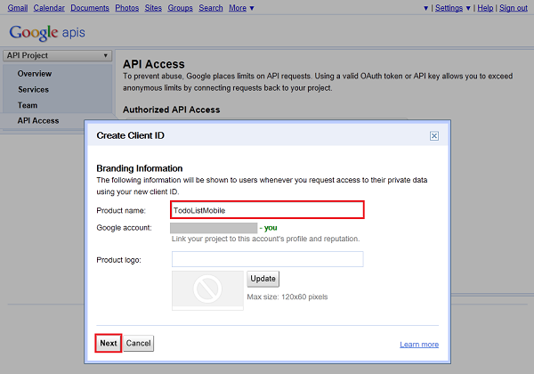
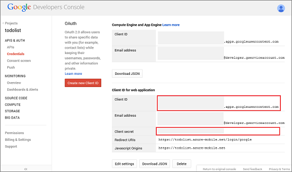

<properties 
	pageTitle="Register for Google authentication - Mobile Services" 
	description="Learn how to register your apps to use Google to authenticate with Azure Mobile Services." 
	services="mobile-services" 
	documentationCenter="android" 
	authors="ggailey777" 
	manager="dwrede" 
	editor=""/>

<tags 
	ms.service="mobile-services" 
	ms.workload="mobile" 
	ms.tgt_pltfrm="mobile-android" 
	ms.devlang="multiple" 
	ms.topic="article" 
	ms.date="06/11/2015" 
	ms.author="glenga"/>

# Register your apps for Google login with Mobile Services

[AZURE.INCLUDE [mobile-services-selector-register-identity-provider](../includes/mobile-services-selector-register-identity-provider.md)]

This topic shows you how to register your apps to be able to use Google to authenticate with Azure Mobile Services.

>[AZURE.NOTE] This tutorial is about [Azure Mobile Services](http://azure.microsoft.com/services/mobile-services/), a solution to help you build scalable mobile applications for any platform. Mobile Services makes it easy to sync data, authenticate users, and send push notifications. This page supports the [Get Started with Authentication](mobile-services-ios-get-started-users.md) tutorial, which shows how to sign in users to your app. 
 If this is your first experience with Mobile Services, please complete the tutorial [Get Started with Mobile Services](mobile-services-ios-get-started.md).

To complete the procedure in this topic, you must have a Google account that has a verified email address. To create a new Google account, go to <a href="http://go.microsoft.com/fwlink/p/?LinkId=268302" target="_blank">accounts.google.com</a>.

1. Navigate to the <a href="http://go.microsoft.com/fwlink/p/?LinkId=268303" target="_blank">Google apis</a> website, sign-in with your Google account credentials, click **Create Project**, provide a **Project name**, then click **Create**.

   	

2. Click **Consent screen**, select your **Email Address**, enter a **Product Name**, then click **Save**. 

3. Click **API & Auth** > **Credentials** > **Create new Client ID**.

   	

4. Select **Web application**, type your mobile service URL in **Authorized JavaScript Origins**, replace the generated URL in **Authorized Redirect URI** with the URL of your mobile service appended with the path `/login/google`, and then click **Create client ID**.

	>[AZURE.NOTE] For a .NET backend mobile service published to Azure by using Visual Studio, the redirect URL is the URL of your mobile service appended with the path _signin-google_ your mobile service as a .NET service, such as `https://todolist.azure-mobile.net/signin-google`. 
	&nbsp;

   	

5. Under **Client ID for web applications**, make a note of the values of **Client ID** and **Client secret**. 

   	

    >[AZURE.IMPORTANT] The client secret is an important security credential. Do not share this secret with anyone or distribute it with your app.

You are now ready to configure your mobile service to use Google sign-in for authentication in your app.

<!-- Anchors. -->

<!-- Images. -->

<!-- URLs. -->

[Google apis]: http://go.microsoft.com/fwlink/p/?LinkId=268303
[Get started with authentication]: /develop/mobile/tutorials/get-started-with-users-dotnet/

[Azure Management Portal]: https://manage.windowsazure.com/
