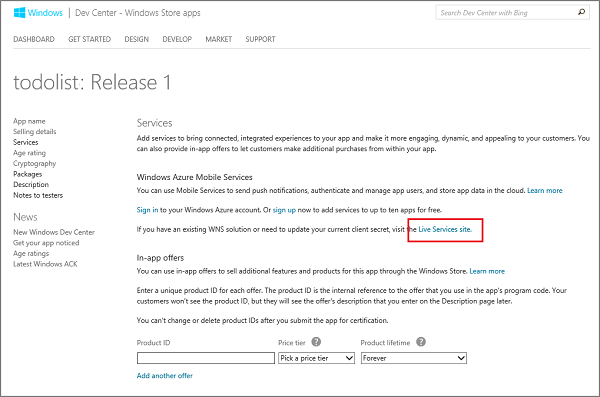
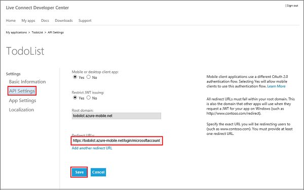
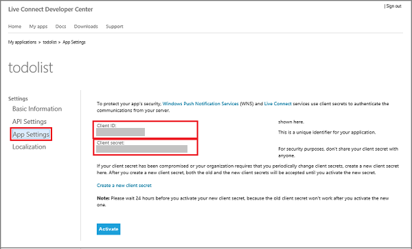

<properties 
	pageTitle="Register for Microsoft authentication - Mobile Services" 
	description="Learn how to register for Microsoft authentication in your Azure Mobile Services application." 
	authors="ggailey777" 
	services="mobile-services" 
	documentationCenter="Mobile" 
	manager="dwrede" 
	editor=""/>

<tags 
	ms.service="mobile-services" 
	ms.workload="mobile" 
	ms.tgt_pltfrm="NA" 
	ms.devlang="multiple" 
	ms.topic="article" 
	ms.date="05/07/2015" 
	ms.author="glenga"/>

# Register your app to use Microsoft account for authentication

This topic shows you how to register your mobile app to be able to use Microsoft account as an identity provider with Azure Mobile Services. The same steps apply for both service-directed authentication and client-directed authentication using the Live SDK.

##Register your Windows Store app at the Windows Dev Center

Windows Store apps must first be registered with the Windows Dev Center. 

>[AZURE.NOTE]Windows Phone 8, Windows Phone 8.1 Silverlight, and non-Windows apps can skip this section.

1. If you have not already registered your app, navigate to the [Submit an app page] at the Dev Center for Windows Store apps, log on with your Microsoft account, and then click **App name**.

   	

2. Select **Create a new app by reserving a unique name** and click **Continue**, then type a name for your app in **App name**, click **Reserve app name**, and then click **Save**.

   	

   	This creates a new Windows Store registration for your app.

3. In Visual Studio, open the project that you created when you completed the tutorial [Get started with Mobile Services].

4. In solution explorer, right-click the Windows Store app project, click **Store**, and then click **Associate App with the Store...**. 

  	

   	This displays the **Associate Your App with the Windows Store** Wizard.

5. In the wizard, click **Sign in** and then login with your Microsoft account, select the app name that you reserved in step 2, click **Next**, and then click **Associate**.

   	This adds the required Windows Store registration information to the application manifest.   

6. (Optional) For a universal Windows app, repeat steps 4 and 5 for the Windows Phone Store project. 

6. Back in the Windows Dev Center page for your new app, click **Services**. 

   	 

7. In the Services page, click **Live Services site** under **Azure Mobile Services**.

	 

This displays the Microsoft account page for your app.

## Configure your Microsoft account registration and connect to Mobile Services

The first step in this section applies only to Windows Phone 8, Windows Phone 8.1 Silverlight, and non-Windows Store apps. For these apps, you can also ignore the Package security identifier (SID), which is only available for Windows Store apps. 

1. For a non-Windows Store app, navigate to the <a href="http://go.microsoft.com/fwlink/p/?LinkId=262039" target="_blank">My Applications</a> page in the Microsoft account Developer Center, log on with your Microsoft account (if required), click **Create application**, then type an **Application name** and click **I accept**.

   	This reserves you app name with Microsoft account and displays the Microsoft account page for your app.

2. In the Microsoft account page for your app, click **API Settings**, select enable **Mobile or desktop client app**, set the mobile service URL as the **Target domain**, supply a value of `https://<mobile_service>.azure-mobile.net/login/microsoftaccount/` in **Redirect URL**, then click **Save**.

	>[AZURE.NOTE]For a .NET backend mobile service published to Azure by using Visual Studio, the redirect URL is the URL of your mobile service appended with the path _signin-microsoft_ your mobile service as a .NET service, such as <code>https://todolist.azure-mobile.net/signin-microsoft</code>. 

	

	The **Root domain** should be filled-in automatically.

4. Click **App Settings** and make a note of the values of the **Client ID**, **Client secret** and **Package SID**. 

   	

    > [AZURE.NOTE] The client secret is an important security credential. Do not share the client secret with anyone or distribute it with your app. Only Windows Store app registrations will see a Package SID field.

4. In the [Azure Management Portal], click the **Identity** tab for the mobile service, enter the client ID, client secret and package SID obtained from your identity provider, and click **Save**. 

 	
	
	>[AZURE.NOTE]You do not need to supply a Package SID value for a Windows Phone 8, Windows Phone Store 8.1 Silverlight, or a non-Windows app.
	
Both your mobile service and your app are now configured to work with Microsoft account.

<!-- Anchors. -->

<!-- Images. -->

<!-- URLs. -->

[Submit an app page]: http://go.microsoft.com/fwlink/p/?LinkID=266582
[My Applications]: http://go.microsoft.com/fwlink/p/?LinkId=262039

[Azure Management Portal]: https://manage.windowsazure.com/
