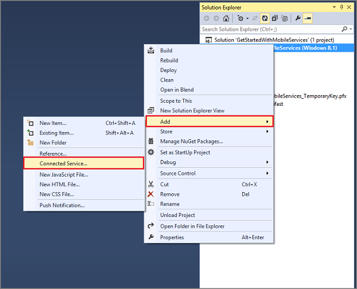

<properties 
	pageTitle="Import your publish settings file in Visual Studio 2013 | Mobile Services" 
	description="Learn how to import a subscription publish settings file for your Azure Mobile Services application in Visual Studio 2013." 
	documentationCenter="" 
	services="mobile-services" 
	manager="dwrede" 
	editor="" 
	authors="ggailey777"/>

<tags 
	ms.service="mobile-services" 
	ms.workload="mobile" 
	ms.tgt_pltfrm="na" 
	ms.devlang="multiple" 
	ms.topic="article" 
	ms.date="04/13/2015" 
	ms.author="glenga"/>

# Import your subscription publish settings file in Visual Studio 2013

Before you can create the mobile service, you must import the publish settings file from your Azure subscription into Visual Studio. This enables Visual Studio to connect to Azure on your behalf.  

>[AZURE.NOTE] Beginning with Visual Studio 2013 Update 2, you no longer need to use a publish settings file. Visual Studio is able to connect directly to Azure using the credentials that you provide.

1. In Visual Studio 2013, open Solution Explorer, right-click the project then click **Add** and then **Connected Service...**. 

	

2. In the Services Manager dialog, click **Create service...**, then select **&lt;Import...&gt;** from  **Subscription** in the Create Mobile Service dialog.  

	

3. In Import Azure Subscriptions, click **Download subscription file**, login to your Azure account (if required), click **Save** when your browser requests to save the file.

	

	> [AZURE.NOTE] The login window is displayed in the browser, which may be behind your Visual Studio window. Remember to make a note of where you saved the downloaded .publishsettings file. You can skip this step if your project is already connected to your Azure subscription.

4. Click **Browse**, navigate to the location where you saved the .publishsettings file, select the file, then click **Open** and then **Import**. 

	

	Visual Studio imports the data needed to connect to your Azure subscription. When your subscription already has one or more existing mobile services, the service names are displayed. 

	> [AZURE.NOTE] After importing the publish settings, consider deleting the downloaded .publishsettings file as it contains information that can be used by others to access your account. Secure the file if you plan to keep it for use in other connected app projects.

<!-- Anchors. -->

<!-- Images. -->
[1]: ./media/mobile-services-how-to-register-microsoft-authentication/mobile-services-live-connect-add-app.png
[2]: ./media/mobile-services-how-to-register-microsoft-authentication/mobile-live-connect-app-api-settings.png
<!-- URLs. -->
[Single sign-on for Windows Store apps by using Live Connect]: /develop/mobile/how-to-guides/register-for-single-sign-on/
[Submit an app page]: http://go.microsoft.com/fwlink/p/?LinkID=266582
[My Applications]: http://go.microsoft.com/fwlink/p/?LinkId=262039
[Get started with Mobile Services]: /develop/mobile/tutorials/get-started/
[Get started with authentication]: /develop/mobile/tutorials/get-started-with-users-dotnet/
[Get started with push notifications]: /develop/mobile/tutorials/get-started-with-push-dotnet/
[Authorize users with scripts]: /develop/mobile/tutorials/authorize-users-in-scripts-dotnet/
[JavaScript and HTML]: /develop/mobile/tutorials/get-started-with-users-js/

[Azure Management Portal]: https://manage.windowsazure.com/
