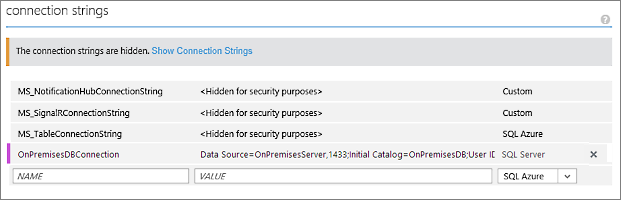

<properties
	pageTitle="Connect to an on-premises SQL Server from a .NET backend mobile service using Hybrid Connections |  Azure Mobile Services"
	description="Learn how to connect to an on-premises SQL Server from a .NET backend mobile service using Azure Hybrid Connections"
	services="mobile-services"
	documentationCenter=""
	authors="ggailey777"
	manager="dwrede"
	editor=""/>

<tags
	ms.service="mobile-services"
	ms.workload="mobile"
	ms.tgt_pltfrm="na"
	ms.devlang="multiple"
	ms.topic="article"
	ms.date="07/21/2016"
	ms.author="glenga"/>

# Connect to an on-premises SQL Server from Azure Mobile Services using Hybrid Connections

[AZURE.INCLUDE [mobile-service-note-mobile-apps](../../includes/mobile-services-note-mobile-apps.md)]
> For the equivalent Mobile Apps version of this topic, see [Access on-premises resources using hybrid connections in Azure App Service](../app-service-web/web-sites-hybrid-connection-get-started.md).

When your enterprise transitions to the cloud, you might not be able to migrate all of your assets to Azure right away. Hybrid Connections lets Azure Mobile Services securely connect to your on-premises assets. In this way, you can make your on-premises data accessible to your mobile clients by using Azure. Supported assets include any resource that runs on a static TCP port, including Microsoft SQL Server, MySQL, HTTP Web APIs, and most custom web services. Hybrid Connections use Shared Access Signature (SAS) authorization to secure the connections from your mobile service and the on-premises Hybrid Connection Manager to the hybrid connection. For more information, see [Hybrid Connections Overview](../biztalk-services/integration-hybrid-connection-overview.md).

In this tutorial, you will learn how to modify a .NET backend mobile service to use a local on-premises SQL Server database instead of the default Azure SQL Database provisioned with your service. Hybrid Connections are also supported for a JavaScript backend mobile service, as described in [this article](http://blogs.msdn.com/b/azuremobile/archive/2014/05/12/connecting-to-an-external-database-with-node-js-backend-in-azure-mobile-services.aspx).

##Prerequisites##

This tutorial requires you to have the following:

- **An existing .NET backend mobile service**  Follow the tutorial [Get started with Mobile Services] to create and download a new .NET backend mobile service from the [Azure classic portal].

[AZURE.INCLUDE [hybrid-connections-prerequisites](../../includes/hybrid-connections-prerequisites.md)]

## Install SQL Server Express, enable TCP/IP, and create a SQL Server database on-premises

[AZURE.INCLUDE [hybrid-connections-create-on-premises-database](../../includes/hybrid-connections-create-on-premises-database.md)]

## Create a Hybrid Connection

[AZURE.INCLUDE [hybrid-connections-create-new](../../includes/hybrid-connections-create-new.md)]

## Install the on-premises Hybrid Connection Manager to complete the connection

[AZURE.INCLUDE [hybrid-connections-install-connection-manager](../../includes/hybrid-connections-install-connection-manager.md)]

## Configure the mobile service project to connect to the SQL Server database

In this step, you define a connection string for the on-premises database and modify the mobile service to use this connection.

1. In Visual Studio 2013, open the project that defines your .NET backend mobile service.

	To learn how to download your .NET backend project, see [Get started with Mobile Services](mobile-services-dotnet-backend-windows-store-dotnet-get-started.md) .

2. In Solution Explorer, open the Web.config file, locate the **connectionStrings** section, add a new SqlClient entry like the following, which points to the on-premises SQL Server database:

	    <add name="OnPremisesDBConnection"
         connectionString="Data Source=OnPremisesServer,1433;
         Initial Catalog=OnPremisesDB;
         User ID=HybridConnectionLogin;
         Password=<**secure_password**>;
         MultipleActiveResultSets=True"
         providerName="System.Data.SqlClient" />

	Remember to replace `<**secure_password**>` in this string with the password you created for the *HbyridConnectionLogin*.

3. Click **Save** in Visual Studio to save the Web.config file.

	> [AZURE.NOTE]This connection setting is used when running on the local computer. When running in Azure, this setting is overriden by the connection setting defined in the portal.

4. Expand the **Models** folder and open the data model file, which ends in *Context.cs*.

6. Modify the **DbContext** instance constructor to pass the value `OnPremisesDBConnection` to the base **DbContext** constructor, similar to the following snippet:

        public class hybridService1Context : DbContext
        {
            public hybridService1Context()
                : base("OnPremisesDBConnection")
            {
            }
        }

	The service will now use the new connection to the SQL Server database.

##Test the database connection locally

Before publishing to Azure and using the hybrid connection, it's a good idea to make sure that the database connection works when running locally. That way you can more easily diagnose and correct any connection issues before you republish and start using the hybrid connection.

[AZURE.INCLUDE [mobile-services-dotnet-backend-test-local-service-api-documentation](../../includes/mobile-services-dotnet-backend-test-local-service-api-documentation.md)]

## Update Azure to use the on-premises connection string

Now that you have verified the database connection, you need to add an app setting for this new connection string so that it can be used from Azure and publish the mobile service to Azure.

1. In the [Azure classic portal], browse to your mobile service.

1. Click the **Configure** tab, and locate **Connection Strings** section.

	

2. Add an new connection **SQL Server** string named `OnPremisesDBConnection` with a value like the following:

		Server=OnPremisesServer,1433;Database=OnPremisesDB;User ID=HybridConnectionsLogin;Password=<**secure_password**>

	Replace `<**secure_password**>` with the secure password for *HybridConnectionLogin*.

2. Press **Save** to save the hybrid connection and connection string you just created.

3. Using Visual Studio, publish your updated mobile service project to Azure.

	The service start page is displayed.

4. Using either the **Try it now** button on the start page as before or using a client app connected to your mobile service, invoke some operations that generate database changes.

	>[AZURE.NOTE]When you use the **Try it now** button to launch the Help API pages, remember to supply your application key as the password (with a blank username).

4. In SQL Server Management Studio, connect to your SQL Server instance, open the Object Explorer, expand the **OnPremisesDB** database and expand **Tables**.

5. Right-click the **hybridService1.TodoItems** table and choose **Select Top 1000 Rows** to view the results.

	Note that changes generated in your app have been saved by your mobile service to your on-premises database using the hybrid connection.

##See Also##

+ [Hybrid Connections web site](https://azure.microsoft.com/services/biztalk-services/)
+ [Hybrid Connections overview](../biztalk-services/integration-hybrid-connection-overview.md)
+ [BizTalk Services: Dashboard, Monitor, Scale, Configure, and Hybrid Connection tabs](../biztalk-services/biztalk-dashboard-monitor-scale-tabs.md)
+ [How to make data model changes to a .NET backend mobile service](mobile-services-dotnet-backend-how-to-use-code-first-migrations.md)

<!-- IMAGES -->

<!-- Links -->
[Azure classic portal]: http://manage.windowsazure.com
[Get started with Mobile Services]: mobile-services-dotnet-backend-windows-store-dotnet-get-started.md
