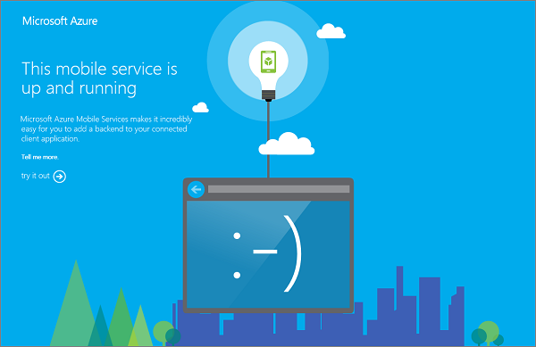

<properties
	pageTitle="Store you .NET backend project code in source control | Azure Mobile Services"
	description="Learn how to store your .NET backend project in and publish from a local Git repo on your computer."
	services="mobile-services"
	documentationCenter=""
	authors="ggailey777"
	manager="dwrede"
	editor=""/>

<tags
	ms.service="mobile-services"
	ms.workload="mobile"
	ms.tgt_pltfrm="na"
	ms.devlang="multiple"
	ms.topic="article"
	ms.date="07/21/2016"
	ms.author="glenga"/>

# Store your mobile service project code in source control

[AZURE.INCLUDE [mobile-service-note-mobile-apps](../../includes/mobile-services-note-mobile-apps.md)]

&nbsp;

> [AZURE.SELECTOR]
- [.NET backend](mobile-services-dotnet-backend-store-code-source-control.md)
- [Javascript backend](mobile-services-store-scripts-source-control.md)

This topic shows you how to use the source control provided by Azure Mobile Services to store your .NET backend service project. Your project can be published by simply uploading from your local Git repository to your production mobile service.

To complete this tutorial, you must have already created a mobile service by completing either the [Get started with Mobile Services] tutorial.

##Enable source control in your mobile service

[AZURE.INCLUDE [mobile-services-enable-source-control](../../includes/mobile-services-enable-source-control.md)]

##Install Git and create the local repository

1. Install Git on your local computer.

	The steps required to install Git vary between operating systems. See [Installing Git] for operating system specific distributions and installation guidance.

	> [AZURE.NOTE]
	> On some operating systems, both a command-line and GUI version of Git are available. The instructions provided in this article use the command-line version.

2. Open a command-line, such as **GitBash** (Windows) or **Bash** (Unix Shell). On OS X systems you can access the command-line through the **Terminal** application.

3. From the command line, change to the directory where you will store your scripts. For example, `cd SourceControl`.

4. Use the following command to create a local copy of your new Git repository, replacing `<your_git_URL>` with the URL of the Git repository for your mobile service:

		git clone <your_git_URL>

5. When prompted, type in the user name and password that you set when you enabled source control in your mobile service. After successful authentication, you will see a series of responses like this:

		remote: Counting objects: 8, done.
		remote: Compressing objects: 100% (4/4), done.
		remote: Total 8 (delta 1), reused 0 (delta 0)
		Unpacking objects: 100% (8/8), done.

6. Browse to the directory from which you ran the `git clone` command, and notice that a new directory is created with the name of the mobile service. For a .NET backend mobile service, the git repository is initial empty.

Now that you have created your local repository, you can publish your .NET backend service project from this repository.

##Publish your project by using Git

1. Create a new .NET backend mobile service project in Visual Studio 2013, or move an existing project into your new local repository.

	For a quick test, download and save the Mobile Services quickstart project to this folder.

2. Remove any NuGet package folders, leaving the packages.config file.

	Mobile Services will automatically restore your NuGet packages based on the packages.confign file. You can also define a .gitignore file to prevent the package directories from being added.

3. In the Git command prompt, type the following command to start tracking the new script file:

		$ git add .

4. Type the following command to commit changes:

		$ git commit -m "adding the .NET backend service project"

5. Type the following command to upload the changes to the remote repository, and supply your credentials:

		$ git push origin master

	You should see a series of commands that indicates that the project is deployed to Mobile Services, packages are added, and the service is restarted.

6. Browse to the URL of your .NET backend mobile service, and you should see the following:

	

Now, your mobile service project is maintained in source control, and you can publish service updates by simply pushing updates from your local repository. For information about making data model changes in a .NET backend mobile service that uses a SQL Database, see [How to make data model changes to a .NET backend mobile service].

<!-- Anchors. -->

<!-- Images. -->

<!-- URLs. -->
[Git website]: http://git-scm.com
[Source control]: http://msdn.microsoft.com/library/windowsazure/c25aaede-c1f0-4004-8b78-113708761643
[Installing Git]: http://git-scm.com/book/en/Getting-Started-Installing-Git
[Get started with Mobile Services]: mobile-services-dotnet-backend-ios-get-started.md
[How to make data model changes to a .NET backend mobile service]: mobile-services-dotnet-backend-how-to-use-code-first-migrations.md
