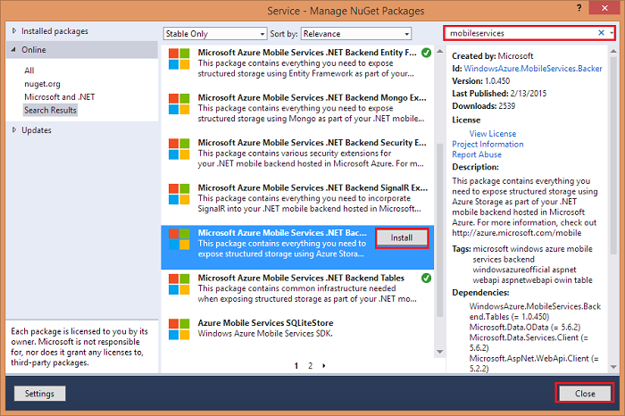
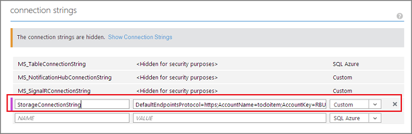

<properties
	pageTitle="Build a .NET backend mobile service that uses Table storage | Azure Mobile Services"
	description="Learn how to use Azure Table storage with your .NET backend mobile service."
	services="mobile-services"
	documentationCenter=""
	authors="ggailey777"
	manager="dwrede"
	editor=""/>

<tags
	ms.service="mobile-services"
	ms.workload="mobile"
	ms.tgt_pltfrm="na"
	ms.devlang="dotnet"
	ms.topic="article"
	ms.date="07/21/2016"
	ms.author="glenga"/>

# Build a .NET backend mobile service that uses Table storage

[AZURE.INCLUDE [mobile-service-note-mobile-apps](../../includes/mobile-services-note-mobile-apps.md)]

This topic shows you how to use a non-relational data store for your .NET backend mobile service. In this tutorial, you will modify the Azure Mobile Services quickstart project to use Azure Table storage instead of the default Azure SQL Database data store.

The tutorial requires completion of the [Get started with Mobile Services] tutorial. You will also need an Azure storage account.

##Configure Azure Table storage in your .NET backend mobile service

First, you need to configure your mobile service and .NET backend code project to connect to Azure storage.

1. In **Solution Explorer** in Visual Studio, right-click the .NET backend project, and then select **Manage NuGet Packages**.

2. In the left pane, select the **Online** category, select **Stabile Only**, search for **MobileServices**, click **Install** on the **Microsoft Azure Mobile Services .NET Backend Azure Storage Extension** package, then accept the license agreements.

  	

  	This adds support for Azure storage services to the .NET backend mobile service project.

3. If you haven't yet created your storage account, see [How To Create a Storage Account](../storage/storage-create-storage-account.md).

4. In the [Azure classic portal], click **Storage**, click the storage account, then click **Manage Keys**.

5. Make a note of the **Storage Account Name** and **Access Key**.

6. In your mobile service, click the **Configure** tab, scroll down to **Connection strings** and enter a new connection string with a **Name** of `StorageConnectionString` and a **Value** that is your storage account connection string in the following format.

		DefaultEndpointsProtocol=https;AccountName=<ACCOUNT_NAME>;AccountKey=<ACCESS_KEY>;

	

7. In the above string, replace the values of `<ACCOUNT_NAME>` and `<ACCESS_KEY>` with the values from the portal, then click **Save**.

	The storage account connection string is stored encrypted in app settings. You can access this string in any table controller at runtime.

8. In Solution Explorer in Visual Studio, open the Web.config file for the mobile service project and add the following new connection string:

		<add name="StorageConnectionString" connectionString="<STORAGE_CONNECTION_STRING>" />

9. Replace the `<STORAGE_CONNECTION_STRING>` placeholder with the connection string from step 6.

	The mobile service uses this connection string when it runs on your local computer, which lets you test the code before you publish it. When running in Azure, the mobile service instead uses the connection string value set in the portal and ignores the connection string in the project.

## Modify data types and table controllers

Because the TodoList quickstart project is designed to work with a SQL Database using Entity Framework, you need to make some updates in the project to work with Table storage.

1. Modify the **TodoItem** data type to derive from **StorageData** instead of **EntityData**, as follows.

	    public class TodoItem : StorageData
	    {
	        public string Text { get; set; }
	        public bool Complete { get; set; }
	    }

	>[AZURE.NOTE]The **StorageData** type has an Id property that requires a compound key that is a string in the format *partitionId*,*rowValue*.

2. In **TodoItemController**, add the following using statement.

		using System.Web.Http.OData.Query;
		using System.Collections.Generic;

3. Replace the **Initialize** method of the **TodoItemController** with the following.

        protected override void Initialize(HttpControllerContext controllerContext)
        {
            base.Initialize(controllerContext);

            // Create a new Azure Storage domain manager using the stored
            // connection string and the name of the table exposed by the controller.
            string connectionStringName = "StorageConnectionString";
            var tableName = controllerContext.ControllerDescriptor.ControllerName.ToLowerInvariant();
            DomainManager = new StorageDomainManager<TodoItem>(connectionStringName,
                tableName, Request, Services);
        }

	This create a new storage domain manager for the requested controller using the storage account connection string.

3. Replace the existing **GetAllTodoItems** method with the following code.

		public Task<IEnumerable<TodoItem>> GetAllTodoItems(ODataQueryOptions options)
        {
            // Call QueryAsync, passing the supplied query options.
            return DomainManager.QueryAsync(options);
        }

	Unlike a SQL Database, this version doesn't return IQueryable<TEntity>, so the result can be bound to but not futher composed in a query.

## Update the client app

You need to make one change on the client side to make the quickstart app work with the .NET backend using Table storage. This is due to the compound key expected by the table storage provider.

1. Open the client code file that contains the data access code and find the method where the insert operation performed.

2. Update the TodoItem instance being added to explicitly set the Id field in the string format `<partitionID>,<rowValue>`.

	This is an example of how this ID might be set in a C# app, where the partition part is fixed and the row part is GUID-based.

		 todoItem.Id = string.Format("partition,{0}", Guid.NewGuid());

You are now ready to test the app.

## Test the application

1. (Optional) Republish your mobile service .NET backend project.

	You can also test your mobile service locally before you publish the .NET backend project to Azure. Whether you test locally or in Azure, the mobile service will be using the Azure Table storage.

4. Run the quickstart client app connected to your mobile service.

	Note that you do not see items that you previously added using the quickstart tutorial. This is because the Table store is currently empty.

5. Add new items to generate database changes.

	The app and mobile service should behave as before, except now your data is being stored in your non-relational store instead of in the SQL Database.

##Next Steps

Now that you have seen how easy it is to use Table storage with .NET backend, consider exploring some other backend storage options:

+ [Connect to an on-premises SQL Server using Hybrid Connections](mobile-services-dotnet-backend-hybrid-connections-get-started.md) Hybrid Connections lets your mobile service securely connect to your on-premises assets. In this way, you can make your on-premises data accessible to your mobile clients by using Azure. Supported assets include any resource that runs on a static TCP port, including Microsoft SQL Server, MySQL, HTTP Web APIs, and most custom web services.

+ [Upload images to Azure Storage using Mobile Services](mobile-services-dotnet-backend-windows-universal-dotnet-upload-data-blob-storage.md) Shows you how to extend the TodoList sample project to let you upload images from your app to Azure Blob storage.

<!-- Anchors. -->
[Create a non-relational store]: #create-store
[Modify data and controllers]: #modify-service
[Test the application]: #test-application

<!-- Images. -->

<!-- URLs. -->
[Get started with Mobile Services]: mobile-services-dotnet-backend-windows-store-dotnet-get-started.md
[Azure classic portal]: https://manage.windowsazure.com/
[What is the Table Service]: ../storage-dotnet-how-to-use-tables.md#what-is
[MongoLab Add-on Page]: /gallery/store/mongolab/mongolab
