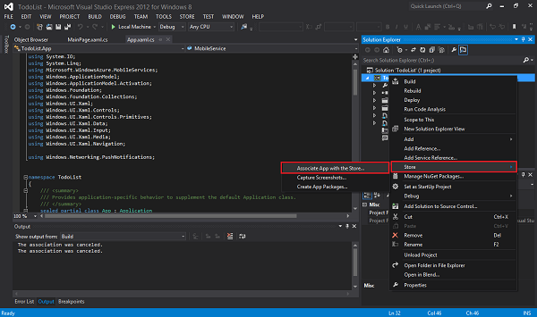
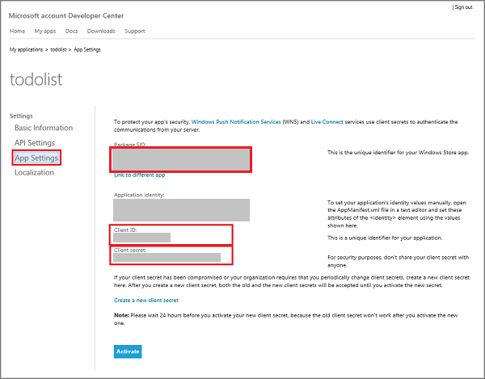

<properties
	pageTitle="Register for Microsoft authentication | Microsoft Azure"
	description="Learn how to register for Microsoft authentication in your Azure Mobile Services application."
	authors="ggailey777"
	services="mobile-services"
	documentationCenter="Mobile"
	manager="dwrede"
	editor=""/>

<tags 
	ms.service="mobile-services" 
	ms.workload="mobile" 
	ms.tgt_pltfrm="NA" 
	ms.devlang="multiple" 
	ms.topic="article" 
	ms.date="07/21/2016" 
	ms.author="glenga"/>

# Register your app to use Microsoft account for authentication

[AZURE.INCLUDE [mobile-service-note-mobile-apps](../../includes/mobile-services-note-mobile-apps.md)]

&nbsp;

[AZURE.INCLUDE [mobile-services-selector-register-identity-provider](../../includes/mobile-services-selector-register-identity-provider.md)]

## Overview

This topic shows you how to register your mobile app to be able to use Microsoft account as an identity provider with Azure Mobile Services. The same steps apply for both service-directed authentication and client-directed authentication using the Live SDK.

##Register your Windows Store app at the Windows Dev Center

Windows Store apps must first be registered with the Windows Dev Center. By registering, your Windows app will be able to use single sign-on behaviors.

>[AZURE.NOTE]Windows Phone 8, Windows Phone 8.1 Silverlight, and non-Windows apps can skip this section.

1. If you have not already registered your app, navigate to the [Windows Dev Center](https://dev.windows.com/dashboard/Application/New), log on with your Microsoft account, type a name for your app, then click **Reserve app name**.

3. Open your Windows app project in Visual Studio, then in Solution Explorer right-click the Windows Store app project, click **Store** > **Associate App with the Store...**.

  	

5. In the wizard, click **Sign in** and sign-in with your Microsoft account, select the app name you reserved, then click **Next** > **Associate**.

6. (Optional) For a universal Windows 8.1 app, repeat steps 4 and 5 for the Windows Phone Store project.

6. Back in the Windows Dev Center page for your new app, click **Services** > **Push notifications**.

7. In the **Push notifications** page, click **Live Services site** under **Windows Push Notification Services (WNS) and Microsoft Azure Mobile Services**.
 
	This displays the Microsoft account app settings page for your app. 

8. Make a note of the **Package SID** value. You can save this SID in the Azure portal to both enable single sign-on and push notifications for your Windows app.

Next, you will configure Microsoft account authentication for your Windows app, starting with step 4 in the next section.

## Configure your Microsoft account registration and connect to Mobile Services

If you have already registered your Windows app in the previous section, you can skip to step 2. 

1. For a non-Windows Store app, navigate to the [My Applications](http://go.microsoft.com/fwlink/p/?LinkId=262039) page in the Microsoft account Developer Center, log on with your Microsoft account (if required), click **Create application**, type an **Application name**, then click **I accept**.

   	This reserves you app name with Microsoft account and displays the Microsoft account page for your app.

2. In the Microsoft account page for your app, click **API Settings**, enable **Mobile or desktop client app**, set the mobile service URL as the **Target domain**, then supply one of the following URL formats in **Redirect URL** and click **Save**:

	+ **.NET backend**: `https://<mobile_service>.azure-mobile.net/signin-microsoft`
	+ **JavaScript backend**: `https://<mobile_service>.azure-mobile.net/login/microsoftaccount`

	 >[AZURE.NOTE]Make sure that you use the correct redirect URL path format for your type of Mobile Services backend. When this is incorrect, authentication will not succeed. The **Root domain** should fill in automatically.
&nbsp;

    

4. Click **App Settings** and make a note of the values of the **Client ID**, **Client secret** and **Package SID**.

   	

    > [AZURE.NOTE] The client secret is an important security credential. Do not share the client secret with anyone or distribute it with your app. Only Windows Store app registrations will see a Package SID field.

4. In the [Azure classic portal], click the **Identity** tab for the mobile service, enter the client ID, client secret and package SID obtained from your identity provider, then click **Save**.

	>[AZURE.NOTE]You do not need to supply a Package SID value for a Windows Phone 8, Windows Phone Store 8.1 Silverlight, or a non-Windows app.

Both your mobile service and your app are now configured to work with Microsoft account.

<!-- Anchors. -->

<!-- Images. -->

<!-- URLs. -->

[Submit an app page]: http://go.microsoft.com/fwlink/p/?LinkID=266582
[My Applications]: http://go.microsoft.com/fwlink/p/?LinkId=262039

[Azure classic portal]: https://manage.windowsazure.com/
