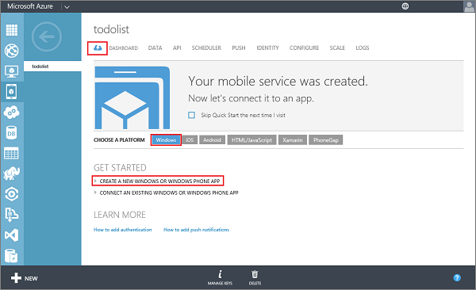

<properties
	pageTitle="Get Started with Mobile Services for Windows Store JavaScript apps | Azure Mobile Services"
	description="Follow this tutorial to get started using Azure Mobile Services for Windows Store development in JavaScript."
	services="mobile-services"
	documentationCenter="windows"
	authors="ggailey777"
	manager="dwrede"
	editor=""/>

<tags
	ms.service="mobile-services"
	ms.workload="mobile"
	ms.tgt_pltfrm="mobile-windows-store"
	ms.devlang="javascript"
	ms.topic="article"
	ms.date="09/16/2015"
	ms.author="glenga"/>

# Get started with Mobile Services

[AZURE.INCLUDE [mobile-services-selector-get-started](../../includes/mobile-services-selector-get-started.md)]

This tutorial shows you how to add a cloud-based backend service to a Windows Store JavaScript app using Azure Mobile Services.

In this tutorial, you will create both a new mobile service and a simple *To do list* app that stores app data in the new mobile service. The mobile service that you will create uses JavaScript for server-side business logic. To create a mobile service that lets you write your server-side business logic in the supported .NET languages using Visual Studio, see the [.NET backend version of this topic](mobile-services-dotnet-backend-windows-store-dotnet-get-started.md).

To complete this tutorial, you need the following:

* An active Azure account. If you don't have an account, you can create a free trial account in just a couple of minutes. For details, see [Azure Free Trial](http://azure.microsoft.com/pricing/free-trial/?WT.mc_id=A0E0E5C02&amp;returnurl=http%3A%2F%2Fazure.microsoft.com%2Fdocumentation%2Farticles%2Fmobile-services-javascript-backend-windows-store-javascript-get-started%2F).
* [Visual Studio 2013 Express for Windows]

## Create a new mobile service

[AZURE.INCLUDE [mobile-services-create-new-service](../../includes/mobile-services-create-new-service.md)]

## Create a new Windows Store app

Once you have created your mobile service, you can follow an easy quickstart in the Management Portal to create a new Windows Store 8.1 JavaScript app that connects to your mobile service.

1.  In the Management Portal, click **Mobile Services**, and then click the mobile service that you just created.

2. In the quickstart tab, click **Windows** under **Choose platform** and expand **Create a new Windows Store app**.

   	

3. If you haven't already done so, download and install [Visual Studio 2013][Visual Studio 2013 Express for Windows] on your local computer or virtual machine.

4. Click **Create TodoItem table** to create a table to store app data.

5. Under **Download and run your app**, select a language for your app, then click **Download**.

  	This downloads the project for the sample *To do list* application that is connected to your mobile service. Save the compressed project file to your local computer, and make a note of where you save it.

## Run your Windows app

The final stage of this tutorial is to build and run your new app.

1. Browse to the location where you saved the compressed project files, expand the files on your computer, and open the solution file in Visual Studio.

2. Press the **F5** key to rebuild the project and start the app.

3. In the app, type meaningful text, such as *Complete the tutorial*, in **Insert a TodoItem**, and then click **Save**.

   	This sends a POST request to the new mobile service hosted in Azure. Data from the request is inserted into the TodoItem table. Items stored in the table are returned by the mobile service, and the data is displayed in the second column in the app.

4. (Optional) Run the app again, and notice that data saved from the previous step is loaded from the mobile service after the app starts.
 
4. Back in the Management Portal, click the **Data** tab and then click the **TodoItems** table.

   	This lets you browse the data inserted by the app into the table.

>[AZURE.NOTE] You can review the code that accesses your mobile service to query and insert data, which is found in the default.js file.

<!-- Anchors. -->
[Getting started with Mobile Services]:#getting-started
[Create a new mobile service]:#create-new-service
[Define the mobile service instance]:#define-mobile-service-instance
[Next Steps]:#next-steps

<!-- Images. -->

<!-- URLs. -->
[Get started with data]: ../mobile-services-javascript-backend-windows-universal-javascript-get-started-data.md
[Visual Studio 2013 Express for Windows]: http://go.microsoft.com/fwlink/?LinkId=257546
[Mobile Services SDK]: http://go.microsoft.com/fwlink/?LinkId=257545
[Management Portal]: https://manage.windowsazure.com/
