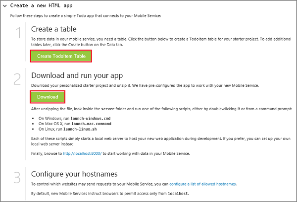
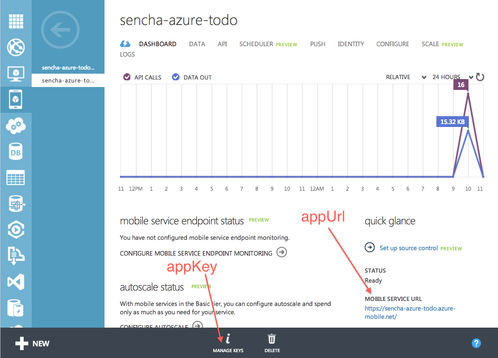

<properties
	pageTitle="Get Started with Azure Mobile Services and Sencha"
	description="Follow this tutorial to get started developing with Mobile Services and the Sencha HTML5 mobile app framework."
	services="mobile-services"
	documentationCenter=""
	authors="ggailey777"
	manager="dwrede"
	editor=""/>

<tags
	ms.service="mobile-services"
	ms.workload="mobile"
	ms.tgt_pltfrm="mobile-sencha"
	ms.devlang="multiple"
	ms.topic="get-started-article"
	ms.date="07/21/2016"
	ms.author="glenga"/>

# Get started with Mobile Services and Sencha Touch

[AZURE.INCLUDE [mobile-service-note-mobile-apps](../../includes/mobile-services-note-mobile-apps.md)]

&nbsp;

[AZURE.INCLUDE [mobile-services-selector-get-started](../../includes/mobile-services-selector-get-started.md)]
&nbsp;

[AZURE.INCLUDE [mobile-services-hero-slug](../../includes/mobile-services-hero-slug.md)]

##Overview

This tutorial shows you how to leverage Azure Mobile Services in your Sencha Touch application. You will create a simple *To Do List* app using Sencha Touch that utilizes a mobile service you define through the Azure classic portal. This tutorial is intended for intermediate to advanced web application developers who have a good understanding of JavaScript and who are familiar with the Sencha Touch framework.

If you prefer to watch a video, this clip follows the same steps as this tutorial. In the video, Arthur Kay  explains how to build a Sencha Touch application using an Azure Mobile Services backend.

> [AZURE.VIDEO getting-started-with-sencha-touch]

A screenshot from the completed app is shown below:

![][0]

##Requirements

- Download and install [Sencha Touch](http://wwww.sencha.com/products/touch/download" target="_blank").

- Download and install [Sencha Cmd Tool](http://www.sencha.com/products/sencha-cmd/download" target="_blank").

- Java Runtime Environment (JRE), or Java Development Kit (if you are creating Android apps)
- Ruby and SASS gem.

## Create a new mobile service

[AZURE.INCLUDE [mobile-services-create-new-service](../../includes/mobile-services-create-new-service.md)]

##Create a TodoItems Table

Once you have created your mobile service, you can follow an easy quickstart in the Azure classic portal to create
a new database table for use in your mobile service.

1. In the [Azure classic portal], click **Mobile Services**, and then click the mobile service that you just created.

2. In the quickstart tab, click **HTML** under **Choose platform** and expand **Create a new HTML app**.

    

    This displays the three easy steps to create and host an HTML app connected to your mobile service.

    

3. Click **Create TodoItems table** to create a table to store app data.

	> [AZURE.NOTE] Do NOT download the HTML app from the Azure classic portal. Instead, we will manually create a Sencha Touch application in the section below.

1. Take note of the **appKey** and **appUrl** in the Azure classic portal. You will use them in other sections of this tutorial.

    

1. In the **Configure** tab, verify that `localhost` is already listed in the **Allow requests from host names** list under **Cross-Origin Resource Sharing (CORS)**. If it's not, type `localhost` in the **Host name** field and then click **Save**.

    

##Generate your Touch application

Generating a Sencha Touch template application is a simple task using Sencha Cmd and is a great way to get an application up and running very quickly.

From the directory where you installed the Touch framework, issue the following command:

	$ sencha generate app Basic /path/to/application

This generates a template Touch application with an application name of 'Basic'. To launch your application, simply point your browser to the directory /path/to/application and you should be presented with the standard Touch sample application.

##Installing the Sencha Touch Extensions for Azure

The extension for Azure is installed either manually or as a Sencha Package. The method you use is totally up to you.

###Manual installation

In most Touch applications, if you wish to add an external library of classes, you simply download the package, unpack it in your application directory and configure the Touch loader with the location of the library.

You can manually add the Azure extensions to your application using the following steps:

1. Download the Azure extensions package from [here](https://market.sencha.com/extensions/sencha-extensions-for-microsoft-azure). (You may use your Sencha Forums ID to access this area.)

2. Copy the Azure extensions package from the download directory to where you would ultimately want it to reside and unpack it :

        $ cd /path/to/application
	    $ mv /download-location/azure.zip .
    	$ unzip azure.zip

    This creates an **azure** directory containing the entire package source, examples and documentation. The source will reside in the **azure/src** directory.

###Installation as a Sencha package

> [AZURE.NOTE] You can only use this method when you have generated your application using the <code>sencha generate app</code> command.

All applications generated by Sencha Cmd have a "packages" folder at the root. The location of this folder can be configured, but regardless of its location, the role of the "packages" folder is to serve as the storage of all packages used by your application (or applications if you have created a Sencha Workspace).

As Ext.Azure is a Sencha Cmd "package", the source code can be easily installed and included in your application using Sencha Cmd. (See [Sencha Cmd Packages](http://docs.sencha.com/cmd/6.x/cmd_packages/cmd_packages.html) for more information).

To download and install the Azure extensions package from the Sencha Packages repository, you will need to add the package name to your **app.json** file and build your application:

1. Add the Azure package to the requires section of your app.json file:

	    {
            "name": "Basic",
	        "requires": [
    	        "touch-azure"
        	]
    	}

2. Rebuild your application using **sencha cmd** to fetch and install the package:

	    $ sencha app build

Both **sencha app build** and **sencha app refresh** will both now perform the steps needed to integrate the package in to your application. Typically, after changing package requirements, you will need to run **sencha app refresh** so that the metadata required to support "dev mode" is up to date.

Whichever command you run, Sencha Cmd will download and expand the package to your "packages" folder. After this you will find a "packages/touch-azure" folder in your workspace.

##Include and configure Azure

**Filename**: app.js

Now that the Azure extension has been downloaded and installed in your application directory, the next step is to tell your application where to find the source files, and to require those files:

1. Configure the Sencha Loader with the location of the source code:

        Ext.Loader.setConfig({
       	    enabled : true,
           	paths   : {
               	'Ext'       : 'touch/src',
               	'Ext.azure' : '/path-to/azure-for-touch/azure/src'
            }
        });

2. Require the Azure class files:

		Ext.application({

			requires: [ 'Ext.azure.Azure' ],

			// ...

		});

3. Configuring Azure

	The Azure package is initialized by calling the **Ext.Azure.init** method in the launch section of your application. This method is passed a configuration object containing mobile service credentials as well as other credentials and features you wish to utilize.

	While you can pass the configuration object directly to the init method, we suggest creating a Sencha application configuration property called **azure** and placing all the appropriate information there. You can then pass this property value to the Ext.Azure.init method.

	When you create a mobile service in Azure (see [Getting Started with Azure](http://senchaazuredocs.azurewebsites.net/#!/guide/getting_started)), an application key and URL are assigned to that service. This information must be provided to your Azure package so it can connect to your service.

	This example shows a very simple Azure configuration and initialization supplying only the application key and URL:

	    Ext.application({
    	    name: 'Basic',

        	requires: [ 'Ext.azure.Azure' ],

	        azure: {
    	        appKey: 'myazureservice-access-key',
        	    appUrl: 'myazure-service.azure-mobile.net'
	        },

    	    launch: function() {

        	    // Call Azure initialization

            	Ext.Azure.init(this.config.azure);

 	       }
    	});

	For more information on the Azure configuration options, please consult the Ext.Azure API documentation.

Congratulations! Your application should now have access to your mobile service.

##Build the ToDo app

Now that we have configured your application to include the Azure extension, and provided it with your mobile service credentials, we can move on to creating a Touch application which utilizes your mobile service for viewing and editing your ToDo list data stored in the service.

###Configure the Azure data proxy

**Filename:** app/model/TodoItem.js

Your Touch application will be communicating with your mobile service via a data proxy. The proxy does all the work of both sending requests to, and receiving data from, the mobile service. Used in combination with a Touch data model and store, all the hard work of processing remote data and getting it into your application is removed and handled by Touch itself.

Sencha Touch models provide the definition of the data records you will be using in your application. They allow you to not only define the data fields but also provide configuration about the proxy that will be handling the communication between the application and the Azure mobile service.

In the code below you can see that we define the fields (and their types) for the model, and also provide a proxy configuration. When configuring your proxy, you need to give it a type (in this case 'azure'), the mobile service tablename (ToDoItem) and other optional parameters. In this example, we will be turning on proxy paging so that we can seamlessly page forward and backward through list items.

The Azure proxy will automatically set all HTTP headers with the appropriate CRUD operations expected by the Azure API (including authentication credentials, if they exist).

	Ext.define('Basic.model.TodoItem', {
    	extend : 'Ext.data.Model',

	    requires : [
    	    'Ext.azure.Proxy'
    	],

	    config : {
    	    idProperty : 'id',
        	useCache   : false,

	        fields     : [
    	        {
        	        name : 'id',
            	    type : 'int'
            	},
            	{
                	name : 'text',
                	type : 'string'
            	},
            	{
	                name : 'complete',
    	            type : 'boolean'
        	    }
	        ],

	        proxy : {
    	        type               : 'azure',
        	    tableName          : 'TodoItem',
            	enablePagingParams : true
        	}
    	}
	});

###Store your ToDo items

**Filename**: app/store/TodoItems.js

Sencha Touch stores are used to store collections of data records (models) which can be used as sources for Touch components for displaying the records in a variety of different ways. This can include Grids, Charts, Lists and more.

Here we define a store which will be used to hold all your store ToDo list items which are retrieved from your Azure mobile service. Notice that the store configuration contains the name of the model type (Basic.model.TodoItem - defined above). This defines the structure of the records which will be contained in the store.

We also have some additional configuration options for the store such as specifying the page size (8 records), and that the sorting of records for this store is done remotely by the Azure mobile service (no sorting is done locally within the store itself).

	Ext.define('Basic.store.TodoItems', {
    	extend : 'Ext.data.Store',

	    requires : [
    	    'Basic.model.TodoItem'
	    ],

	    config : {
    	    model        : 'Basic.model.TodoItem',
        	pageSize     : 8,
	        remoteSort   : true,
    	    remoteFilter : true
    	}
	});

###View and edit your ToDo items

**Filename**: app/view/DataItem.js

Now that we have defined the structure of each ToDo item, and created a store to place all the records in, we should think about how we wish to display this information to the user of the app. We normally display information to the user through the use of **Views**. A view can be one of any number of Touch components, individually or combined with others.

The view below is comprised of a ListItem which defines how each record will be displayed along with some buttons which will accommodate actions to delete each item.

	Ext.define('Basic.view.DataItem', {
    	extend : 'Ext.dataview.component.ListItem',
    	xtype  : 'basic-dataitem',

	    requires : [
    	    'Ext.Button',
        	'Ext.layout.HBox',
        	'Ext.field.Checkbox'
    	],

	    config : {
    	    checkbox : {
        	    docked     : 'left',
            	xtype      : 'checkboxfield',
            	width      : 50,
            	labelWidth : 0
        	},

	        text : {
    	        flex : 1
        	},

	        button : {
    	        docked   : 'right',
        	    xtype    : 'button',
            	ui       : 'plain',
	            iconMask : true,
    	        iconCls  : 'delete',
        	    style    : 'color: red;'
        	},

	        dataMap : {
    	        getText : {
        	        setHtml : 'text'
            	},

	            getCheckbox : {
    	            setChecked : 'complete'
        	    }
        	},

	        layout : {
    	        type : 'hbox',
        	    align: 'stretch'
        	}
    	},

	    applyCheckbox : function(config) {
    	    return Ext.factory(config, Ext.field.Checkbox, this.getCheckbox());
    	},

	    updateCheckbox : function (cmp) {
    	    if (cmp) {
        	    this.add(cmp);
        	}
    	},

	    applyButton : function(config) {
    	    return Ext.factory(config, Ext.Button, this.getButton());
    	},

	    updateButton : function (cmp) {
    	    if (cmp) {
        	    this.add(cmp);
        	}
    	}

	});

###Create your primary view

**Filename**: app/view/Main.js

Now that we have defined the layout of an individual ToDo list item (above) we want to wrap a full user interface around that list which defines the actual list of items, an application title, and a button to add a new task.

	Ext.define('Basic.view.Main', {
    	extend : 'Ext.dataview.List',
    	xtype  : 'main',

	    requires : [
    	    'Ext.TitleBar',
        	'Ext.dataview.List',
        	'Ext.data.Store',
        	'Ext.plugin.PullRefresh',
        	'Ext.plugin.ListPaging',
        	'Basic.view.DataItem'
    	],

	    config : {
    	    store : 'TodoItems',

        	useSimpleItems : false,
        	defaultType    : 'basic-dataitem',

	        plugins : [
    	        {
        	        xclass          : 'Ext.plugin.PullRefresh',
            	    pullRefreshText : 'Pull down to refresh!'
            	},
            	{
                	xclass     : 'Ext.plugin.ListPaging',
                	autoPaging : true
            	}
        	],

	        scrollable : {
    	        direction     : 'vertical',
        	    directionLock : true
        	},

	        items : [
    	        {
        	        docked : 'top',
            	    xtype  : 'titlebar',
                	title  : 'Azure Mobile - Basic Data Example'
            	},
            	{
                	xtype  : 'toolbar',
                	docked : 'bottom',
                	items  : [
                    	{
                        	xtype       : 'textfield',
                        	placeHolder : 'Enter new task',
                        	flex        : 1
                    	},
                    	{
                        	xtype  : 'button',
                        	action : 'add',
                        	text   : 'Add'
                    	}
                	]
            	}
        	]
    	}
	});

###Make everything work together

**Filename**: app/controller/Main.js

The final step in our application is to respond to button presses (delete, save, etc) and provide the logic behind all these requests. Sencha Touch utilizes controllers which listen for these events and responds accordingly.

	Ext.define('Basic.controller.Main', {
    	extend : 'Ext.app.Controller',

	    config : {
    	    refs : {
        	    todoField : 'main toolbar textfield',
            	main      : 'main'
        	},

	        control : {
    	        'button[action=add]'    : {
        	        tap : 'onAddItem'
            	},
            	'button[action=reload]' : {
                	tap : 'onReload'
            	},

	            main : {
    	            activate      : 'loadInitialData',
        	        itemdoubletap : 'onItemEdit'
            	},

	            'basic-dataitem checkboxfield' : {
    	            change : 'onItemCompleteTap'
        	    },

            	'basic-dataitem button' : {
                	tap : 'onItemDeleteTap'
            	}
        	}
    	},

	    loadInitialData : function () {
    	    Ext.getStore('TodoItems').load();
    	},

	    onItemDeleteTap : function (button, e, eOpts) {
    	    var store    = Ext.getStore('TodoItems'),
        	    dataItem = button.up('dataitem'),
            	rec      = dataItem.getRecord();

	        rec.erase({
    	        success: function (rec, operation) {
        	        store.remove(rec);
            	},
            	failure: function (rec, operation) {
                	Ext.Msg.alert(
                    	'Error',
                    	Ext.util.Format.format('There was an error deleting this task.  	Status Code: {0} Status Text: {1}',
                    	operation.error.status,
                    	operation.error.statusText)
                	);
            	}
        	});
    	},

	    onItemCompleteTap : function (checkbox, newVal, oldVal, eOpts) {
    	    var dataItem = checkbox.up('dataitem'),
        	    rec      = dataItem.getRecord(),
            	recVal   = rec.get('complete');

	        // this check is needed to prevent an issue where multiple creates get triggered from one create
        	if (newVal !== recVal) {
            	rec.set('complete', newVal);
            	rec.save({
                	success: function (rec, operation) {
                    	rec.commit();
                	},
                	failure: function (rec, operation) {
                    	// since there was a failure doing the update on the server then silently reject the change
	                    rec.reject(true);
    	                Ext.Msg.alert(
        	                'Error',
            	            Ext.util.Format.format('There was an error updating this task.  Status Code: {0} Status Text: {1}',
            	            operation.error.status,
            	            operation.error.statusText)
	                    );
    	            }
        	    });
        	}
    	},

	    onItemEdit : function (list, index, target, record, e, eOpts) {
    	    var rec = list.getSelection()[0];

        	Ext.Msg.prompt('Edit', 'Rename task',
            	function (buttonId, value) {
                	if (buttonId === 'ok') {
                    	rec.set('text', value);
                    	rec.save({
                        	success: function (rec, operation) {
                            	rec.commit();
                        	},
                        	failure: function (rec, operation) {
                            	// since there was a failure doing the update on the server then reject the change
                            	rec.reject();
                            	Ext.Msg.alert(
                                	'Error',
                                	Ext.util.Format.format('There was an error updating this task.  Status Code: {0} Status Text: {1}',
                                	operation.error.status,
                                	operation.error.statusText)
                            	);
                        	}
                    	});
                	}
            	},
            	null,
            	false,
            	record.get('text')
        	);
    	},

	    onReload : function () {
    	    Ext.getStore('TodoItems').load();
    	},

	    onAddItem : function () {
    	    var me = this,
        	    rec,
            	store = Ext.getStore('TodoItems'),
            	field = me.getTodoField(),
            	value = field.getValue();

	        if (value === '') {
    	        Ext.Msg.alert('Error', 'Please enter Task name', Ext.emptyFn);
        	}
        	else {
            	rec = Ext.create('Basic.model.TodoItem', {
                	complete : false,
                	text     : value
            	});
            	//store.insert(0, rec); //insert at the top
            	//store.sync();
            	rec.save({
                	success: function (rec, operation) {
                    	store.insert(0, rec); //insert at the top
                    	field.setValue('');
                	},
                	failure: function (rec, operation) {
                    	Ext.Msg.alert(
                        	'Error',
                        	Ext.util.Format.format('There was an error creating this task.  Status Code: {0} Status Text: {1}',
                        	operation.error.status,
                        	operation.error.statusText)
                    	);
                	}
            	});
        	}
    	}
	});

###Put it all together

**Filename**: app.js

Our final step is to finish editing the main application file, and provide information about the models, stores, views and controllers that have defined. The source files for these resources are automatically loaded into the application. Finally, the launch method is called which creates and displays the primary application view 'Basic.main.View'.

	Ext.Loader.setConfig({
    	enabled : true,
    	paths   : {
        	'Ext'       : 'touch/src',
        	'Ext.azure' : 'packages/azure/src'
    	}
	});

	Ext.application({
    	name : 'Basic',

	    requires : [
    	    'Ext.MessageBox',
        	'Ext.azure.Azure'
    	],

	    views : [
    	    'Main'
    	],

	    controllers : [
    	    'Main'
    	],

	    stores : [
    	    'TodoItems'
    	],

	    azure : {
    	    appUrl : 'YOUR_APP_URL.azure-mobile.net',
        	appKey : 'YOUR_APP_KEY'
    	},

	    icon : {
    	    '57'  : 'resources/icons/Icon.png',
        	'72'  : 'resources/icons/Icon~ipad.png',
        	'114' : 'resources/icons/Icon@2x.png',
        	'144' : 'resources/icons/Icon~ipad@2x.png'
    	},

	    isIconPrecomposed : true,

	    startupImage : {
    	    '320x460'   : 'resources/startup/320x460.jpg',
        	'640x920'   : 'resources/startup/640x920.png',
        	'768x1004'  : 'resources/startup/768x1004.png',
        	'748x1024'  : 'resources/startup/748x1024.png',
        	'1536x2008' : 'resources/startup/1536x2008.png',
        	'1496x2048' : 'resources/startup/1496x2048.png'
    	},

	    launch : function () {
    	    // Destroy the #appLoadingIndicator element
        	Ext.fly('appLoadingIndicator').destroy();

	        // Initialize Azure
    	    Ext.Azure.init(this.config.azure);

	        // Initialize the main view
    	    Ext.Viewport.add(Ext.create('Basic.view.Main'));
	    },

	    onUpdated : function () {
    	    Ext.Msg.confirm(
        	    "Application Update",
            	"This application has just successfully been updated to the latest version. Reload now?",
	            function (buttonId) {
    	            if (buttonId === 'yes') {
        	            window.location.reload();
            	    }
            	}
        	);
   		}
	});

###Host and run your Sencha Touch app

The final stage of this tutorial is to host and run your new app on your local computer.

  1. In your terminal, browse to the location of your unzipped application.

  2. Using Sencha Cmd, run the following commands:

    * *sencha app refresh* : This will instruct Sencha Cmd to locate all app dependencies,
      and download any needed packages (for example, [Sencha Touch Extensions for Azure](https://market.sencha.com/extensions/sencha-extensions-for-microsoft-azure)).

    * *sencha web start* : This will start a local web server to test our application.

    

  3. Open the URL listed in your terminal in a web browser to start the app (e.g. http://localhost:1841).

  4. In the app, type meaningful text, such as "Complete the tutorial", and then click **Add**.

    

    This sends a POST request to the new mobile service hosted in Azure. Data from the request is inserted into the TodoItem table.

  5. Back in the [Azure classic portal], click the **Data** tab and then click the TodoItems table.

    

    This lets you browse the data inserted by the app into the table.

    

##Next Steps
Now that you have completed the Getting Started Guide, learn how to perform additional important tasks in Mobile Services with Sencha.

[Download](https://github.com/arthurakay/sencha-touch-azure-example) a completed sample app with additional styling and features to see what else Sencha Touch can do!

Then, dive into more information about the Sencha Touch Extensions for Azure:

  * Sample app [walkthrough](http://docs.sencha.com/touch-azure/1.0.0/#!/guide/data_filters)
  * Get help in the [Sencha Forums](http://www.sencha.com/forum)
  * Browse the [Sencha Documentation](http://docs.sencha.com/)
  * Using Sencha With Azure Mobile Services: [(Video)](http://channel9.msdn.com/Shows/Cloud+Cover/Episode-126-Using-Sencha-With-Windows-Azure-Mobile-Services)

##Additional Resources

  * [Download Sencha Touch](http://pages.sencha.com/touch-for-azure.html)
  * [Sencha Touch Extensions for Azure](https://market.sencha.com/extensions/sencha-extensions-for-microsoft-azure)

##Summary

The example outlined here is provided in the Sencha Touch Extension for Azure package and is located in the examples directory as the Basic Data example. There are a few more examples which are provided which demonstrated other functionality of this extension along with detailed comments and explanations.

For more information about getting started with Sencha Touch please visit the full set of [guides](http://docs.sencha.com/touch/#!/guide)

[AZURE.INCLUDE [app-service-disqus-feedback-slug](../../includes/app-service-disqus-feedback-slug.md)]

<!-- images -->
[0]: ./media/partner-sencha-mobile-services-get-started/finished-app.png

[Azure classic portal]: https://manage.windowsazure.com/