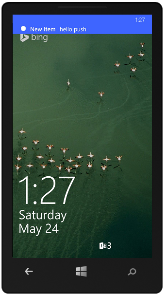

 <properties
	pageTitle="Add push notifications to your Mobile Services app (Xamarin.Forms) - Mobile Services"
	description="Learn how to use push notifications in Xamarin.Forms apps with Azure Mobile Services."
	documentationCenter="xamarin"
	authors="wesmc7777"
	manager="dwrede"
	services="mobile-services"
	editor=""/>

<tags
	ms.service="mobile-services"
	ms.devlang="dotnet"
	ms.topic="article"
	ms.tgt_pltfrm="mobile-xamarin"
	ms.workload="mobile"
	ms.date="06/10/2015"
	ms.author="normesta"/>

# Add push notifications to your Xamarin.Forms app
[AZURE.INCLUDE [mobile-services-selector-get-started-push](../../includes/mobile-services-selector-get-started-push.md)]

##Overview

This tutorial shows you how to use Azure Mobile Services to send push notifications to the iOS, Android, and Windows Phone app of your Xamarin.Forms solution. Start by creating a mobile service. Then, you'll download a starter sample, register with the appropriate push notification services, and add code to the solution to receive notifications from those services. 

When you complete this tutorial, your mobile service will send a push notification each time a user adds a task in one of the apps. You can find the completed sample here: [Completed Xamarin.Forms Azure Push Notification Sample].

This tutorial requires the following:

+ An iOS 8 device (you cannot test push notifications in the iOS Simulator)
+ iOS Developer Program membership
+ [Xamarin.iOS Studio]
+ [Azure Mobile Services Component]
+ An active Google account
+ [Google Cloud Messaging Client Component]. You will add this component during the tutorial.

In this topic:

1. [Create a New Mobile Service](#create-service)
2. [Download and Configure the Starter Sample](#download-starter-sample)
4. [Add push notifications to your Xamarin.Forms.iOS app](#iOS)
5. [Add push notifications to your Xamarin.Forms.Android app](#Android)
6. [Add push notifications to your Xamarin.Forms.Windows app](#Windows)
7. [Update Azure table insert script to send push notifications to all apps](#all-apps)

## Create a New Mobile Service

[AZURE.INCLUDE [mobile-services-create-new-service-data](../../includes/mobile-services-create-new-service-data.md)]

To be able to store app data in the new mobile service, you must first create a new table.  

1. In the Management Portal, click **Mobile Services**, and then click the mobile service that you just created.

2. Click the **Data** tab, then click **+Create**.

    ![][123]

   	This displays the **Create new table** dialog.

3. In **Table name** type _TodoItem_, then click the check button.

    ![][124]

  	This creates a new storage table **TodoItem** with the default permissions set, which means that any user of the app can access and change data in the table. 

    > [AZURE.NOTE] The same table name is used in Mobile Services quickstart. However, each table is created in a schema that is specific to a given mobile service. This is to prevent data collisions when multiple mobile services use the same database.

4. Click the new **TodoItem** table and verify that there are no data rows.

5. Click the **Columns** tab and verify that there is only a single **id** column, which is automatically created for you.

  	This is the minimum requirement for a table in Mobile Services. 

    > [AZURE.NOTE] When dynamic schema is enabled on your mobile service, new columns are created automatically when JSON objects are sent to the mobile service by an insert or update operation.

You are now ready to use the new mobile service as data storage for the app.

## Download and Configure the Starter Sample
We'll add push notifications to an existing sample.
  
1. Download the following sample: [Xamarin.Forms Azure Push Notification Starter Sample].

2. In the Management Portal, click **Mobile Services**, and then click the mobile service. Click the **Dashboard** tab and make a note of the **Site URL**. Then click **Manage Keys** and make a note of the **Application Key**. You'll need these values when you access the mobile service from your app code.

3. In the  **ToDoAzure(Portable)** project of the solution, open the **Constants.cs** file, replace `ApplicationURL` and `ApplicationKey` with the site URL and application key you obtained in the previous step.

## Add push notifications to your Xamarin.Forms.iOS app

You'll add push notifications to the iOS app by using the Apple Push Notification service (APNS). You'll need an active Google account, and the [Google Cloud Messaging Client Component].

>[AZURE.IMPORTANT] Because of Apple Push Notification service (APNS) requirements, you must deploy and test push notifications on an iOS capable device (iPhone or iPad) instead of in the emulator.

APNS uses certificates to authenticate your mobile service. Follow these instructions to create the necessary certificates and upload it to your Mobile Service. For the official APNS feature documentation, see [Apple Push Notification Service].

### Generate the Certificate Signing Request file

First you must generate the Certificate Signing Request (CSR) file, which is used by Apple to generate a signed certificate.

1. From Utilities, run the **Keychain Access tool**.

2. Click **Keychain Access**, expand **Certificate Assistant**, then click **Request a Certificate from a Certificate Authority...**.

    ![][5]

3. Enter your **User Email Address**, type in a **Common Name** value, make sure that **Saved to disk** is selected, and then click **Continue**.

    ![][6]

4. Type a name for the Certificate Signing Request (CSR) file in **Save As**, select the location in **Where**, then click **Save**.

    ![][7]

    Remember the location you chose.

Next, you will register your app with Apple, enable push notifications, and upload this exported CSR to create a push certificate.

### Register your app for push notifications

To be able to send push notifications to an iOS app from mobile services, you must register your application with Apple and register for push notifications.

1. If you have not already registered your app, navigate to the <a href="http://go.microsoft.com/fwlink/p/?LinkId=272456" target="_blank">iOS Provisioning Portal</a> at the Apple Developer Center, log on with your Apple ID, click **Identifiers**, then click **App IDs**, and finally click on the **+** sign to create an app ID for your app.

    ![][102]

2. Type a name for your app in **Description**, enter and remember the unique **Bundle Identifier**, check the "Push Notifications" option in the "App Services" section, and then click **Continue**. This example uses the ID **MobileServices.Quickstart** but you may not reuse this same ID, as app IDs must be unique across all users. As such, it is recommended that you append your full name or initials after the app name.

    ![][103]

    This generates your app ID and requests you to **Submit** the information. Click **Submit**.

    ![][104]

    Once you click **Submit**, you will see the **Registration complete** screen, as shown below. Click **Done**.

    ![][105]

3. Locate the app ID that you just created, and click on its row.

    ![][106]

    Clicking on the app ID will display details on the app and app ID. Click the **Settings** button.

    ![][107]

4. Scroll to the bottom of the screen, and click the **Create Certificate...** button under the section **Development Push SSL Certificate**.

    ![][108]

    This displays the "Add iOS Certificate" assistant.

    Note: This tutorial uses a development certificate. The same process is used when registering a production certificate. Just make sure that you set the same certificate type when you upload the certificate to Mobile Services.

5. Click **Choose File**, browse to the location where you saved the CSR file earlier, then click **Generate**.

    ![][110]

6. After the certificate is created by the portal, click the **Download** button, and click **Done**.

    ![][111]  

    This downloads the signing certificate and saves it to your computer in your Downloads folder.

    ![][9]

    Note: By default, the downloaded file a development certificate is named <strong>aps_development.cer</strong>.

7. Double-click the downloaded push certificate **aps_development.cer**.

    This installs the new certificate in the Keychain, as shown below:

    ![][10]

    Note: The name in your certificate might be different, but it will be prefixed with <strong>Apple Development iOS Push Notification Services:</strong>.

Later, you will use this certificate to generate a .p12 file and upload it to Mobile Services to enable authentication with APNS.

### Create a provisioning profile for the app

1. Back in the <a href="http://go.microsoft.com/fwlink/p/?LinkId=272456" target="_blank">iOS Provisioning Portal</a>, select **Provisioning Profiles**, select **All**, and then click the **+** button to create a new profile. This launches the **Add iOS Provisiong Profile** Wizard.

    ![][112]

2. Select **iOS App Development** under **Development** as the provisiong profile type, and click **Continue**.

3. Next, select the app ID for the Mobile Services Quickstart app from the **App ID** drop-down list, and click **Continue**.

    ![][113]

4. In the **Select certificates** screen, select the certificate created earlier, and click **Continue**.

    ![][114]

5. Next, select the **Devices** to use for testing, and click **Continue**.

    ![][115]

6. Finally, pick a name for the profile in **Profile Name**, click **Generate**, and click **Done**.

    ![][116]

    This creates a new provisioning profile.

    ![][117]

7. In Xcode, open the Organizer select the Devices view, select **Provisioning Profiles** in the **Library** section in the left pane, and then click the **Refresh** button at the bottom of the middle pane.

### Configure Mobile Services to send push requests

After you have registered your app with APNS and configured your project, you must next configure your mobile service to integrate with APNS.

1. In Keychain Access, right-click the new certificate, click **Export**, name your file, select the **.p12** format, then click **Save**.

    ![][28]

    Make a note of the file name and location of the exported certificate.

2. Log on to the [Azure Management Portal], click **Mobile Services**, and then click your app.

    ![][18]

3. Click the **Push** tab and click **Upload** under **apple push notification settings**.

    ![][19]

    This displays the Upload Certificate dialog.

4. Click **File**, select the exported certificate .p12 file, enter the **Password**, make sure that the correct **Mode** is selected, click the check icon, then click **Save**.

    ![][20]

Your mobile service is now configured to work with APNS.

### Configure your Xamarin.iOS application

1. In Xamarin.Studio or Visual Studio, open **Info.plist**, and update the **Bundle Identifier** with the ID you created earlier.

    ![][121]

2. Scroll down to **Background Modes** and check the **Enable Background Modes** box and the **Remote notifications** box.

    ![][122]

3. Double click your project in the Solution Panel to open **Project Options**.

4.  Choose **iOS Bundle Signing** under **Build**, and select the corresponding **Identity** and **Provisioning profile** you had just set up for this project.

    ![][120]

    This ensures that the Xamarin project uses the new profile for code signing. For the official Xamarin device provisioning documentation, see [Xamarin Device Provisioning].

### Add push notifications to your app

1. In Xamarin.Studio or Visual Studio, expand the **ToDoAzure.iOS** project, open the **AppDelegate** class, and then replace the **FinishedLaunching** event with the following code:

        public override bool FinishedLaunching(UIApplication app, NSDictionary options)
        {
             // registers for push for iOS8
            var settings = UIUserNotificationSettings.GetSettingsForTypes(
                UIUserNotificationType.Alert
                | UIUserNotificationType.Badge
                | UIUserNotificationType.Sound,
                new NSSet());

            global::Xamarin.Forms.Forms.Init();
            instance = this;
            CurrentPlatform.Init();
            
            todoItemManager = new ToDoItemManager();
            App.SetTodoItemManager(todoItemManager);

            UIApplication.SharedApplication.RegisterUserNotificationSettings(settings);
            UIApplication.SharedApplication.RegisterForRemoteNotifications();
            
            LoadApplication(new App());
            return base.FinishedLaunching(app, options);
        }

6. In **AppDelegate**, override the **RegisteredForRemoteNotifications** event:

        public override void RegisteredForRemoteNotifications(UIApplication application, NSData deviceToken)
        {
            // Modify device token
            string _deviceToken = deviceToken.Description;
            _deviceToken = _deviceToken.Trim('<', '>').Replace(" ", "");

            // Get Mobile Services client
            MobileServiceClient client = todoItemManager.GetClient;

            // Register for push with Mobile Services
            IEnumerable<string> tag = new List<string>() { "uniqueTag" };
            
            const string template = "{\"aps\":{\"alert\":\"$(message)\"}}";

            var expiryDate = DateTime.Now.AddDays(90).ToString
                (System.Globalization.CultureInfo.CreateSpecificCulture("en-US"));

            var push = client.GetPush();

            push.RegisterTemplateAsync(_deviceToken, template, expiryDate, "myTemplate", tag)
        }

7. In **AppDelegate**, override the **ReceivedRemoteNotification** event:

        public override void ReceivedRemoteNotification(UIApplication application, NSDictionary userInfo)
        {
            NSObject inAppMessage;

            bool success = userInfo.TryGetValue(new NSString("inAppMessage"), out inAppMessage);

            if (success)
            {
                var alert = new UIAlertView("Got push notification", inAppMessage.ToString(), null, "OK", null);
                alert.Show();
            }
        }

Your app is now updated to support push notifications.

### Update the registered insert script in the Management Portal

1. In the Management Portal, click the **Data** tab and then click the **TodoItem** table.

    ![][21]

2. In **todoitem**, click the **Script** tab and select **Insert**.

    ![][22]

    This displays the function that is invoked when an insert occurs in the **TodoItem** table.

3. Replace the insert function with the following code, and then click **Save**:

          function insert(item, user, request) {
          // Execute the request and send notifications.
             request.execute({
             success: function() {                      
              // Create a template-based payload.
              var payload = '{ "message" : "New item added: ' + item.text + '" }';            

              // Write the default response and send a notification
              // to all platforms.            
              push.send(null, payload, {               
                  success: function(pushResponse){
                  console.log("Sent push:", pushResponse);
                  // Send the default response.
                  request.respond();
                  },              
                  error: function (pushResponse) {
                      console.log("Error Sending push:", pushResponse);
                       // Send the an error response.
                      request.respond(500, { error: pushResponse });
                      }           
               });                 
              }
           });   
          }

    This registers a new insert script, which sends a push notification (the inserted text) to the device provided in the insert request.

   >[AZURE.NOTE] This script delays sending the notification to give you time to close the app to receive a toast notification.

### Test push notifications in your app

1. Press the **Run** button to build the project and start the app in an iOS capable device, then click **OK** to accept push notifications

   >[AZURE.NOTE] You must explicitly accept push notifications from your app. This request only occurs the first time that the app runs.

2. In the app, click the **Add** button, add a task title and then click the **Save** button. 

3. Verify that a notification is received, then click **OK** to dismiss the notification.

You have successfully completed this tutorial.

## Add push notifications to the Xamarin.Forms.Android app

You'll add push notifications to the Android app by using the Google Cloud Messaging (GCM) service. You'll need an active Google account, and the [Google Cloud Messaging Client Component].

###Enable Google Cloud Messaging

[AZURE.INCLUDE [mobile-services-enable-Google-cloud-messaging](../../includes/mobile-services-enable-google-cloud-messaging.md)]

###Configure your mobile service to send push requests

[AZURE.INCLUDE [mobile-services-android-configure-push](../../includes/mobile-services-android-configure-push.md)]

###Update the registered insert script to send notifications

>[AZURE.NOTE] The following steps show you how to update the script registered to the insert operation on the TodoItem table in the Azure Management Portal. You can also access and edit this mobile service script directly in Visual Studio, in the Azure node of Server Explorer. 

In the Management Portal, click the **Data** tab and then click the **TodoItem** table.

   ![][21]

2. In **todoitem**, click the **Script** tab and select **Insert**.

   ![][22]

    This displays the function that is invoked when an insert occurs in the **TodoItem** table.

3. Replace the insert function with the following code, and then click **Save**:

          function insert(item, user, request) {
          // Execute the request and send notifications.
             request.execute({
             success: function() {                      
              // Create a template-based payload.
              var payload = '{ "message" : "New item added: ' + item.text + '" }';            

              // Write the default response and send a notification
              // to all platforms.            
              push.send(null, payload, {               
                  success: function(pushResponse){
                  console.log("Sent push:", pushResponse);
                  // Send the default response.
                  request.respond();
                  },              
                  error: function (pushResponse) {
                      console.log("Error Sending push:", pushResponse);
                       // Send the an error response.
                      request.respond(500, { error: pushResponse });
                      }           
               });                 
              }
           });   
          }

    This registers a new insert script, which sends a push notification (the inserted text) to the device provided in the insert request.

   >[AZURE.NOTE] This script delays sending the notification to give you time to close the app to receive a toast notification.

###Configure the existing project for push notifications

1. In the Solution view, expand the **Components** folder in the Xamarin.Android app and make sure that Azure Mobile Services package is installed. 

2. Right-click the **Components** folder, click  **Get More Components...**, search for the **Google Cloud Messaging Client** component and add it to the project. 

1. Open the MainActivity.cs project file and add the following using statement to the class:

		using Gcm.Client;

4.	In the **MainActivity** class, add the following code to the **OnCreate** method, after the call to the **LoadApplication** method:
            
            try
            {
                // Check to ensure everything's setup right
                GcmClient.CheckDevice(this);
                GcmClient.CheckManifest(this);

                // Register for push notifications
                System.Diagnostics.Debug.WriteLine("Registering...");
                GcmClient.Register(this, PushHandlerBroadcastReceiver.SENDER_IDS);
            }
            catch (Java.Net.MalformedURLException)
            {
                CreateAndShowDialog(new Exception("There was an error creating the Mobile Service. Verify the URL"), "Error");
            }
            catch (Exception e)
            {
                CreateAndShowDialog(e, "Error");
            }

Your **MainActivity** is now prepared for adding push notifications.

###Add push notifications code to your app

5. In the ToDoAzure.Droid project, create a new class in the project called `GcmService`.

5. Add the following using statements to **GcmService** class:

		using Gcm.Client;
		using Microsoft.WindowsAzure.MobileServices;

6. Add the following permission requests between the **using** statements and the **namespace** declaration:

		[assembly: Permission(Name = "@PACKAGE_NAME@.permission.C2D_MESSAGE")]
        [assembly: UsesPermission(Name = "@PACKAGE_NAME@.permission.C2D_MESSAGE")]
        [assembly: UsesPermission(Name = "com.google.android.c2dm.permission.RECEIVE")]

        //GET_ACCOUNTS is only needed for android versions 4.0.3 and below
        [assembly: UsesPermission(Name = "android.permission.GET_ACCOUNTS")]
        [assembly: UsesPermission(Name = "android.permission.INTERNET")]
        [assembly: UsesPermission(Name = "android.permission.WAKE_LOCK")]

7. In the **GcmService.cs** project file, add the following class:
 
        [BroadcastReceiver(Permission = Gcm.Client.Constants.PERMISSION_GCM_INTENTS)]
        [IntentFilter(new string[] { Gcm.Client.Constants.INTENT_FROM_GCM_MESSAGE }, Categories = new string[] { "@PACKAGE_NAME@" })]
        [IntentFilter(new string[] { Gcm.Client.Constants.INTENT_FROM_GCM_REGISTRATION_CALLBACK }, Categories = new string[] { "@PACKAGE_NAME@" })]
        [IntentFilter(new string[] { Gcm.Client.Constants.INTENT_FROM_GCM_LIBRARY_RETRY }, Categories = new string[] { "@PACKAGE_NAME@" })]

        public class PushHandlerBroadcastReceiver : GcmBroadcastReceiverBase<GcmService>
        {
        
            public static string[] SENDER_IDS = new string[] { "<PROJECT_NUMBER>" };

        }

	In the above code, you must replace _`<PROJECT_NUMBER>`_ with the project number assigned by Google when you provisioned your app in the Google developer portal. 

8. In the GcmService.cs project file, add the following code that defines the **GcmService** class:
 
         [Service]
         public class GcmService : GcmServiceBase
         {
             public static string RegistrationID { get; private set; }

             public GcmService()
                 : base(PushHandlerBroadcastReceiver.SENDER_IDS){}
         }

	Note that this class derives from **GcmServiceBase** and that the **Service** attribute must be applied to this class.

	>[AZURE.NOTE]The **GcmServiceBase** class implements the **OnRegistered()**, **OnUnRegistered()**, **OnMessage()** and **OnError()** methods. You must override these methods in the **GcmService** class.

5. Add the following code to the **GcmService** class that overrides the **OnRegistered** event handler. 

        protected override void OnRegistered(Context context, string registrationId)
        {
            Log.Verbose(PushHandlerBroadcastReceiver.TAG, "GCM Registered: " + registrationId);
            RegistrationID = registrationId;

            createNotification("GcmService Registered...", "The device has been Registered, Tap to View!");

            MobileServiceClient client =  MainActivity.DefaultService.todoItemManager.GetClient;
            
            var push = client.GetPush();

            MainActivity.DefaultService.RunOnUiThread(() => Register(push, null));

        }
        public async void Register(Microsoft.WindowsAzure.MobileServices.Push push, IEnumerable<string> tags)
        {
            try
            {
                const string template = "{\"data\":{\"message\":\"$(message)\"}}";

                await push.RegisterTemplateAsync(RegistrationID, template, "mytemplate", tags);
            }
            catch (Exception ex)
            {
                System.Diagnostics.Debug.WriteLine(ex.Message);
                Debugger.Break();
            }
        }

	This method uses the returned GCM registration ID to register with Azure for push notifications.

10. Override the **OnMessage** method in **GcmService** with the following code:

        protected override void OnMessage(Context context, Intent intent)
        {
            Log.Info(PushHandlerBroadcastReceiver.TAG, "GCM Message Received!");

            var msg = new StringBuilder();

            if (intent != null && intent.Extras != null)
            {
                foreach (var key in intent.Extras.KeySet())
                    msg.AppendLine(key + "=" + intent.Extras.Get(key).ToString());
            }

            //Store the message
            var prefs = GetSharedPreferences(context.PackageName, FileCreationMode.Private);
            var edit = prefs.Edit();
            edit.PutString("last_msg", msg.ToString());
            edit.Commit();

            string message = intent.Extras.GetString("message");
            if (!string.IsNullOrEmpty(message))
            {
                createNotification("New todo item!", "Todo item: " + message);
                return;
            }

            string msg2 = intent.Extras.GetString("msg");
            if (!string.IsNullOrEmpty(msg2))
            {
                createNotification("New hub message!", msg2);
                return;
            }

            createNotification("Unknown message details", msg.ToString());
        }

        void createNotification(string title, string desc)
        {
            //Create notification
            var notificationManager = GetSystemService(Context.NotificationService) as NotificationManager;

            //Create an intent to show ui
            var uiIntent = new Intent(this, typeof(MainActivity));

            //Create the notification
            var notification = new Notification(Android.Resource.Drawable.SymActionEmail, title);

            //Auto cancel will remove the notification once the user touches it
            notification.Flags = NotificationFlags.AutoCancel;

            //Set the notification info
            //we use the pending intent, passing our ui intent over which will get called
            //when the notification is tapped.
            notification.SetLatestEventInfo(this, title, desc, PendingIntent.GetActivity(this, 0, uiIntent, 0));

            //Show the notification
            notificationManager.Notify(1, notification);
        }

12. Add the following method overrides for **OnUnRegistered()** and **OnError()**, which are required for the project to compile.

        protected override void OnError(Context context, string errorId)
        {
              Log.Error(PushHandlerBroadcastReceiver.TAG, "GCM Error: " + errorId);
        }

###Test push notifications in your app

You can test the app by directly attaching an Android phone with a USB cable, or by using a virtual device in the emulator.

When you run this app in the emulator, make sure that you use an Android Virtual Device (AVD) that supports Google APIs.

> [AZURE.IMPORTANT] In order to receive push notifications, you must set up a Google account on your Android Virtual Device (in the emulator, navigate to **Settings** and click **Add Account**). Also, make sure that the emulator is connected to the Internet.

1. From **Tools**, click **Open Android Emulator Manager**, select your device, and then click **Edit**.
    
    ![][125]

2. Select **Google APIs** in **Target**, then click **OK**.
    
    ![][126]

3. On the top toolbar, click **Run**, and then select your app. This starts the emulator and runs the app.

  The app retrieves the *registrationId* from GCM and registers with the Notification Hub.

1. In the app, add a new task.

2. Swipe down from the top of the screen to open the device's Notification Center to see the notification.

	![][127]

## Add push notifications to the Xamarin.Forms.Windows app

This section shows you how to use Azure Mobile Services to send push notifications to the Windows Phone Silverlight app that is included in your Xamarin.Forms solution. 

### Update the app to register for notifications

Before your app can receive push notifications, you must register a notification channel.

1. In Visual Studio, open the file App.xaml.cs and add the following `using` statement:

        using Microsoft.Phone.Notification;

3. Add the following to App.xaml.cs:
	
        public static HttpNotificationChannel CurrentChannel { get; private set; }

        private void AcquirePushChannel()
        {
            CurrentChannel = HttpNotificationChannel.Find("MyPushChannel");

            if (CurrentChannel == null)
            {
                CurrentChannel = new HttpNotificationChannel("MyPushChannel");
                CurrentChannel.Open();
                CurrentChannel.BindToShellToast();
            }

            CurrentChannel.ChannelUriUpdated +=
                new EventHandler<NotificationChannelUriEventArgs>(async (o, args) =>
                {

                   // Register for notifications using the new channel
                    const string template =
                    "<?xml version=\"1.0\" encoding=\"utf-8\"?><wp:Notification " +
                    "xmlns:wp=\"WPNotification\"><wp:Toast><wp:Text1>$(message)</wp:Text1></wp:Toast></wp:Notification>";

                    await client.GetPush()
                        .RegisterTemplateAsync(CurrentChannel.ChannelUri.ToString(), template, "mytemplate");
                });
        }

    This code retrieves the ChannelURI for the app from the Microsoft Push Notification Service (MPNS) used by Windows Phone 8.x "Silverlight", and then registers that ChannelURI for push notifications.

	>[AZURE.NOTE]In this this tutorial, the mobile service sends a toast notification to the device. When you send a tile notification, you must instead call the **BindToShellTile** method on the channel.

4. At the top of the **Application_Launching** event handler in App.xaml.cs, add the following call to the new **AcquirePushChannel** method:

        AcquirePushChannel();

	This makes sure that registration is requested every time that the page is loaded. In your app, you may only want to make this registration periodically to ensure that the registration is current. 

5. Press the **F5** key to run the app. A popup dialog with the registration key is displayed.
  
6.	In the Solution Explorer, expand **Properties**, open the WMAppManifest.xml file, click the **Capabilities** tab and make sure that the **ID___CAP___PUSH_NOTIFICATION** capability is checked.

   	

   	This makes sure that your app can raise toast notifications. 

### Update server scripts to send push notifications

Finally, you must update the script registered to the insert operation on the TodoItem table to send notifications.

1. In the Management Portal, click the **Data** tab and then click the **TodoItem** table.

    ![][21]

2. In **todoitem**, click the **Script** tab and select **Insert**.

    ![][22]

    This displays the function that is invoked when an insert occurs in the **TodoItem** table.

3. Replace the insert function with the following code, and then click **Save**:
          
          function insert(item, user, request) {
          // Execute the request and send notifications.
             request.execute({
             success: function() {                      
              // Create a template-based payload.
              var payload = '{ "message" : "New item added: ' + item.text + '" }';            

              // Write the default response and send a notification
              // to all platforms.            
              push.send(null, payload, {               
                  success: function(pushResponse){
                  console.log("Sent push:", pushResponse);
                  // Send the default response.
                  request.respond();
                  },              
                  error: function (pushResponse) {
                      console.log("Error Sending push:", pushResponse);
                       // Send the an error response.
                      request.respond(500, { error: pushResponse });
                      }           
               });                 
              }
           });   
          }

    This registers a new insert script, which sends a push notification (the inserted text) to the device provided in the insert request.

3. Click the **Push** tab, check **Enable unauthenticated push notifications**, then click **Save**.

	This enables the mobile service to connect to MPNS in unauthenticated mode to send push notifications.

	>[AZURE.NOTE]This tutorial uses MPNS in unauthenticated mode. In this mode, MPNS limits the number of notifications that can be sent to a device channel. To remove this restriction, you must generate and upload a certificate by clicking **Upload** and selecting the certificate. For more information on generating the certificate, see [Setting up an authenticated web service to send push notifications for Windows Phone].

### Test push notifications in your app

1. In Visual Studio, press the F5 key to run the app.

    >[AZURE.NOTE] You may encounter a 401 Unauthorized RegistrationAuthorizationException when testing on the Windows Phone emulator. This can occur during the `RegisterNativeAsync()` call because of the way the Windows Phone emulator syncs it's clock with the host PC. It can result in a security token that will be rejected. To resolve this simply manually set the clock in the emulator before testing.

5. In the app, create a new task with the title **Hello push**, then immediately click the start button or back button to leave the app.

  	This sends an insert request to the mobile service to store the added item. Notice that the device receives a toast notification that says **hello push**.

	

	>[AZURE.NOTE]You will not receive the notification when you are still in the app. To receive a toast notification while the app is active, you must handle the [ShellToastNotificationReceived](http://msdn.microsoft.com/library/windowsphone/develop/microsoft.phone.notification.httpnotificationchannel.shelltoastnotificationreceived(v=vs.105).aspx) event.
   
<!-- Anchors. -->
[Generate the certificate signing request]: #certificates
[Register your app and enable push notifications]: #register
[Create a provisioning profile for the app]: #profile
[Configure Mobile Services]: #configure-mobileServices
[Configure the Xamarin.iOS App]: #configure-app
[Update scripts to send push notifications]: #update-scripts
[Add push notifications to the app]: #add-push
[Insert data to receive notifications]: #test

<!-- Images. -->

[5]: ./media/partner-xamarin-mobile-services-xamarin-forms-get-started-push/mobile-services-ios-push-step5.png
[6]: ./media/partner-xamarin-mobile-services-xamarin-forms-get-started-push/mobile-services-ios-push-step6.png
[7]: ./media/partner-xamarin-mobile-services-xamarin-forms-get-started-push/mobile-services-ios-push-step7.png

[9]: ./media/partner-xamarin-mobile-services-xamarin-forms-get-started-push/mobile-services-ios-push-step9.png
[10]: ./media/partner-xamarin-mobile-services-xamarin-forms-get-started-push/mobile-services-ios-push-step10.png

[17]: ./media/partner-xamarin-mobile-services-xamarin-forms-get-started-push/mobile-services-ios-push-step17.png
[18]: ./media/partner-xamarin-mobile-services-xamarin-forms-get-started-push/mobile-services-selection.png
[19]: ./media/partner-xamarin-mobile-services-xamarin-forms-get-started-push/mobile-push-tab-ios.png
[20]: ./media/partner-xamarin-mobile-services-xamarin-forms-get-started-push/mobile-push-tab-ios-upload.png
[21]: ./media/partner-xamarin-mobile-services-xamarin-forms-get-started-push/mobile-portal-data-tables.png
[22]: ./media/partner-xamarin-mobile-services-xamarin-forms-get-started-push/mobile-insert-script-push2.png
[23]: ./media/partner-xamarin-mobile-services-xamarin-forms-get-started-push/mobile-quickstart-push1-ios.png
[24]: ./media/partner-xamarin-mobile-services-xamarin-forms-get-started-push/mobile-quickstart-push2-ios.png
[25]: ./media/partner-xamarin-mobile-services-xamarin-forms-get-started-push/mobile-quickstart-push3-ios.png
[26]: ./media/partner-xamarin-mobile-services-xamarin-forms-get-started-push/mobile-quickstart-push4-ios.png
[28]: ./media/partner-xamarin-mobile-services-xamarin-forms-get-started-push/mobile-services-ios-push-step18.png

[101]: ./media/partner-xamarin-mobile-services-xamarin-forms-get-started-push/mobile-services-ios-push-01.png
[102]: ./media/partner-xamarin-mobile-services-xamarin-forms-get-started-push/mobile-services-ios-push-02.png
[103]: ./media/partner-xamarin-mobile-services-xamarin-forms-get-started-push/mobile-services-ios-push-03.png
[104]: ./media/partner-xamarin-mobile-services-xamarin-forms-get-started-push/mobile-services-ios-push-04.png
[105]: ./media/partner-xamarin-mobile-services-xamarin-forms-get-started-push/mobile-services-ios-push-05.png
[106]: ./media/partner-xamarin-mobile-services-xamarin-forms-get-started-push/mobile-services-ios-push-06.png
[107]: ./media/partner-xamarin-mobile-services-xamarin-forms-get-started-push/mobile-services-ios-push-07.png
[108]: ./media/partner-xamarin-mobile-services-xamarin-forms-get-started-push/mobile-services-ios-push-08.png

[110]: ./media/partner-xamarin-mobile-services-xamarin-forms-get-started-push/mobile-services-ios-push-10.png
[111]: ./media/partner-xamarin-mobile-services-xamarin-forms-get-started-push/mobile-services-ios-push-11.png
[112]: ./media/partner-xamarin-mobile-services-xamarin-forms-get-started-push/mobile-services-ios-push-12.png
[113]: ./media/partner-xamarin-mobile-services-xamarin-forms-get-started-push/mobile-services-ios-push-13.png
[114]: ./media/partner-xamarin-mobile-services-xamarin-forms-get-started-push/mobile-services-ios-push-14.png
[115]: ./media/partner-xamarin-mobile-services-xamarin-forms-get-started-push/mobile-services-ios-push-15.png
[116]: ./media/partner-xamarin-mobile-services-xamarin-forms-get-started-push/mobile-services-ios-push-16.png
[117]: ./media/partner-xamarin-mobile-services-xamarin-forms-get-started-push/mobile-services-ios-push-17.png

[120]:./media/partner-xamarin-mobile-services-xamarin-forms-get-started-push/mobile-services-ios-push-20.png
[121]:./media/partner-xamarin-mobile-services-xamarin-forms-get-started-push/mobile-services-ios-push-21.png
[122]:./media/partner-xamarin-mobile-services-xamarin-forms-get-started-push/mobile-services-ios-push-22.png
[123]:./media/partner-xamarin-mobile-services-xamarin-forms-get-started-push/mobile-data-tab-empty.png
[124]:./media/partner-xamarin-mobile-services-xamarin-forms-get-started-push/mobile-create-todoitem-table.png
[125]:./media/partner-xamarin-mobile-services-xamarin-forms-get-started-push/notification-hub-create-android-app7.png
[126]:./media/partner-xamarin-mobile-services-xamarin-forms-get-started-push/notification-hub-create-android-app8.png
[127]:./media/partner-xamarin-mobile-services-xamarin-forms-get-started-push/notification-area-received.png

[Xamarin.iOS Studio]: http://xamarin.com/platform
[Install Xcode]: https://go.microsoft.com/fwLink/p/?LinkID=266532
[iOS Provisioning Portal]: http://go.microsoft.com/fwlink/p/?LinkId=272456
[Mobile Services iOS SDK]: https://go.microsoft.com/fwLink/p/?LinkID=266533
[Apple Push Notification Service]: http://go.microsoft.com/fwlink/p/?LinkId=272584
[Get started with Mobile Services]: mobile-services-ios-get-started.md

[Xamarin Device Provisioning]: http://developer.xamarin.com/guides/ios/getting_started/installation/device_provisioning/

[Azure Management Portal]: https://manage.windowsazure.com/
[apns object]: http://go.microsoft.com/fwlink/p/?LinkId=272333
[Azure Mobile Services Component]: http://components.xamarin.com/view/azure-mobile-services/
[completed example project]: http://go.microsoft.com/fwlink/p/?LinkId=331303
[Xamarin.iOS]: http://xamarin.com/download
[Google Cloud Messaging Client Component]: http://components.xamarin.com/view/GCMClient/
[Xamarin.Forms Azure Push Notification Starter Sample]: https://github.com/Azure/mobile-services-samples/tree/master/TodoListXamarinForms
[Completed Xamarin.Forms Azure Push Notification Sample]: https://github.com/Azure/mobile-services-samples/tree/master/GettingStartedWithPushXamarinForms
 