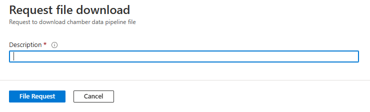
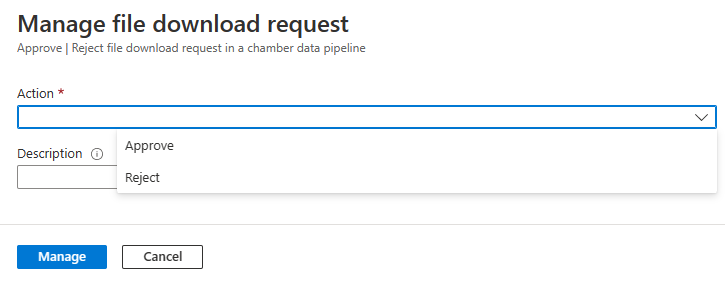

# Export data from Azure Modeling and Simulation Workbench

Azure Modeling and Simulation Workbench uses a two-key approval process for optimal security and privacy when you're exporting data. A Chamber Admin provides the first key approval. A Workbench Owner provides the second key approval.

This article explains the steps to export data from Azure Modeling and Simulation Workbench.

## Prerequisites

- An Azure account with an active subscription. [Create an account for free](https://azure.microsoft.com/free/?WT.mc_id=A261C142F).
- An instance of Azure Modeling and Simulation Design Workbench installed with at least one chamber.
- A user who's a Workbench Owner (Subscription Owner or Subscription Contributor), and a user who's provisioned as a Chamber Admin or Chamber User.
- [AzCopy](/azure/storage/common/storage-ref-azcopy) installed on the machine, with access to the configured network for the target chamber. Only machines on the specified network path for the chamber can export files.

## Sign in to the Azure portal

Open your web browser and go to the [Azure portal](https://portal.azure.com/). Enter your credentials to sign in to the portal.

## Copy the export file to the data-out folder

To export a file, you first need to copy the file to the data-out folder in the data pipeline.

> [!NOTE]
> Supported characters for the file name are alphanumeric characters, underscores, periods, and hyphens.
>
> The data pipeline processes only files in */mount/datapipeline/dataout*.

1. Enter **Modeling and Simulation Workbench** in the global search. Then, under **Services**, select **Modeling and Simulation Workbench**.

1. Select your workbench from the resource list.

1. On the left menu, select **Settings** > **Chamber**. A resource list appears. Select the chamber that you want to export data from.

1. On the left menu, select **Settings** > **Connector**.  In the resource list, select the displayed connector.

1. Select the **Dashboard URL** link to open the ETX dashboard.

1. Select an available workload and open a terminal session.

1. Copy the file that you want to export to the data pipeline's data-out folder: */mount/datapipeline/dataout*.

## Request to export the file

After you copy the file to the data-out folder, a Chamber Admin completes the following steps to request an export of the file:

1. In the chamber that you're exporting data from, select **Data Pipeline** > **File**.

1. In the resource list, select the file that you want to export. Files are named *mount-datapipeline-datain-\<filename\>.*

1. Confirm that the data pipeline direction in the **File overview** section is **outbound**. Then select **Request download**.

1. Enter a reason in the **Description** box, and then select **File Request**.

   > [!div class="mx-imgBorder"]
   > 

## Approve or reject an export request

The Workbench Owner completes the next phase, approving (or rejecting) the export request:

1. In the chamber that you're exporting data from, select **Data Pipeline** > **File Request**.

1. In the resource list, select the file request that you want to manage.

   In the **File Request overview** section, the status of the file request must appear as **Requested** for you to approve it.

1. Select **Manage** in the **File Request overview** section.

1. In the **Action** drop-down list, select **Approve** or **Reject**. In the **Description** box, enter a description.

   > [!div class="mx-imgBorder"]
   > 

1. Select **Manage**.

The status of the file export request appears in the **File Request overview** section as either **Approved** or **Rejected**. The status must be **Approved** to enable users to download the file.

## Download an approved export file from the chamber

Complete the following steps to download an approved export file from a chamber:

1. In the chamber that you're exporting data from, select **Data Pipeline** > **File Request**.

1. In the resource list, select the approved file request that you want to download. The status of the file request must appear as **Approved** for you to download it.

1. In the **File Request overview** section, select the **Download URL** button.

1. In the pop-up dialog, copy the **Download URL** value.

1. Use the AzCopy command to copy out your file. For example, use `azcopy copy "<downloadURL>" <targetFilePath>`.

> [!IMPORTANT]
> If you're exporting multiple smaller files, we recommend that you zip or tarball them into a single file. Gigabyte-sized tarballs and zipped files are supported, depending on your connection type and network speed.

## Next steps

To learn how to manage chamber storage in Azure Modeling and Simulation Workbench, see [Manage chamber storage](./how-to-guide-manage-storage.md).
