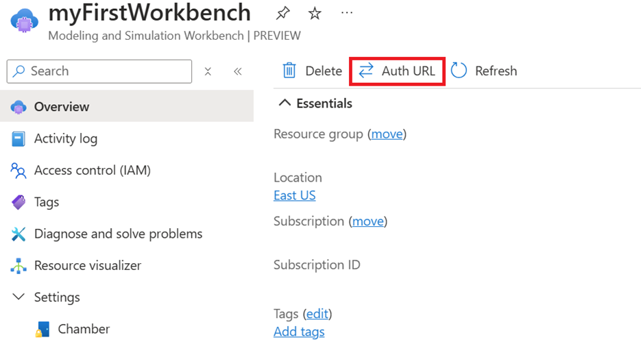
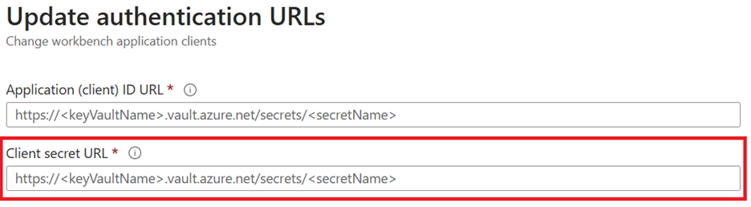

# Refresh remote connection keys

The Modeling and Simulation Workbench offers provisioned users secure remote connectivity to all chamber workloads. To set up remote access, register a new application in Microsoft Entra ID and add a client secret as described in [Create an Azure Modeling and Simulation Workbench](/azure/modeling-simulation-workbench/quickstart-create-portal#add-a-client-secret). Registering your application establishes a trust relationship between the Modeling and Simulation Workbench remote desktop authentication and the Microsoft identity platform. Creating a client secret allows the Modeling and Simulation Workbench to redirect Microsoft Entra sign-in requests directly to your organization's Microsoft Entra ID and enables a single sign-on experience for onboarded users. 

## Client secret lifetime

The client secret lifetime is typically set to 12 months. If the workbench’s lifetime extends beyond the secret’s lifespan, the app secrets will expire resulting in users losing access to the chambers. Expired client secrets disrupt remote authentication, causing a blue screen.

To address an expired client secret, you need to create a new secret by following steps outlined in [Create an application in Microsoft Entra ID](/azure/modeling-simulation-workbench/quickstart-create-portal#create-an-application-in-microsoft-entra-id). After creating a new secret, you need to update the Modeling and Simulation Workbench with that new client secret URL. 

## Update the client secret URL

On the Azure portal workbench resource page, you can update the authentication URLs for the new client secrets linked to the original app registration.

1. In the Azure portal, navigate to the Modeling and Simulation Workbenches (preview) page.

1. Select **Auth URL**.

    

1. Enter in the new client secret URL.

    

These actions can only be performed by the Workbench Owner, and allow rotation of Client ID/secrets on deployed workbenches prior to expiration, which ensures business continuity for the engineering team.

> [!NOTE]
> Please restart the connector before attempting to make a remote connection with the updated authentication URLs
