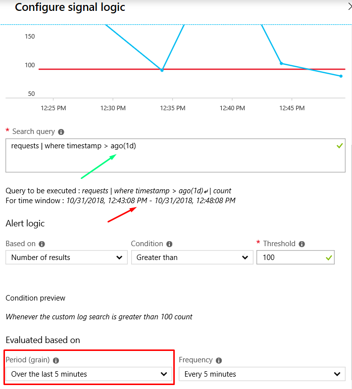
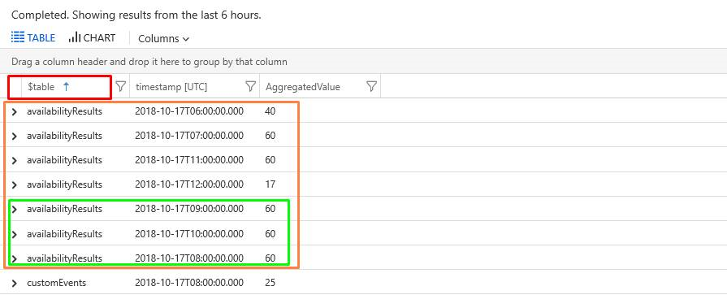
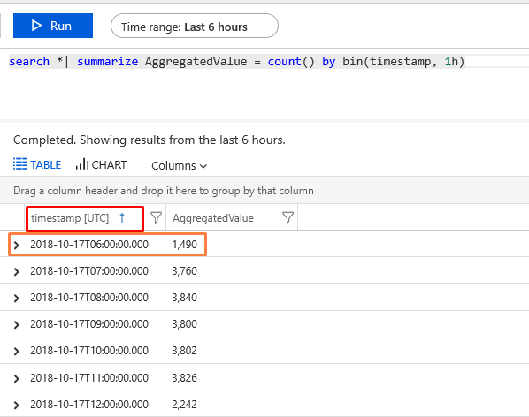

---
title: "Troubleshooting log alerts in Azure Monitor"
description: Common issues, errors and resolution for log alert rules in Azure.
author: msvijayn
services: azure-monitor
ms.service: azure-monitor
ms.topic: conceptual
ms.date: 10/29/2018
ms.author: vinagara
ms.component: alerts
---
# Troubleshooting log alerts in Azure Monitor  
## Overview
This article shows you how to resolve common issues seen when setting up log alerts in Azure monitor. It also provides solutions to frequently asked questions regarding functionality or configuration of log alerts. 

The term **Log Alerts** describes alerts that fire based on a custom query in [Log Analytics](../log-analytics/log-analytics-tutorial-viewdata.md) or [Application Insights](../application-insights/app-insights-analytics.md). Learn more about functionality, terminology, and types in [Log alerts - Overview](monitor-alerts-unified-log.md).

> [!NOTE]
> This article doesn't consider cases when the Azure portal shows and alert rule triggered and a notification performed by an associated Action Group(s). For such cases, please refer to details in the article on [Action Groups](monitoring-action-groups.md).

## Log alert didn't fire

Here are some common reasons why a configured [log alert rule in Azure Monitor](alert-log.md) state doesn't show [as *fired* when expected](monitoring-alerts-managing-alert-states.md). 

### Data Ingestion time for Logs
Log alert periodically runs your query based on [Log Analytics](../log-analytics/log-analytics-tutorial-viewdata.md) or [Application Insights](../application-insights/app-insights-analytics.md). Because Log Analytics processes many terabytes of data from thousands of customers from varied sources across the world, the service is susceptible to a varying time delay. For more information, see [Data ingestion time in Log Analytics](../log-analytics/log-analytics-data-ingestion-time.md).

To mitigate data ingestion delay, the system waits and retries the alert query multiple times if it finds the needed data is not yet ingested. The system has an exponentially increasing wait time set. The log alert only triggers after the data is available so they delay could be due to slow log data ingestion. 

### Incorrect time period configured
As described in the article on [terminology for log alerts](monitor-alerts-unified-log.md#log-search-alert-rule---definition-and-types), the time period stated in configuration specifies the time range for the query. The query returns only records that were created within this range of time. Time period restricts the data fetched for log query to prevent abuse and circumvents any time command (like *ago*) used in log query. For example, If the time period is set to 60 minutes, and the query is run at 1:15 PM, only records created between 12:15 PM and 1:15 PM are used for the log query. If the log query uses a time command like *ago (1d)*, the query still only uses data between 12:15 PM and 1:15 PM because the time period is set to that interval.*

Therefore, check that time period in the configuration matches your query. For the example stated earlier, if the log query uses *ago (1d)* as shown with Green marker, then the time period should be set to 24 hours or 1440 minutes (as indicated in Red), to ensure the query executes as intended.

### Suppress Alerts option is set
As described in step 8 of the article on [creating a log alert rule in Azure portal](alert-log.md#managing-log-alerts-from-the-azure-portal), log alerts provide a **Suppress Alerts** option to suppress triggering and notification actions for a configured amount of time. As a result, you may think that an alert didn't fire while in actuality it did, but was suppressed.  

### Metric measurement alert rule is incorrect
**Metric measurement log alerts** are a subtype of log alerts, which have special capabilities and a restricted alert query syntax. A metric measurement log alert rule requires the query output to be a metric time series; that is, a table with distinct equally sized time periods along with corresponding aggregated values. Additionally, users can choose to have additional variables in the table alongside AggregatedValue. These variables may be used to sort the table. 

For example, suppose a metric measurement log alert rule was configured as:
- query was: `search *| summarize AggregatedValue = count() by $table, bin(timestamp, 1h)`  
- time period of 6 hours
- threshold of 50
- alert logic of three consecutive breaches
- Aggregate Upon chosen as $table

Since the command includes *summarize … by* and provided two variables (timestamp & $table), the system chooses $table to “Aggregate Upon”. It sorts the result table by the field *$table* as shown below and then looks at the multiple AggregatedValue for each table type (like availabilityResults) to see if there was consecutive breaches of 3 or more.

As “Aggregate Upon” is $table – the data is sorted on $table column (as in RED); then we group and look for types of “Aggregate Upon” field (that is) $table – for example: values for availabilityResults will be considered as one plot/entity (as highlighted in Orange). In this value plot/entity – alert service checks for three consecutive breaches occurring (as shown in Green) for which alert will get triggered for table value 'availabilityResults'. Similarly, if for any other value of $table if three consecutive breaches are seen - another alert notification will be triggered for the same thing; with alert service automatically sorting the values in one plot/entity (as in Orange) by time.

Now suppose, metric measurement log alert rule was modified and query was `search *| summarize AggregatedValue = count() by bin(timestamp, 1h)` with rest of the config remaining same as before including alert logic for three consecutive breaches. "Aggregate Upon" option in this case will be by default: timestamp. Since only one value is provided in query for summarize…by (that is) timestamp; similar to earlier example, at end of execution the output would be as illustrated below. 

   

As “Aggregate Upon” is timestamp – the data is sorted on timestamp column (as in RED); then we group by timestamp – for example: values for `2018-10-17T06:00:00Z` will be considered as one plot/entity (as highlighted in Orange). In this value plot/entity – alert service will find no consecutive breaches occurring (as each timestamp value has only one entry) and hence alert will never get triggered. Hence in such case, user must either -
- Add a dummy variable or an existing variable (like $table) to correctly sorting done using "Aggregate Upon" field configured
- (Or) reconfigure alert rule to use alert logic based on *total breach* instead appropriately
 
## Log alert fired unnecessarily
Detailed next are some common reasons why a configured [log alert rule in Azure Monitor](alert-log.md) may be triggered when viewed in [Azure Alerts](monitoring-alerts-managing-alert-states.md), when you don't expect it to be fired.

### Alert triggered by partial data
Analytics powering Log Analytics and Application Insights are subject to ingestion delays and processing; due to which, at the time when provided log alert query is run - there may be a case of no data being available or only some data being available. For more information, see [Data ingestion time in Log Analytics](../log-analytics/log-analytics-data-ingestion-time.md).

Depending on how the alert rule is configured, there may be mis-firing if there is no or partial data in logs at the time of alert execution. In such cases, we advise you to change the alert query or config. 

For example, if the log alert rule is configured to trigger when number of results from an analytics query is less than 5, then the alert triggers when there is no data (zero record) or partial results (one record). However, after the data ingestion delay, the same query with full data might provide a result of 10 records.

### Alert query output misunderstood
You provide the logic for log alerts in an analytics query. The analytics query may use various big data and mathematical functions.  The alerting service executes your query at intervals specified with data for time period specified. The alerting service makes subtle changes to query provided based on the alert type chosen. This can be seen in the "Query to be executed" section in *Configure signal logic* screen, as shown below:
    
 
What is shown in the **query to be executed** box is what the log alert service runs. You can run the stated query as well as timespan via [Analytics portal](../log-analytics/log-analytics-log-search-portals.md) or the [Analytics API](https://docs.microsoft.com/rest/api/loganalytics/) if you want to understand what the alert query output may be before you actually create the alert.
 
## Next steps

* Learn about [Log Alerts in Azure Alerts](monitor-alerts-unified-log.md)
* Learn more about [Application Insights](../application-insights/app-insights-analytics.md)
* Learn more about [Log Analytics](../log-analytics/log-analytics-overview.md). 

