---
title: "Create, view and manage log alerts Using Azure Monitor"
description: Use the Azure Monitor to author, view and manage log alert rules in Azure.
author: msvijayn
services: azure-monitor
ms.service: azure-monitor
ms.topic: conceptual
ms.date: 09/15/2018
ms.author: vinagara
ms.component: alerts
---
# Create, view, and manage log alerts using Azure Monitor  

## Overview
This article shows you how to set up log alerts using the alerts interface inside Azure portal. Definition of an alert rule is in three parts:
- Target: Specific Azure resource, which is to be monitored
- Criteria: Specific condition or logic that when seen in Signal, should trigger action
- Action: Specific call sent to a receiver of a notification - email, SMS, webhook etc.

The term **Log Alerts** to describe alerts where signal is custom query based on [Log Analytics](../log-analytics/log-analytics-tutorial-viewdata.md) or [Application Insights](../application-insights/app-insights-analytics.md). Learn more about functionality, terminology, and types from [Log alerts - Overview](monitor-alerts-unified-log.md).

> [!NOTE]
> Popular log data from [Azure Log Analytics](../log-analytics/log-analytics-tutorial-viewdata.md) is now also available on the metric platform in Azure Monitor. For details view, [Metric Alert for Logs](monitoring-metric-alerts-logs.md)

## Managing log alerts from the Azure portal

Detailed next is step-by-step guide to using log alerts using the Azure portal interface.

### Create a log alert rule with the Azure portal
1. In the [portal](https://portal.azure.com/), select **Monitor** and under the MONITOR section - choose **Alerts**.  
    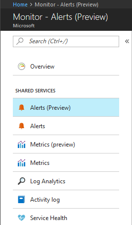

1. Select the **New Alert Rule** button to create a new alert in Azure.
    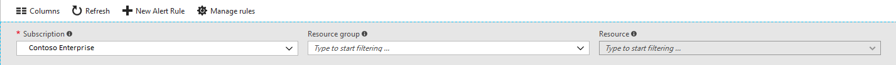

1. The Create Alert section is shown with the three parts consisting of: *Define alert condition*, *Define alert details*, and *Define action group*.

    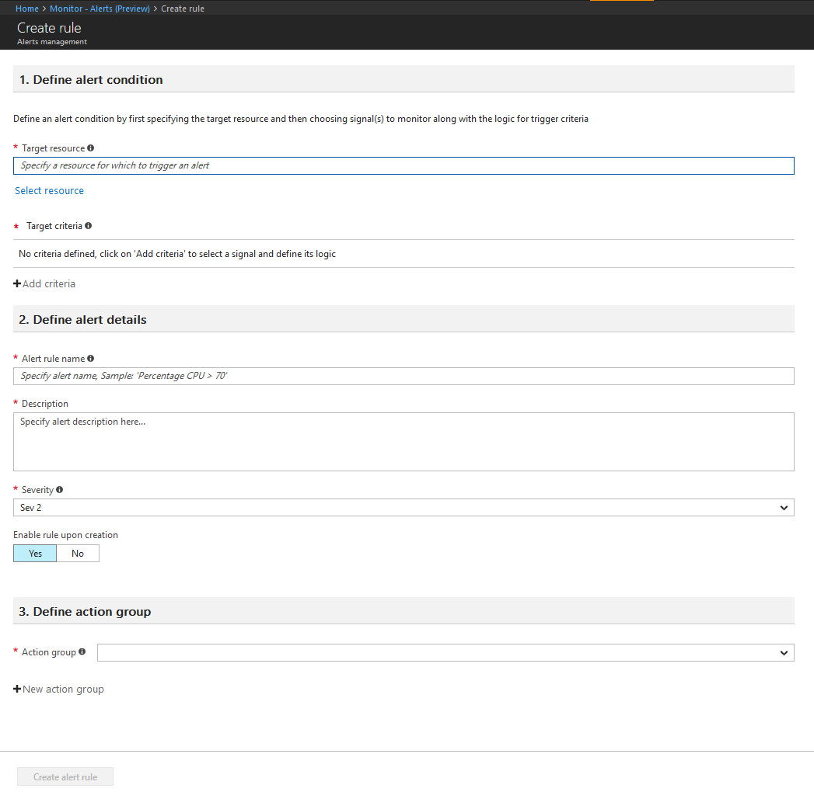

1.  Define the alert condition by using the **Select Resource** link and specifying the target by selecting a resource. Filter by choosing the _Subscription_, _Resource Type_, and required _Resource_. 

    >[!NOTE]

    > For creating a log alert - verify the **log** signal is available for the selected resource before you proceed.
    

 
1. *Log Alerts*: Ensure **Resource Type** is an analytics source like *Log Analytics* or *Application Insights* and signal type as **Log**, then once appropriate **resource** is chosen, click *Done*. Next use the **Add criteria** button to view list of signal options available for the resource and from the signal list **Custom log search** option for chosen log monitor service like *Log Analytics* or *Application Insights*.

   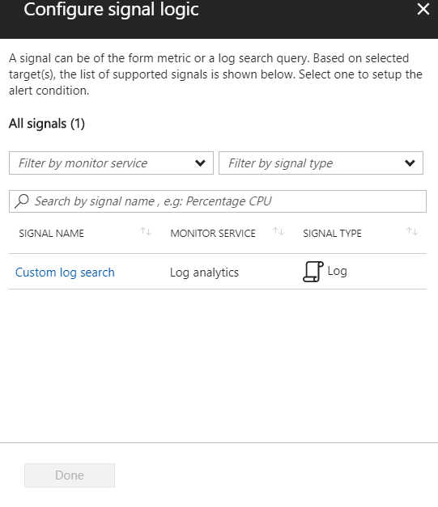

   > [!NOTE]

   > Alerts lists can import analytics query as signal type - **Log (Saved Query)**, as seen in above illustration. So users can perfect your query in Analytics and then save them for future use in alerts - more details on using saving query available at [using log search in log analytics](../log-analytics/log-analytics-log-searches.md) or [shared query in application insights analytics](../log-analytics/log-analytics-overview.md). 

1.  *Log Alerts*: Once selected, query for alerting can be stated in **Search Query** field; if the query syntax is incorrect the field displays error in RED. If the query syntax is correct - For reference historic data of the stated query is shown as a graph with option to tweak the time window from last six hours to last week.

 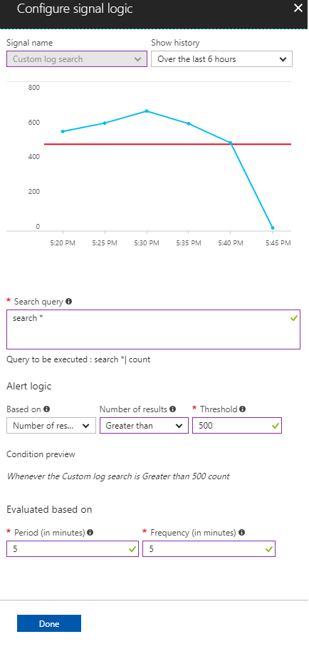

 > [!NOTE]

    > Historical data visualization can only be shown if the query results have time details. If your query results in summarized data or specific column values - same is shown as a singular plot.

    >  For Metric Measurement type of Log Alerts using Application insights, you can specify which specific variable to group the data by using the **Aggregate on** option; as illustrated in below:

    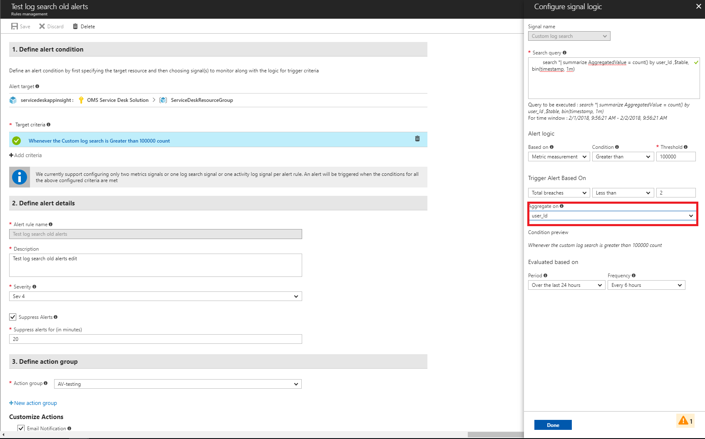

1.  *Log Alerts*: With the visualization in place, **Alert Logic** can be selected from shown options of Condition, Aggregation and finally Threshold. Finally specify in the logic, the time to assess for the specified condition, using **Period** option. Along with how often Alert should run by selecting **Frequency**.
For **Log Alerts** alerts can be based on:
   - *Number of Records*: An alert is created if the count of records returned by the query is either greater than or less than the value provided.
   - *Metric Measurement*: An alert is created if each *aggregate value* in the results exceeds the threshold value provided and it is *grouped by* chosen value. The number of breaches for an alert is the number of times the threshold is exceeded in the chosen time period. You can specify Total breaches for any combination of breaches across the results set or Consecutive breaches to require that the breaches must occur in consecutive samples. Learn more about [Log Alerts and their types](monitor-alerts-unified-log.md).


1. As the second step, define a name for your alert in the **Alert rule name** field along with a **Description** detailing specifics for the alert and **Severity** value from the options provided. These details are reused in all alert emails, notifications, or push done by Azure Monitor. Additionally, user can choose to immediately activate the alert rule on creation by appropriately toggling **Enable rule upon creation** option.

    For **Log Alerts** only, some additional functionality is available in Alert details:

    - **Suppress Alerts**: When you turn on suppression for the alert rule, actions for the rule are disabled for a defined length of time after creating a new alert. The rule is still running and creates alert records provided the criteria is met. Allowing you time to correct the problem without running duplicate actions.

        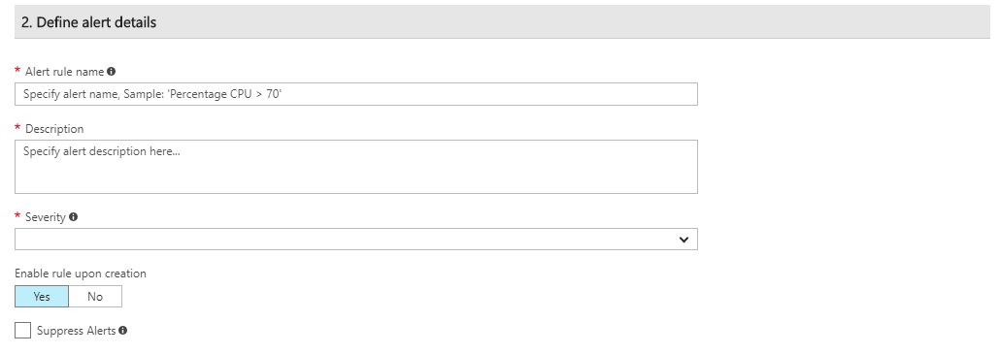

        > [!TIP]
        > Specify an suppress alert value greater than frequency of alert to ensure notifications are stopped without overlap

1. As the third and final step, specify if any **Action Group** needs to be triggered for the alert rule when alert condition is met. You can choose any existing Action Group with alert or create a new Action Group. According to selected Action Group, when alert is trigger Azure will: send email(s), send SMS(s), call Webhook(s), remediate using Azure Runbooks, push to your ITSM tool, etc. Learn more about [Action Groups](monitoring-action-groups.md).

    > [!NOTE]
    > Refer to the [Azure subscription service limits](../azure-subscription-service-limits.md) for limits on Runbook payloads triggered for log alerts via Azure action groups

    For **Log Alerts** some additional functionality is available to override the default Actions:

    - **Email Notification**: Overrides *e-mail subject* in the email, sent via Action Group; if one or more email actions exist in the said Action Group. You cannot modify the body of the mail and this field is **not** for email address.
    - **Include custom Json payload**: Overrides the webhook JSON used by Action Groups; if one or more webhook actions exist in the said Action Group. User can specify format of JSON to be used for all webhooks configured in associated Action Group; for more information on webhook formats, see [webhook action for Log Alerts](monitor-alerts-unified-log-webhook.md). View Webhook option is provided to check format using sample JSON data.

        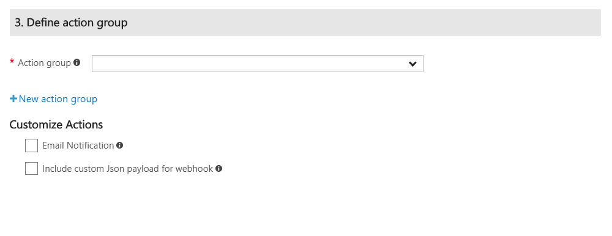


1. If all fields are valid and with green tick the **create alert rule** button can be clicked and an alert is created in Azure Monitor - Alerts. All alerts can be viewed from the alerts Dashboard.

    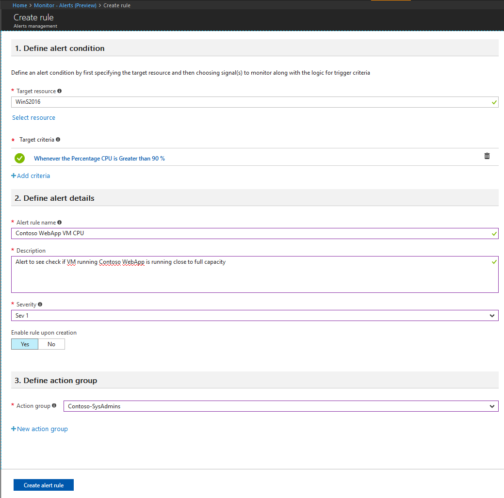

    Within a few minutes, the alert is active and triggers as previously described.

Users can also finalized their analytics query in [Logs Analytics page in Azure portal](../log-analytics/log-analytics-log-search-portals.md#log-analytics-page
) and then push it to create an alert via 'Set Alert' button - then following instructions from Step 6 onwards in the above tutorial.

 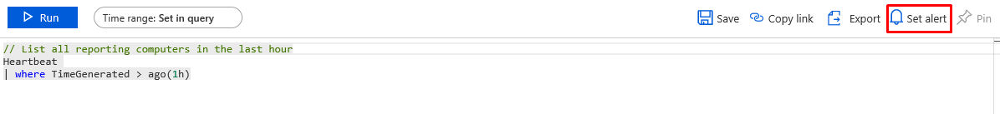

### View & manage log alerts in Azure portal

1. In the [portal](https://portal.azure.com/), select **Monitor** and under the MONITOR section - choose **Alerts**.  

1. The **Alerts  Dashboard** is displayed - wherein all Azure Alerts (including log alerts) are displayed in a singular board; including every instance of when your log alert rule has fired. To learn more, see [Alert Management](https://aka.ms/managealertinstances).
    > [!NOTE]
    > Log alert rules comprise of custom query-based logic provided by users and hence without a resolved state. Due to which every time the conditions specified in the log alert rule are met, it is fired. 


1. Select the **Manage rules** button on the top bar, to navigate to the rule management section - where all  alert rules created are listed; including alerts that have been disabled.
    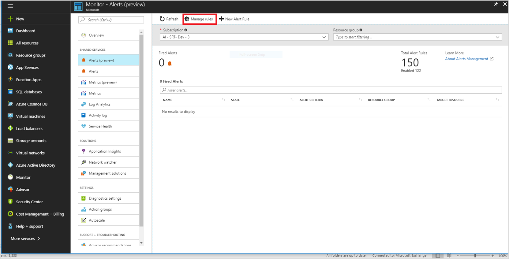

## Managing log alerts using Azure Resource Template
Currently log alerts can be created using two different Resource Templates, based on which analytics platform the alert is to be based upon (that is) Log Analytics or Application Insights.

Hence the section below provide details on using Resource Template for Log Alerts for each analytics platform.

### Azure Resource Template for Log Analytics
Log alerts for Log Analytics are created by alert rules that run a saved search on a regular interval. If the results of the query match specified criteria, an alert record is created and one or more actions are run. 

Resource template for Log analytics saved search and Log analytics alerts are available in Log Analytics section of documentation. To learn more, see, [Adding Log Analytics saved searches and alerts](../operations-management-suite/operations-management-suite-solutions-resources-searches-alerts.md); which includes illustrative samples as well as schema details.

### Azure Resource Template for Application Insights
Log alert for Application Insights resources has a type of `Microsoft.Insights/scheduledQueryRules/`. For more information on this resource type, see [Azure Monitor - Scheduled Query Rules API reference](https://docs.microsoft.com/rest/api/monitor/scheduledqueryrules/).

The following is the structure for [Scheduled Query Rules creation](https://docs.microsoft.com/rest/api/monitor/scheduledqueryrules/createorupdate) based resource template, with sample data set as variables.

```json
{
    "$schema": "http://schema.management.azure.com/schemas/2015-01-01/deploymentTemplate.json#",
    "contentVersion": "1.0.0.0", 
    "parameters": {      
    },   
    "variables": {
    "alertLocation": "southcentralus",
    "alertName": "samplelogalert",
    "alertTag": "hidden-link:/subscriptions/a123d7efg-123c-1234-5678-a12bc3defgh4/resourceGroups/myRG/providers/microsoft.insights/components/sampleAIapplication",
    "alertDesription": "Sample log search alert",
    "alertStatus": "true",
    "alertSource":{
        "Query":"requests",
        "SourceId": "/subscriptions/a123d7efg-123c-1234-5678-a12bc3defgh4/resourceGroups/myRG/providers/microsoft.insights/components/sampleAIapplication",
        "Type":"ResultCount"
         },
     "alertSchedule":{
         "Frequency": 15,
         "Time": 60
         },
     "alertActions":{
         "SeverityLevel": "4"
         },
      "alertTrigger":{
        "Operator":"GreaterThan",
        "Threshold":"1"
         },
       "actionGrp":{
        "ActionGroup": "/subscriptions/a123d7efg-123c-1234-5678-a12bc3defgh4/resourceGroups/myRG/providers/microsoft.insights/actiongroups/sampleAG",
        "Subject": "Customized Email Header",
        "Webhook": "{ \"alertname\":\"#alertrulename\", \"IncludeSearchResults\":true }"           
         }
  },
  "resources":[ {
    "name":"[variables('alertName')]",
    "type":"Microsoft.Insights/scheduledQueryRules",
    "apiVersion": "2018-04-16",
    "location": "[variables('alertLocation')]",
    "tags":{"[variables('alertTag')]": "Resource"},
    "properties":{
       "description": "[variables('alertDesription')]",
       "enabled": "[variables('alertStatus')]",
       "source": {
           "query": "[variables('alertSource').Query]",
           "dataSourceId": "[variables('alertSource').SourceId]",
           "queryType":"[variables('alertSource').Type]"
       },
      "schedule":{
           "frequencyInMinutes": "[variables('alertSchedule').Frequency]",
           "timeWindowInMinutes": "[variables('alertSchedule').Time]"    
       },
      "action":{
           "odata.type": "Microsoft.WindowsAzure.Management.Monitoring.Alerts.Models.Microsoft.AppInsights.Nexus.DataContracts.Resources.ScheduledQueryRules.AlertingAction",
           "severity":"[variables('alertActions').SeverityLevel]",
           "aznsAction":{
               "actionGroup":"[array(variables('actionGrp').ActionGroup)]",
               "emailSubject":"[variables('actionGrp').Subject]",
               "customWebhookPayload":"[variables('actionGrp').Webhook]"
           },
       "trigger":{
               "thresholdOperator":"[variables('alertTrigger').Operator]",
               "threshold":"[variables('alertTrigger').Threshold]"
           }
       }
     }
   }
 ]
}
```
> [!IMPORTANT]
> Tag field with hidden-link to target resource is mandatory in use of [Scheduled Query Rules ](https://docs.microsoft.com/rest/api/monitor/scheduledqueryrules/) API call or resource template. 

The sample json above can be saved as (say) sampleScheduledQueryRule.json for the purpose of this walkthrough and can be deployed using [Azure Resource Manager in Azure portal](../azure-resource-manager/resource-group-template-deploy-portal.md#deploy-resources-from-custom-template).


## Managing log alerts using PowerShell, CLI, or API
Currently log alerts can be created using two different Resource Manager compliant APIs, based on which analytics platform the alert is to be based upon (that is) Log Analytics or Application Insights.

Hence the section below provide details on using API via Powershell or CLI for Log Alerts for each analytics platform.

### PowerShell, CLI, or API for Log Analytics
The Log Analytics Alert REST API is RESTful and can be accessed via the Azure Resource Manager REST API. The API can thus be accessed from a PowerShell command line and will output search results to you in JSON format, allowing you to use the results in many different ways programmatically.

Learn more  about [create and manage alert rules in Log Analytics with REST API](../log-analytics/log-analytics-api-alerts.md); including examples of accessing the API from Powershell.

### PowerShell, CLI, or API for Application Insights
[Azure Monitor - Scheduled Query Rules API](https://docs.microsoft.com/rest/api/monitor/scheduledqueryrules/) is a REST API and fully compatible with Azure Resource Manager REST API. Hence it can be used via Powershell using Resource Manager cmdlet as well as Azure CLI.

Illustrated below usage via Azure Resource Manager PowerShell cmdlet for sample Resource Template shown earlier (sampleScheduledQueryRule.json) in the [Resource Template section](#azure-resource-template-for-application-insights) :
```powershell
New-AzureRmResourceGroupDeployment -ResourceGroupName "myRG" -TemplateFile "D:\Azure\Templates\sampleScheduledQueryRule.json"
```
Illustrated below usage via Azure Resource Manager command in Azure CLI for sample Resource Template shown earlier (sampleScheduledQueryRule.json) in the [Resource Template section](#azure-resource-template-for-application-insights) :

```azurecli
az group deployment create --resource-group myRG --template-file sampleScheduledQueryRule.json
```
On successful operation, 201 will be returned to state new alert rule creation or 200 will be returned if an existing alert rule was modified.


  
## Next steps

* Learn about [Log Alerts in Azure Alerts](monitor-alerts-unified-log.md)
* Understand [Webhook actions for log alerts](monitor-alerts-unified-log-webhook.md)
* Learn more about [Application Insights](../application-insights/app-insights-analytics.md)
* Learn more about [Log Analytics](../log-analytics/log-analytics-overview.md). 

