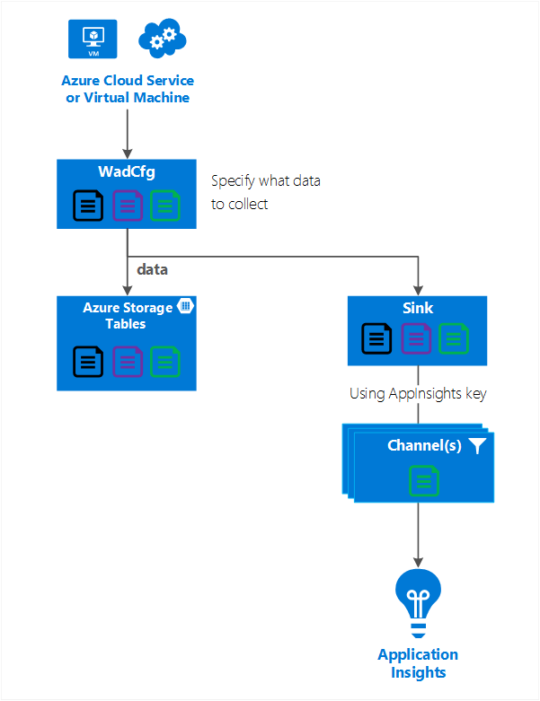

# Configure Azure Diagnostics to send data to Application Insights
Azure diagnostics send data to Azure Storage tables.  However, you can also pipe all or a subset of the data to other locations using Azure Diagnostics extension 1.5 or later.

This article describes how to send data from the Azure Diagnostics extension to Application Insights.


## Configuring Application Insights as a Sink
The Azure diagnostics extension 1.5 introduced sinks, which are additional locations where you can send diagnostic data.

Example configuration of a sink for Application Insights:

```XML
    <SinksConfig>
        <Sink name="ApplicationInsights">
          <ApplicationInsights>{Insert InstrumentationKey}</ApplicationInsights>
          <Channels>
            <Channel logLevel="Error" name="MyTopDiagData"  />
            <Channel logLevel="Verbose" name="MyLogData"  />
          </Channels>
        </Sink>
      </SinksConfig>
```

- The **Sink** *name* attribute is a string value that uniquely identifies the sink.

- The **ApplicationInsights** element specifies instrumentation key of the Application insights resource where the Azure diagnostics data is sent.
    - If you don't have an existing Application Insights resource, see [Create a new Application Insights resource](../application-insights/app-insights-create-new-resource.md) for more information on creating a resource and getting the instrumentation key.
    - If you are developing a Cloud Service with Azure SDK 2.8 and later, this instrumentation key is automatically populated. The value is based on the **APPINSIGHTS_INSTRUMENTATIONKEY** service configuration setting when packaging the Cloud Service project. See [Use Application Insights with Azure Diagnostics to troubleshoot Cloud Service issues](../cloud-services/cloud-services-dotnet-diagnostics-applicationinsights.md).

- The **Channels** element contains one or more **Channel** elements.
    - The *name* attribute uniquely refers to that channel.
    - The *loglevel* attribute lets you specify the log level that the channel allows. The available log levels in order of most to least information are:
        - Verbose
        - Information
        - Warning
        - Error
        - Critical

A channel acts like a filter and allows you to select specific log levels to send to the target sink. For example, you could collect verbose logs and send them to storage, but send only Errors to the sink.

The following graphic shows this relationship.



## Send data to the Application Insights sink
The following graphic summarizes the configuration values and how they work. You can include multiple sinks in the configuration at different levels in the hierarchy. The sink specified at the top level of the hierarchy acts as a global setting and the one specified at the individual element acts like an override to that global setting.


1. Create and name a sink in the SinksConfig section.
2. Create and name any channel filters for the data being sent in the Channels section.

Add the *sinks* attribute to elements under the **DiagnosticMonitorConfiguration** to send data to that sink. Use the form "Sink" or "Sink.Channel" to specify where to send the data.

**Example: Send all the data that is being collected by Azure diagnostics. **

```XML
<DiagnosticMonitorConfiguration overallQuotaInMB="4096" sinks="ApplicationInsights">
```

**Example: Send only error logs to the Application Insights sink**

```XML
<DiagnosticMonitorConfiguration overallQuotaInMB="4096" sinks="ApplicationInsights.MyTopDiagdata">
```

**Example: Send Verbose application logs to Application Insights**

```XML
<Logs scheduledTransferPeriod="PT1M" scheduledTransferLogLevelFilter="Verbose" sinks="ApplicationInsights.MyLogData"/>
```

Here is a complete example of the public configuration file that sends all errors to Application Insights (specified at the **DiagnosticMonitorConfiguration** node) and in addition Verbose level logs for the Application Logs (specified at the **Logs** node).

```XML
<WadCfg>
  <DiagnosticMonitorConfiguration overallQuotaInMB="4096"
       sinks="ApplicationInsights.MyTopDiagData"> <!-- All info below sent to this channel -->
    <DiagnosticInfrastructureLogs />
    <PerformanceCounters>
      <PerformanceCounterConfiguration counterSpecifier="\Processor(_Total)\% Processor Time" sampleRate="PT3M" sinks="ApplicationInsights.MyLogData/>
      <PerformanceCounterConfiguration counterSpecifier="\Memory\Available MBytes" sampleRate="PT3M" />
      <PerformanceCounterConfiguration counterSpecifier="\Web Service(_Total)\Bytes Total/Sec" sampleRate="PT3M" />
    </PerformanceCounters>
    <WindowsEventLog scheduledTransferPeriod="PT1M">
      <DataSource name="Application!*" />
    </WindowsEventLog>
    <Logs scheduledTransferPeriod="PT1M" scheduledTransferLogLevelFilter="Verbose"
            sinks="ApplicationInsights.MyLogData"/> <!-- This specific info sent to this channel -->
  </DiagnosticMonitorConfiguration>

<SinksConfig>
    <Sink name="ApplicationInsights">
      <ApplicationInsights>{Insert InstrumentationKey}</ApplicationInsights>
      <Channels>
        <Channel logLevel="Error" name="MyTopDiagData"  />
        <Channel logLevel="Verbose" name="MyLogData"  />
      </Channels>
    </Sink>
  </SinksConfig>
</WadCfg>
```

There are some limitations to be aware of with this functionality

- **Channels only log type and not performance counters.** If you specify a channel with a performance counter element it is ignored.
- **The log level for a channel cannot exceed the log level for what is being collected by Azure diagnostics.** For example: you cannot collect Application Log errors in the Logs element and try to send Verbose logs to the Application Insight sink. The *scheduledTransferLogLevelFilter* attribute must always collect equal or more logs than the logs you are trying to send to a sink.
- **You cannot send blob data collected by Azure diagnostics extension to Application Insights.** For example anything specified under the *Directories* node. For Crash Dumps the actual crash dump is sent to blob storage and only a notification that the crash dump was generated is sent to Application Insights.

## Next Steps
* Use [PowerShell](../cloud-services/cloud-services-diagnostics-powershell.md) to enable the Azure diagnostics extension for your application.
* Use [Visual Studio](../vs-azure-tools-diagnostics-for-cloud-services-and-virtual-machines.md) to enable the Azure diagnostics extension for your application
