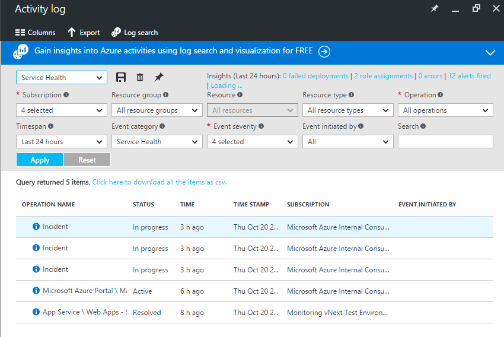

<properties
	pageTitle="Track Azure service health using Azure Monitor Activity Logs | Microsoft Azure"
	description="Find out when Azure has experienced performance degradation or service interruptions. "
	authors="rboucher"
	manager="carolz"
	editor=""
	services="monitoring-and-diagnostics"
	documentationCenter="monitoring-and-diagnostics"/>

<tags
	ms.service="monitoring-and-diagnostics"
	ms.workload="na"
	ms.tgt_pltfrm="na"
	ms.devlang="na"
	ms.topic="article"
	ms.date="10/20/2016"
	ms.author="robb"/>

# Track Azure service health using Azure Monitor Activity Logs

Azure publicizes each time there is a service interruption or performance degradation. You can browse these events in the Azure portal, and you can also use the [REST API](https://msdn.microsoft.com/library/azure/dn931927.aspx) or [.NET SDK](https://www.nuget.org/packages/Microsoft.Azure.Insights/) to access the full set of events programmatically.

## Browse the service health logs for your subscription

1. Sign in to the [Azure Portal](https://portal.azure.com/).

2. On **Home** you should see a tile called **Service health**. Click on it.

    

3. You see a list of all the regions in Azure. Click any region to bring up the Activity Log query that shows service incidents that have impacted any of your subscriptions in the last 24 hours.

    

4. You can see the details of an individual incident by clicking that event in the table.

5. Change the **Timespan** to see a longer timeframe.

## Next steps

* [Monitor availability and responsiveness of any web page](../application-insights/app-insights-monitor-web-app-availability.md) with Application Insights so you can find out if your page is down.
