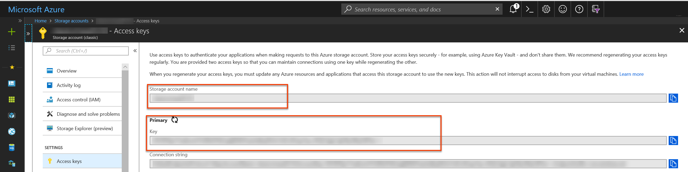
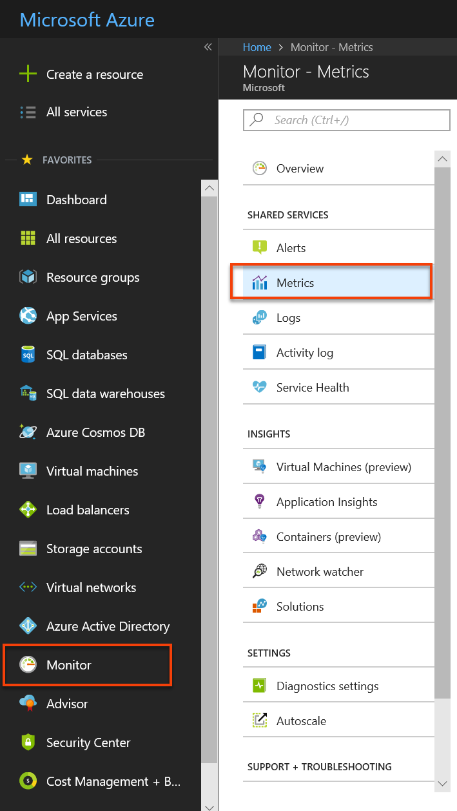

# Send guest OS metrics to the Azure Monitor data store for a Windows Virtual Machine (classic)

The Azure Monitor [Windows Azure Diagnostics extension](https://docs.microsoft.com/azure/monitoring-and-diagnostics/azure-diagnostics) (WAD) allows you to collect metrics and logs from the Guest Operating System (guest OS) running as part of a Virtual Machine, Cloud Service, or Service Fabric cluster. The extension can send telemetry to many different locations listed in the previously linked article.

This article describes the process to send guest OS performance metrics for a Windows Virtual Machine (classic) to the Azure Monitor metric store. Starting with WAD version 1.11, you can write metrics directly to the Azure Monitor metrics store where standard platform metrics are already collected. Storing them in this location allows you to access the same actions available for platform metrics.  Actions include near-real time alerting, charting, routing, access from REST API and more.  In the past, the WAD extension wrote to Azure Storage, but not the Azure Monitor data store. 

The process outlined in this article only works classic Virtual Machines running the Windows operating system.

## Pre-requisites

- You must be a [Service Administrator or co-administrator](https://docs.microsoft.com/azure/billing/billing-add-change-azure-subscription-administrator.md) on your Azure subscription 

- Your subscription must be registered with [Microsoft.Insights](https://docs.microsoft.com/powershell/azure/overview?view=azurermps-6.8.1) 

- You need to have either [Azure PowerShell](https://docs.microsoft.com/powershell/azure/overview?view=azurermps-6.8.1) installed, or you can use [Azure CloudShell](https://docs.microsoft.com/azure/cloud-shell/overview.md) 

## Create a Classic Virtual Machine and Storage Account

1. Create a Classic VM using the Azure portal
   

1. When creating this VM, choose to create a new classic storage account. We use this storage account in later steps.

1. In the Azure portal, navigate to the Storage Account resource blade and choose the **Keys** and note down the storage account name and storage account key. You need these keys in later steps
   

## Create a Service Principal

Create a service principle in your Azure Active Directory tenant using the instructions found at [Create a service principal](../azure-resource-manager/resource-group-create-service-principal-portal.md). Note the following while going through this process: 
- Create new client secret for this app  
- Save the Key and the client id for use in later steps.

Give this app “Monitoring Metrics Publisher” permissions to the resource you wish to emit metrics against. You may use a resource group or an entire subscription.  

> [!NOTE]
> The Diagnostics Extension will use the service principal to authenticate against Azure Monitor and emit metrics for your classic VM.

## Author Diagnostics Extension Configuration

1. Prepare your WAD diagnostics extension configuration file. This file dictates which logs, and performance counters the diagnostics extension should collect for your Classic VM. Below is a sample.

    ```xml
    <?xml version="1.0" encoding="utf-8"?>
    <DiagnosticsConfiguration xmlns="http://schemas.microsoft.com/ServiceHosting/2010/10/DiagnosticsConfiguration">
    <PublicConfig xmlns="http://schemas.microsoft.com/ServiceHosting/2010/10/DiagnosticsConfiguration">
        <WadCfg>
        <DiagnosticMonitorConfiguration overallQuotaInMB="4096" sinks="applicationInsights.errors">
            <DiagnosticInfrastructureLogs scheduledTransferLogLevelFilter="Error" />
            <Directories scheduledTransferPeriod="PT1M">
                <IISLogs containerName="wad-iis-logfiles" />
                <FailedRequestLogs containerName="wad-failedrequestlogs" />
            </Directories>
            <PerformanceCounters scheduledTransferPeriod="PT1M">
                <PerformanceCounterConfiguration counterSpecifier="\Processor(*)\% Processor Time" sampleRate="PT15S" />
                <PerformanceCounterConfiguration counterSpecifier="\Memory\Available Bytes" sampleRate="PT15S" />
                <PerformanceCounterConfiguration counterSpecifier="\Memory\Committed Bytes" sampleRate="PT15S" />
                <PerformanceCounterConfiguration counterSpecifier="\Memory\% Committed Bytes" sampleRate="PT15S" />
                <PerformanceCounterConfiguration counterSpecifier="\LogicalDisk(*)\Disk Read Bytes/sec" sampleRate="PT15S" />
            </PerformanceCounters>
            <WindowsEventLog scheduledTransferPeriod="PT1M">
                <DataSource name="Application!*[System[(Level=1 or Level=2 or Level=3)]]" />
                <DataSource name="Windows Azure!*[System[(Level=1 or Level=2 or Level=3 or Level=4)]]" />
            </WindowsEventLog>
            <CrashDumps>
                <CrashDumpConfiguration processName="WaIISHost.exe" />
                <CrashDumpConfiguration processName="WaWorkerHost.exe" />
                <CrashDumpConfiguration processName="w3wp.exe" />
            </CrashDumps>
            <Logs scheduledTransferPeriod="PT1M" scheduledTransferLogLevelFilter="Error" />
            <Metrics resourceId="/subscriptions/xxxxxxxx-xxxx-xxxx-xxxx-xxxxxxxxxxxx/resourceGroups/MyResourceGroup/providers/Microsoft.ClassicCompute/virtualMachines/MyClassicVM">
                <MetricAggregation scheduledTransferPeriod="PT1M" />
                <MetricAggregation scheduledTransferPeriod="PT1H" />
            </Metrics>
        </DiagnosticMonitorConfiguration>
        <SinksConfig>
        </SinksConfig>
        </WadCfg>
        <StorageAccount />
    </PublicConfig>
    <PrivateConfig xmlns="http://schemas.microsoft.com/ServiceHosting/2010/10/DiagnosticsConfiguration">
        <StorageAccount name="" endpoint="" />
    </PrivateConfig>
    <IsEnabled>true</IsEnabled>
    </DiagnosticsConfiguration>
    ```
1. In the “SinksConfig” section of your diagnostics file define a new Azure Monitor sink:

    ```xml
    <SinksConfig>
        <Sink name="AzMonSink">
            <AzureMonitor>
                <ResourceId>Provide your Classic VM’s Resource ID </ResourceId>
                <Region>Region your VM is deployed in</Region>
            </AzureMonitor>
        </Sink>
    </SinksConfig>
    ```

1. In the section of your configuration file where the list of performance counters to be collected is listed, route the performance counters to the Azure Monitor Sink "AzMonSink".

    ```xml
    <PerformanceCounters scheduledTransferPeriod="PT1M" sinks="AzMonSink">
        <PerformanceCounterConfiguration counterSpecifier="\Processor(_Total)\% Processor Time" sampleRate="PT15S" />
    ...
    </PerformanceCounters>
    ```

1. In the Private configuration define the Azure Monitor account, and add the service principal information to use to emit metrics.

    ```xml
    <PrivateConfig xmlns="http://schemas.microsoft.com/ServiceHosting/2010/10/DiagnosticsConfiguration">
    <StorageAccount name="" endpoint="" />
        <AzureMonitorAccount>
            <ServicePrincipalMeta>
                <PrincipalId>clientId for your service principal</PrincipalId>
                <Secret>client secret of your service principal</Secret>
            </ServicePrincipalMeta>
        </AzureMonitorAccount>
    </PrivateConfig>
    ```

1. Save this file locally.

## Deploy Diagnostics Extension to your Cloud Service

1. Launch PowerShell and sign in

    ```powershell
    Login-AzureRmAccount
    ```

1. Start by setting the context to your classic VM

    ```powershell
    $VM = Get-AzureVM -ServiceName <VM’s Service_Name> -Name <VM Name>
    ```

1. Set the context of the classic storage account that was created with the VM.

    ```powershell
    $StorageContext = New-AzureStorageContext -StorageAccountName <name of your storage account from earlier steps> -storageaccountkey "<storage account key from earlier steps>"
    ```

1.	Set the diagnostics file path to a variable using the below command.

    ```powershell
    $diagconfig = “<path of the diagnostics configuration file with the Azure Monitor sink configured>”
    ```

1.	Prepare the update to your classic VM with the diagnostics file with the Azure Monitor sink configured

    ```powershell
    $VM_Update = Set-AzureVMDiagnosticsExtension -DiagnosticsConfigurationPath $diagconfig -VM $VM -StorageContext $Storage_Context
    ```

1.	Deploy the update to your VM by running the command below

    ```powershell
    Update-AzureVM -ServiceName "ClassicVMWAD7216" -Name "ClassicVMWAD" -VM $VM_Update.VM
    ```

> [!NOTE]
> It is still mandatory to provide a Storage Account as part of the installation of the diagnostics extension. Any logs and/or performance counters specified in the diagnostics config file will be written to the specified storage account.

## Plot the metrics in the Azure portal

1.	Navigate to the Azure portal

1.	In the left-hand menu click on Monitor

1.	On the Monitor blade click on the **Metrics**
   

1. In the resource drop-down select your Classic VM

1. In the namespaces drop-down select **azure.vm.windows.guest**

1. In the metrics drop down, select **Memory\Committed Bytes in Use**
   


## Next steps
- Learn more about [custom metrics](metrics-custom-overview.md).
