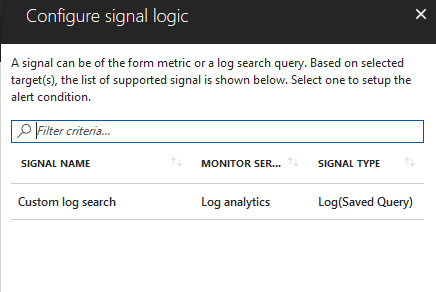
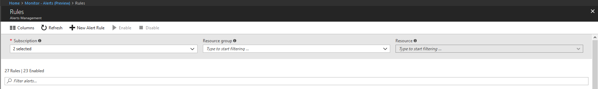

# Log Analytics based alerts in Azure Monitor for Azure services - Alerts (Preview)
> [!div class="op_single_selector"]
> * [Portal](insights-alerts-unified.md)
>

## Overview
This article shows you how to set up Azure Log Search alerts for Log Analytics, using the new Alerts (Preview) interface inside Azure portal. 
**Log search results** - An alert can trigger on *result* returned by supported Azure analytics platforms, like Azure Log Analytics, for a scheduled custom query. 

An alert can on triggering push information or notification using [Action Groups](monitoring-action-groups). While Action Groups support many means of communicating an alert, a few are mentioned below:

* send email notifications to the service administrator and co-administrators
* send email to additional emails that you specify.
* call a webhook and push JSON to Azure or external applications
* notify on mobile using SMS and/or Azure Mobile App. Learn more about the [Azure Mobile App](https://aka.ms/azureapp).
* Create incidents or tickets in popular IT Service Management tool using ITSM Connector. Learn more about [IT Service Management Connector](https://aka.ms/ITSMC).

> [!NOTE]
> While Azure Alerts (Preview) offers a new and enhanced experience for creating alerts in Azure. The older and existing [OMS Alerts](../log-analytics/log-analytics-alerts.md) will remain usable
>

## Create an alert rule using Log Analytics query with the Azure portal
1. In the [portal](https://portal.azure.com/), select **Monitor** and under the MONITOR section - choose **Alerts (Preview)**.  
    

2. Select the **Add Alert Rule** button to create a new alert in Azure.
    

3. Create the rule  by first clicking **Select Resource** link. Filter appropriately by choosing needed **Subscription**, **Resource Type** and finally selecting required **Resource**.
    

> [!IMPORTANT]
> For creating Log Analytics based Alerts (Preview), ensure the *resource type* chosen is **Log Analytics**. And then requisite workspace is selected from the *resource* dropdown

4. Once **resource** is selected, click **Add criteria** button and select from the signal list **Custom log search** option.
   

5.  Once selected, query for alerting can be stated in **Search Query** field; if the query syntax is incorrect the field displays error in RED. If the query syntax is correct - For reference historic data of the stated query is shown as a graph with option to tweak the time window from last six hours to last week. 
   

> [!NOTE]
> Historical data can only be shown if the query results in data, which have time details. If your query results in summarized data or specific tabular values - you can toggle to view as table instead

5. With the visualization in place, **Alert Logic** can be selected from shown options of Condition, Aggregation and finally Threshold. Finally specify in the logic, for what time Alerts should look for the specified condition by choosing from the **Period** option along with how often Alert should run by selecting **Frequency**

> [!TIP]
> Currently in Alerts (Preview) - log search alerts can be generated only on *Number of Records*; where Alerts will automatically summarize your query results for count and trigger alerts based Threshold value/condition specified

6. As the second step, define a name for your alert in the **Alert rule name** field along with a **Description** detailing specifics for the alert and **Severity** value from the options provided. These details are reused in all alert emails, notifications, or push done by Azure Monitor. Additionally, user can choose to immediately activate the alert rule on creation by appropriately toggling **Enable rule upon creation** option.

7. As the third and final step, specify if any **Action Group** needs to be triggered for the alert rule when alert condition is met. You can choose any existing Action Group with alert or create a new Action Group. According to selected Action Group, when alert is trigger Azure will: send email(s), send SMS(s), call Webhook(s), push to your ITSM tool, etc. Learn more about [Action Groups](monitoring-action-groups.md).

7. If all fields are valid and with green tick the **create alert rule** button can be clicked and Alert is created in Azure Monitor - Alerts (Preview). All Alerts can be viewed from the Alerts (Preview) Dashboard.
   

> [!NOTE]
> Alerts (Preview) currently doesn't support [querying across workspaces](https://azure.microsoft.com/en-us/blog/query-across-resources/). For more details and workaround, view [Alerts Known Issues](monitor-alerts-known-issues.md) page

Within a few minutes, the alert is active and triggers as previously described.

## Managing your log search alerts in Alerts (Preview)
1. In the [portal](https://portal.azure.com/), select **Monitor** and under the MONITOR section - choose **Alerts (Preview)**.  
2. Select the **Manage rules** button on the top bar, to navigate to the rule management section - where all  alert rules created are listed; including alerts that have been disabled.
3. To find for specific alert rules, one can either use the drop-down filters on top, which allow to shortlist alert rules for specific *Subscription, Resource Groups and/or Resource*. Ensure Resource Group is set to *log Analytics* for log search alerts. Alternatively on using the search pane above the alert rule list marked *Filter alerts*, one can provide keyword, which is matched against *Alert Name, Condition and Target Resource*; to show only matching rules. 
   
4. To view or modify specific Alert rule, click on its name that would be shown as a clickable link.
5. Alert defined is shown - in the three stage structure of: 1) Alert Condition 2) Alert Detail 3) Action Group. **Target Criteria** can be clicked to modify the alert logic or a new criteria can be added after using the bin icon to delete the earlier logic. Similarly, in Alert details section - **Description** and **Severity** can be modified. And the Action Group can be changed or a new one can be crafted to linking to the alert using the **New action group** button
   
6. Using the top panel, changes to the alert can be reflective including: *Save* to commit any changes done to alert, *Discard* to go back without committing any changes made to alert, *Disable* to deactivate the alert and prevent it from running without deletion and finally,  *Delete* to permanently remove the entire alert rule from Azure.

## Next steps
* [Get an overview of Azure Alerts (Preview)](monitoring-overview-unified.md) including the types of information you can collect and monitor.
* Learn about [Metric Alerts for Log Analytics in Azure Alerts (preview)](monitor-alerts-unified-metric.md)
* Learn more about [Log Analytics](../log-analytics/log-analytics-overview.md).    
* Learn more about [configuring webhooks in alerts](insights-webhooks-alerts.md).