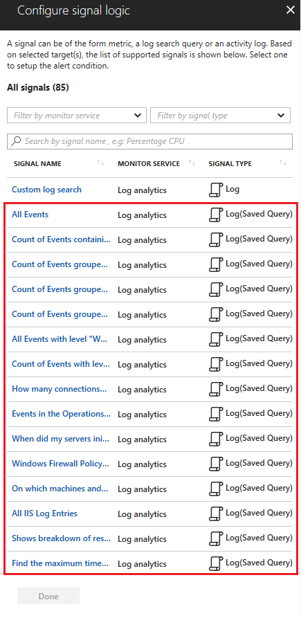

# Log alerts in Azure Monitor - Alerts 
This article provides details of Log alerts are one of the types of alerts supported within the new [Azure Alerts](monitoring-overview-unified-alerts.md) and allow users to use Azure's analytics platform as basis for alerting.

Log Alert consists of Log Search rules created for [Azure Log Analytics](../log-analytics/log-analytics-tutorial-viewdata.md) or [Application Insights](../application-insights/app-insights-cloudservices.md#view-azure-diagnostic-events). Pricing details for Log Alerts is available at the [Azure Monitor Pricing](https://azure.microsoft.com/en-us/pricing/details/monitor/) page. In Azure bills, Log Alerts are represented as type `microsoft.insights/scheduledqueryrules` with:
- Log Alerts on Application Insights shown with exact alert name along with resource group and alert properties
- Log Alerts on Log Analytics shown with alert name as `<WorkspaceName>|<savedSearchId>|<scheduleId>|<ActionId>` along with resource group and alert properties

    > [!NOTE]
    > The name for all saved searches, schedules, and actions created with the Log Analytics API must be in lowercase. If invalid characters such as `<, >, %, &, \, ?, /` are used - they will be replaced with `_` in the bill.

## Log search alert rule - definition and types

Log search rules are created by Azure Alerts to automatically run specified log queries at regular intervals.  If the results of the log query match particular criteria, then an alert record is created. The rule can then automatically run one or more actions using [Action Groups](monitoring-action-groups.md). 

Log search rules are defined by the following details:
- **Log Query**.  The query that runs every time the alert rule fires.  The records returned by this query are used to determine whether an alert is created. *Azure Application Insights* query can also include [cross-application calls](https://dev.applicationinsights.io/ai/documentation/2-Using-the-API/CrossResourceQuery), provided the user has access rights to the external applications. 

    > [!IMPORTANT]
    > Suppport of [cross application query for Application Insights](https://dev.applicationinsights.io/ai/documentation/2-Using-the-API/CrossResourceQuery) is in preview - the functionality limited to use with 2 or more apps and user experience is subject to change. Usage of [cross workspace query](https://dev.loganalytics.io/oms/documentation/3-Using-the-API/CrossResourceQuery) and [cross-resource query for Log Analytics](../log-analytics/log-analytics-cross-workspace-search.md) is currently **not supported**  in Azure alerts.

- **Time Period**.  Specifies the time range for the query. The query returns only records that were created within this range of the current time. Time period restricts the data fetched for log query to prevent abuse and circumvents any time command (like ago) used in log query.  *For example, If the time period is set to 60 minutes, and the query is run at 1:15 PM, only records created between 12:15 PM and 1:15 PM is returned to execute log query. Now if the log query uses time command like ago (7d), the log query would be run only for data between 12:15 PM and 1:15 PM - as if data exists for only the past 60 minutes. And not for seven days of data as specified in log query.*
- **Frequency**.  Specifies how often the query should be run. Can be any value between 5 minutes and 24 hours. Should be equal to or less than the time period.  If the value is greater than the time period, then you risk records being missed. *For example, consider a time period of 30 minutes and a frequency of 60 minutes.  If the query is run at 1:00, it returns records between 12:30 and 1:00 PM.  The next time the query would run is 2:00 when it would return records between 1:30 and 2:00.  Any records created between 1:00 and 1:30 would never be evaluated.*
- **Threshold**.  The results of the log search are evaluated to determine whether an alert should be created.  The threshold is different for the different types of log search alert rules.

Log search rules be it for [Azure Log Analytics](../log-analytics/log-analytics-tutorial-viewdata.md) or [Application Insights](../application-insights/app-insights-cloudservices.md#view-azure-diagnostic-events), can be of two types. Each of these types is described in detail in the sections that follow.

- **[Number of results](#number-of-results-alert-rules)**. Single alert created when the number records returned by the log search exceed a specified number.
- **[Metric measurement](#metric-measurement-alert-rules)**.  Alert created for each object in the results of the log search with values that exceed specified threshold.

The differences between alert rule types are as follows.

- *Number of results* alert rules always creates a single alert, while *Metric measurement* alert rule creates an alert for each object that exceeds the threshold.
- *Number of results* alert rules create an alert when the threshold is exceeded a single time. *Metric measurement* alert rules can create an alert when the threshold is exceeded a certain number of times over a particular time interval.

### Number of results alert rules
**Number of results** alert rules create a single alert when the number of records returned by the search query exceed the specified threshold. This type of alert rule is ideal for working with events such as Windows event logs, Syslog, WebApp Response, and Custom logs.  You may want to create an alert when a particular error event gets created, or when multiple error events are created within a particular time period.

**Threshold**: The threshold for a Number of results alert rules is greater than or less than a particular value.  If the number of records returned by the log search match this criteria, then an alert is created.

To alert on a single event, set the number of results to greater than 0 and check for the occurrence of a single event that was created since the last time the query was run. Some applications may log an occasional error that shouldn't necessarily raise an alert.  For example, the application may retry the process that created the error event and then succeed the next time.  In this case, you may not want to create the alert unless multiple events are created within a particular time period.  

In some cases, you may want to create an alert in the absence of an event.  For example, a process may log regular events to indicate that it's working properly.  If it doesn't log one of these events within a particular time period, then an alert should be created.  In this case, you would set the threshold to **less than 1**.

#### Example
Consider a scenario where you want to know when your web-based App gives a response to users with code 500 (that is) Internal Server Error. You would create an alert rule with the following details:  
- **Query:** requests | where resultCode == "500" 
- **Time period:** 30 minutes 
- **Alert frequency:** five minutes 
- **Threshold value:** Greater than 0 

Then alert would run the query every 5 minutes, with 30 minutes of data - to look for any record where result code was 500. If even one such record is found, it fires the alert and triggers the action configured.

### Metric measurement alert rules

- **Metric measurement** alert rules create an alert for each object in a query with a value that exceeds a specified threshold.  They have the following distinct differences from **Number of results** alert rules.
- **Aggregate function**: Determines the calculation that is performed and potentially a numeric field to aggregate.  For example, **count()** returns the number of records in the query, **avg(CounterValue)** returns the average of the CounterValue field over the interval. Aggregate function in query must be named/called: AggregatedValue and provide a numeric value. 
- **Group Field**: A record with an aggregated value is created for each instance of this field, and an alert can be generated for each.  For example, if you wanted to generate an alert for each computer, you would use **by Computer** 

    > [!NOTE]
    > For Metric measurement alert rules that are based on Application Insights, you can specify the field for grouping the data. To do this, use the **Aggregate on** option in the rule definition.   
    
- **Interval**:  Defines the time interval over which the data is aggregated.  For example, if you specified **five minutes**, a record would be created for each instance of the group field aggregated at 5-minute intervals over the time period specified for the alert.

    > [!NOTE]
    > Bin function must be used in query to specify interval. As bin() can result in unequal time intervals  - Alert will automatically convert bin command to  bin_at command with appropriate time at runtime, to ensure results with a fixed point
    
- **Threshold**: The threshold for Metric measurement alert rules is defined by an aggregate value and a number of breaches.  If any data point in the log search exceeds this value, it's considered a breach.  If the number of breaches in for any object in the results exceeds the specified value, then an alert is created for that object.

#### Example
Consider a scenario where you wanted an alert if any computer exceeded processor utilization of 90% three times over 30 minutes.  You would create an alert rule with the following details:  

- **Query:** Perf | where ObjectName == "Processor" and CounterName == "% Processor Time" | summarize AggregatedValue = avg(CounterValue) by bin(TimeGenerated, 5m), Computer 
- **Time period:** 30 minutes 
- **Alert frequency:** five minutes 
- **Aggregate value:** Greater than 90 
- **Trigger alert based on:** Total breaches Greater than 2 

The query would create an average value for each computer at 5-minute intervals.  This query would be run every 5 minutes for data collected over the previous 30 minutes.  Sample data is shown below for three computers.

In this example, separate alerts would be created for srv02 and srv03 since they breached the 90% threshold 3 times over the time period.  If the **Trigger alert based on:** were changed to **Consecutive** then an alert would be created only for srv03 since it breached the threshold for three consecutive samples.

## Log search alert rule - creation and modification

Log alert as well as its consisting log search alert rule can be viewed, created, or modified from:
- Azure portal
- REST APIs (including via PowerShell)
- Azure Resource Manager Templates

### Azure portal
Since the introduction of the [new Azure alerts](monitoring-overview-unified-alerts.md), now users can manage all types of alerts in Azure portal from a single location and with similar steps for usage. Learn more about [using new Azure Alerts](monitor-alerts-unified-usage.md).

Also, users can perfect their queries in Analytics platform of choice in Azure and then *import them for use in Alerts  by saving the query*. Steps to follow:
- *For Application Insights*: Go-to Analytics portal, validate query and its results. Then save with unique name into *Shared Queries*.
- *For Log Analytics*: Go-to Log Search, validate query and its results. Then use save with unique name into any category.

Then when [creating a log alert in Alerts ](monitor-alerts-unified-usage.md), you see the saved query listed as signal type **Log (Saved Query)**; as illustrated in below example:
 

> [!NOTE]
> Using **Log (Saved Query)** results in an import to Alerts. Hence any changes done after in Analytics will not be reflective in log search alert rules and vice-versa.

### REST APIs
APIs provided for Log alerts are RESTful and can be accessed via the Azure Resource Manager REST API. Hence can be accessed over PowerShell, as well other options to leverage the APIs.

For details as well as examples on using REST API, kindly refer to:
- [Log Analytics Alert REST API](../log-analytics/log-analytics-api-alerts.md) -  to create and manage log search alert rules for Azure Log Analytics
- [Azure Monitor Scheduled Query Rules REST API](https://docs.microsoft.com/rest/api/monitor/scheduledqueryrules/) - to create and manage log search alert rules for Azure Application Insights

### Azure Resource Manager Template
Users can also use the flexibility provided by [Azure Resource Manager](../azure-resource-manager/resource-group-overview.md) to create and update resources - for creating or updating Log alerts.

For details as well as examples on using Resource Manager templates, kindly refer to:
- [Saved search and alerts management](monitor-alerts-unified-log-template.md#managing-log-alert-on-log-analytics) for log alerts based on Azure Log Analytics
- [Scheduled Query Rule](monitor-alerts-unified-log-template.md#managing-log-alert-on-application-insights) for log alerts based on Azure Application Insights
 

## Next steps
* Understand [webhooks in log alerts in Azure](monitor-alerts-unified-log-webhook.md).
* Learn about the new [Azure Alerts](monitoring-overview-unified-alerts.md).
* Learn more about [Application Insights](../application-insights/app-insights-analytics.md).
* Learn more about [Log Analytics](../log-analytics/log-analytics-overview.md).    
