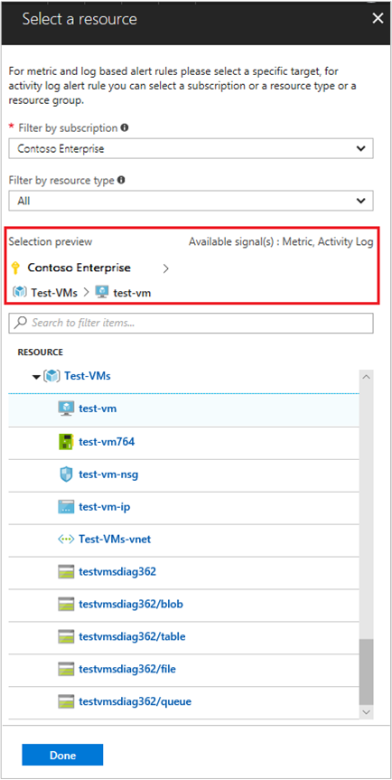
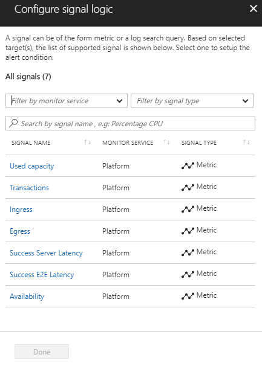
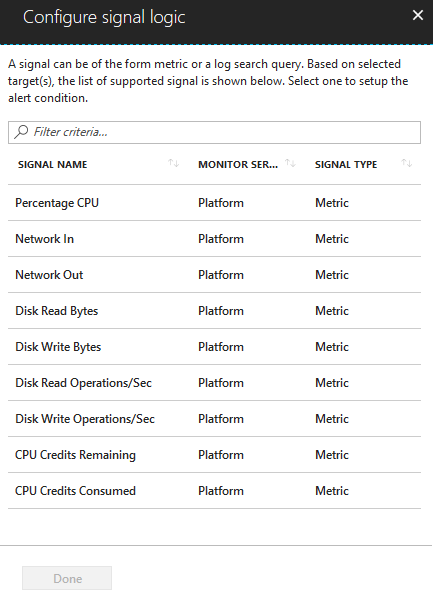
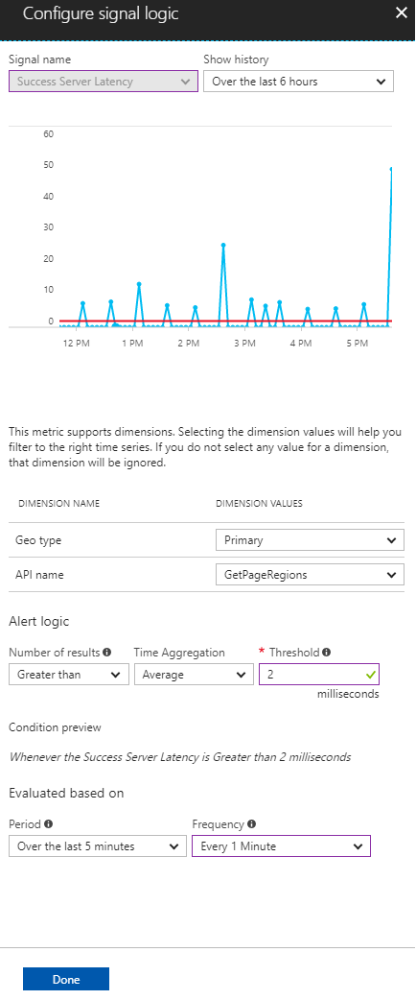
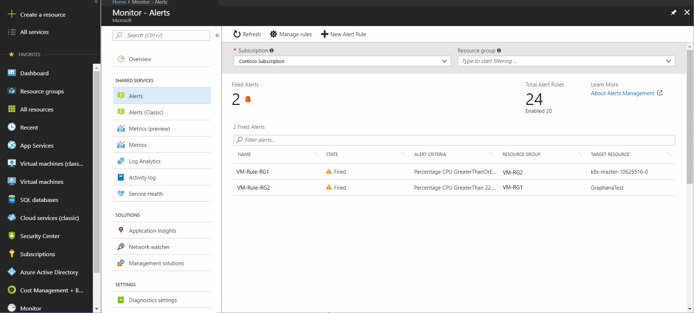
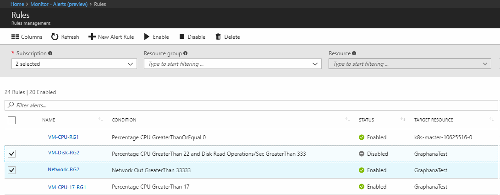
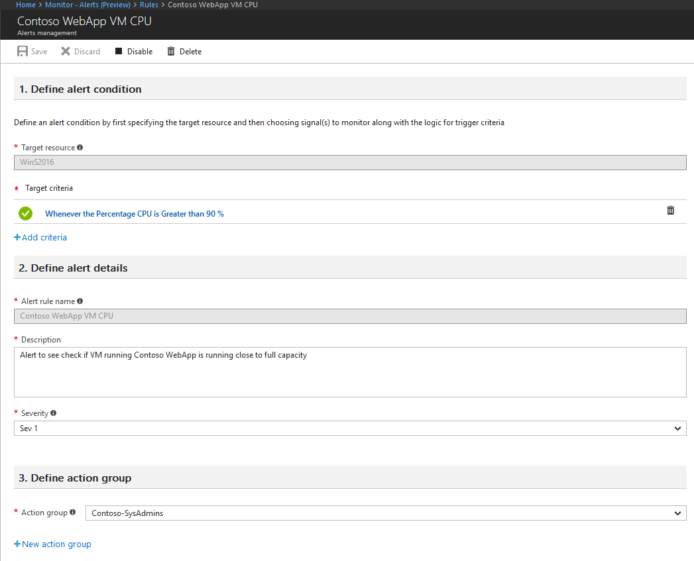

---
title: "Create, view and manage alerts Using Azure Monitor"
description: Use the new unified Azure alerts experience to author, view and manage metric and log alert rules from one place.
author: msvijayn
services: azure-monitor
ms.service: azure-monitor
ms.topic: conceptual
ms.date: 02/05/2018
ms.author: vinagara
ms.component: alerts
---
# Create, view, and manage alerts using Azure Monitor  

## Overview
This article shows you how to set up alerts using the new alerts interface inside Azure portal. Definition of an alert rule is in three parts:
- Target: Specific Azure resource, which is to be monitored
- Criteria: Specific condition or logic that when seen in Signal, should trigger action
- Action: Specific call sent to a receiver of a notification - email, SMS, webhook etc.

Azure alerts also provides a unified view to all your alert rules and ability to manage them a single place; including viewing any unresolved alerts. Learn more about functionality from [Azure alerts - Overview](monitoring-overview-unified-alerts.md).

Alert uses the term **Log Alerts** to describe alerts where signal is custom query based on [Log Analytics](../log-analytics/log-analytics-tutorial-viewdata.md) or [Application Insights](../application-insights/app-insights-analytics.md). The [new metric alert capability](monitoring-near-real-time-metric-alerts.md) provides ability to alert on [multidimensional metrics](monitoring-metric-charts.md) for specific Azure resources. The alerts for such resource can use additional filters on dimensions creating **Multi-Dimensional Metric Alerts**.

> [!NOTE]
> While Azure alerts offers a new and enhanced experience for creating alerts in Azure. The existing [alerts (classic)](monitoring-overview-alerts.md) experience remains usable.
>

Detailed next is step-by-step guide to using Azure alerts.

## Create an alert rule with the Azure Portal
1. In the [portal](https://portal.azure.com/), select **Monitor** and under the MONITOR section - choose **Alerts**.  
    

1. Select the **New Alert Rule** button to create a new alert in Azure.
    

1. The Create Alert section is shown with the three parts consisting of: *Define alert condition*, *Define alert details*, and *Define action group*.

    

1.  Define the alert condition by using the **Select Resource** link and specifying the target, by selecting a resource. Filter by choosing the *Subscription, *Resource Type, and finally selecting required *Resource*.

    >[!NOTE]

    > Verify the signals available for the selected resource before you proceed.

    

 The user interface allows you to create various types of alerts from one place. Based on the type of alert desired choose the next step as:

    - For **Metric Alerts**: follow steps 5 to 7; then go directly to step 11
    - For **Log Alerts**, jump to step 8.

    > [!NOTE]

    > Activity Log alerts are also supported, but are in preview. [Learn more](monitoring-activity-log-alerts-new-experience.md).

1. *Metric Alerts*: Ensure **Resource Type** is selected with signal type as **Metric**, then once appropriate **resource** is chosen click *Done* button to return to the Create Alert. Next use the **Add criteria** button to choose the specific signal from list of signal options, their monitoring service, and type listed - which are available for the resource selected earlier.

    

    > [!NOTE]

    >  All [near real time alerts](monitoring-near-real-time-metric-alerts.md) capable resources are listed with monitor service **Platform** and signal type as **Metric**

1. *Metric Alerts*: Once signal is selected, logic for alerting can be stated. For reference, historic data of signal is shown with option to tweak the time window using **Show History**, varying from last six hours to last week. With the visualization in place, **Alert Logic** can be selected from shown options of Condition, Aggregation and finally Threshold. As preview of the logic provided, the condition is shown in the visualization along with signal history, to indicate when the alert would have triggered. Finally specify for what time duration, Alert should look for the specified condition by choosing from the **Period** option along with how often Alert should run by selecting **Frequency**.

    

1. *Metric Alerts*: If Signal is a metric, then alert window can be filtered using multiple data points or dimensions for the said Azure resource. 

    a. Choose a duration from the **Show History** dropdown to visualize a different period of time. You can choose dimensions for the supported metrics to filter on a time series; choosing dimensions is optional and up-to five dimensions can be used. 

    b. **Alert Logic** can be selected from shown options of *Condition*, *Aggregation, and  *Threshold*. As preview of the logic provided, the condition is shown in the visualization along with signal history, to indicate when the alert would have been triggered in the past. 

    c. To specify the time duration, choose **Period** along with how often alert should run by selecting **Frequency**.

    

1. *Log Alerts*: Ensure **Resource Type** is an analytics source like *Log Analytics* or *Application Insights* and signal type as **Log**, then once appropriate **resource** is chosen, click *Done*. Next use the **Add criteria** button to view list of signal options available for the resource and from the signal list **Custom log search** option for chosen log monitor service like *Log Analytics* or *Application Insights*.

   

   > [!NOTE]

   > Alerts lists can import analytics query as signal type - **Log (Saved Query)**, as seen in above illustration. So users can perfect your query in Analytics and then save them for future use in alerts - more details on using saving query available at [using log search in log analytics](../log-analytics/log-analytics-log-searches.md) or [shared query in application insights analytics](../log-analytics/log-analytics-overview.md). 

1.  *Log Alerts*: Once selected, query for alerting can be stated in **Search Query** field; if the query syntax is incorrect the field displays error in RED. If the query syntax is correct - For reference historic data of the stated query is shown as a graph with option to tweak the time window from last six hours to last week.

 

 > [!NOTE]

    > Historical data visualization can only be shown if the query results have time details. If your query results in summarized data or specific column values - same is shown as a singular plot.

    >  For Metric Measurement type of Log Alerts using Application insights, you can specify which specific variable to group the data by using the **Aggregate on** option; as illustrated in below:

    

1.  *Log Alerts*: With the visualization in place, **Alert Logic** can be selected from shown options of Condition, Aggregation and finally Threshold. Finally specify in the logic, the time to assess for the specified condition, using **Period** option. Along with how often Alert should run by selecting **Frequency**.
For **Log Alerts** alerts can be based on:
   - *Number of Records*: An alert is created if the count of records returned by the query is either greater than or less than the value provided.
   - *Metric Measurement*: An alert is created if each *aggregate value* in the results exceeds the threshold value provided and it is *grouped by* chosen value. The number of breaches for an alert is the number of times the threshold is exceeded in the chosen time period. You can specify Total breaches for any combination of breaches across the results set or Consecutive breaches to require that the breaches must occur in consecutive samples. Learn more about [Log Alerts and their types](monitor-alerts-unified-log.md).

    > [!TIP]
    > Currently in alerts - log search alerts can take custom *period* and *frequency* value in minute(s). Values can vary from 5 minutes to 1440 minutes (that is) 24 hours. So if you want alert period to be say three hours, convert it into minutes - 180 minutes, before use

1. As the second step, define a name for your alert in the **Alert rule name** field along with a **Description** detailing specifics for the alert and **Severity** value from the options provided. These details are reused in all alert emails, notifications, or push done by Azure Monitor. Additionally, user can choose to immediately activate the alert rule on creation by appropriately toggling **Enable rule upon creation** option.

    For **Log Alerts** only, some additional functionality is available in Alert details:

    - **Suppress Alerts**: When you turn on suppression for the alert rule, actions for the rule are disabled for a defined length of time after creating a new alert. The rule is still running and creates alert records provided the criteria is met. Allowing you time to correct the problem without running duplicate actions.

        

        > [!TIP]
        > Specify an suppress alert value greater than frequency of alert to ensure notifications are stopped without overlap

1. As the third and final step, specify if any **Action Group** needs to be triggered for the alert rule when alert condition is met. You can choose any existing Action Group with alert or create a new Action Group. According to selected Action Group, when alert is trigger Azure will: send email(s), send SMS(s), call Webhook(s), remediate using Azure Runbooks, push to your ITSM tool, etc. Learn more about [Action Groups](monitoring-action-groups.md).

    For **Log Alerts** some additional functionality is available to override the default Actions:

    - **Email Notification**: Overrides *e-mail subject* in the email, sent via Action Group; if one or more email actions exist in the said Action Group. You cannot modify the body of the mail and this field is **not** for email address.
    - **Include custom Json payload**: Overrides the webhook JSON used by Action Groups; if one or more webhook actions exist in the said Action Group. User can specify format of JSON to be used for all webhooks configured in associated Action Group; for more information on webhook formats, see [webhook action for Log Alerts](monitor-alerts-unified-log-webhook.md). Test Webhook option is provided to check format and processing by destination using sample JSON and this option as labeled meant only for **testing** purposes.

        

        > [!NOTE]
        > For **Test Webhook** option to work, the endpoint should support [Cross Origin Resource Sharing (CORS)](https://www.w3.org/TR/cors/) and user's can use CORS proxy to get around “No Access-Control-Allow-Origin header” problems

1. If all fields are valid and with green tick the **create alert rule** button can be clicked and an alert is created in Azure Monitor - Alerts. All alerts can be viewed from the alerts Dashboard.

    

    Within a few minutes, the alert is active and triggers as previously described.

## View your alerts in Azure Portal

1. In the [portal](https://portal.azure.com/), select **Monitor** and under the MONITOR section - choose **Alerts**.  

1. The **Alerts Dashboard** is displayed - wherein all Azure Alerts are unified and displayed in a singular board
   
1. From Top Left to Right, the Dashboard shows at a glance, the following - which can be clicked to see a detailed listing:
    - *Fired Alerts*: The number of Alerts currently, which have met logic and in fired state
    - *Total Alert Rules*: The number of Alert rules created and in subtext, the number that are currently enabled 
    

        > [!NOTE]
        > To ensure consistent dashboard with details on all fired alerts including log alerts for application insights and log analytics; [Enhanced unified alert (preview)](monitoring-overview-unified-alerts.md#enhanced-unified-alerts-public-preview) should be used
  
  
1. A list of all fired alerts is shown which the user can click to view details
1. Aiding in finding specific the alerts; one can use the dropdown options on top for filtering specific *Subscription, Resource Group and/or Resource*. Further for any unresolved alert, one use the *Filter alert* option to find for provided keyword - specific matching alerts with *Name, Alert Criteria, Resource Group, and Target Resource*

## Managing your alerts in Azure Portal
1. In the [portal](https://portal.azure.com/), select **Monitor** and under the MONITOR section - choose **Alerts**.  
1. Select the **Manage rules** button on the top bar, to navigate to the rule management section - where all  alert rules created are listed; including alerts that have been disabled.
1. To find for specific alert rules, one can either use the drop-down filters on top, which allow to shortlist alert rules for specific *Subscription, Resource Groups and/or Resource*. Alternatively on using the search pane above the alert rule list marked *Filter alerts*, one can provide keyword, which is matched against *Alert Name, Condition, and Target Resource*; to show only matching rules.
   
1. To view or modify specific Alert rule, click on its name that would be shown as a clickable link.
1. Alert defined is shown - in the three stage structure of: 1) Alert Condition 2) Alert Detail 3) Action Group. **Target Criteria** can be clicked to modify the alert logic or  a new criteria can be added after using the bin icon to delete the earlier logic. Similarly, in Alert details section - **Description** and **Severity** can be modified. And the Action Group can be changed or a new one can be crafted to linking to the alert using the **New action group** button.

   

1. Using the top panel, changes to the alert can be reflective including: **Save** to commit any changes done to alert, **Discard** to go back without committing any changes made to alert, **Disable** to deactivate the alert - after which it no longer runs or triggers any action. And finally,  **Delete** to permanently remove the entire alert rule from Azure.

## Next steps

- Learn more about the new [near real-time metric alerts](monitoring-near-real-time-metric-alerts.md)
- Get an [overview of metrics collection](insights-how-to-customize-monitoring.md) to make sure your service is available and responsive.
- Learn about [Log Alerts in Azure Alerts](monitor-alerts-unified-log.md)
- [Learn about Activity log alerts in Alerts (Preview) experience](monitoring-activity-log-alerts-new-experience.md)
