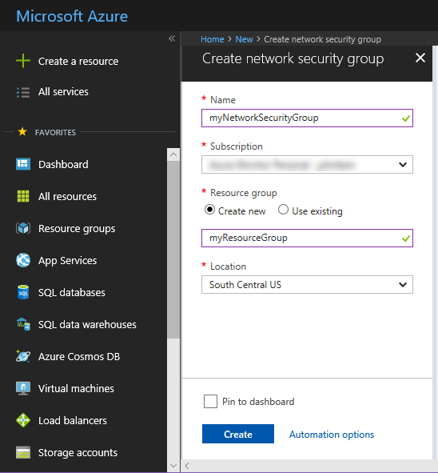
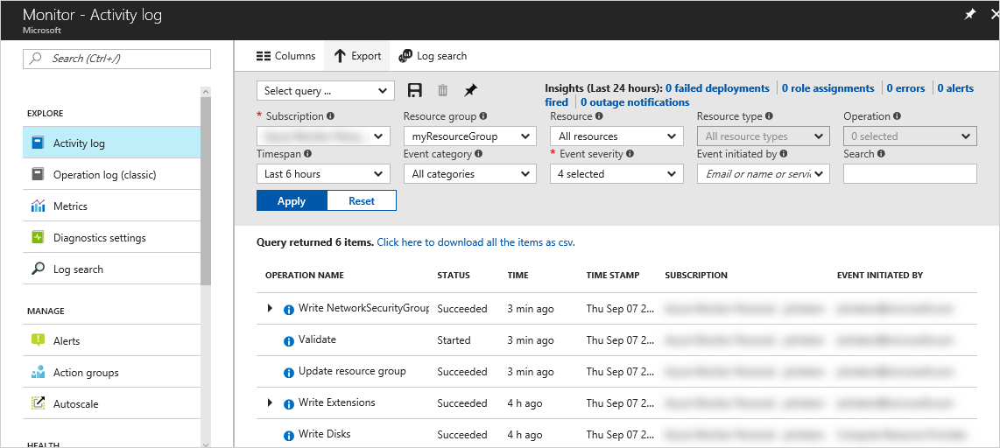
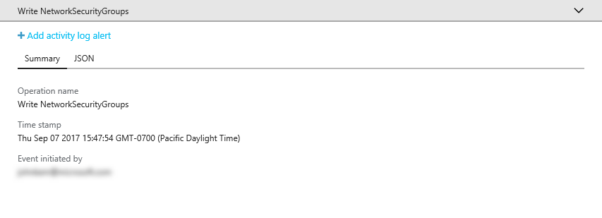
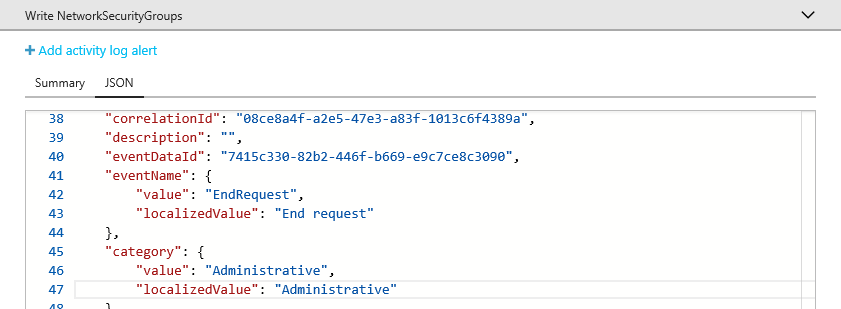
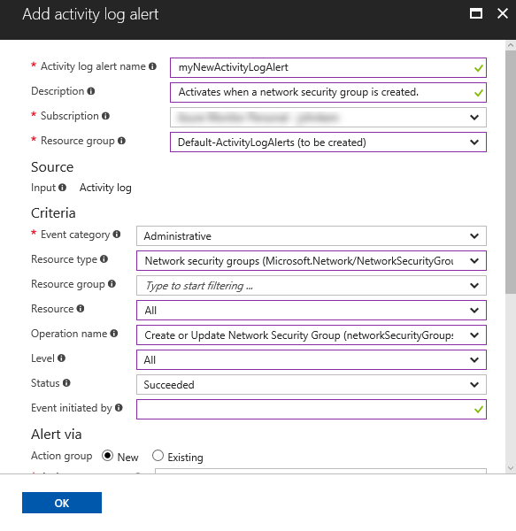
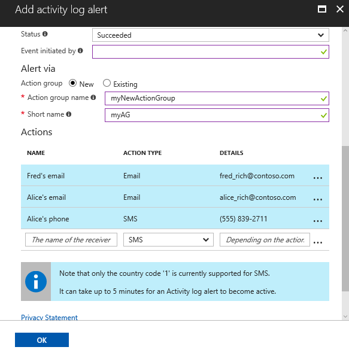

# Audit and receive notifications about important actions in your Azure subscription

The **Azure Activity Log** provides a history of subscription-level events in Azure. It offers information about *who* created, updated, or deleted *what* resources and *when* they did it. You can create an **Activity Log alert** to receive email, SMS, or webhook notifications when an activity occurs that match your alert conditions. This Quickstart steps through creating a simple network security group, browsing the Activity Log to understand the event that occurred, and then authoring an Activity Log alert to become notified when any network security group is created going forwards.

If you don't have an Azure subscription, create a [free](https://azure.microsoft.com/free/) account before you begin.

## Log in to the Azure portal

Log in to the [Azure portal](https://portal.azure.com/).

## Create a network security group

1. Click the **Create a resource** button found on the upper left-hand corner of the Azure portal.

2. Select **Networking**, select **Network security group**.

3. Enter "myNetworkSG" as the **Name** and create a new resource group named **myResourceGroup**. Click the **Create** button.

    

## Browse the Activity Log in the portal

An event has now been added to the Activity Log that describes the creation of the network security group. Use the following instructions to identify that event.

1. Click the **Monitor** button found on the left-hand navigation list. It opens to the Activity Log section. This section contains a history of all actions that users have performed on resources in your subscription, filterable by several properties such as the **Resource Group**, **Timespan**, and **Category**.

2. In the **Activity Log** section, click the **Resource Group** dropdown and select **myResourceGroup**. Change the **Timespan** dropdown to **Last 1 hour**. Click **Apply**.

    

3. Click on the **Write NetworkSecurityGroups** event in the table of events shown.

## Browse an event in the Activity Log

The section that appears contains basic details of the operation that was performed, including the name, the timestamp, and the user or application that performed it.

Click on the **JSON** tab to view the full event details. This includes the details of how the user or application was authorized to perform the operation, the event category and level, and the status of the operation.

## Create an Activity Log alert

1. Click on the **Summary** tab to return to the event summary.

2. In the summary section that appears, click **Add activity log alert**.

    

3. In the section that appears, give the Activity Log alert a name and description.

4. Under **Criteria** ensure that **Event category** is set to **Administrative**, **Resource type** is set to **Network security groups**, **Operation name** is set to **Create or Update Network Security Group**, **Status** is set to **Succeeded** and all other criteria fields are either blank or set to **All**. The criteria define the rules used to determine whether the alert should be activated when a new event appears in the Activity Log.

    

5. Under **Alert via** select **New** action group and provide a **name** and **short name** for the action group. The action group defines the set of actions taken when the alert is activated (when the criteria match a new event).

6. Under **Actions** add 1 or more actions by providing a **Name** for the action, the **Action type** (for example, email, SMS, or webhook), and **Details** for that particular action type (for example, a webhook URL, email address, or SMS number).

    

7. Click **Ok** to save the Activity Log alert.

## Test the Activity Log alert

> [!NOTE]
> It takes approximately 5 minutes for an Activity Log alert to become fully enabled. New events that occur before the Activity Log alert is fully enabled do not generate notifications.
>
>

To test the alert, repeat the preceding section to **Create a network security group**, but give this network security group a different name and reuse the existing resource group. Within a few minutes, you will receive a notification that the network security group was created.

## Clean up resources

When no longer needed, delete the resource group and network security group. To do so, type the name of the resource group you created into the search box at the top of the portal, and click on the name of the resource group. In the section that is displayed, click the **Delete resource group** button, type the name of the resource group, and click **Delete**.

## Next steps

In this quick start, you performed an operation to generate an Activity Log event and then created an Activity Log alert to become notified when this operation occurs again in the future. You then tested the alert by performing that operation again. Azure makes available Activity Log events from the past 90 days. If you need to retain events longer than 90 days, try archiving your Activity Log data alongside your other monitoring data.

> [!div class="nextstepaction"]
> [Archive monitoring data](./monitor-tutorial-archive-monitoring-data.md)
