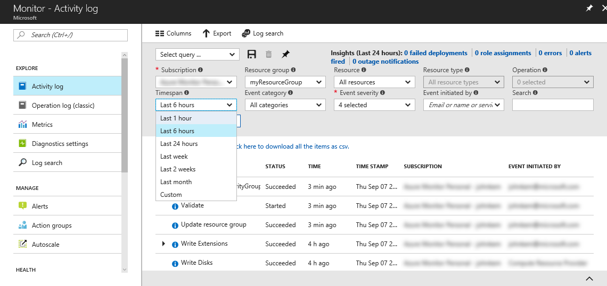

# Audit Azure subscription activity in the Azure portal

The **Azure Activity Log** provides a history of subscription-level events in Azure. You can browse it in the Azure portal to determine *who* created, updated, or deleted *what* resources and *when* they did it. This Quickstart steps through creating a simple network security group then browsing the Activity Log to understand the event that occurred.

If you don't have an Azure subscription, create a [free](https://azure.microsoft.com/free/) account before you begin.

## Log in to the Azure portal

Log in to the [Azure portal](https://portal.azure.com/).

## Create a network security group

1. Click the **New** button found on the upper left-hand corner of the Azure portal.

2. Select **Networking**, select **Network security group**.

3. Enter a name for the network security group and create a new resource group named **myResourceGroup**. Click the **Create** button.

    

## Browse the Activity Log in the portal

An event has now been added to the Activity Log that describes the creation of the network security group. Use the following instructions to identify that event.

1. Click the **Monitor** button found on the left-hand navigation list. This will open to the Activity Log section.

2. In the **Activity Log** section, click the **Resource Group** dropdown and select **myResourceGroup**. Change the **Timespan** dropdown to **Last 1 hour**. Click **Apply**.

    

3. Click on the **Write NetworkSecurityGroups** event in the table of events shown.

## Browse an event in the Activity Log

The section that appears contains basic details of the operation that was performed, including the name, the timestamp, and the user or application that performed it.

Click on the **JSON** tab to view the full event details. This includes the details of how the user or application was authorized to perform the operation, the event category and level, and the status of the operation.

## Clean up resources

When no longer needed, delete the resource group and network security group. To do so, select the **myResourceGroup** resource group and click **Delete**.

## Next steps

In this quick start, you've created a network security group and browsed to the Activity Log to view the details of that event and other subscription-level events. To learn more about the Azure Activity Log, continue to the overview of the Activity Log.

> [!div class="nextstepaction"]
> [Azure Monitor tutorials](./monitoring-overview-activity-logs.md)
