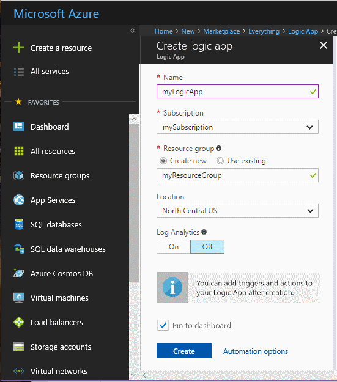
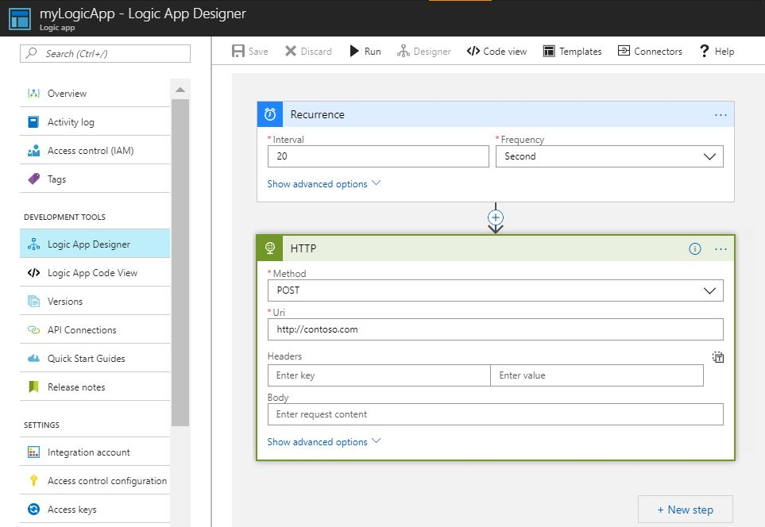

# Receive a notification when a metric value meets a condition

Azure Monitor makes metrics available for many Azure resources. These metrics convey the performance and health of those resources. In many cases metric values can point to something being wrong with a resource. You can create metric alerts to monitor for abnormal behavior and be notified if it occurs. This Quickstart steps through creating a Logic App, creating a job, and visualizing the metrics for the logic app. It then goes through creating an alert, and receiving a notification for a metric for the Logic App resource.

For more information on metrics and metric alerts, see  [Azure Monitor metrics overview](./monitoring-overview-metrics.md) and [Azure Monitor alerts overview](./monitoring-overview-alerts.md). 

If you don't have an Azure subscription, create a [free](https://azure.microsoft.com/free/) account before you begin.

## Sign in to the Azure portal

Sign in to the [Azure portal](https://portal.azure.com/).

## Create a Logic App

1. Click the **Create a resource** button found on the upper left-hand corner of the Azure portal.

2. Search for and select **Logic App**. Click the **Create** button.

3. Enter the name myLogicApp and the Resource Group myResourceGroup. Use your subscription.  Use the default location. Check the **Pin to Dashboard** option.  When complete, click **Create**. 

      

4. The logic app should be pinned to your dashboard. Navigate to the logic app by clicking on it.

5. In the Logic App panel, select the **Logic App Designer**

       

6. Set up your values as seen in the following diagram.

     

7. In the designer, select the **Recurrence** trigger.

8. Set an interval of 20 and a frequency of second to ensure your logic app is triggered every 20 seconds.

9. Click the **New Step** button, and select **Add an action**.

10. Choose the **HTTP** option, and select **HTTP-HTTP**.

11. Set the **Method** as POST and the **Uri** to a web address of your choice.

12. Click **Save**.

13. It may take up to 5 minutes for the logic app run actions to occur.  

## View metrics for your logic app

1. Click the **Monitor** option in the left-hand navigation pane.

2. Select the **Metrics** tab, fill in the **Subscription**, **Resource Group**, **Resource Type** and **Resource** information for your logic app.

3. From the list of metrics, choose **Runs Failed**.

4. Modify the **Time range** of the chart to display data for the past hour.

5. You should now see a chart plotting the total number of runs your logic app has started over the past hour. If you do not see any, make sure you have waited at least 5 minutes from the step above. Then refresh your browser. 

    

## Create a metric alert for your logic app

1.  In the top right portion of the metrics panel click the **Add metric alert** button.

2. Name your metric alert 'myLogicAppAlert', and provide a brief description for the alert.

3. Set the **Condition** for the metric alert as 'Greater than', set the **Threshold** as '10', and set the **Period** as 'Over the last 5 minutes'.

4. Finally, under **Additional administrator email(s)** enter your email address. This alert ensures that you receive an email in the event your logic app has more than 10 failed runs within a period of 5 minutes.

    

## Receive metric alert notifications for your logic app
1. Within a few moments, you should receive an email from 'Microsoft Azure Alerts' to inform you the alert has been 'activated'.

2. Navigate back to your logic app and modify the recurrence trigger to an interval of 1 and frequency of hour.

3. Within a few minutes, you should receive an email from 'Microsoft Azure Alerts' informing you the alert has been 'resolved'.

## Clean up resources

Other quick starts in this collection build upon this quickstart. If you plan to continue on to work with subsequent quick starts or with the tutorials, do not clean up the resources created in this quickstart. If you do not plan to continue, use the following steps to delete all resources created by this quickstart in the Azure portal.

1. From the left-hand menu in the Azure portal, click on **Monitor**.

2. Select the **Alerts** tab, find the alert you created in this quickstart guide and click on it.

3. In the metric alert panel, click **Delete**.

4. From the left-hand menu in the Azure portal, search for **Logic App** and then click **Logic apps**.

5. On the panel, click the logic app you created in this quickstart in the text box, and then click **Delete**.

## Next steps

In this quickstart, you’ve learned how to create a metric alert for your resources. For more information on metric alerts, click through to our overview on alerts.

> [!div class="nextstepaction"]
> [Azure Monitor subscription action alerts](./monitor-quick-audit-notify-action-in-subscription.md )
