# Create a Logic App action
## Overview ##
When an Azure Monitor alert triggers, it calls an [action group](monitoring-action-groups.md). Action groups allow you to trigger one or more actions to notify people of the alert and even remediate it.

This article shows how to set up and trigger a Logic App to create a conversation in Microsoft Teams when an alert fires.

The general process is:

-   Create the Logic App for the respective alert type

-   Import the schema for the respective alert type into the Logic App

-   Define the Logic App behavior

-   Copy the Logic App’s HTTP endpoint into an Azure Action Group

The process is similar if you want the Logic App to perform a different action.

## Create an Activity log alert – Administrative

1.  Click the **Create a resource** button found on the upper left-hand corner
    of the Azure portal.

2.  Search for and select **Logic App**. Click the **Create** button.

3.  Give your Logic App a name, choose a Resource group, etc.

    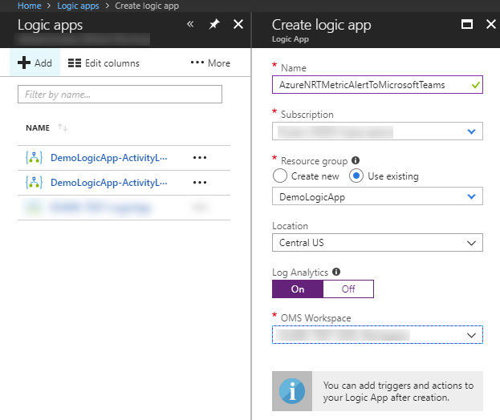

4.  Click the Create button to create the Logic App. A popup will be displayed when the Logic App has been created. Click on the Launch Resource button to open the Logic Apps designer.

5.  Select the trigger **When a HTTP request is received**.

    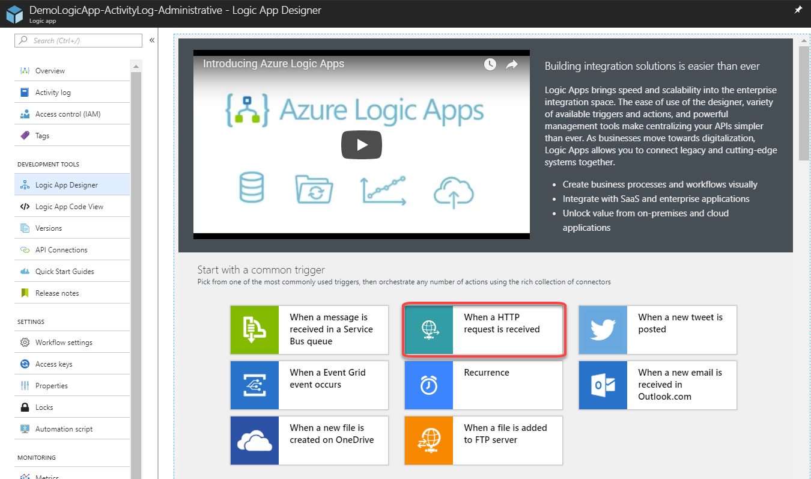

6.  Select **Edit** to change the HTTP request trigger

    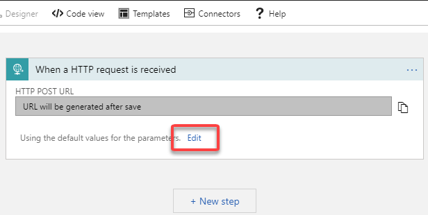

7.  Select **Use sample payload to generate schema**.

    

8.  Copy and paste the following sample schema into the dialog box.

    ```json
        {
            "schemaId": "Microsoft.Insights/activityLogs",
            "data": {
                "status": "Activated",
                "context": {
                "activityLog": {
                    "authorization": {
                    "action": "microsoft.insights/activityLogAlerts/write",
                    "scope": "/subscriptions/…"
                    },
                    "channels": "Operation",
                    "claims": "…",
                    "caller": "logicappdemo@contoso.com",
                    "correlationId": "91ad2bac-1afa-4932-a2ce-2f8efd6765a3",
                    "description": "",
                    "eventSource": "Administrative",
                    "eventTimestamp": "2018-04-03T22:33:11.762469+00:00",
                    "eventDataId": "ec74c4a2-d7ae-48c3-a4d0-2684a1611ca0",
                    "level": "Informational",
                    "operationName": "microsoft.insights/activityLogAlerts/write",
                    "operationId": "61f59fc8-1442-4c74-9f5f-937392a9723c",
                    "resourceId": "/subscriptions/…",
                    "resourceGroupName": "LOGICAPP-DEMO",
                    "resourceProviderName": "microsoft.insights",
                    "status": "Succeeded",
                    "subStatus": "",
                    "subscriptionId": "…",
                    "submissionTimestamp": "2018-04-03T22:33:36.1068742+00:00",
                    "resourceType": "microsoft.insights/activityLogAlerts"
                }
                },
                "properties": {}
            }
        }
    ```

9. The Logic App Designer will display a note reminding you that request sent to the Logic App must set the Content-Type header to application/json. Go ahead and dismiss the dialog. The Azure Monitor alert will do this correctly.

    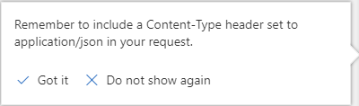

10. Select **+ New Step** and then choose **Add an action**.

    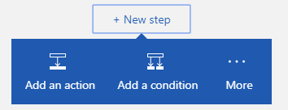

11. Search for and select the Microsoft Teams connector. Choose the **Microsoft Teams – Post message** action.

    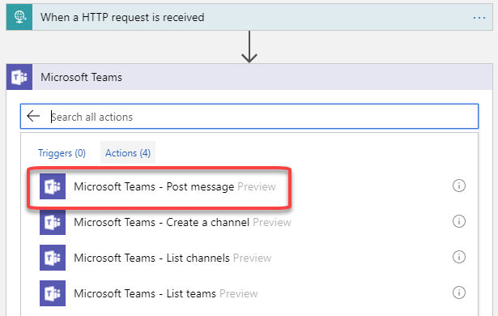

12. Configure the Microsoft Teams action. The Logic Apps Designer will ask you to authenticate to your Office365 account. Choose the **Team Id** and **Channel Id** to send the message to.

13. Configure the **Message** using a combination of static text and references to the \<fields\> in the Dynamic content. Cut and paste the following text into the Message field.

    ```text
      Activity Log Alert: <eventSource>
      operationName: <operationName>
      status: <status>
      resourceId: <resourceId>
    ```

    Then search for and replace the \<fields\> with Dynamic content tags of the same name.

    **[NOTE!]** There are two dynamic fields named **status**. Add both status fields to the message. Use the one in the activityLog property bag and delete the other. If you hover your mouse over the **status** field you will see the fully qualified field reference as shown in the screenshot

    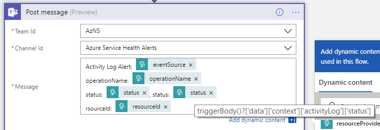

14. Save your Logic App by clicking the Save button at the top of the Designer

15. Click on the HTTP Request shape to cause it to expand. Copy the HTTP POST URL.

    

16. Open your existing Action Group and add an Action to reference the Logic App. If you don’t have an existing action group, see     <https://docs.microsoft.com/en-us/azure/monitoring-and-diagnostics/monitoring-action-groups> to create one. Don’t forget to save your changes.

    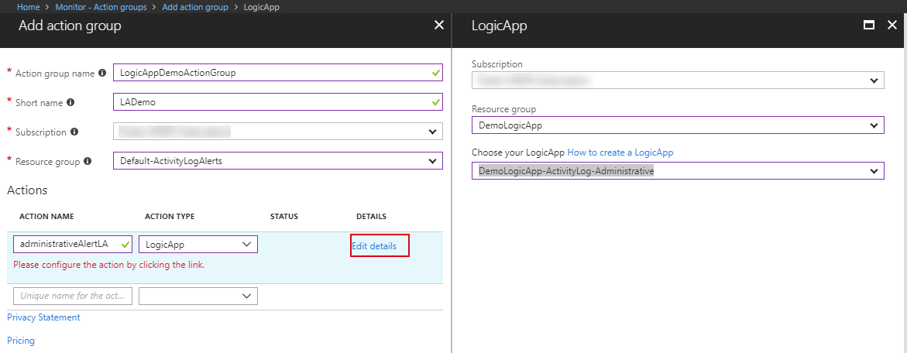

The next time an alert invokes your Action Group, your Logic App is called.

## Create a Service Health alert

Service health entries are part of the Activity log, so the process is similar with the following changes

1.  Steps 1 through 7 are the same.
2.  Use the following sample schema for the HTTP Trigger in step 8.

    ```json
    {
        "schemaId": "Microsoft.Insights/activityLogs",
        "data": {
            "status": "Activated",
            "context": {
                "activityLog": {
                    "channels": "Admin",
                    "correlationId": "e416ed3c-8874-4ec8-bc6b-54e3c92a24d4",
                    "description": "…",
                    "eventSource": "ServiceHealth",
                    "eventTimestamp": "2018-04-03T22:44:43.7467716+00:00",
                    "eventDataId": "9ce152f5-d435-ee31-2dce-104228486a6d",
                    "level": "Informational",
                    "operationName": "Microsoft.ServiceHealth/incident/action",
                    "operationId": "e416ed3c-8874-4ec8-bc6b-54e3c92a24d4",
                    "properties": {
                        "title": "…",
                        "service": "…",
                        "region": "Global",
                        "communication": "…",
                        "incidentType": "Incident",
                        "trackingId": "…",
                        "impactStartTime": "2018-03-22T21:40:00.0000000Z",
                        "impactMitigationTime": "2018-03-22T21:41:00.0000000Z",
                        "impactedServices": "[{"ImpactedRegions"}]",
                        "defaultLanguageTitle": "…",
                        "defaultLanguageContent": "…",
                        "stage": "Active",
                        "communicationId": "11000001466525",
                        "version": "0.1.1"
                    },
                    "status": "Active",
                    "subscriptionId": "…",
                    "submissionTimestamp": "2018-04-03T22:44:50.8013523+00:00"
                }
            },
            "properties": {}
        }
    }
    ```

3.  Steps 9 - 10 are the same.
4.  From Step 11 on use the process below.
5.  Click on the **+ New Step** button and choose **Add a condition**. Set the following conditions to ensure that the Logic App only executes when the input data matches these values
    - schemaId == Microsoft.Insights/activityLogs
    - eventSource == ServiceHealth
    - version == 0.1.1

    

6. In the **if true** condition, add the Microsoft Teams action using steps 11–13 from the previous example.

7. Define the Message using a combination of HTML and [dynamic content]. Copy and paste the content below into the message field. Replace the [incidentType], [trackingID], [title] and [communication] fields with dynamic content tags of the same name

    ```html
    <p>
    <b>Alert Type:</b>&nbsp;<strong>[incidentType]</strong>&nbsp;
    <strong>Tracking ID:</strong>&nbsp;[trackingId]&nbsp;
    <strong>Title:</strong>&nbsp;[title]</p>
    <p>
    <a href="https://ms.portal.azure.com/#blade/Microsoft_Azure_Health/AzureHealthBrowseBlade/serviceIssues">For details log into the Azure Service Health dashboard</a>
    </p>
    <p>[communication]</p>
    ```

    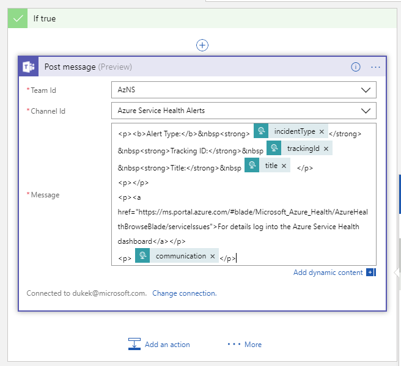

8. For the **If false** condition provide a useful Message

    ```html
    <p><strong>Service Health Alert</strong></p>
    <p><b>Unrecognized alert schema</b></p>
    <p><a href="https://ms.portal.azure.com/#blade/Microsoft_Azure_Health/AzureHealthBrowseBlade/serviceIssues">For details log into the Azure Service Health dashboard\</a></p>
    ```

    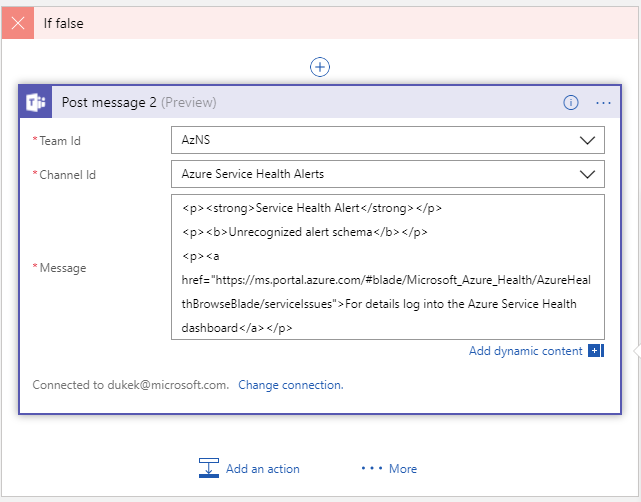

9.  Follow steps 15 – 16 of the previous example to save your Logic App and
    update your Action Group

## Metric Alert

1.  Steps 1 through 7 are the same as the first example
2.  Use the following sample schema for the HTTP Trigger in step 8.

    ```json
    {
    "schemaId": "AzureMonitorMetricAlert",
    "data": {
        "version": "2.0",
        "status": "Activated",
        "context": {
        "timestamp": "2018-04-09T19:00:07.7461615Z",
        "id": "…",
        "name": "TEST-VM CPU Utilization",
        "description": "",
        "conditionType": "SingleResourceMultipleMetricCriteria",
        "condition": {
            "windowSize": "PT15M",
            "allOf": [
                {
                    "metricName": "Percentage CPU",
                    "dimensions": [
                    {
                        "name": "ResourceId",
                        "value": "d92fc5cb-06cf-4309-8c9a-538eea6a17a6"
                    }
                ],
                "operator": "GreaterThan",
                "threshold": "5",
                "timeAggregation": "PT15M",
                "metricValue": 1.0
            }
            ]
        },
        "subscriptionId": "…",
        "resourceGroupName": "TEST",
        "resourceName": "test-vm",
        "resourceType": "Microsoft.Compute/virtualMachines",
        "resourceId": "…",
        "portalLink": "…"
        },
        "properties": {}
    }
    }
    ```

3.  Steps 9 - 10 are the same.
4.  From Step 11 on use the process below.
5.  Click on the **+ New Step** button and choose **Add a condition**. Set the following conditions to ensure that the Logic App only executes when the input data matches these values

    - schemaId == AzureMonitorMetricAlert
    - version == 2.0

    

6.  In the **if true** condition we will add a **For each** shape and the Microsoft Teams action and define the Message using a combination of HTML and [dynamic content]

    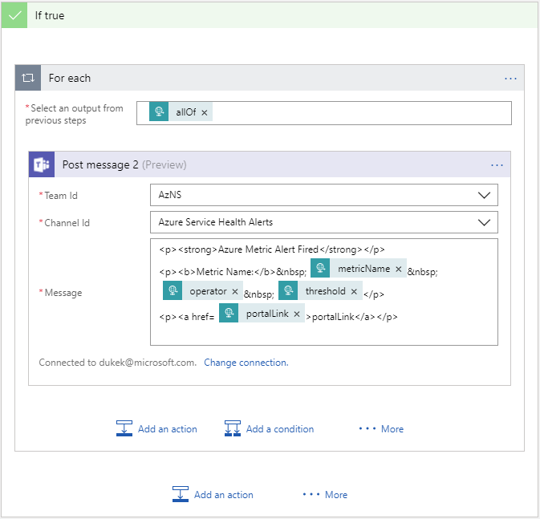

7.  In the **If false** shape, define a Microsoft Teams action which
    communicates that the Metric Alert doesn’t match the Logic App’s
    expectations and include the JSON payload. Note how we reference the
    triggerBody dynamic content in the json() expression.

    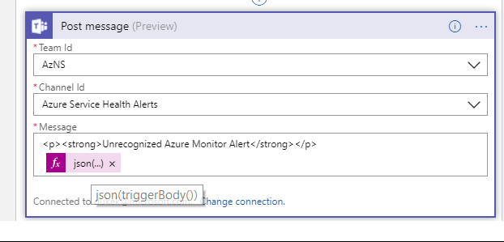

8.  Follow steps 15 – 16 of the first example to save your Logic App and
    update your Action Group

## Next steps ##
* Get an [overview of activity log alerts](monitoring-overview-alerts.md), and learn how to receive alerts.  
* Learn how to [configure alerts whenever a service health notification is posted](monitoring-activity-log-alerts-on-service-notifications.md).
* Learn more about [Action Groups](monitoring-action-groups.md)