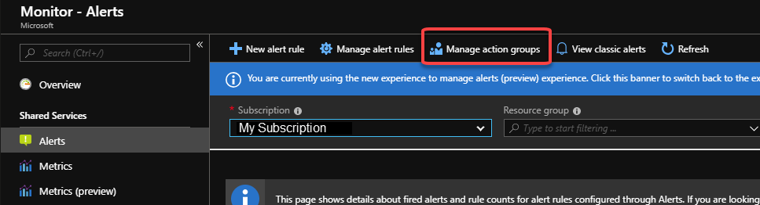

# Create and manage action groups in the Azure portal
## Overview ##
An action group is a collection of notification preferences defined by the user. Azure Monitor and Service Health alerts are configured to use a specific action group when the alert is triggered. Various alerts may use the same action group or different action groups depending on the user's requirements.

This article shows you how to create and manage action groups in the Azure portal.

Each action is made up of the following properties:

* **Name**: A unique identifier within the action group.  
* **Action type**: Send an Voice call or SMS, send an email, call a webhook, send data to an ITSM tool, call a Logic App, send a push notification to the Azure app, or run an Automation runbook.
* **Details**: The corresponding phone number, email address, webhook URI, or ITSM Connection Details.

For information on how to use Azure Resource Manager templates to configure action groups, see [Action group Resource Manager templates](monitoring-create-action-group-with-resource-manager-template.md).

## Create an action group by using the Azure portal ##
1. In the [portal](https://portal.azure.com), select **Monitor**. The **Monitor** blade consolidates all your monitoring settings and data in one view.

    
1. Select **Alerts** then select **Manage action groups**.

    
1. Select **Add action group**, and fill in the fields.

    
1. Enter a name in the **Action group name** box, and enter a name in the **Short name** box. The short name is used in place of a full action group name when notifications are sent using this group.

      

1. The **Subscription** box autofills with your current subscription. This subscription is the one in which the action group is saved.

1. Select the **Resource group** in which the action group is saved.

1. Define a list of actions by providing each action's:

    a. **Name**: Enter a unique identifier for this action.

    b. **Action Type**: Select Email/SMS/Push/Voice, Logic App, Webhook, ITSM, or Automation Runbook.

    c. **Details**: Based on the action type, enter a phone number, email address, webhook URI, Azure app, ITSM connection, or Automation runbook. For ITSM Action, additionally specify **Work Item** and other fields your ITSM tool requires.

1. Select **OK** to create the action group.

## Action specific information
<dl>
<dt>Azure app Push</dt>
<dd>You may have up to 10 Azure app actions in an Action Group.</dd>
<dd>At this time the Azure app action only supports ServiceHealth alerts. Any other alert time will be ignored. See [configure alerts whenever a service health notification is posted](monitoring-activity-log-alerts-on-service-notifications.md).</dd>

<dt>Email</dt>
<dd>Emails will be sent from the following email addresses. Ensure that your email filtering is configured appropriately
<ul>
    <li>azure-noreply@microsoft.com</li>
    <li>azureemail-noreply@microsoft.com</li>
    <li>alerts-noreply@mail.windowsazure.com</li>
</ul>
</dd>
<dd>You may have up to 1000 email actions in an Action Group</dd>
<dd>See the [rate limiting information](./monitoring-alerts-rate-limiting.md) article</dd>

<dt>ITSM</dt>
<dd>You may have up to 10 ITSM actions in an Action Group</dd>
<dd>ITSM Action requires an ITSM Connection. Learn how to create an [ITSM Connection](../log-analytics/log-analytics-itsmc-overview.md).</dd>

<dt>Logic App</dt>
<dd>You may have up to 10 Logic App actions in an Action Group</dd>

<dt>Runbook</dt>
<dd>You may have up to 10 Runbook actions in an Action Group</dd>
<dd>Refer to the [Azure subscription service limits](../azure-subscription-service-limits.md) for limits on Runbook payloads</dd>

<dt>SMS</dt>
<dd>You may have up to 10 SMS actions in an Action Group</dd>
<dd>See the [rate limiting information](./monitoring-alerts-rate-limiting.md) article</dd>
<dd>See the [SMS alert behavior](monitoring-sms-alert-behavior.md) article</dd>

<dt>Voice</dt>
<dd>You may have up to 10 Voice actions in an Action Group</dd>
<dd>See the [rate limiting information](./monitoring-alerts-rate-limiting.md) article</dd>

<dt>Webhook</dt>
<dd>You may have up to 10 Webhook actions in an Action Group
<dd>Retry logic - The timeout period for a response is 10 seconds. The webhook call will be retried a maximum of 2 times when the following HTTP status codes are returned: 408, 429, 503, 504 or the HTTP endpoint does not respond. The first retry happens after 10 seconds. The second and last retry happens after 100 seconds.</dd>
<dd>Source IP address ranges
<ul>
    <li>13.106.57.181</li>
    <li>13.106.54.3</li>
    <li>13.106.54.19</li>
    <li>13.106.38.142</li>
    <li>13.106.38.148</li>
    <li>13.106.57.196</li>
</ul>
To receive updates about changes to these IP addresses we recommend you configure a [Service Health alert](./monitoring-service-notifications.md) which monitors for Informational notifications about the Action Groups service.
</dd>
</dl>

## Manage your action groups ##
After you create an action group, it's visible in the **Action groups** section of the **Monitor** blade. Select the action group you want to manage to:

* Add, edit, or remove actions.
* Delete the action group.

## Next steps ##
* Learn more about [SMS alert behavior](monitoring-sms-alert-behavior.md).  
* Gain an [understanding of the activity log alert webhook schema](monitoring-activity-log-alerts-webhook.md).  
* Learn more about [ITSM Connector](../log-analytics/log-analytics-itsmc-overview.md)
* Learn more about [rate limiting](monitoring-alerts-rate-limiting.md) on alerts.
* Get an [overview of activity log alerts](monitoring-overview-alerts.md), and learn how to receive alerts.  
* Learn how to [configure alerts whenever a service health notification is posted](monitoring-activity-log-alerts-on-service-notifications.md).
