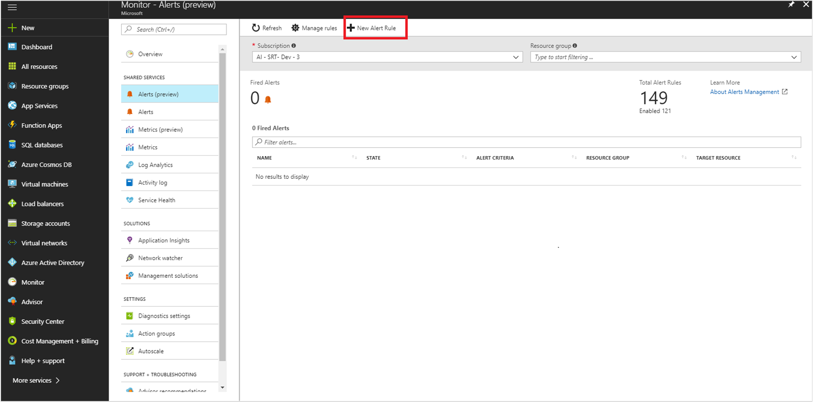
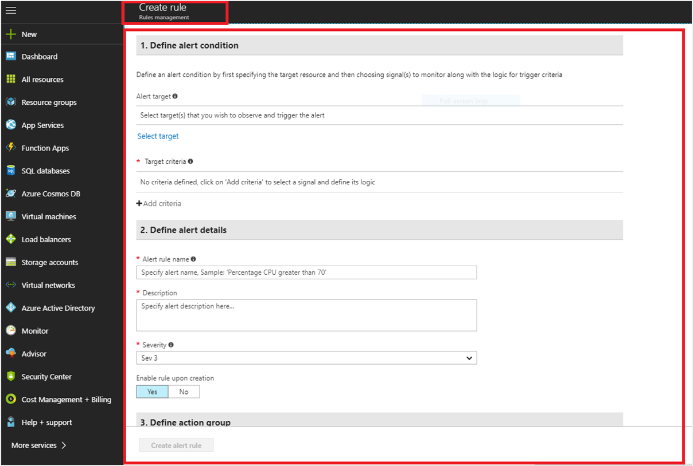
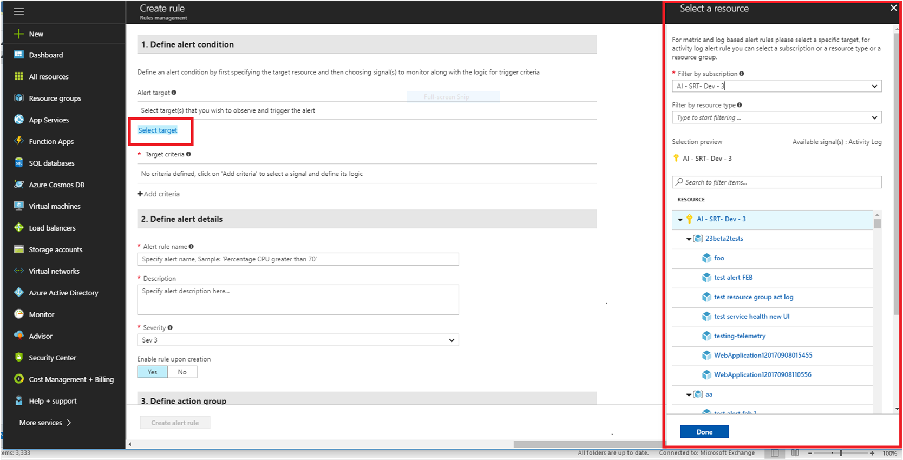
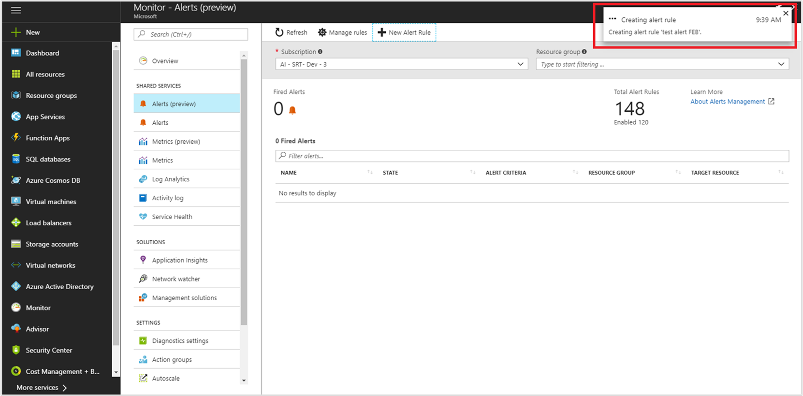
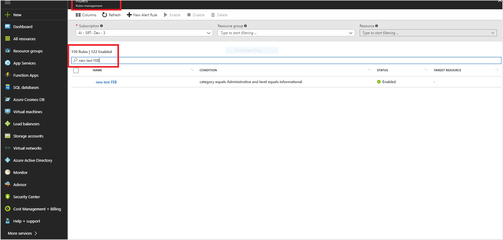
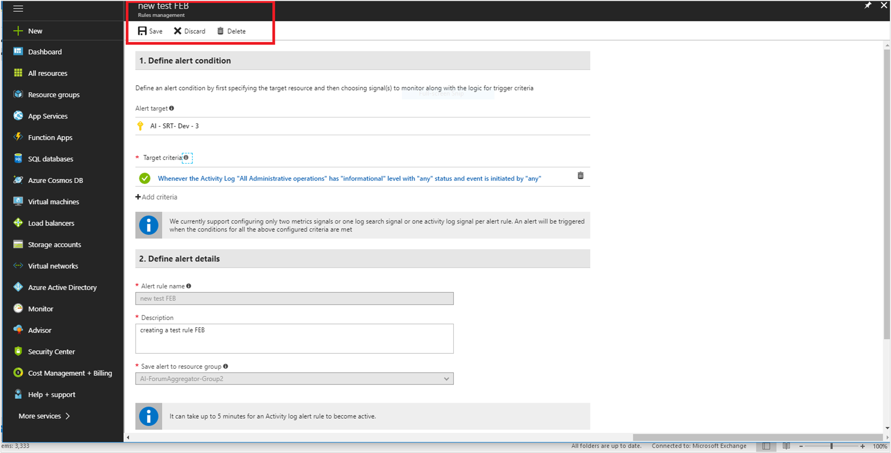

# Create activity log alerts using the new alerts experience

Activity log alerts are the alerts that get activated when a new activity log event occurs that matches the conditions specified in the alert.

These alerts are for Azure resources, can be created by using an Azure Resource Manager template. They also can be created, updated, or deleted in the Azure portal. This article introduces the concepts behind activity log alerts. It then shows you how to use the Azure portal to set up an alert on activity log events using the new experience in [Azure Alerts](monitoring-overview-unified-alerts.md).

Typically, you create activity log alerts to receive notifications when specific changes occur on resources in your Azure subscription, often scoped to particular resource groups or resource. For example, you might want to be notified when any virtual machine in (sample resource group) **myProductionResourceGroup** is deleted, or you might want to get notified if any new roles are assigned to a user in your subscription.

You can configure an activity log alert based on any top-level property in the JSON object for an activity log event. However, the portal shows the most common options as detailed in the following sections:

>[!NOTE]

> When the category is "administrative", You must specify at least one of the preceding criteria in your alert. You may not create an alert that activates every time an event is created in the activity logs.
>

When an activity log alert is activated, it uses an action group to generate actions or notifications. An action group is a reusable set of notification receivers, such as email addresses, webhook URLs, or SMS phone numbers. The receivers can be referenced from multiple alerts to centralize and group your notification channels. When you define your activity log alert, you have two options. You can:

* Use an existing action group in your activity log alert.
* Create a new action group.

To learn more about action groups, see [Create and manage action groups in the Azure portal](monitoring-action-groups.md).

To learn more about service health notifications, see [Receive activity log alerts on service health notifications](monitoring-activity-log-alerts-on-service-notifications.md).

## What's new in alerts for activity logs?

[Azure Alerts](monitoring-overview-unified-alerts.md) now provides enhanced user experience for Activity log alerts. With the [enhanced user experience for Alerts](monitoring-overview-unified-alerts.md), you can now:

- [Create](#create-an-alert-rule-for-an-activity-log) and [manage](#view-and-manage-activity-log-alert-rules) the Activity log alert rules, from **Monitor** > **Alerts** blade. Learn more about [Activity logs](monitoring-overview-activity-logs.md).

- **New options for Alerts Target**:  While creating a new activity log alert rule, you can now select a target resource or a resource group or a subscription.

## Create an alert rule for an activity log

> [!NOTE]

>  While creating the alert rules, ensure the following:

> - Subscription in the scope is not different from the subscription where the alert is created.
- Criteria must be level/status/ caller/ resource group/ resource id/ resource type/ event category on which the alert is configured.
- There is no  “anyOf” condition or nested conditions in the alert configuration JSON (basically, only one allOf is allowed with no further allOf/anyOf).

Use the following procedure:

1. From Azure portal, select **Monitor** > **Alerts**
2. Click **New Alert Rule** at the top of the **Alerts** window.

     

     The **Create rule** window appears.

      

3. **Under Define Alert condition,** provide the following information, and click **Done**.

    - **Alert Target:** To view and select the target for the new alert, use **Filter by subscription** / **Filter by resource type** and select the resource or resource group from the list displayed.

    > [!NOTE]

    > you can select a resource, resource group, or an entire subscription.

    **Alert target sample view**

     

    - Under **Target Criteria**, click **add criteria** select the signal type as **Activity log**.

    - Select the signal from the list displayed.

    You can select the log history timeline and the corresponding alert logic for this target signal:

    **Add criteria screen**

    

    **History time**: Over the last 6/12/24 hours, Over the last Week.

    **Alert logic**:

     - **Event Level**- The severity level of the event.**Verbose,Informational, Warning, Error**, or **Critical**.
     - **Status**: The status of the event.**Started, Failed**, or **Succeeded**.
     - **Event initiated by**: Also known as the caller; The email address or Azure Active Directory identifier of the user who performed the operation.

        **Sample signal graph with alert logic applied** :

        

4. Under **define alert rules details**, provide the following details:

    - **Alert rule name** – Name for the new alert rule
    - **Description** – Description for the new alert rule
    - **Save alert to resource group** – Select the Resource group, where you want to save this new rule.

5. Under **Action group**, from the drop-down menu, specify the action group that you want to assign to this new alert rule. Alternatively, [create a new action group](monitoring-action-groups.md) and assign to the new rule. To create a new group, click **+ New group**.

6. To enable the rules after you create it, click **Yes** for **Enable rule upon creation** option.
7. Click **Create alert rule**.

    The new alert rule for the activity log is created and a confirmation message appears at the top right of the window.

    

    You can enable, disable, edit or delete a rule. [Learn more](#view-and-manage-activity-log-alert-rules) about managing activity log rules.

## View and manage activity log alert rules

1. From Azure portal, click **Monitor** > **Alerts** and click **Manage rules** at the top left of the window.

    

    The list of available rules appears.

2. Search the Activity log rule to modify.

    

    You can use the available filters - **Subscription**, **Resource group**, or **Resource** to find the activity rule that you want to edit.

    > [!NOTE]

    > You can only edit **Description** , **Target criteria** and **Action groups**.

3.  Select the rule and double-click to edit the rule options. Make the required changes and then click **Save**.

    

4.  You can disable, enable, or delete a rule. Select the appropriate option at the top of the window, after selecting the rule as detailed in step 2.

## Next steps

- [Archive Activity log alerts](monitoring-archive-activity-log.md)
- [Stream Activity logs to Event hubs](monitoring-stream-activity-logs-event-hubs.md)
- [Migrate to Activity logs](monitoring-migrate-management-alerts.md)
