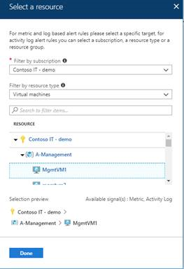
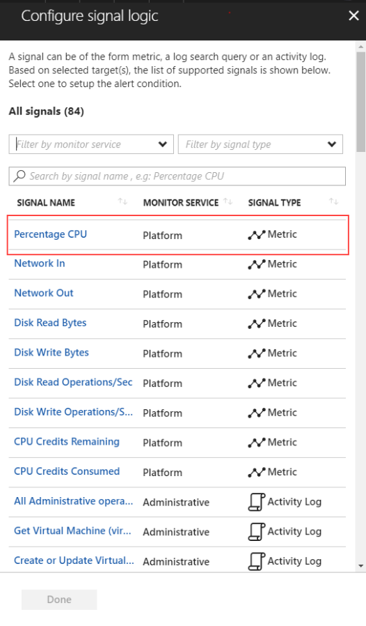
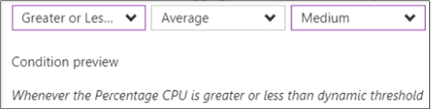
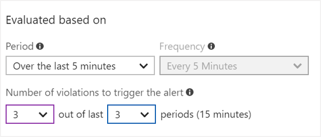
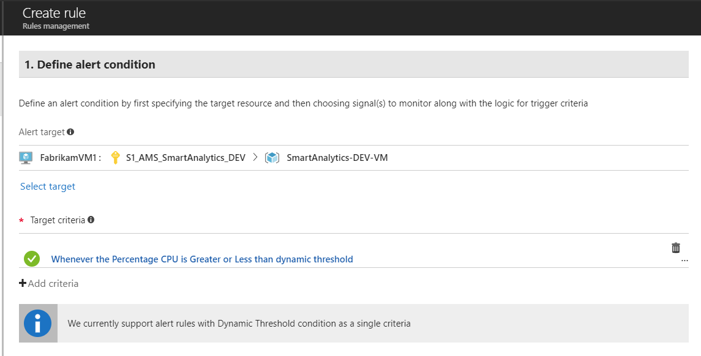

# Alerts with dynamic thresholds in Azure Monitor (Limited Public Preview)

Alerts with dynamic thresholds are an enhancement to Azure Metric Alerts in Azure Monitor, which leverage advanced Machine Learning (ML) capabilities to learn metrics' historical behavior to automatically calculate baselines and use them as alert thresholds.

The benefits of using dynamic thresholds are:

- Save the hassle associated with setting a predefined rigid boundary as the monitor automatically learns the historical performance of the metric and applies ML algorithms to determine alert thresholds.
- They can identify seasonal behavior and alert only on deviations from the expected seasonal behavior. Metric alerts with dynamic thresholds will not trigger if your service is regularly idle on the weekends and then spikes every Monday. Currently supported: hourly, daily, and weekly seasonality.
- Continuously learns the metric performance and is adaptive to metric changes.

Dynamic threshold-based alerts are available for all Azure monitor based metric sources listed in this [article](https://docs.microsoft.com/azure/monitoring-and-diagnostics/monitoring-near-real-time-metric-alerts#what-resources-can-i-create-near-real-time-metric-alerts-for).

## Sign up to access the preview

To take this capability for a spin, [sign up for the preview](http://aka.ms/DynamicThresholdMetricAlerts). As always, we would love to hear your feedback, keep it coming at [azurealertsfeedback@microsoft.com](mailto:azurealertsfeedback@microsoft.com)

## How to configure alerts with dynamic thresholds

Alerts with dynamic thresholds can be configured through Alerts in Azure Monitor

## Creating an alert rule with dynamic thresholds

1. From the Alerts pane under Monitor, select the **New Alert Rule** button to create a new alert in Azure.

   

2. The Create rule section is shown with the three parts consisting of: _Define alert condition_, _Define alert details_, and _Define action group_. First begin with the _Define alert condition_ section use the **Select Target** link to specify the target, by selecting a resource. Once an appropriate resource is chosen, click the Done button.

   

3. Next use the **Add criteria** button to view a list of signal options available for the resource and from the signal list choose an appropriate **metric** option. (For example Percentage CPU.)

   

4. On the Configure signal logic screen, in the Alert logic section you have the option to switch the condition to a type of Dynamic, which will automatically generate the Dynamic thresholds (red lines) alongside the metric (blue line).

   

5. The thresholds appearing in the chart are calculated based on the last seven days of historical data, once an alert is created, the Dynamic thresholds will acquire additional historical data that is available and will continuously learn based on new data to make the thresholds more accurate.

6. Additional Alert logic settings:
   - Condition - You can choose the alert to be triggered on one of the following three conditions:
       - Greater than the upper threshold or lower than the lower threshold (default)
       - Greater than the upper threshold
       - Lower than the lower threshold.
   - Time aggregation: Average (default), sum, min max.
   - Alert Sensitivity:
       - High – More alerts, as alert will be triggered on smallest deviation.
       - Med – Less sensitive than high, fewer alerts than with high sensitivity (default)
       - Low – The least sensitive threshold.

    

7. Evaluated based on:
    -  What time duration, the Alert should look for the specified condition by choosing from the **Period**.

    

   > [!NOTE]
   > Supported Period values: 5 minutes, 10 minutes, 30 minutes and 1 hour.

   To reduce alert noise generated by transient spikes, we recommend using the “Number violations to trigger the alert” settings. This functionality enables you to get an alert only if the threshold was violated X consecutive times, or Y times out of last Z periods. For example:

    To trigger an alert when the issue is continuous for 15 minutes, 3 consecutive times in a given period of 5 minutes, use the following settings:

   

    To trigger an alert when there was a violation from a Dynamic threshold in 15 minutes out of the last 30 minutes with period of 5 minutes, use the following settings:

   

8. Currently users can have alerts with dynamic threshold criteria as a single criteria.

   

## Q & A

- Q: If the metric slowly changes over time, will this trigger an alert with dynamic thresholds?

- A: Probably no. Dynamic thresholds are good for detecting significant deviations rather than slowly evolving issues.

- Q: Can I configure dynamic thresholds through an API?

- A: We’re working on it.
