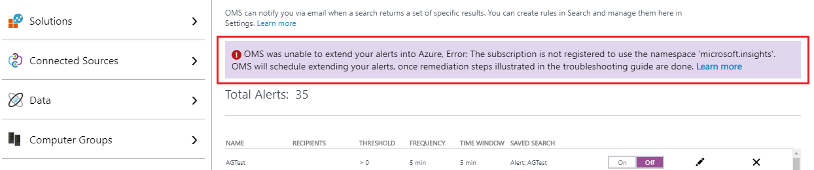

# How to migrate alerts from Log Analytics into Azure Alerts
Alerts in Log Analytics is being replaced by Azure Alerts and as part of this transition, alerts that you configured in Log Analytics will be migrated into Azure.  If you don't want to wait for them to be automatically moved into Azure, you can initiate the process following one of the options:

1. Manually from the OMS portal 
2. Programatically using the AlertsVersion API  

> [!NOTE]
> Microsoft will automatically migrate alerts created in Log Analytics to Azure alerts starting on **14 May 2018** in a phased approach until completed. From this day forward, Microsoft will begin to schedule migrating the alerts to Azure, and during this transition, alerts can be managed from both the OMS portal and Azure portal. This process is nondestructive and not interruptive.  

## Option 1 - Initiate from the OMS Portal
The following steps describe how to migrate alerts for the workspace from the OMS portal.  

1. In the Azure portal, click **All services**. In the list of resources, type **Log Analytics**. As you begin typing, the list filters based on your input. Select **Log Analytics**.
2. In the Log Analytics subscriptions pane, select a workspace and then select the **OMS Portal** tile.<br><br> <br><br> 
3. After you are redirected to the OMS portal, click the Settings tile on the top right-hand side of the page.<br><br> <br><br> 
4. From the **Settings** page, select **Alerts**.  
5. Click the button **Extend into Azure**.<br><br> 
6. A wizard is presented in the pane, with the first of three steps providing an overview of the process.  Click **Next** to proceed.<br><br>   
7. In the second step, a summary of proposed changes is presented listing appropriate [Action Groups](monitoring-action-groups.md) for the alerts. If similar actions are seen across more than one alert, the service will propose to associate with all of them a single action group.  Action group proposed follow the naming convention: *WorkspaceName_AG_#Number*. To be proceed, click **Next**.<br><br>   
8. In the last step of wizard, click **Finish** and confirm when prompted to initiate the process.  Optionally, you can provide an email addresses so that you are notified when the process completes and all alerts have been successfully moved to Azure Alerts.<br><br> 

Once the wizard is finished, you notice on the **Alert Settings** page that the option to migrate alerts to Azure is removed.  In the background, your alerts are moved into Azure and this can take some time.  During the operation, you will not be able to make changes to alerts from the OMS portal.  The current status will be shown from the banner at the top of the portal, and if you provided an email address earlier you will receive an email when the process is successfully completed.  


Alerts continue to be listed in OMS portal, even after they are successfully moved into Azure.<br><br> 


## Option 2 - Using the AlertsVersion API
You can use the Log Analytics AlertsVersion API to migrate alerts from Log Analytics into Azure Alerts from any client that can call a REST API. You can access from PowerShell using [ARMClient](https://github.com/projectkudu/ARMClient), an open-source command-line tool that simplifies invoking the Azure Resource Manager API. The use of ARMClient and PowerShell is one of many options to access the API.  Using the API will output the results in JSON.  

To use the API, you first create a GET request, which will evaluate and return a summary of the proposed changes before you attempt to actually migrate into Azure using a POST request. The results list your alerts and proposed list of [action groups](monitoring-action-groups.md) in JSON format.  If similar actions are seen across more than one alert, the service will propose associating all of them with a single action group.  Action groups proposed follow the naming convention: *WorkspaceName_AG_#Number*.

```
armclient GET  /subscriptions/<subscriptionId>/resourceGroups/<resourceGroupName>/providers/Microsoft.OperationalInsights/workspaces/<workspaceName>/alertsversion?api-version=2017-04-26-preview
```

If the GET request is successful, an HTTP status code 200 is returned along with a list of alerts and proposed action groups in the JSON data. The following is an example response:

```json
{
    "version": 1,
    "migrationSummary": {
        "alertsCount": 2,
        "actionGroupsCount": 2,
        "alerts": [
            {
                "alertName": "DemoAlert_1",
                "alertId": " /subscriptions/<subscriptionId>/resourceGroups/<resourceGroupName>/providers/Microsoft.OperationalInsights/workspaces/<workspaceName>/savedSearches/<savedSearchId>/schedules/<scheduleId>/actions/<actionId>",
                "actionGroupName": "<workspaceName>_AG_1"
            },
            {
                "alertName": "DemoAlert_2",
                "alertId": " /subscriptions/<subscriptionId>/resourceGroups/<resourceGroupName>/providers/Microsoft.OperationalInsights/workspaces/<workspaceName>/savedSearches/<savedSearchId>/schedules/<scheduleId>/actions/<actionId>",
                "actionGroupName": "<workspaceName>_AG_2"
            }
        ],
        "actionGroups": [
            {
                "actionGroupName": "<workspaceName>_AG_1",
                "actionGroupResourceId": "/subscriptions/<subscriptionid>/resourceGroups/<resourceGroupName>/providers/microsoft.insights/actionGroups/<workspaceName>_AG_1",
                "actions": {
                    "emailIds": [
                        "JohnDoe@mail.com"
                    ],
                    "webhookActions": [
                        {
                            "name": "Webhook_1",
                            "serviceUri": "http://test.com"
                        }
                    ],
                    "itsmAction": {}
                }
            },
            {
                "actionGroupName": "<workspaceName>_AG_1",
                "actionGroupResourceId": "/subscriptions/<subscriptionid>/resourceGroups/<resourceGroupName>/providers/microsoft.insights/actionGroups/<workspaceName>_AG_1",
                 "actions": {
                    "emailIds": [
                        "test1@mail.com",
                          "test2@mail.com"
                    ],
                    "webhookActions": [],
                    "itsmAction": {
                        "connectionId": "<Guid>",
                        "templateInfo":"{\"PayloadRevision\":0,\"WorkItemType\":\"Incident\",\"UseTemplate\":false,\"WorkItemData\":\"{\\\"contact_type\\\":\\\"email\\\",\\\"impact\\\":\\\"3\\\",\\\"urgency\\\":\\\"2\\\",\\\"category\\\":\\\"request\\\",\\\"subcategory\\\":\\\"password\\\"}\",\"CreateOneWIPerCI\":false}"
                    }
                }
            }
        ]
    }
}

```
If the specified workspace does not have any alert rules defined, along with the HTTP 200 OK status code for the GET operation the JSON data returns:

```json
{
    "version": 1,
    "Message": "No Alerts found in the workspace for migration."
}
```

If all alert rules in the specified workspace have already been migrated to Azure - the response to the GET request is:

```json
{
    "version": 2
}
```

To initiate migrating the alerts to Azure, initiate a POST response. The POST response confirms your intent as well as acceptance to have alerts migrated from Log Analytics to Auzre alerts.  The activity is scheduled and the alerts are processed as indicated based on the results when you performed the GET response earlier.  Optionally, you can provide a list of email addresses to which Log Analytics will mail a report when the scheduled background process of migrating the alerts completes successfully.  This is performed by using the following request example:

```
$emailJSON = “{‘Recipients’: [‘a@b.com’, ‘b@a.com’]}”
armclient POST  /subscriptions/<subscriptionId>/resourceGroups/<resourceGroupName>/providers/Microsoft.OperationalInsights/workspaces/<workspaceName>/alertsversion?api-version=2017-04-26-preview $emailJSON
```

> [!NOTE]
> Result of migrating alerts into Azure Alerts may vary based on the summary provided by GET response.  Once scheduled, alerts in Log Analytics will be temporarily unavailable for editing/modification in the OMS portal.  However, new alerts can be created. 

If the POST resquest is successful, it returns a HTTP 200 OK status along with the following response:

```json
{
    "version": 2
}
```

This response indicates the alerts have been successfully migrated into Azure Alerts. The  version property is only for checking if alerts have been migrated to Azure and have no relation to the [Log Analytics Search API](../log-analytics/log-analytics-api-alerts.md). Once the alerts are migrated to Azure successfully, any email addresses provided with the POST request are sent a report with details of the changes performed.  If all of the alerts in the specified workspace are already scheduled to be migrated, the response to your POST request is a 403 status code meaning the attempt was forbidden. To view any error message or understand if the process is stuck, you can submit a GET request and an error message if any, will be returned along with the summary information.

```json
{
    "version": 1,
    "message": "OMS was unable to extend your alerts into Azure, Error: The subscription is not registered to use the namespace 'microsoft.insights'. OMS will schedule extending your alerts, once remediation steps illustrated in the troubleshooting guide are done.",
    "recipients": [
       "john.doe@email.com",
       "jane.doe@email.com"
     ],
    "migrationSummary": {
        "alertsCount": 2,
        "actionGroupsCount": 2,
        "alerts": [
            {
                "alertName": "DemoAlert_1",
                "alertId": " /subscriptions/<subscriptionId>/resourceGroups/<resourceGroupName>/providers/Microsoft.OperationalInsights/workspaces/<workspaceName>/savedSearches/<savedSearchId>/schedules/<scheduleId>/actions/<actionId>",
                "actionGroupName": "<workspaceName>_AG_1"
            },
            {
                "alertName": "DemoAlert_2",
                "alertId": " /subscriptions/<subscriptionId>/resourceGroups/<resourceGroupName>/providers/Microsoft.OperationalInsights/workspaces/<workspaceName>/savedSearches/<savedSearchId>/schedules/<scheduleId>/actions/<actionId>",
                "actionGroupName": "<workspaceName>_AG_2"
            }
        ],
        "actionGroups": [
            {
                "actionGroupName": "<workspaceName>_AG_1",
                "actionGroupResourceId": "/subscriptions/<subscriptionid>/resourceGroups/<resourceGroupName>/providers/microsoft.insights/actionGroups/<workspaceName>_AG_1",
                "actions": {
                    "emailIds": [
                        "JohnDoe@mail.com"
                    ],
                    "webhookActions": [
                        {
                            "name": "Webhook_1",
                            "serviceUri": "http://test.com"
                        }
                    ],
                    "itsmAction": {}
                }
            },
            {
                "actionGroupName": "<workspaceName>_AG_1",
                "actionGroupResourceId": "/subscriptions/<subscriptionid>/resourceGroups/<resourceGroupName>/providers/microsoft.insights/actionGroups/<workspaceName>_AG_1",
                 "actions": {
                    "emailIds": [
                        "test1@mail.com",
                          "test2@mail.com"
                    ],
                    "webhookActions": [],
                    "itsmAction": {
                        "connectionId": "<Guid>",
                        "templateInfo":"{\"PayloadRevision\":0,\"WorkItemType\":\"Incident\",\"UseTemplate\":false,\"WorkItemData\":\"{\\\"contact_type\\\":\\\"email\\\",\\\"impact\\\":\\\"3\\\",\\\"urgency\\\":\\\"2\\\",\\\"category\\\":\\\"request\\\",\\\"subcategory\\\":\\\"password\\\"}\",\"CreateOneWIPerCI\":false}"
                    }
                }
            }
        ]
    }
}              

```

## Troubleshooting 
During the process of migrating your alerts from Log Analytics to Azure Alerts, an issue could prevent the service from creating the required [Action Groups](monitoring-action-groups.md). In such cases an error message will be shown in a banner at the top of the OMS portal under **Alert Settings** section and in the resulting JSON when you create a GET request.

Listed below are the remediation steps for each error:  

1. **Error: The subscription is not registered to use the namespace 'microsoft.insights'**:  

    

    a. The subscription associated with your OMS workspace - has not been registered to use Azure Monitor (microsoft.insights) functionality; due to which OMS unable to extend you alerts into Azure Monitor & Alerts.
    
    b. To resolve, register microsoft.insights (Azure monitor & alerts) use in your subscription using Powershell, Azure CLI, or Azure portal. To learn more, view the article on [resolving errors on resource provider registration](../azure-resource-manager/resource-manager-register-provider-errors.md)
    
    c. Once resolved as per steps illustrated in the article, OMS will extend your alerts into Azure within the next day's scheduled run; without the need of any action or initiation.

2. **Error: Scope Lock is present at subscription/resource group level for write operations**:  

    

    a. When Scope Lock is enabled, any new change in subscription or resource group containing the Log Analytics workspace is restricted.  The service is unable to migrate alerts to Azure Alerts and create the required action groups.
    
    b. To resolve this, delete the *ReadOnly* lock on your subscription or resource group containing the workspace from the Azure portal, Powershell, Azure CLI, or API. To learn more, review the article [resource lock usage](../azure-resource-manager/resource-group-lock-resources.md). 
    
    c. Once you have completed the steps to remove the lock, you can reattempt to migrate your alerts to Azure Alerts within the next day's scheduled run without the need of any action or initiation.

3. **Error: Policy is present at subscription/resource group level**:  

    

    a. When [Azure Policy](../azure-policy/azure-policy-introduction.md) is applied, any new resource in subscription or resource group containing the Log Analytics (OMS) workspace is restricted.  The service is unable to migrate your alerts into Azure Alerts and create the required action groups.
    
    b. To resolve this, edit the policy causing *[RequestDisallowedByPolicy](../azure-resource-manager/resource-manager-policy-requestdisallowedbypolicy-error.md)* error, which prevents creation of new resources in your subscription or resource group containing the workspace. Using Azure portal, Powershell, Azure CLI or API, you can audit actions to find the appropriate policy causing this failure. To learn more, review the article [viewing activity logs to audit actions](../azure-resource-manager/resource-group-audit.md). 
    
    c. Once you have completed the steps to remove the restriction, Log Analytics will migrate your alerts to Azure Alerts within the next day's scheduled run without the need of any action or initiation.

## Next steps

* Learn more about the new [Azure alerts experience](monitoring-overview-unified-alerts.md).
* Learn about [log alerts in Azure Alerts](monitor-alerts-unified-log.md).