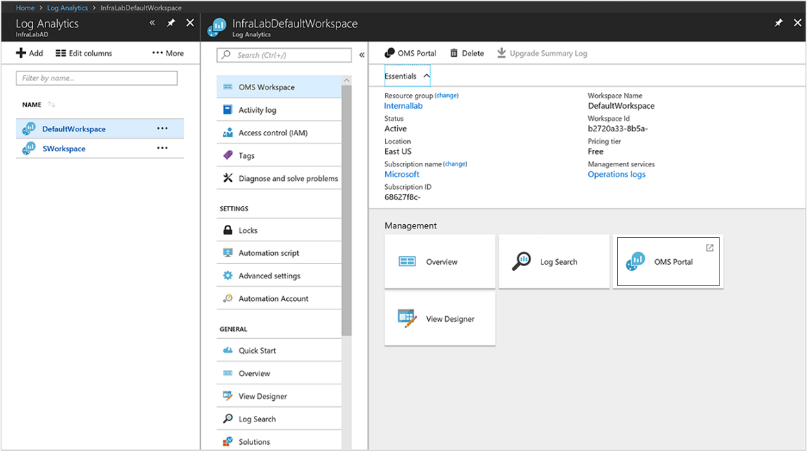
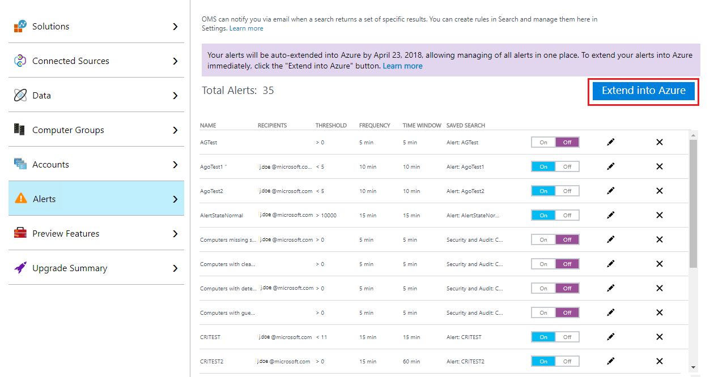
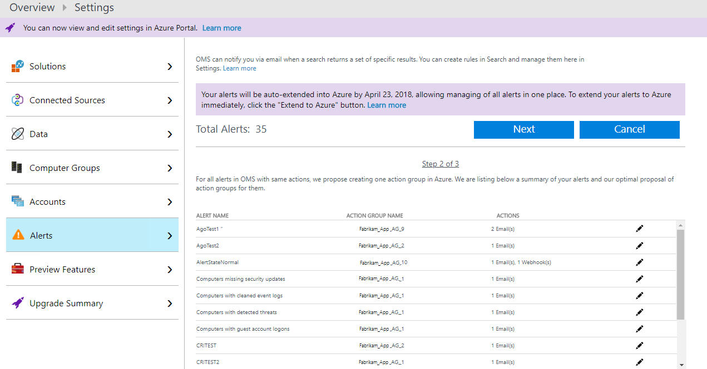
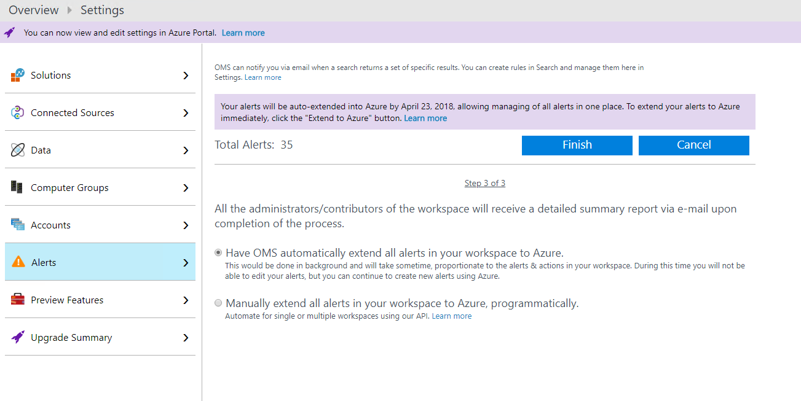
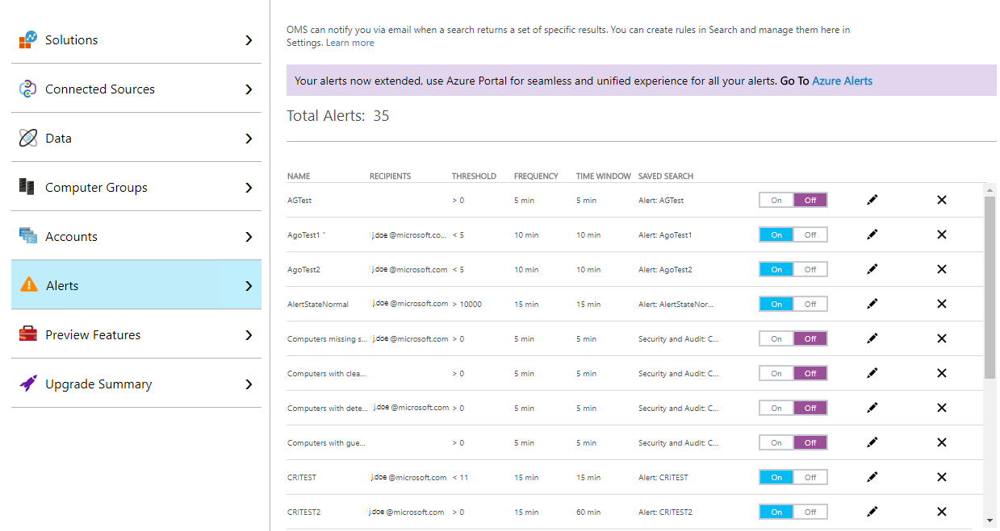
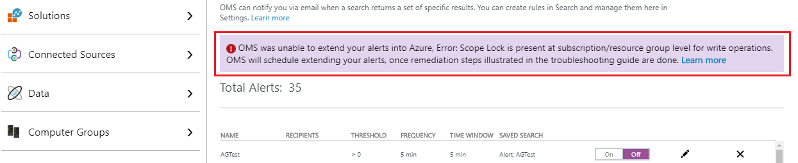

# Extend alerts from Log Analytics into Azure Alerts
The alerts feature in Azure Log Analytics is being replaced by Azure Alerts. As part of this transition, alerts that you originally configured in Log Analytics will be extended into Azure. If you don't want to wait for them to be automatically moved into Azure, you can initiate the process:

- Manually from the Operations Management Suite portal. 
- Programmatically by using the AlertsVersion API.  

> [!NOTE]
> Microsoft will automatically extend alerts created in public cloud instances of Log Analytics to Azure Alerts, starting on May 14, 2018, in a recurring series until completed. If you have any problems creating [action groups](monitoring-action-groups.md), use [these remediation steps](monitoring-alerts-extend-tool.md#troubleshooting) to get action groups created automatically. You can use these steps until July 5, 2018. *Not applicable for Azure Goverment and Soveriegn cloud users of Log Analytics*. 

## Option 1: Initiate from the Operations Management Suite portal
The following steps describe how to extend alerts for the workspace from the Operations Management Suite portal.  

1. In the Azure portal, select **All services**. In the list of resources, type **Log Analytics**. As you begin typing, the list filters based on your input. Select **Log Analytics**.
2. In the Log Analytics subscriptions pane, select a workspace, and then select the **OMS Portal** tile.
 
3. After you are redirected to the Operations Management Suite portal, select the **Settings** icon.
 
4. From the **Settings** page, select **Alerts**.  
5. Select **Extend into Azure**.

6. A three-step wizard appears in the **Alerts** pane. Read the overview, and select **Next**.
  
7. In the second step, you see a summary of proposed changes, listing appropriate [action groups](monitoring-action-groups.md) for the alerts. If similar actions are seen across more than one alert, the wizard proposes to associate a single action group with all of them.  The naming convention is as follows: *WorkspaceName_AG_#Number*. To proceed, select **Next**.
  
8. In the last step of wizard, select **Finish**, and confirm when prompted to initiate the process. Optionally, you can provide an email address, so that you are notified when the process completes and all alerts have been successfully moved to Azure Alerts.


When the wizard is finished, on the **Alert Settings** page, the option to extend alerts to Azure is removed. In the background, your alerts are moved into Azure, and this can take some time. During the operation, you can't make changes to alerts from the Operations Management Suite portal. You can see the current status from the banner at the top of the portal. If you provided an email address earlier, you receive an email when the process has successfully completed.  


Alerts continue to be listed in Operations Management Suite portal, even after they are successfully moved into Azure.



## Option 2: Use the AlertsVersion API
You can use the Log Analytics AlertsVersion API to extend alerts from Log Analytics into Azure Alerts from any client that can call a REST API. You can access the API from PowerShell by using [ARMClient](https://github.com/projectkudu/ARMClient), an open-source command-line tool. You can output the results in JSON.  

To use the API, you first create a GET request. This evaluates and returns a summary of the proposed changes, before you attempt to actually extend into Azure by using a POST request. The results list your alerts and a proposed list of [action groups](monitoring-action-groups.md), in JSON format. If similar actions are seen across more than one alert, the service proposes to associate all of them with a single action group. The naming convention is as follows: *WorkspaceName_AG_#Number*.

```
armclient GET  /subscriptions/<subscriptionId>/resourceGroups/<resourceGroupName>/providers/Microsoft.OperationalInsights/workspaces/<workspaceName>/alertsversion?api-version=2017-04-26-preview
```

If the GET request is successful, an HTTP status code 200 is returned, along with a list of alerts and proposed action groups in the JSON data. The following is an example response:

```json
{
    "version": 1,
    "migrationSummary": {
        "alertsCount": 2,
        "actionGroupsCount": 2,
        "alerts": [
            {
                "alertName": "DemoAlert_1",
                "alertId": " /subscriptions/<subscriptionId>/resourceGroups/<resourceGroupName>/providers/Microsoft.OperationalInsights/workspaces/<workspaceName>/savedSearches/<savedSearchId>/schedules/<scheduleId>/actions/<actionId>",
                "actionGroupName": "<workspaceName>_AG_1"
            },
            {
                "alertName": "DemoAlert_2",
                "alertId": " /subscriptions/<subscriptionId>/resourceGroups/<resourceGroupName>/providers/Microsoft.OperationalInsights/workspaces/<workspaceName>/savedSearches/<savedSearchId>/schedules/<scheduleId>/actions/<actionId>",
                "actionGroupName": "<workspaceName>_AG_2"
            }
        ],
        "actionGroups": [
            {
                "actionGroupName": "<workspaceName>_AG_1",
                "actionGroupResourceId": "/subscriptions/<subscriptionid>/resourceGroups/<resourceGroupName>/providers/microsoft.insights/actionGroups/<workspaceName>_AG_1",
                "actions": {
                    "emailIds": [
                        "JohnDoe@mail.com"
                    ],
                    "webhookActions": [
                        {
                            "name": "Webhook_1",
                            "serviceUri": "http://test.com"
                        }
                    ],
                    "itsmAction": {}
                }
            },
            {
                "actionGroupName": "<workspaceName>_AG_1",
                "actionGroupResourceId": "/subscriptions/<subscriptionid>/resourceGroups/<resourceGroupName>/providers/microsoft.insights/actionGroups/<workspaceName>_AG_1",
                 "actions": {
                    "emailIds": [
                        "test1@mail.com",
                          "test2@mail.com"
                    ],
                    "webhookActions": [],
                    "itsmAction": {
                        "connectionId": "<Guid>",
                        "templateInfo":"{\"PayloadRevision\":0,\"WorkItemType\":\"Incident\",\"UseTemplate\":false,\"WorkItemData\":\"{\\\"contact_type\\\":\\\"email\\\",\\\"impact\\\":\\\"3\\\",\\\"urgency\\\":\\\"2\\\",\\\"category\\\":\\\"request\\\",\\\"subcategory\\\":\\\"password\\\"}\",\"CreateOneWIPerCI\":false}"
                    }
                }
            }
        ]
    }
}

```
If the specified workspace does not have any alert rules defined, the JSON data returns the following:

```json
{
    "version": 1,
    "Message": "No Alerts found in the workspace for migration."
}
```

If all alert rules in the specified workspace have already been extended to Azure, the response to the GET request is:

```json
{
    "version": 2
}
```

To initiate migrating the alerts to Azure, initiate a POST response. The POST response confirms your intent, as well as acceptance, to have alerts extended from Log Analytics to Azure Alerts. The activity is scheduled and the alerts are processed as indicated, based on the results when you performed the GET response earlier. Optionally, you can provide a list of email addresses to which Log Analytics sends a report when the scheduled background process of migrating the alerts completes successfully. You can use the following request example:

```
$emailJSON = “{‘Recipients’: [‘a@b.com’, ‘b@a.com’]}”
armclient POST  /subscriptions/<subscriptionId>/resourceGroups/<resourceGroupName>/providers/Microsoft.OperationalInsights/workspaces/<workspaceName>/alertsversion?api-version=2017-04-26-preview $emailJSON
```

> [!NOTE]
> The result of migrating alerts into Azure Alerts might vary based on the summary provided by GET response. When scheduled, alerts in Log Analytics are temporarily unavailable for modification in the Operations Management Suite portal. However, you can create new alerts. 

If the POST request is successful, it returns an HTTP 200 OK status, along with the following response:

```json
{
    "version": 2
}
```

This response indicates the alerts have been successfully extended into Azure Alerts. The  version property is only for checking if alerts have been extended to Azure, and have no relation to the [Log Analytics Search API](../log-analytics/log-analytics-api-alerts.md). When the alerts are extended to Azure successfully, any email addresses provided with the POST request are sent a report. If all the alerts in the specified workspace are already scheduled to be extended, the response to your POST request is that the attempt was forbidden (a 403 status code). To view any error message or understand if the process is stuck, you can submit a GET request. If there is an error message, it is returned, along with the summary information.

```json
{
    "version": 1,
    "message": "OMS was unable to extend your alerts into Azure, Error: The subscription is not registered to use the namespace 'microsoft.insights'. OMS will schedule extending your alerts, once remediation steps illustrated in the troubleshooting guide are done.",
    "recipients": [
       "john.doe@email.com",
       "jane.doe@email.com"
     ],
    "migrationSummary": {
        "alertsCount": 2,
        "actionGroupsCount": 2,
        "alerts": [
            {
                "alertName": "DemoAlert_1",
                "alertId": " /subscriptions/<subscriptionId>/resourceGroups/<resourceGroupName>/providers/Microsoft.OperationalInsights/workspaces/<workspaceName>/savedSearches/<savedSearchId>/schedules/<scheduleId>/actions/<actionId>",
                "actionGroupName": "<workspaceName>_AG_1"
            },
            {
                "alertName": "DemoAlert_2",
                "alertId": " /subscriptions/<subscriptionId>/resourceGroups/<resourceGroupName>/providers/Microsoft.OperationalInsights/workspaces/<workspaceName>/savedSearches/<savedSearchId>/schedules/<scheduleId>/actions/<actionId>",
                "actionGroupName": "<workspaceName>_AG_2"
            }
        ],
        "actionGroups": [
            {
                "actionGroupName": "<workspaceName>_AG_1",
                "actionGroupResourceId": "/subscriptions/<subscriptionid>/resourceGroups/<resourceGroupName>/providers/microsoft.insights/actionGroups/<workspaceName>_AG_1",
                "actions": {
                    "emailIds": [
                        "JohnDoe@mail.com"
                    ],
                    "webhookActions": [
                        {
                            "name": "Webhook_1",
                            "serviceUri": "http://test.com"
                        }
                    ],
                    "itsmAction": {}
                }
            },
            {
                "actionGroupName": "<workspaceName>_AG_1",
                "actionGroupResourceId": "/subscriptions/<subscriptionid>/resourceGroups/<resourceGroupName>/providers/microsoft.insights/actionGroups/<workspaceName>_AG_1",
                 "actions": {
                    "emailIds": [
                        "test1@mail.com",
                          "test2@mail.com"
                    ],
                    "webhookActions": [],
                    "itsmAction": {
                        "connectionId": "<Guid>",
                        "templateInfo":"{\"PayloadRevision\":0,\"WorkItemType\":\"Incident\",\"UseTemplate\":false,\"WorkItemData\":\"{\\\"contact_type\\\":\\\"email\\\",\\\"impact\\\":\\\"3\\\",\\\"urgency\\\":\\\"2\\\",\\\"category\\\":\\\"request\\\",\\\"subcategory\\\":\\\"password\\\"}\",\"CreateOneWIPerCI\":false}"
                    }
                }
            }
        ]
    }
}              

```


## Option 3: Use a custom PowerShell script
 If Microsoft has not successfully extended your alerts from the Operations Management Suite portal to Azure, you can do so manually until July 5, 2018. The two options for manual extension are covered in the previous two sections.

After July 5, 2018, all alerts from the Operations Management Suite portal are extended into Azure. Users who didn't take the [necessary remediation steps suggested](#troubleshooting) will have their alerts running without firing actions or notifications, due to the lack of associated [action groups](monitoring-action-groups.md). 

To create [action groups](monitoring-action-groups.md) for alerts manually in Log Analytics, use the following sample script:
```PowerShell
########## Input Parameters Begin ###########


$subscriptionId = ""
$resourceGroup = ""
$workspaceName = "" 


########## Input Parameters End ###########

armclient login

try
{
    $workspace = armclient get /subscriptions/$subscriptionId/resourceGroups/$resourceGroup/providers/Microsoft.OperationalInsights/workspaces/"$workspaceName"?api-version=2015-03-20 | ConvertFrom-Json
    $workspaceId = $workspace.properties.customerId
    $resourceLocation = $workspace.location
}
catch
{
    "Please enter valid input parameters i.e. Subscription Id, Resource Group and Workspace Name !!"
    exit
}

# Get Extend Summary of the Alerts
"`nGetting Extend Summary of Alerts for the workspace...`n"
try
{

    $value = armclient get /subscriptions/$subscriptionId/resourceGroups/$resourceGroup/providers/Microsoft.OperationalInsights/workspaces/$workspaceName/alertsversion?api-version=2017-04-26-preview

    "Extend preview summary"
    "=========================`n"

    $value

    $result = $value | ConvertFrom-Json
}
catch
{

    $ErrorMessage = $_.Exception.Message
    "Error occured while fetching/parsing Extend summary: $ErrorMessage"
    exit 
}

if ($result.version -eq 2)
{
    "`nThe alerts in this workspace have already been extended to Azure."
    exit
}

$in = Read-Host -Prompt "`nDo you want to continue extending the alerts to Azure? (Y/N)"

if ($in.ToLower() -ne "y")
{
    exit
} 


# Check for resource provider registration
try
{
    $val = armclient get subscriptions/$subscriptionId/providers/microsoft.insights/?api-version=2017-05-10 | ConvertFrom-Json
    if ($val.registrationState -eq "NotRegistered")
    {
        $val = armclient post subscriptions/$subscriptionId/providers/microsoft.insights/register/?api-version=2017-05-10
    }
}
catch
{
    "`nThe user does not have required access to register the resource provider. Please try with user having Contributor/Owner role in the subscription"
    exit
}

$actionGroupsMap = @{}
try
{
    "`nCreating new action groups for alerts extension...`n"
    foreach ($actionGroup in $result.migrationSummary.actionGroups)
    {
        $actionGroupName = $actionGroup.actionGroupName
        $actions = $actionGroup.actions
        if ($actionGroupsMap.ContainsKey($actionGroupName))
        {
            continue
        } 
        
        # Create action group payload
        $shortName = $actionGroupName.Substring($actionGroupName.LastIndexOf("AG_"))
        $properties = @{"groupShortName"= $shortName; "enabled" = $true}
        $emailReceivers = New-Object Object[] $actions.emailIds.Count
        $webhookReceivers = New-Object Object[] $actions.webhookActions.Count
        
        $count = 0
        foreach ($email in $actions.emailIds)
        {
            $emailReceivers[$count] = @{"name" = "Email$($count+1)"; "emailAddress" = "$email"}
            $count++
        }

        $count = 0
        foreach ($webhook in $actions.webhookActions)
        {
            $webhookReceivers[$count] = @{"name" = "$($webhook.name)"; "serviceUri" = "$($webhook.serviceUri)"}
            $count++
        }

        $itsmAction = $actions.itsmAction
        if ($itsmAction.connectionId -ne $null)
        {
            $val = @{
            "name" = "ITSM"
            "workspaceId" = "$subscriptionId|$workspaceId"
            "connectionId" = "$($itsmAction.connectionId)"
            "ticketConfiguration" = $itsmAction.templateInfo
            "region" = "$resourceLocation"
            }
            $properties["itsmReceivers"] = @($val)  
        }

        $properties["emailReceivers"] = @($emailReceivers)
        $properties["webhookReceivers"] = @($webhookReceivers)
        $armPayload = @{"properties" = $properties; "location" = "Global"} | ConvertTo-Json -Compress -Depth 4

    
        # Azure Resource Manager call to create action group
        $response = $armPayload | armclient put /subscriptions/$subscriptionId/resourceGroups/$resourceGroup/providers/Microsoft.insights/actionGroups/$actionGroupName/?api-version=2017-04-01

        "Created Action Group with name $actionGroupName" 
        $actionGroupsMap[$actionGroupName] = $actionGroup.actionGroupResourceId.ToLower()
        $index++
    }

    "`nSuccessfully created all action groups!!"
}
catch
{
    $ErrorMessage = $_.Exception.Message

    #Delete all action groups in case of failure
    "`nDeleting newly created action groups if any as some error happened..."
    
    foreach ($actionGroup in $actionGroupsMap.Keys)
    {
        $response = armclient delete /subscriptions/$subscriptionId/resourceGroups/$resourceGroup/providers/Microsoft.insights/actionGroups/$actionGroup/?api-version=2017-04-01      
    }

    "`nError: $ErrorMessage"
    "`nExiting..."
    exit
}

# Update all alerts configuration to the new version
"`nExtending OMS alerts to Azure...`n"

try
{
    $index = 1
    foreach ($alert in $result.migrationSummary.alerts)
    {
        $uri = $alert.alertId + "?api-version=2015-03-20"
        $config = armclient get $uri | ConvertFrom-Json
        $aznsNotification = @{
            "GroupIds" = @($actionGroupsMap[$alert.actionGroupName])
        }
        if ($alert.customWebhookPayload)
        {
            $aznsNotification.Add("CustomWebhookPayload", $alert.customWebhookPayload)
        }
        if ($alert.customEmailSubject)
        {
            $aznsNotification.Add("CustomEmailSubject", $alert.customEmailSubject)
        }      

        # Update alert version
        $config.properties.Version = 2

        $config.properties | Add-Member -MemberType NoteProperty -Name "AzNsNotification" -Value $aznsNotification
        $payload = $config | ConvertTo-Json -Depth 4
        $response = $payload | armclient put $uri
    
        "Extended alert with name $($alert.alertName)"
        $index++
    }
}
catch
{
    $ErrorMessage = $_.Exception.Message   
    if ($index -eq 1)
    {
        "`nDeleting all newly created action groups as no alerts got extended..."
        foreach ($actionGroup in $actionGroupsMap.Keys)
        {
            $response = armclient delete /subscriptions/$subscriptionId/resourceGroups/$resourceGroup/providers/Microsoft.insights/actionGroups/$actionGroup/?api-version=2017-04-01      
        }
        "`nDeleted all action groups."  
    }
    
    "`nError: $ErrorMessage"
    "`nPlease resolve the issue and try extending again!!"
    "`nExiting..."
    exit
}

"`nSuccessfully extended all OMS alerts to Azure!!" 

# Update version of workspace to indicate extension
"`nUpdating alert version information in OMS workspace..." 

$response = armclient post "/subscriptions/$subscriptionId/resourceGroups/$resourceGroup/providers/Microsoft.OperationalInsights/workspaces/$workspaceName/alertsversion?api-version=2017-04-26-preview&iversion=2"

"`nExtension complete!!"
```


### About the custom PowerShell script 
The following is important information about using the script:
- A prerequisite is the installation of [ARMclient](https://github.com/projectkudu/ARMClient), an open-source command-line tool that simplifies invoking the Azure Resource Manager API.
- To run the script, you must have a contributor or owner role in the Azure subscription.
- You must provide the following parameters:
    - $subscriptionId: The Azure Subscription ID associated with the Operations Management Suite Log Analytics workspace.
    - $resourceGroup: The Azure Resource Group for Operations Management Suite Log Analytics workspace.
    - $workspaceName: The name of the Operations Management Suite Log Analytics workspace.

### Output of the custom PowerShell script
The script is verbose, and outputs the steps as it runs: 
- It displays the summary, which contains the information about the existing Operations Management Suite Log Analytics alerts in the workspace. The summary also contains information about the Azure action groups to be created for the actions associated with them. 
- You are prompted to go ahead with the extension, or exit after viewing the summary.
- If you go ahead with the extension, new Azure action groups are created, and all the existing alerts are associated with them. 
- The script exits by displaying the message "Extension complete!" In case of any intermediate failures, the script displays subsequent errors.

## Troubleshooting 
During the process of extending alerts, problems can prevent the system from creating the necessary [action groups](monitoring-action-groups.md). In such cases, you see an error message in a banner in the **Alert** section of the Operations Management Suite portal, or in the GET call done to the API.

> [!IMPORTANT]
> If Azure public cloud based Log Analytics users don't take the following remediation steps before July 5, 2018, alerts will run in Azure but will not fire any action or notification. To get notifications for alerts, you must manually edit and add [action groups](monitoring-action-groups.md), or use the preceding [custom PowerShell script](#option-3---using-custom-powershell-script).

Here are the remediation steps for each error:
- **Error: Scope Lock is present at subscription/resource group level for write operations**:
    

    When Scope Lock is enabled, the feature restricts any new change in the subscription or resource group that contains the Log Analytics (Operations Management Suite) workspace. The system is unable to extend alerts into Azure and create necessary action groups.
    
    To resolve, delete the *ReadOnly* lock on your subscription or resource group that contains the workspace. You can do this by using the Azure portal, PowerShell, Azure CLI, or the API. To learn more, see [resource lock usage](../azure-resource-manager/resource-group-lock-resources.md). 
    
    When you resolve the error by using the steps illustrated in the article, Operations Management Suite extends your alerts into Azure within the next day's scheduled run. You don't need to take any further action or initiate anything.

- **Error: Policy is present at subscription/resource group level**: 
    

    When [Azure Policy](../azure-policy/azure-policy-introduction.md) is applied, it restricts any new resource in a subscription or resource group that contains the Log Analytics (Operations Management Suite) workspace. The system is unable to extend alerts into Azure and create necessary action groups.
    
    To resolve, edit the policy that's causing the *[RequestDisallowedByPolicy](../azure-resource-manager/resource-manager-policy-requestdisallowedbypolicy-error.md)* error, which prevents creation of new resources on your subscription or resource group that contains the workspace. You can do this by using the Azure portal, PowerShell, Azure CLI, or the API. You can audit actions to find the appropriate policy that's causing failure. To learn more, see [viewing activity logs to audit actions](../azure-resource-manager/resource-group-audit.md). 
    
    When you resolve the error by using the steps illustrated in the article, Operations Management Suite extends your alerts into Azure within the next day's scheduled run. You don't need to take any further action or initiate anything.


## Next steps

* Learn more about the new [Azure Alerts experience](monitoring-overview-unified-alerts.md).
* Learn about [log alerts in Azure Alerts](monitor-alerts-unified-log.md).
